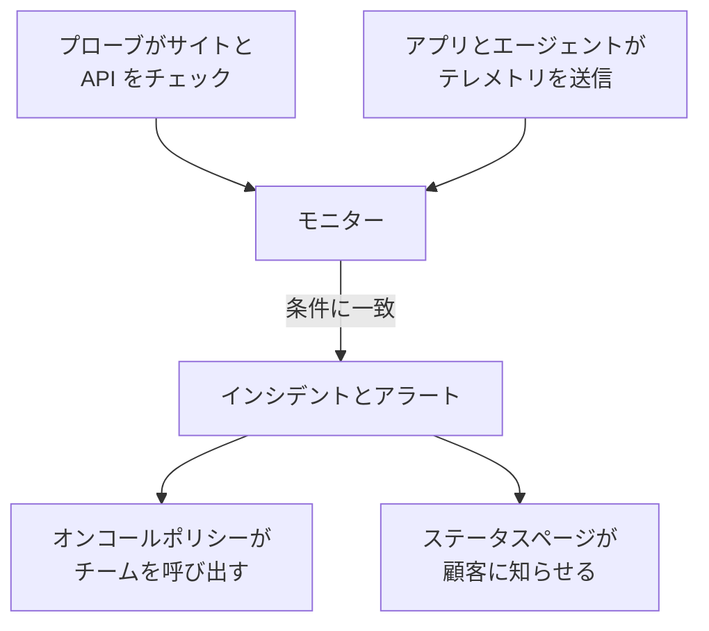

# はじめに

OneUptime はオープンソースのオブザーバビリティプラットフォームです。ウェブサイト、API、サーバーが動いていることを確認し、アプリが送るログ、メトリクス、トレースを集め、何かが壊れたときはオンコール担当者を呼び出し、ステータスページで顧客に知らせます。これらはすべて 1 つの製品の中で行われるため、問題に気づいたツールがそのままチームを呼び出します。OneUptime Cloud で使うことも、自分のサーバーで動かすこともできます。

まずはここから:

:::cards
- [クイックスタート](/docs/introduction/quickstart): ウェブサイトを監視し、障害時に呼び出しを受け、ステータスページを公開します。
- [基本概念](/docs/introduction/core-concepts): ほかのすべての土台となるいくつかの考え方と、そのつながり。
- [ホーム画面とショートカット](/docs/introduction/home): ダッシュボードの歩き方と、クリックを減らすキー。
- [アカウント](/docs/introduction/your-account): プロフィール、パスワード、パスキー、2 要素認証。
:::

## OneUptime の全体像

すべては、あなたが見守る対象から始まります。モニターはそれを定期的にチェックするか、それが送るテレメトリを読み取ります。モニターの条件に一致すると、OneUptime はインシデントを宣言するかアラートを作成し、オンコール担当者を呼び出し、必要に応じてインシデントをステータスページに表示します。

- **インシデント** は、ユーザーに影響する問題です。オンコール担当者を呼び出し、ステータスページに表示できます。
- **アラート** は、ユーザーが気づく前にチームが調べるべき問題です。これもオンコール担当者を呼び出せますが、ステータスページには表示されません。

[基本概念](/docs/introduction/core-concepts) では、それぞれの要素を数文で説明しています。

## ドキュメントを探す

ドキュメントはサイドバーと同じく 9 つのセクションに分かれています。必要な部分を選んでください。

### モニタリング

:::cards
- [モニター](/docs/monitor/create-monitor): ウェブサイト、API、ポート、DNS、NTP サーバー、証明書などを、世界中のプローブからチェックします。
- [インフラストラクチャモニター](/docs/monitor/server-monitor): サーバー、Kubernetes、Docker、VMware、ネットワーク機器、ストレージを見守ります。
- [テレメトリモニター](/docs/monitor/logs-monitor): 送信したログ、メトリクス、トレース、例外、プロファイルに基づいてアラートを出します。
- [SLO](/docs/slo/introduction): 信頼性の目標、エラーバジェット、バーンレートを追跡します。
- [プローブ](/docs/probe/custom-probe): 自社ネットワークの内側からチェックを実行します。
- [OneUptime がデータを受信していないとき](/docs/monitor/when-oneuptime-is-not-receiving): OneUptime 側の空白が、あなたのダウンタイムとして数えられない理由。
:::

### インシデント対応

:::cards
- [インシデント](/docs/incidents/index): インシデントを宣言、調整、解決し、完全なタイムラインを残します。
- [オンコール](/docs/on-call/schedules): ローテーション、エスカレーションルール、誰をいつ呼び出すか。
- [ステータスページ](/docs/status-pages/index): 公開または非公開のステータスページで、顧客に状況を伝えます。
- [ワークスペース連携](/docs/workspace-connections/slack): Slack や Microsoft Teams からインシデントに対応します。
:::

### オブザーバビリティ

:::cards
- [テレメトリ](/docs/telemetry/open-telemetry): OpenTelemetry でログ、メトリクス、トレースを送信し、検索します。
- [インフラストラクチャエージェント](/docs/telemetry/kubernetes-agent): Kubernetes、ホスト、Docker、Proxmox、VMware などのエージェントをインストールします。
- [クラウド](/docs/telemetry/cloud-environments): ECS、Cloud Run、Azure Container Apps などのマネージドプラットフォームを観測します。
- [AI オブザーバビリティ](/docs/telemetry/ai-llm-observability): AI の会話を追い、回答の質が悪いときに知らせを受けます。
- [セキュリティ](/docs/telemetry/security-events): セキュリティイベントと脅威インテリジェンスを収集します。
- [リアルユーザーモニタリング](/docs/rum/index): Core Web Vitals とセッションリプレイで、実際のユーザーの体験を測定します。
- [ダッシュボード](/docs/dashboards/index): メトリクス、ログ、モニターからダッシュボードを作成します。
- [インベントリ](/docs/inventory/overview): OneUptime が把握しているすべてのサービス、ホスト、デバイスを確認します。
:::

### 自動化と AI

:::cards
- [Runbook](/docs/runbooks/index): 対応手順を、チームが実行できるステップに変えます。
- [フォーム](/docs/forms/index): 誰でもフォームから問題を報告でき、そのフォームがインシデントを開きます。
- [ワークフロー](/docs/workflows/index): OneUptime で何かが起きたときのアクションを自動化します。
- [AI](/docs/ai/ai-sre): OneUptime AI にインシデントとアラートを調査させ、システムについて質問します。
:::

### インテグレーション

:::cards
- [インテグレーション](/docs/integrations/index): Jira、ServiceNow、Grafana、Datadog、Huntress、SIEM ツール、Discord、Telegram、IRC などと接続します。
:::

### 開発者向け

:::cards
- [API リファレンス](/docs/api-reference/api-reference): REST API で OneUptime を自動化します。
- [CLI](/docs/cli/index): ターミナルや CI から OneUptime を管理します。
- [Terraform プロバイダー](/docs/terraform/index): モニター、ステータスページ、オンコールをコードとして管理します。
:::

### 管理

:::cards
- [ユーザーと権限](/docs/permissions/index): メンバーを招待し、チームを編成し、できることを制御します。
- [ID 管理](/docs/identity/sso): SAML または OIDC のシングルサインオンでサインインし、SCIM でユーザーをプロビジョニングします。
- [設定](/docs/configuration/label-and-owner-rules): リソースに自動でラベルを付け、所有者を割り当てます。
- [メール](/docs/emails/smtp): OneUptime のメールを、自社の SMTP サーバー経由で送信します。
- [モバイル・デスクトップアプリ](/docs/mobile-desktop-apps/index): iOS、Android、macOS、Windows、Linux で呼び出しを受けて対応します。
:::

### セルフホスティング

:::cards
- [インストール](/docs/installation/docker-compose): 自分の OneUptime をインストールし、規模を見積もり、アップグレードします。
- [セルフホスト環境](/docs/self-hosted/architecture): 自分のインストールのアーキテクチャ、連携、Enterprise 機能。
:::

## 他のツールから移行する

### 今の設定を持ち込む

**プロジェクト設定 → 別のツールからインポート** は、他のツールの設定を API キーで（Uptime Kuma の場合はファイルで）読み取ります。見つかったものを表示し、チェックを入れたものを作成します。他のツール側は何も変わらず、インポートをもう一度実行しても同じものが 2 回作成されることはありません。

| 移行元 | OneUptime が読み取るもの |
| --- | --- |
| [Opsgenie](/docs/moving-to-oneuptime/opsgenie) | ユーザー、チーム、スケジュール、エスカレーション、サービス |
| [PagerDuty](/docs/moving-to-oneuptime/pagerduty) | ユーザー、チーム、スケジュール、エスカレーションポリシー、サービス |
| [incident.io](/docs/moving-to-oneuptime/incident-io) | ユーザー、チーム、スケジュール、エスカレーションパス、サービス、インシデントの設定 |
| [Splunk On-Call](/docs/moving-to-oneuptime/splunk-on-call) | ユーザー、チーム、ローテーション、エスカレーションポリシー |
| [Grafana OnCall](/docs/moving-to-oneuptime/grafana-oncall) | ユーザー、チーム、スケジュール、エスカレーションチェーン |
| [UptimeRobot](/docs/moving-to-oneuptime/uptimerobot) | モニターと公開ステータスページ |
| [Atlassian Statuspage](/docs/moving-to-oneuptime/atlassian-statuspage) | ページ、そのコンポーネントとグループ、メールの購読者 |
| [Better Stack](/docs/moving-to-oneuptime/better-stack) | モニター、ハートビート、ステータスページ、メールの購読者 |
| [Pingdom](/docs/moving-to-oneuptime/pingdom) | 稼働時間のチェック |
| [StatusCake](/docs/moving-to-oneuptime/statuscake) | 稼働時間、SSL、ハートビートのチェック |
| [Uptime Kuma](/docs/moving-to-oneuptime/uptime-kuma) | モニター（バックアップまたはメトリクスページから） |

### OneUptime が置き換えるもの

| 機能 | 内容 | 置き換えられるツールの例 |
| --- | --- | --- |
| 稼働監視 | 世界各地から可用性と応答時間をチェックします。 | Pingdom、UptimeRobot |
| ステータスページ | サービスの現在の状態と履歴を顧客に表示します。 | Atlassian Statuspage |
| インシデント管理 | メモ、所有者、タイムラインとともに、インシデントを最初から最後まで管理します。 | incident.io |
| オンコールとアラート | オンコールのシフトを組み、誰かが応答するまでエスカレーションします。 | PagerDuty、Opsgenie |
| ログ管理 | ログを収集、検索、可視化します。 | Loggly |
| ワークフロー | アクションを自動化し、OneUptime をすでに使っているツールとつなぎます。 | Zapier |
| アプリケーションパフォーマンス監視 | トレース、応答時間、スループット、エラー率を追跡します。 | New Relic、Datadog |
| エラートラッキング | 例外を、スタックトレースとコンテキストとともにグループ化します。 | Sentry |

## 次のステップ

:::cards
- [クイックスタート](/docs/introduction/quickstart): 最初のモニター、オンコールポリシー、ステータスページを設定します。
- [基本概念](/docs/introduction/core-concepts): ほかのすべてのページで使われる言葉を学びます。
- [ホーム画面とショートカット](/docs/introduction/home): ダッシュボードで、任意のページ、設定、アクションを見つけます。
- [Docker Compose](/docs/installation/docker-compose): 自分のサーバーで OneUptime を動かします。
:::
