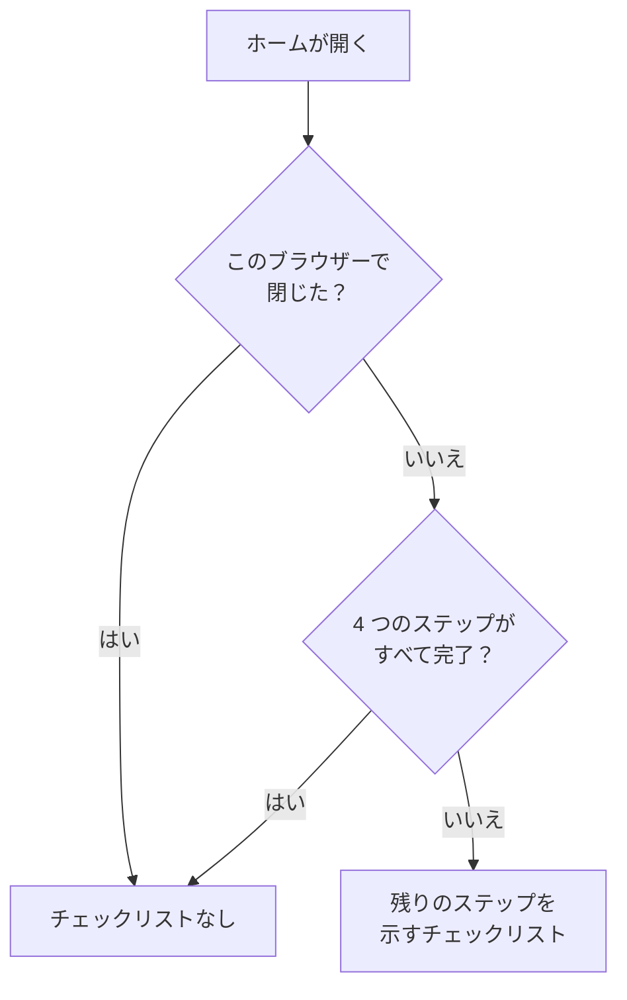

# ホーム画面とショートカット

ホームは、プロジェクトで最初に目にするページです。いま対応が必要なことがあるかをひと目で伝え、新しいプロジェクトを最初のセットアップへと導きます。このページでは、ホームに何が表示されるか、ダッシュボードで製品、ページ、アクションを見つける方法、そしてメニューをたどる手間を省くキーボードショートカットを説明します。

:::cards
- [ホームに表示されるもの](#ホームに表示されるもの): ウェルカムチェックリスト、5 つのタイル、アクティブなインシデント。
- [画面の歩き方](#画面の歩き方): 製品メニューと、各ページ上部のバー。
- [検索](#ページ設定アクションを検索する): 名前を入力して、任意のページ、設定、アクションを見つけます。
- [キーボードショートカット](#キーボードショートカット): 2 つのキーで、ホーム、モニター、インシデントに移動します。
:::

## ホームに表示されるもの

上部のバーで **ホーム** を開くか、どこからでも `g` に続けて `h` を押します。ホームには、上から順に次のものが表示されます。

1. **OneUptime へようこそ 👋**: 新しいプロジェクト向けのチェックリストで、完了するまで表示されます。
2. 対応が必要なものを数える 5 つのタイル。
3. **アクティブなインシデント**: まだ解決されていないすべてのインシデント。

### ウェルカムチェックリスト

チェックリストは、プロジェクトが役に立つようになるまでに必要な 4 つのことを案内します。各ステップは、それを行うページを開き、求めたものがプロジェクトにそろうと自動でチェックが付きます。

| ステップ | 完了の条件 | 開くページ |
| --- | --- | --- |
| **最初のモニターを作成** | プロジェクトにモニターがある。 | **モニターを作成** フォーム。モニターを作成できない人には **モニター** の一覧。 |
| **ステータスページを公開** | プロジェクトにステータスページがある。 | **ステータスページ** |
| **チームを招待** | あなた以外の誰かがプロジェクトにいる、または招待されている。 | **ユーザー** |
| **オンコールポリシーを設定** | プロジェクトにオンコールポリシーがある。 | **オンコール** |

ステップの下にある **OneUptime のしくみ** は、問題が流れる順に 4 つの中核製品を示します。 **モニター**、 **インシデントとアラート**、 **オンコール**、 **ステータスページ** です。クリックすると、それぞれが開きます。

チェックリストは、4 つのステップがすべて完了すると消えます。それより前に隠すには、 **閉じる** をクリックします。閉じたことは、このブラウザーに、このプロジェクトについて記憶されます。ステップが開くものは、引き続き **製品** メニューから開けます。

### タイル

各タイルは何かを数え、対応が必要かどうかを示し、数字の背後にある一覧を開きます。

| タイル | 数えるもの | 数がゼロのとき |
| --- | --- | --- |
| **対応中のインシデント** | 解決されていないインシデント | **問題なし** |
| **対応中のアラート** | 解決されていないアラート | **問題なし** |
| **非稼働のモニター** | 状態が稼働中のどれにも当たらないモニター。アーカイブ済みのモニターは除外されます。 | **すべて稼働中** |
| **実施中のメンテナンス** | 進行中の定期メンテナンスのイベント | **実施中のものはありません** |
| **リスクのある SLO** | オンになっている SLO のうち、リスクがあるものや、エラーバジェットを使い切ったもの | **エラーバジェットは健全** |

数がゼロより大きいと **対応が必要** と表示され、メンテナンスと SLO のタイルでは、それぞれ **実施中** と **エラーバジェット消費中** と表示されます。まだモニターがないプロジェクトでは、モニターのタイルに **モニターはまだありません** と表示され、SLO がないプロジェクトでは **SLO はまだありません** と表示されます。空のプロジェクトは、健全なプロジェクトと同じではないからです。このとき、この 2 つのタイルはそれぞれ **モニター** と **SLO** の一覧を開き、そこで最初の 1 つを作成できます。

### ホームのサイドメニュー

ホームの横のサイドメニューには、同じ一覧が件数付きで並んでいます。

| セクション | ページ |
| --- | --- |
| **インシデント** | **アクティブなインシデント** と **アクティブなエピソード** |
| **アラート** | **アクティブなアラート** と **アクティブなエピソード** |
| **モニター** | **非稼働** |
| **定期イベント** | **進行中** |

エピソードは、関連するインシデントやアラートをまとめ、1 つのものとして対応できるようにします。 [基本概念](/docs/introduction/core-concepts#インシデントとアラート) を参照してください。

## 画面の歩き方

OneUptime のすべては、上部バーの **製品** にあります。メニューはグループを 1 つのリストの行として並べ、常に最初のグループである「基本」を開いた状態で開きます。基本には、モニター、インシデント、アラート、オンコール、ステータスページ、定期メンテナンス、SLO があります。ほかのグループ（オブザーバビリティ、AI、コード、リソース、インフラストラクチャ、ダッシュボードと自動化、設定）は、それぞれ同じリストの 1 行に折りたたまれています。各行には、そのグループの製品名とその数が表示されます。行をクリックすると開いたり折りたたんだりでき、矢印キーでその行に移動して **Enter** を押しても同じです。

- **検索ですべてが見つかります。** メニューの検索ボックスに入力すると、名前や機能、あるいは `k8s` や `RUM` のようなおなじみの言葉で、どの製品でも見つかります。検索は、折りたたまれたグループの中も探します。
- **今いる場所から始まります。** 表示中のページのグループは自動で開き、最近開いた製品は上部に並びます。
- **選択は保持されます。** メニューは、ほかのグループのうちどれを開き、どれを折りたたんだかを、ブラウザーに記憶します。基本は、折りたたんだことがあっても、メニューを開くたびに再び開いた状態になります。
- **スマートフォンでは**、メニューボタンが同じように製品を並べます。基本は上部に開いた状態で表示され、ほかのグループはそれぞれ、タップで開く 1 行として表示されます。

### 上部のバー

すべてのページの上部には、2 本のバーがあります。

| 場所 | あるもの |
| --- | --- |
| 左上 | プロジェクトピッカー: 自分の別のプロジェクトに切り替えたり、新しいプロジェクトを作成したりします。 |
| 右上 | **検索** と **AI に質問**、いま対応が必要なもの（アクティブなインシデントとアラート、当番になっているオンコールポリシー、保留中の招待）を示す通知ベル、 **ヘルプ**、そして [アカウント](/docs/introduction/your-account) メニューを開くあなたの写真。 |
| その下 | 左に **ホーム** と **製品**、右に **ユーザー設定**: このプロジェクトで OneUptime があなたに連絡する方法。 |

**ヘルプ** は、このドキュメント（**ドキュメント**）と **キーボードショートカット** の一覧を開き、メールと Slack でのサポートも案内します。スマートフォンのような狭い画面では、場所を節約するために **検索**、 **AI に質問**、 **ヘルプ** は表示されません。通知ベルとあなたの写真は残ります。

## ページ、設定、アクションを検索する

**Cmd+K**（Mac）または **Ctrl+K**（Windows と Linux）を押すか、上部バーの検索アイコンをクリックして、入力を始めます。検索で見つかるものは次のとおりです。

- **メニューのすべてのページ**: メニューでの名前で見つかります。API キー、危険な操作、オンコールスケジュール、インシデントの重大度、自分の通知方法などです。各結果には、 *プロジェクト設定 › 詳細* のようにそのページの場所が表示されるので、同じ名前のページ（インシデント、アラート、モニターそれぞれのカスタムフィールド）も簡単に見分けられます。
- **アクション**: やりたいことで見つかります。インシデントを宣言、モニターを作成、あるいは危険な操作を開くプロジェクトを削除などです。何かを変更するアクションは、それを行う権限のある人にだけ表示されます。
- **モニター、インシデント、アラート、ステータスページ、オンコールポリシー**: 名前で見つかります。

検索は、入力したことを意図どおりに読み取ります。

- 大文字と小文字、アクセント記号、スペース、ハイフンの違いは関係ありません。 *on-call*、 *on call*、 *oncall* はどれも同じページを見つけ、単語の順序も自由です。
- 多くのページについて、別の言葉（英語）も知っています。オンコールポリシーには *pager* や *escalation*、オンコールスケジュールには *rota*、2 要素認証には *2fa*、危険な操作には *delete project* です。
- 製品名を加えると、検索を絞り込めます。 *incident custom fields* は、インシデントのカスタムフィールドのページを見つけます。
- *incidnet* のような小さなタイプミスがあっても、入力どおりに一致するものがなければ、意図したものが見つかります。

検索ボックスが空のときは、最近開いたページ、アクション、製品が表示されます。

## キーボードショートカット

ダッシュボードのどこでも `?` を押すと、すべてのショートカットが表示されます。 **ヘルプ** を開いて **キーボードショートカット** を選んでも表示できます。Mac では `Mod` は Command キー、Windows と Linux では Ctrl キーです。

| キー | 動作 |
| --- | --- |
| `Mod` + `K` | コマンドパレットを開き、任意のページ、設定、アクションを検索します。 |
| `Mod` + `I` | いま見ているものについて AI に質問します。 |
| `/` | このページのリストを検索します。 |
| `?` | キーボードショートカットを表示します。 |
| `Esc` | ダイアログやパネルを閉じます。 |

### 製品に移動する

`g` を押してから文字キーを押すと、その製品に直接移動します。文字キーは、 `g` から 1.5 秒以内に押してください。

| キー | 移動先 |
| --- | --- |
| `g`、次に `h` | ホーム |
| `g`、次に `m` | モニター |
| `g`、次に `i` | インシデント |
| `g`、次に `a` | アラート |
| `g`、次に `o` | オンコール |
| `g`、次に `s` | ステータスページ |
| `g`、次に `e` | 定期メンテナンス |
| `g`、次に `d` | ダッシュボード |
| `g`、次に `l` | ログ |
| `g`、次に `t` | トレース |

ショートカットは作業の邪魔をしません。フィールドに入力している間は `?`、`/`、`g` は何もせず、ダイアログが開いている間はどのキーでもページを移動しないので、うっかり押したキーで入力途中のフォームが失われることはありません。ほかの製品も、 `Mod` + `K` で検索すればすぐに開けます。

## 次のステップ

:::cards
- [クイックスタート](/docs/introduction/quickstart): ウェルカムチェックリストを、ステップごとに進めます。
- [アカウント](/docs/introduction/your-account): プロフィール、サインインのセキュリティ、言語とテーマ。
- [AI に質問](/docs/ai/ask-ai): AI に質問が答えられること、あなたの代わりにできること。
- [基本概念](/docs/introduction/core-concepts): モニター、インシデント、アラート、オンコールとは何か。
:::
