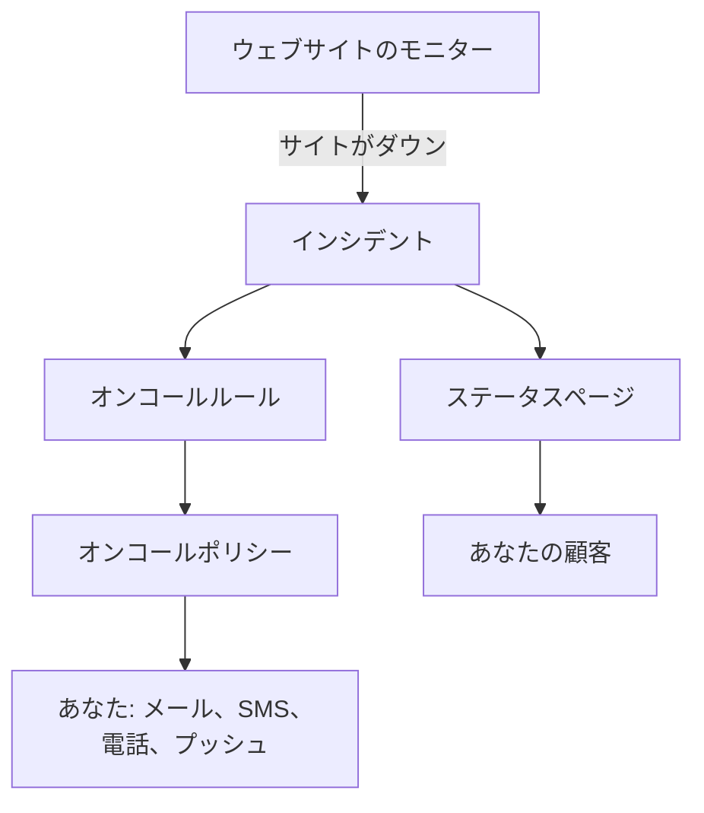

# クイックスタート

このガイドでは、新しいアカウントから約 15 分で、動く構成までを案内します。5 分ごとにウェブサイトをチェックするモニター、サイトがダウンしたときにあなたを呼び出すオンコールポリシー、そして顧客に知らせるステータスページです。プロジェクトのホームページにある **OneUptime へようこそ 👋** チェックリストに沿って進めます。

## 始める前に

- **アカウント。** OneUptime Cloud では [oneuptime.com](https://oneuptime.com/accounts/register) でサインアップし、届いたメールのリンクを開きます。自分のインストールでは、ブラウザーで開いてサインアップします。最初のアカウントがマスター管理者になります。インストール方法は [Docker Compose](/docs/installation/docker-compose) を参照してください。
- **監視するウェブサイト。** HTTP または HTTPS で応答するアドレスなら何でもかまいません。たとえば会社のホームページです。

## プロジェクトを作成する

OneUptime のすべては、プロジェクトの中にあります。モニター、インシデント、オンコールポリシー、ステータスページ、そしてそれらに取り組む人々です。

:::steps
### 新しいプロジェクトを始める

初めてサインインすると、OneUptime は **プロジェクトがありません** と表示します。 **新しいプロジェクトを作成** をクリックします。すでに誰かからプロジェクトに招待されている場合は、代わりに同じページで招待を承諾します。

### 名前を付ける

**プロジェクト名** に、会社名などを入力します。OneUptime Cloud では、次のステップでプランを選びます。

### 作成する

**プロジェクトを作成** をクリックします。プロジェクトのホームページが開き、上部に **OneUptime へようこそ 👋** チェックリストが表示されます。
:::

## ウェブサイトを監視する

:::steps
### モニターの作成を開く

チェックリストで **最初のモニターを作成** をクリックします。 **製品** メニューから **モニター** を開き、 **モニターを作成** をクリックすることもできます。

### ウェブサイトを選ぶ

**モニターの種類** で **ウェブサイト** を選びます。 **名前** に `Website` などと入力し、 **次へ** をクリックします。

### アドレスを入力する

**ウェブサイト URL** に、サイトの完全なアドレスを入力します。たとえば `https://example.com` です。条件は OneUptime が自動で追加します。サイトが応答しない、またはエラーを返すと、モニターは **オフライン** になり、インシデントを宣言します。 **次へ** をクリックします。

### モニターを作成する

選択済みの **プローブ** と、 **監視間隔** の **5 分ごと** はそのままにして、 **モニターを作成** をクリックします。モニターのページが開き、プローブがサイトのチェックを始めます。
:::

保存する前にチェックを試すには、2 番目のステップで **モニターをテスト** をクリックします。そのほかのモニターの種類は [モニターの作成](/docs/monitor/create-monitor) で説明しています。

## ダウンしたときに呼び出しを受ける

今のままでは、所有者のいないインシデントはプロジェクトの所有者にメールで送られ、そこにはあなたも含まれます。誰かが応答するまで呼び出しを受けるには、オンコールポリシーを作成し、すべてのインシデントがそれを呼び出すようにします。

:::steps
### オンコールポリシーを作成する

チェックリストで **オンコールポリシーを設定** をクリックするか、 **製品** メニューから **オンコール** を開きます。 **オンコールポリシーを作成** をクリックし、 **名前** を入力します。 **最初に誰に通知しますか？** で **対応者を追加** をクリックし、自分を選びます。 **オンコールポリシーを作成** をクリックします。

### すべてのインシデントで呼び出す

**製品** メニューから **インシデント** を開き、サイドメニューの **ルール** を展開して **オンコールルール** を選びます。 **インシデントのオンコールルールを作成** をクリックし、 **名前** を入力して **次へ** をクリックします。 **一致条件** は空のままにしてすべてのインシデントに一致させ、 **次へ** をクリックします。 **オンコールポリシー** で自分のポリシーを選び、 **インシデントのオンコールルールを作成** をクリックします。

### 連絡方法を選ぶ

サインインに使うメールは、すでにあなたへの連絡手段になっています。SMS や電話でも連絡を受けるには、上部バーの下のバーで **ユーザー設定** を開いて **通知方法** に移動し、 **直接の連絡先** タブで、 **電話番号 SMS 通知用** または **通話通知用の電話番号** に番号を追加します。 **確認** をクリックし、OneUptime から届いたコードを入力します。確認済みの番号は、すぐにオンコールの呼び出しに使われます。
:::

> [!NOTE]
> 新しいプロジェクトでは、SMS と電話はオフになっています。プロジェクトの所有者、Billing Admin、または Manage Billing の権限を持つ人が、 **プロジェクト設定 → 通知 → 通知設定** の **通知チャネル** カードでオンにします。

レベルの追加、ローテーション、各レベルの待ち時間については、 [エスカレーションルール](/docs/on-call/escalation-rules) と [オンコールスケジュール](/docs/on-call/schedules) を参照してください。

## ステータスページを公開する

:::steps
### ステータスページを作成する

チェックリストで **ステータスページを公開** をクリックするか、 **製品** メニューから **ステータスページ** を開きます。 **ステータスページを作成** をクリックし、 **名前** に `Acme Status` などと入力して、 **ステータスページを作成** をクリックします。

### モニターを追加する

新しいステータスページを開きます。サイドメニューの **リソース** で **モニター** を選びます。モニターグループが有効なプロジェクトでは、この項目は **リソース** と表示されます。 **モニターを追加** をクリックし、ウェブサイトのモニターを選んで **モニターを追加** をクリックします。行には、モニターの名前が訪問者向けに表示されます。変えたい場合は **表示名** で変更します。

### ページを開く

サイドメニューで **概要** を選びます。 **ステータスページのプレビュー URL** カードからステータスページにリンクしています。開くと、ウェブサイトが稼働中として表示されます。
:::

新しいステータスページは公開されており、アドレスを知っていれば誰でも開けます。独自のドメイン、ロゴ、色を設定するには、 [ステータス ページのブランディングとドメイン](/docs/status-pages/branding-and-domains) を参照してください。

## チームを招待する

チェックリストで **チームを招待** をクリックするか、 **製品** メニューの **設定** にある **ユーザー** を開きます。 **ユーザーを招待** をクリックし、相手の **メール** を入力して **チーム** を選びます。最初はメンバーのチームが選ばれています。 **招待** をクリックします。OneUptime から招待メールが送られ、その人ができることはチームによって決まります。 [ユーザー、チーム、権限](/docs/permissions/index) を参照してください。

## 試してみる

テスト用のインシデントを宣言して、一連の流れが動くことを確かめましょう。

:::steps
### テスト用のインシデントを宣言する

**インシデント** を開き、 **インシデントを宣言** をクリックします。 **タイトル** に `Test incident` などと入力し、 **インシデントの重大度** を選んで **次へ** をクリックします。 **モニター** でウェブサイトのモニターを選ぶと、インシデントがステータスページに表示されます。概要に達するまで **次へ** をクリックし、 **インシデントを宣言** をクリックします。

### 動きを確かめる

1、2 分以内に、オンコールポリシーがあなたを呼び出し、インシデントがステータスページに表示されます。

### 解決する

インシデントのページで **解決** をクリックします。呼び出しが止まり、インシデントはステータスページから消えます。
:::

> [!WARNING]
> ステータスページを開いた人には、解決するまでテスト用のインシデントが見えます。ページのアドレスを共有する前にテストしてください。

## トラブルシューティング

:::details 呼び出されなかった
インシデントを開き、サイドメニューで **オンコールの実行** を選びます。ポリシーが実行されたかどうか、誰を呼び出したかがわかります。実行されていなければ、オンコールルールが有効で、そのポリシーを指定しているかを確認します。実行されていれば、 **ユーザー設定 → 通知方法** の方法が確認済みかを確認します。
:::

:::details インシデントがステータスページに表示されない
ステータスページは、インシデントのモニターのいずれかがそのページにあるとき、インシデントを表示します。インシデントの影響を受けるリソースにあなたのモニターが含まれていること、そしてそのモニターがステータスページにあることを確認してください。
:::

:::details モニターはオフラインと表示しているが、サイトは動いている
モニターを開き、プローブが何を受け取ったかを確認します。 [Web サイト モニター](/docs/monitor/website-monitor) のトラブルシューティングのセクションを参照してください。
:::

## 次のステップ

:::cards
- [基本概念](/docs/introduction/core-concepts): いま設定したものの背景にある考え方。
- [オンコールスケジュール](/docs/on-call/schedules): オンコールをチームで分担します。
- [ステータス ページのブランディングとドメイン](/docs/status-pages/branding-and-domains): ステータスページを自分たちらしくします。
- [OpenTelemetry](/docs/telemetry/open-telemetry): アプリからログ、メトリクス、トレースを送信します。
:::
