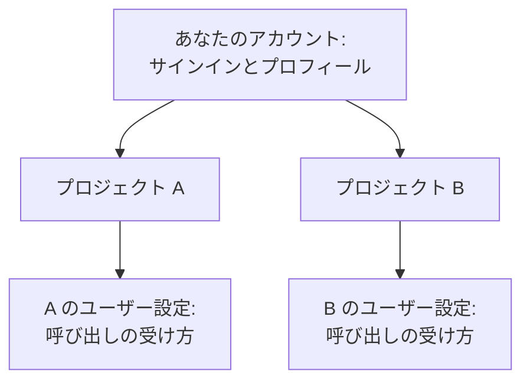

# アカウント

アカウントは、OneUptime があなたを識別するためのものです。サインインに使うメールアドレスとパスワード、名前とタイムゾーン、そしてサインインを守る仕組みが含まれます。1 つのアカウントで多くのプロジェクトに所属でき、これらの設定はどのプロジェクトにもついてきます。OneUptime があなたに連絡する方法と、呼び出すタイミングは、プロジェクトごとに **ユーザー設定** で設定します。

:::cards
- [プロフィール](#プロフィール): 名前、メールアドレス、タイムゾーン、写真。
- [安全なサインイン](#安全なサインイン): パスワード、パスキー、2 要素認証。
- [プロジェクト](#プロジェクト): プロジェクトの切り替え、作成、招待の承諾。
- [ユーザー設定](#各プロジェクトがあなたのために保持するもの): 各プロジェクトで、OneUptime があなたに連絡する方法。
:::

## ユーザーメニュー

ダッシュボードの右上にある、自分の写真をクリックします。

| 項目 | 動作 |
| --- | --- |
| **プロフィール** | **ユーザープロフィール** を開きます。名前、メールアドレス、タイムゾーン、写真、サインインのセキュリティがあります。 |
| **管理者設定** | Admin Dashboard を開きます。セルフホストのインストールのマスター管理者にだけ表示されます。 |
| **ダークテーマ** | ダッシュボードをダークテーマに切り替えます。ダークテーマでは、この項目は **ライトテーマ** と表示されます。 |
| **ログアウト** | サインアウトします。 |

**ユーザープロフィール** には、独自のサイドメニューがあります。 **基本** には **概要** と **プロフィール写真** があります。 **セキュリティ** と **危険な操作** は折りたたまれており、セクションのタイトルをクリックすると開きます。

## プロフィール

:::steps
### プロフィールを開く

右上の自分の写真をクリックし、 **プロフィール** を選びます。 **概要** ページが開き、 **基本情報** カードに名前、メールアドレス、タイムゾーンが表示されます。

### 詳細を編集する

**ユーザーを編集** をクリックし、必要な項目を変更します。

- **メール**: サインインに使うアドレスです。変更した場合は、新しいアドレスをもう一度確認します。
- **氏名**: OneUptime のどこでもチームに表示される名前です。
- **タイムゾーン**: ダッシュボードが時刻を表示し、読み取るときのタイムゾーンです。あなたに送られる通知の時刻にも使われます。

**変更を保存** をクリックします。

### 写真を追加する

**プロフィール写真** を選び、 **プロフィール画像を更新** をクリックして画像をアップロードします。写真は、ユーザーメニューと、人の一覧であなたの名前の横に表示されます。
:::

> [!NOTE]
> あるブラウザーで初めてサインインすると、OneUptime はそのブラウザーのタイムゾーンをプロフィールに保存します。後で、ブラウザーのタイムゾーンが異なる環境でサインインすると、ダッシュボードが **タイムゾーンを更新** するかどうかを尋ねます。閉じると、そのタイムゾーンについては再び尋ねられません。

## 安全なサインイン

**ユーザープロフィール** のサイドメニューで **セキュリティ** を展開します。3 つのページがあります。

| ページ | 用途 |
| --- | --- |
| **パスワード管理** | 新しいパスワードを設定します。 |
| **パスキー** | 指紋、顔、画面ロック、またはセキュリティキーを使い、パスワードなしでサインインします。 |
| **2 要素認証** | パスワードの後に、2 つ目のステップ（アプリのコード、またはセキュリティキー）を求めます。 |

### パスワードを変更する

:::steps
1. **セキュリティ → パスワード管理** を開きます。
2. **パスワード** に新しいパスワードを入力し、 **パスワードの確認** にもう一度入力します。6 文字以上にする必要があります。
3. **パスワードを更新** をクリックします。
:::

### パスキーを追加する

:::steps
1. **セキュリティ → パスキー** を開き、 **パスキーを追加** をクリックします。
2. デバイスやパスワードマネージャーの名前など、見てわかる名前を付けて、 **パスキーを作成** をクリックします。
3. ブラウザーの案内に従って、パスキーを保存します。
:::

次回からは、サインインページで **パスキーでサインイン** を選びます。

### 2 要素認証をオンにする

2 要素認証は、パスワードでサインインするときに適用されます。まず 2 つ目のステップを追加してから、オンにします。

:::steps
### 認証アプリを追加する

**セキュリティ → 2 要素認証** を開きます。 **認証アプリ** でアプリを追加し、名前を付けます。1Password、Google Authenticator、Microsoft Authenticator などのアプリで QR コードをスキャンし、表示された 6 桁のコードを入力して、 **認証して完了** をクリックします。代わりに USB や NFC のキーを使うには、 **セキュリティキー** で追加します。

### バックアップコードを保存する

アプリ、キー、またはパスキーを初めて追加すると、OneUptime が **バックアップコード** を表示します。アプリやキーをなくしたとき、各コードで 1 回サインインできます。コピーまたはダウンロードし、保存したことを示すチェックボックスにチェックを入れて、 **完了** をクリックします。

### オンにする

ページ上部の **2 要素認証を有効化** をクリックし、確認します。カードに **有効** と表示されます。次にパスワードでサインインするときから、OneUptime は 2 つ目のステップを求めます。
:::

> [!TIP]
> バックアップコードが残り少なくなったら、同じページの **コードを再生成** で新しいセットを受け取れます。古いコードはすぐに使えなくなります。

## プロジェクト

プロジェクトには、いくつでも所属できます。ダッシュボード左上のプロジェクトピッカーにすべてが表示され、1 つ選ぶと切り替わります。

- **プロジェクトを作成する**: プロジェクトピッカーを開き、 **新しいプロジェクトを作成** をクリックします。セルフホストのインストールでは、管理者がプロジェクトの作成を管理者だけに限定できます。
- **招待を承諾する**: 誰かに招待されると、右上の通知ベルに保留中の招待が表示され、そこから **プロジェクトへの招待** が開きます。そこで **承諾** または **拒否** を選びます。
- **プロジェクトから抜ける**: そのプロジェクトのユーザーを管理する人に、 **ユーザー** ページの **プロジェクトから削除** で外してもらいます。

## 各プロジェクトがあなたのために保持するもの

上部バーの下のバーの右にある **ユーザー設定** は、あなた専用で、プロジェクトごとに別々です。オンコール担当になっているすべてのプロジェクトで開いてください。

| ページ | 用途 | 詳細 |
| --- | --- | --- |
| **セットアップチェックリスト** | 以下のすべてを案内し、残っている作業を示します。 | |
| **通知方法** | OneUptime があなたに連絡できるメールアドレス、電話番号、アプリ、Webhook。サインインに使うメールは自動で追加されます。 | |
| **オンコールルール** | オンコールポリシーに呼び出されたとき、どの方法を、どれだけ経ってから使うか。 | [エスカレーションルール](/docs/on-call/escalation-rules) |
| **通知設定** | インシデント、アラート、モニターなどについて、どの更新をどのチャネルで受け取るか。 | |
| **メール設定** | 受け取るメールの量。1 通ずつか、まとめてか。 | [通知のまとめ](/docs/emails/notification-rollup) |
| **オンコールログ** | あなたに送られたすべての呼び出しと、その結果。 | |
| **着信用の電話番号** | 着信ポリシーがあなたを呼び出す番号。 | [着信ポリシー](/docs/on-call/incoming-call-policy) |
| **カレンダーフィード** | Google カレンダー、Apple カレンダー、Outlook に表示する、あなたのオンコールのシフト。 | [カレンダーフィード](/docs/on-call/calendar-feeds) |

## 言語とテーマ

どちらもアカウントではなくブラウザーに保存されるため、別のブラウザーやデバイスでは設定し直してください。

- **言語**: ダッシュボードは、ブラウザーの言語で始まります。変更するには、各ページの下部にある言語メニューを使います。このドキュメントには、上部に独自の言語メニューがあります。
- **テーマ**: ユーザーメニューで **ダークテーマ** を選びます。ダッシュボードは、ライトテーマで始まります。

## アカウントの削除

**危険な操作 → アカウントを削除** を開きます。アカウントを削除できるのは、どのプロジェクトにも所属していないときだけです。このページには、まだ所属しているプロジェクトが表示されます。まずそれらから抜け、 **アカウントを削除** をクリックして確認します。アカウントの削除は永久的で、元に戻せません。

## トラブルシューティング

:::details アドレス確認のメールが届かない
もう一度サインインすると、新しいリンクが送られます。迷惑メールフォルダーも確認してください。サインインできない場合は、サインインページの **パスワードをお忘れですか？** を使います。そのリセットリンクでも、アドレスが確認されます。
:::

:::details 認証アプリをなくした
サインインの 2 つ目のステップで **認証アプリにアクセスできませんか？** を選び、バックアップコードを 1 つ入力します。その後、 **セキュリティ → 2 要素認証** を開いて、新しいアプリを追加します。バックアップコードがない場合は、OneUptime のインストールの管理者に、あなたのアカウントの 2 要素認証をリセットするよう依頼してください。
:::

:::details ダッシュボードの時刻が 1 時間ずれている
ダッシュボードは、コンピューターではなく、プロフィールの **タイムゾーン** で時刻を表示します。 **ユーザープロフィール → 概要** で確認してください。
:::

## 次のステップ

:::cards
- [ホーム画面とショートカット](/docs/introduction/home): ダッシュボードの歩き方。
- [エスカレーションルール](/docs/on-call/escalation-rules): オンコールポリシーがあなたを呼び出す仕組み。
- [ユーザー、チーム、権限](/docs/permissions/index): プロジェクトであなたができることを決めるもの。
- [SSO](/docs/identity/sso): 会社の ID プロバイダーでサインインします。
:::
