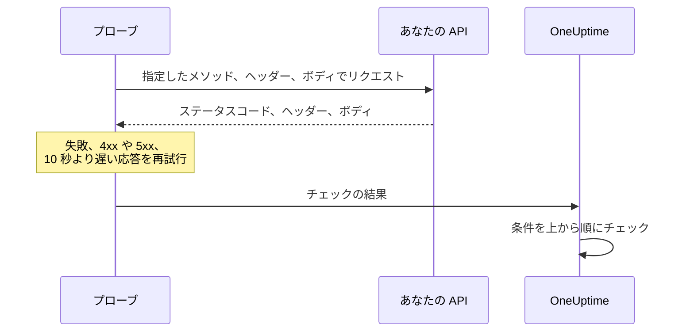

# API モニター

API モニターは、選んだメソッド、ヘッダー、ボディでスケジュールどおりに HTTP エンドポイントを呼び出し、返ってきたもの、つまりステータスコード、レスポンスタイム、ヘッダー、ボディをチェックします。REST、JSON、GraphQL のエンドポイント、ヘルスチェック、そしてユーザーが頼りにしているあらゆる呼び出しに使います。

:::cards
- [モニターを作成する](#api-モニターを作成する): ダッシュボードで 6 ステップ。
- [設定オプション](#設定オプション): メソッド、ヘッダー、ボディ、リダイレクト、証明書、タイムアウト、再試行。
- [監視条件](#監視条件): 最初から何を稼働中または停止とみなすか。
- [トラブルシューティング](#トラブルシューティング): 成功するはずのチェックが失敗するとき。
:::

## しくみ

チェックのたびに、プローブはリクエストを送り、リダイレクトをたどって、ステータスコード、レスポンスタイム、ヘッダー、ボディを記録します。失敗した、タイムアウトした、`4xx` または `5xx` のステータスで応答した、あるいは 10 秒より長くかかったリクエストは、許可した再試行回数まで再試行されます。その後、OneUptime が結果をモニターの条件に通します。



自身のネットワーク接続を失ったプローブは結果を報告しないため、API をオフラインにすることはありません。

## 始める前に

- **モニターを作成できるロール**: Project Owner、Project Admin、Project Member、Monitor Admin、Monitor Member のいずれか、または Create Monitor 権限を持つカスタムロール。
- **API に到達できるプローブ。** 新しいモニターには、プロジェクトのデフォルトのプローブが選ばれます。API の前にファイアウォールがある場合は、[OneUptime Cloud のプローブの IP アドレス](/docs/configuration/ip-addresses) を許可します。プライベートネットワーク上の API には、そのネットワーク内で動く、プライベートアドレスへの到達を許可された [カスタムプローブ](/docs/probe/custom-probe) が必要です。[プライベートネットワークへのアクセス](/docs/self-hosted/private-network-access) を参照してください。
- **モニターシークレットとしての認証情報。** API にキーやトークンが必要な場合は、先にそれを [モニターシークレット](/docs/monitor/monitor-secrets) として保存し、モニターには参照だけを持たせます。

## API モニターを作成する

:::steps
### 新しいモニターを始める

**モニター** に移動し、**モニターを作成** をクリックします。**モニターの種類** で **API** を選びます。

### 名前を付ける

`Orders API` のような **名前** を入力し、**次へ** をクリックします。

### リクエストを入力する

**API URL** に、`https://api.example.com/health` のようなエンドポイントの完全な URL を入力します。**API リクエストタイプ** を選びます（変更しない限り **GET**）。ヘッダーやボディを追加するには **その他の項目** を開き、**リクエストヘッダー** と **リクエストボディ（JSON 形式）** に入力します。

### テストする

**モニターをテスト** をクリックし、**プローブを選択** でプローブを選んで **テストを実行** をクリックします。**モニターテスト結果** に、API の応答が表示されます。

### 条件を確認する

**モニター条件** は [デフォルト条件](#デフォルト条件) から始まります。API が応答しないかエラーで応答するとオフライン、`2xx` または `3xx` のステータスならオンラインです。API が返す内容もチェックするには、フィルターを追加してから **次へ** をクリックします。

### プローブを選んで作成する

**プローブ** と **監視間隔**（**5 分ごと** から始まります）をそのまま使うか変更し、**モニターを作成** をクリックします。モニターのページが開きます。
:::

## 設定オプション

### API URL

呼び出すエンドポイントを、`https://api.example.com/v1/health` のようにスキームを含む完全な URL で指定します。URL には `{{monitorSecrets.NAME}}` として [モニターシークレット](/docs/monitor/monitor-secrets) を入れられます。

### 動的な URL プレースホルダー

API の前に CDN やキャッシュプロキシがあると、プローブがサーバーではなくキャッシュから応答を受け取ることがあります。キャッシュを回避するには URL にプレースホルダーを追加します。プローブはチェックのたびにそれを新しい値に置き換えます。

| プレースホルダー | 置き換えられる値 | 値の例 |
| --- | --- | --- |
| `{{timestamp}}` | 現在の Unix 時刻（秒） | `1719500000` |
| `{{random}}` | 32 文字の 16 進数からなるランダムで一意な文字列 | `3f2b8c1d9e7a4b6c8d0e1f2a3b4c5d6e` |

プレースホルダーを含む URL:

```text
https://api.example.com/health?cb={{timestamp}}
```

5 分間隔の 2 回のチェックでプローブがリクエストする URL:

```text
https://api.example.com/health?cb=1719500000
https://api.example.com/health?cb=1719500300
```

`{{random}}` も同じように使います: `https://api.example.com/health?nocache={{random}}`。

### API リクエストタイプ

送信する HTTP メソッド。デフォルトは **GET** で、ほかに **POST**、**PUT**、**PATCH**、**DELETE**、**HEAD** があります。**HEAD** リクエストに `4xx` または `5xx` のステータスが返ると、プローブはそれを `GET` で繰り返します。

### その他の項目

これらの設定は **その他の項目** に折りたたまれています。折りたたまれた見出しには項目名が並び、変更したものが示されます。

| 項目 | デフォルト | 内容 |
| --- | --- | --- |
| **リクエストヘッダー** | なし | 送信するヘッダーを、名前と値の組で指定します。ヘッダーごとに **Request Headerを追加** をクリックします。 |
| **リクエストボディ（JSON 形式）** | なし | ボディとして送信する JSON オブジェクト。通常は **POST**、**PUT**、**PATCH** と一緒に使います。有効な JSON でなければなりません。 |
| **リダイレクトに従わない** | オフ | リダイレクトをたどらずに最初の応答を評価します。[下記](#リダイレクトに従わない) を参照してください。 |
| **自己署名証明書を許可する** | オフ | モニター自身のホスト名について、TLS 証明書の検証を省略します。 |
| **クライアント証明書を使用（mTLS）** | オフ | クライアント証明書と秘密鍵を提示します。[クライアント証明書（mTLS）](#クライアント証明書mtls) を参照してください。 |
| **リクエストタイムアウト（秒）** | `60` | 各試行を待つ時間。最大は 60 秒です。 |
| **失敗時の再試行** | プローブのデフォルト、通常は `3` | 失敗した試行を何回再試行するか。最大は 3 回です。[再試行とタイムアウト](#再試行とタイムアウト) を参照してください。 |

リクエストヘッダーとリクエストボディでは [モニターシークレット](/docs/monitor/monitor-secrets) を使えます。たとえば値が `Bearer {{monitorSecrets.ApiKey}}` のヘッダー `Authorization` です。

#### リダイレクトに従わない

デフォルトでは、プローブはリダイレクト（`301`、`302`、`303`、`307`、`308`）を最大 10 回までたどり、最後にたどり着いた応答を評価します。代わりにリダイレクトの応答そのものを評価するには、**リダイレクトに従わない** をオンにします。[デフォルト条件](#デフォルト条件) では、リダイレクトの応答はオンラインとみなされます。

リダイレクトをたどるとき:

- `303`、または `POST` への応答としての `301` や `302` は、ブラウザーと同じようにリクエストをボディなしの `GET` に変えます。
- リクエストヘッダーは、URL 自身のオリジン（同じスキーム、ホスト、ポート）にだけ送られます。別のオリジンへのリダイレクトはヘッダーなしで送られます。
- リクエストにまだボディがあるか、メソッドが `GET` または `HEAD` 以外の場合、別のオリジンへのリダイレクトでチェックは失敗します。
- **自己署名証明書を許可する** は、モニター自身のホスト名にとどまるリダイレクトをたどります。別のホスト名へのリダイレクトは通常どおり検証されます。

#### クライアント証明書（mTLS）

API が相互 TLS を必要とする場合は、**クライアント証明書を使用（mTLS）** をオンにして、次を入力します。

| 項目 | 入力する内容 |
| --- | --- |
| **クライアント証明書 (PEM)** | 提示する PEM 形式のクライアント証明書。 |
| **クライアント秘密鍵 (PEM)** | 対応する PEM 形式の秘密鍵。 |
| **クライアント秘密鍵のパスフレーズ** | 任意。秘密鍵が暗号化されている場合のみのパスフレーズ。 |

これは curl の `--cert` と `--key` フラグに相当します。

```bash
curl --cert client.crt --key client.key https://api.example.com/health
```

鍵をモニターの設定に含めないようにするには、証明書と鍵を [モニターシークレット](/docs/monitor/monitor-secrets) として保存し、これらの項目に `{{monitorSecrets.NAME}}` を入力します。シークレットはサーバー上で埋め込まれ、その値がダッシュボードに表示されることはありません。

クライアント証明書は、リクエストが URL のオリジンにとどまっている間だけ提示されます。別のオリジンへリダイレクトされたあとは、証明書なしで続行します。

#### 再試行とタイムアウト

**失敗時の再試行** は最初の試行の _あと_ の再試行を数えるので、`0` ならチェックは 1 回、`2` なら最大 3 回実行されます。空欄の場合はプローブのデフォルトが使われます。プローブの `PROBE_MONITOR_RETRY_LIMIT` で別の値が指定されていない限り 3 です。プローブは試行の間に 1 秒待ち、各試行には **リクエストタイムアウト（秒）** の全時間が与えられます。

再試行される失敗は、接続エラー、タイムアウト、`4xx` と `5xx` の応答、10 秒より遅い応答です。再試行しても変わらないため再試行されないのは、無効またはブロックされた URL、10 回を超えるリダイレクト、512 KiB を超える応答です。

## 監視条件

条件は、API をオンライン、機能低下、オフラインのどれとみなすか、そしてそれによってインシデントを宣言するかアラートを作成するかを決めます。各条件は 1 つ以上のフィルターをチェックします。

| フィルター | 条件 | チェック内容 |
| --- | --- | --- |
| **Is Online** | **真**、**偽** | ステータスコードにかかわらず、API が応答したかどうか。 |
| **レスポンスステータスコード** | **Equal To**、**Not Equal To**、**Greater Than**、**Less Than**、**Greater Than Or Equal To**、**Less Than Or Equal To** | HTTP ステータスコード。 |
| **レスポンスタイム（ms）** | **Greater Than**、**Less Than**、**Greater Than Or Equal To**、**Less Than Or Equal To** | リダイレクトを含め、リクエストにかかった時間。 |
| **レスポンスボディ** | **含む**、**Not Contains** | レスポンスボディ内のテキスト。大文字と小文字を区別します。 |
| **Response Header** | **含む**、**Not Contains** | 応答にこの名前のヘッダーがあるかどうか。`x-request-id` のように小文字で名前を入力します。 |
| **Response Header Value** | **含む**、**Not Contains** | ヘッダーがちょうどこの値を持つかどうか。`application/json` のように小文字で比較します。 |
| **JavaScript Expression** | **Evaluates To True** | 応答に対する式。[JavaScript 式](/docs/monitor/javascript-expression) を参照してください。 |
| **Is Request Timeout** | **真**、**偽** | すべての試行でリクエストがタイムアウトしたかどうか。 |

JSON の応答は、キーと値の間に空白のない詰めた形でチェックされます。**レスポンスボディ** で `"status": "ok"` を探すには、`"status":"ok"` と入力します。

**条件を追加** は、すでにフィルターにちなんだ名前の付いた条件を追加します。たとえば _Response Time (in ms) is above 3000_ です。名前は、自分で名前を入力するまでフィルターに合わせて変わります。説明は任意で、追加するには条件の **設定** を開きます。

フィルターが 2 つ以上ある場合、**一致条件** で **すべて** が一致する必要があるか、**いずれか** 1 つでよいかを決めます。条件の **アクション** は、その条件が何をするかを決めます。モニターのステータスを変える、アラートを作成する、インシデントを宣言する、またはそのいくつかです。

### デフォルト条件

新しい API モニターは 2 つの条件から始まるので、何も変えずに動きます。

- **オフライン** — API が応答しないか、`400` 以上（または `200` 未満）のステータスコードで応答した場合。モニターは **オフライン** になり、インシデントが作成されます。インシデントは API が戻ると自動で解決します。
- **オンライン** — API が `200`、`201`、`202`、`204` など、任意の `2xx` または `3xx` のステータスコードで応答した場合。モニターは **稼働中** になります。

条件の一覧では、これらはモニターにちなんで _Check if (name) is offline_ と _Check if (name) is online_ という名前になっています。

そのため、`201 Created` や `204 No Content` を返すエンドポイントは稼働中とみなされます。正常を意味するステータスコードが 1 つだけの場合は、モニターの **構成 → 条件** ページで両方の条件を変更します。たとえばオンラインの条件では **レスポンスステータスコード** / **Equal To** / `200`、オフラインの条件では **Not Equal To** / `200` とし、それぞれにある 2 つのステータスコードフィルターを置き換えます。API が返す内容もチェックするには、オフラインの条件に **レスポンスボディ** または **JavaScript Expression** のフィルターを追加します。

条件は上から順にチェックされ、最初に一致したものが何が起きるかを決めます。

どれにも一致しない場合、モニターはデフォルトのステータスに戻ります。条件の下にある **その他の項目** で別のものを選ばない限り **稼働中** です。折りたたまれた **その他の項目** の見出しに、それがどのステータスかが表示されます。

OneUptime がこれらのデフォルトを変更する前に作成されたモニターは、作成時の条件を保ち、`200` だけをオンラインとみなします。API や Terraform で作成したモニターは、送信した条件を使います。

### 一定期間にわたる評価

**この条件を一定期間にわたって評価する** はフィルターの下にあるチェックボックスで、**Is Online**、**レスポンスステータスコード**、**レスポンスタイム（ms）** で使えます。オンにすると、最新のチェックだけでなく、過去のチェックの期間を評価します。**評価** で集計方法を選び、**過去（分単位）** で 2 分から 60 分までの期間を選びます。

| 集計 | 一致するとき |
| --- | --- |
| **平均**、**合計**、**Maximum Value**、**Minimum Value** | 期間全体でのその値が条件を満たすとき。数値のフィルターのみ。 |
| **All Values** | 期間内のすべてのチェックが条件を満たすとき。 |
| **Any Value** | 期間内の少なくとも 1 つのチェックが条件を満たすとき。 |

**All Values** は、期間が本当にデータで埋まってから一致します。作成されたばかりのモニターや、チェックが記録されなくなったモニターには、直近 N 分について何かを言えるだけの履歴がないため、条件は手元の 1 つの値で一致せずに待ちます。**Any Value** は「1 回でもしきい値を超えたらすぐに知らせる」ための設定で、引き続きすぐに発火します。

**データがない場合** は、期間が条件を裏付けられない間に何が起きるかを決めます。

| オプション | 何が起きるか | 用途 |
| --- | --- | --- |
| **Ignore**（デフォルト） | 条件は一致しません。 | 通常のしきい値アラート。 |
| **トリガー** | データがないこと自体を問題とみなします。 | 沈黙そのものが障害となるチェック。 |
| **Treat As Zero** | 期間を 1 つのゼロとして比較します。 | イベントがないことが本当にゼロを意味するカウンター。 |

### 条件の例

| 目的 | フィルター | 条件 | 値 |
| --- | --- | --- | --- |
| 遅いときに API を機能低下にする | **レスポンスタイム（ms）** | **Greater Than** | `1000` |
| ヘルスチェックが問題を報告したらオフラインにする | **レスポンスボディ** | **Not Contains** | `"status":"ok"` |
| 同じことを、解析した JSON から読む | **JavaScript Expression** | **Evaluates To True** | `"{{responseBody.status}}" !== "ok"` |
| `POST` からは `201` だけを受け入れる | **レスポンスステータスコード** | **Equal To** | `201` |

## トラブルシューティング

:::details API は自分のリクエストに応答するのに、モニターはオフラインになる
プローブがあなたとは異なる応答を受け取りました。インシデントの根本原因と、モニターの **モニタリングログ** に、プローブが見た内容が表示されます。API が期待するもの、つまりメソッド、`Authorization` ヘッダー、ボディをプローブが送っているか確認します。API の前にあるファイアウォールやレートリミッターがプローブをブロックしていることもあります。[OneUptime Cloud のプローブの IP アドレス](/docs/configuration/ip-addresses) を許可します。
:::

:::details モニターが `{{monitorSecrets.NAME}}` をそのまま送ってしまう
モニターがそのシークレットを使えないか、名前が一致していません。シークレットを使える人については [モニター シークレット](/docs/monitor/monitor-secrets) を参照してください。
:::

:::details チェックが「unsafe cross-origin redirect」で失敗する
API が、ボディ付きのリクエスト、または `GET` か `HEAD` 以外のメソッドのリクエストを別のオリジンにリダイレクトしましたが、プローブはそのようなリクエストを転送しません。API のリダイレクト先の URL をモニターの対象にするか、**リダイレクトに従わない** をオンにしてリダイレクトそのものをチェックします。
:::

:::details チェックが「Remote response exceeded the allowed size.」で失敗する
プローブが読み取る応答は最大 512 KiB で、この応答はそれより大きいです。ページサイズを小さくするなど、返す量の少ないエンドポイントを呼び出します。
:::

## 次のステップ

:::cards
- [JavaScript 式](/docs/monitor/javascript-expression): JSON の応答の奥深くにあるフィールドをチェックします。
- [モニター シークレット](/docs/monitor/monitor-secrets): API キーやトークンをモニターの設定に含めないようにします。
- [Web サイト モニター](/docs/monitor/website-monitor): エンドポイントではなくウェブページをチェックします。
- [インシデント & アラート テンプレート](/docs/monitor/incident-alert-templating): 応答の詳細をインシデントやアラートのタイトルに入れます。
:::
