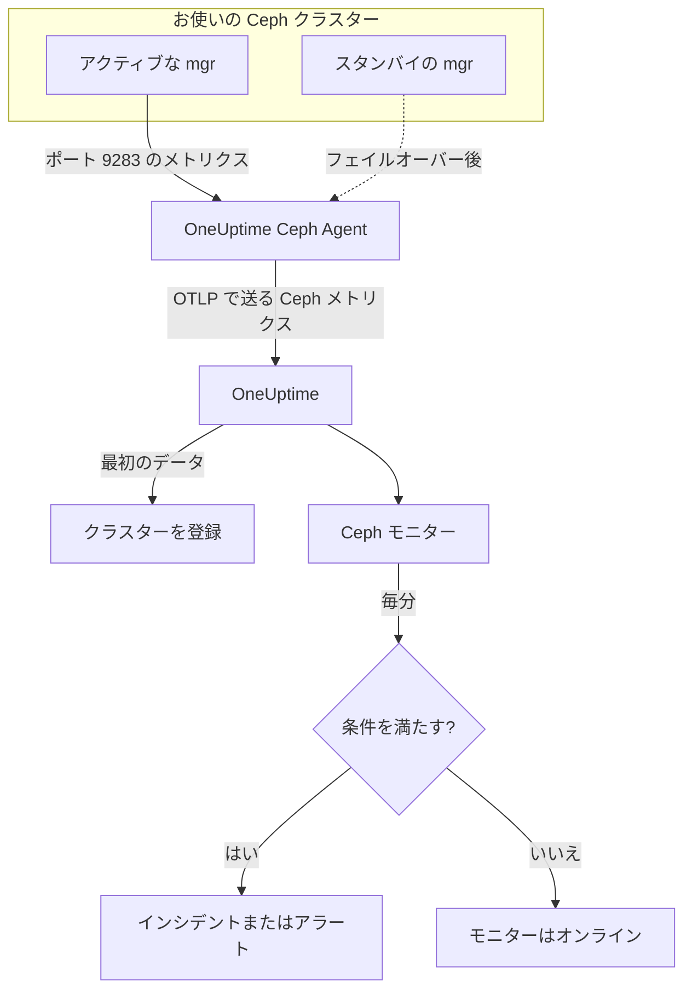

# Ceph モニター

Ceph モニターは 1 つの Ceph クラスター（ヘルス、ヘルスチェック、モニターのクォーラム、OSD、プール、配置グループ）を監視し、ヘルスが悪化したり、OSD がダウンしたり、容量が足りなくなったりした瞬間に知らせます。Ceph mgr の `prometheus` モジュールがエクスポートし、OneUptime Ceph Agent が収集した `ceph_*` メトリクスを読むので、外部から何かをプローブすることはありません。

:::cards
- [モニターを作成する](#ceph-モニターを作成する): ダッシュボードでの 6 つのステップ。
- [テンプレート](#既製のアラートテンプレート): ヘルス、OSD、配置グループ、容量に関する 23 個の既製アラート。
- [ヘルスチェック](#ヘルスチェックの系列): 任意の Ceph ヘルスチェックを名前で指定してアラートを出します。
- [メトリクス](#収集されるメトリクス): モニターがアラートの対象にできるすべての `ceph_*` 系列。
:::

## 仕組み

Ceph mgr の `prometheus` モジュールは、クラスターのメトリクスをポート 9283 で提供します。OneUptime Ceph Agent はすべての mgr デーモンを 30 秒ごとにスクレイプし（応答するのはアクティブな mgr で、スタンバイは役割を引き継ぐまで何も返しません）、Ceph 独自のラベル（`ceph_daemon`、`pool_id`）を保ったまま、クラスター名 `ceph.cluster.name` を付けて OTLP で OneUptime にメトリクスを送ります。最初のデータでクラスターが登録されます。

Ceph モニターは 1 つのクラスターに結び付いています。毎分、そのクラスターのメトリクスに対してクエリを実行し、結果を条件と比較します。



## 始める前に

- クラスターで **mgr の `prometheus` モジュールを有効にします**：

  ```bash
  ceph mgr module enable prometheus
  ```

- ポート 9283 ですべての mgr デーモンに到達できるマシンに **Ceph Agent をインストール** し、それらすべてを `CEPH_MGR_ENDPOINTS` に列挙します。インストール方法は [Ceph エージェントのガイド](/docs/telemetry/ceph)で説明しています。
- **クラスターが登録されていることを確認します。** 最初のスクレイプの約 1 分後に、エージェントの `CEPH_CLUSTER_NAME` の名前で **製品 → インフラストラクチャ → Ceph → すべてのクラスター** に表示されます。
- **ヘルスチェックのアラートには** Ceph Quincy 以降が必要です。それより古いリリースは `ceph_health_detail` をエクスポートしません。

## Ceph モニターを作成する

:::steps
### 新しいモニターを始める

**モニター** に移動し、**モニターを作成** をクリックします。

### Ceph を選ぶ

**モニターの種類** で **その他のモニターの種類** をクリックし、**インフラストラクチャ** の下の **Ceph** を選ぶか、検索ボックスに `ceph` と入力します。**名前** を入力し（インシデントとアラートのタイトルに使われます）、**次へ** をクリックします。

### クラスターを選ぶ

**Ceph モニターの設定** で、**Ceph クラスター** からクラスターを選びます。データを送ったことのあるクラスターはすべて一覧に表示されます。

### 監視する対象を選ぶ

3 つのタブから 1 つを選びます：

- **Quick Setup**：[テンプレート](#既製のアラートテンプレート)をクリックします。テンプレートはメトリクス、フィルター、集計、時間範囲、しきい値を設定し、下の条件を独自の条件に置き換えます。**時間範囲** はそのあとでも変更できます。
- **Custom Metric**：**Ceph メトリクス** から 1 つのメトリクスを選び、**集計** と **時間範囲** を設定します。**OSD** と **プール ID** で 1 つのデーモンまたはプールに絞り込めます。
- **詳細**：**メトリクスを選択** でクエリと数式を自分で組み立てます。たとえば `ceph_cluster_total_used_bytes / ceph_cluster_total_bytes` から使用容量の比率を求めます。**グループ化** で `ceph_daemon` または `pool_id` を指定すると、デーモンやプールをそれぞれ個別に判定できます。

### 条件を確認する

**モニター条件** の各条件を開き、**メトリクス**、**集計**、**条件**、**しきい値** を確認します。テンプレートを使うと、これらは自動で入力されます。**Custom Metric** または **詳細** の場合、モニターは[デフォルトの条件](#デフォルトの条件)で始まります。この条件はメトリクスが 0 に下がったことしか検知しないので、独自のしきい値を設定してください。

### モニターを作成する

**モニターを作成** をクリックします。OneUptime はモニターのページを開き、毎分モニターを評価します。モニターが発生させたインシデントとアラートは、クラスターの **インシデント** ページと **アラート** ページにも表示されます。
:::

> [!TIP]
> 複数のテンプレートを一度に設定するには、**製品 → インフラストラクチャ → Ceph** からクラスターを開き、**推奨事項** に移動します。必要なテンプレートと呼び出す相手を選ぶと、OneUptime がテンプレートごとに 1 つのモニターを作成します。

## モニターの設定

| フィールド | タブ | 役割 |
| --- | --- | --- |
| **Ceph クラスター** | すべて | 必須。すべてのクエリを `resource.ceph.cluster.name` に限定します。 |
| **OSD** | Custom Metric、詳細 | 任意。`ceph_daemon` ラベルとの完全一致。例: `osd.3`。 |
| **プール ID** | Custom Metric、詳細 | 任意。`pool_id` ラベルとの完全一致。例: `2`。 |
| **Ceph メトリクス** | Custom Metric | [カタログ](#収集されるメトリクス)にある 1 つのメトリクス。 |
| **集計** | Custom Metric | サンプルをまとめる方法: **平均**、**最大**、**最小**、**合計**、**カウント**。初期値はそのメトリクスの通常の集計です。 |
| **時間範囲** | すべて | クエリが読み取る移動ウィンドウ。**Past 1 Minute** から **Past 365 Days** まで選べます。新しいモニターは **Past 1 Minute** で始まり、テンプレートは独自の値を設定します。 |
| **メトリクスを選択** | 詳細 | クエリビルダー: **メトリクス**、**集計の基準**、**属性で絞り込み**、**グループ化**、さらにクエリを組み合わせる **メトリクスを追加** と **数式を追加**。 |

プールのデータ系列には `pool_id` ラベルしかありません。プール名は `ceph_pool_metadata` にしか存在しません。プールの系列は `pool_id` でフィルターしてグループ化し、名前が必要なときは `ceph_pool_metadata` で調べます。

### ヘルスチェックの系列

`ceph_health_detail` は **アクティブなヘルスチェックごとに 1 つの系列** をエクスポートし、ラベルは `name`（例: `OSD_NEARFULL` や `RECENT_CRASH`）と `severity` です。系列はチェックが発火している間だけ存在するので、系列がなければ正常です。任意の Ceph ヘルスチェックでアラートを出すには、その `name` でフィルターし、**最大** が `0` を超えたら発火させ、**データがない場合** を **Treat As Zero** にして `0` で回復させます。ヘルスチェックのテンプレートはまさにこの方法で作られています。`ceph_daemon_health_metrics` もデーモンごとに同じように動作し、`type` ラベル（例: `SLOW_OPS`）と `ceph_daemon` がキーです。

## 既製のアラートテンプレート

**Quick Setup** には、クラスターのヘルス、OSD、配置グループ、容量をカバーする 23 個のテンプレートがあります。各テンプレートは完全なモニター（クエリ、ラベルフィルター、グループ化、発火する条件と回復する条件）を作成します。しきい値は出発点なので、編集できます。

テンプレートは、表に別の記載がない限り直近 5 分間を読み取ります。条件が発火するのは、ウィンドウ内のすべての分で成り立つときだけです。しきい値の条件はしきい値から 10% 戻ったところで回復するので、境界付近を行き来する値でばたつくことはありません。**重大度** はピッカーに表示されるラベルです。テンプレートが作成するインシデントとアラートは、プロジェクトで最も重大なインシデントとアラートの重大度で始まります。

### クラスターのヘルスのテンプレート

| テンプレート | 重大度 | 監視対象 | 発火する条件 | 回復する条件 |
| --- | --- | --- | --- | --- |
| Cluster Health Error | 重大 | `ceph_health_status`、Max、直近 1 分 | 2 以上: `HEALTH_ERR` | 1.8 未満: `HEALTH_WARN` またはそれより良い状態 |
| Cluster Health Warning | 警告 | `ceph_health_status`、Max | 1 以上: `HEALTH_WARN` またはそれより悪い状態 | 0.9 未満: `HEALTH_OK` |
| Monitor Quorum Degraded | 重大 | `ceph_mon_quorum_status`、`ceph_daemon` ごとの Min、直近 1 分 | モニターが 1 を下回り、クォーラムから外れる。モニターごとに 1 件のインシデント | 1 に戻る |
| Slow Operations | 警告 | `ceph_healthcheck_slow_ops`、Max | 0 を超える: クラスターの `SLOW_OPS` チェックがアクティブ | 0 になる |
| Daemon Slow Operations | 警告 | `type = SLOW_OPS` の `ceph_daemon_health_metrics`、`ceph_daemon` ごとの Max | 0 を超える。OSD またはモニターごとに 1 件のインシデント | 系列が消える |
| Daemon Crash | 重大 | `name = RECENT_CRASH` の `ceph_health_detail`、Max | チェックがアクティブ: アーカイブされていないデーモンのクラッシュがある。mgr には `ceph_crash_*` メトリクスがないため、これが唯一のクラッシュのシグナル | クラッシュがアーカイブされる |
| Monitor Clock Skew | 警告 | `name = MON_CLOCK_SKEW` の `ceph_health_detail`、Max | チェックがアクティブ: モニターの時計のずれが許容値（デフォルト 0.05 秒）を超えている | チェックが消える |
| Monitor Disk Critically Low | 重大 | `name = MON_DISK_CRIT` の `ceph_health_detail`、Max | チェックがアクティブ: モニターのデータベースディスクの空きが 5% 未満（デフォルト） | チェックが消える |
| Monitor Disk Space Low | 警告 | `name = MON_DISK_LOW` の `ceph_health_detail`、Max | チェックがアクティブ: 空きが 30% 未満（デフォルト） | チェックが消える |

### OSD のテンプレート

| テンプレート | 重大度 | 監視対象 | 発火する条件 | 回復する条件 |
| --- | --- | --- | --- | --- |
| OSD Down | 重大 | `ceph_osd_up`、`ceph_daemon` ごとの Min | OSD が 1 を下回る。OSD ごとに 1 件のインシデント | 1 に戻る |
| OSD Out | 警告 | `ceph_osd_in`、`ceph_daemon` ごとの Min | OSD が 1 を下回る: データ分散から外された | 1 に戻る |
| OSD High Latency | 警告 | `ceph_osd_apply_latency_ms`、`ceph_daemon` ごとの Avg | 100 ms を超える。OSD ごとに 1 件のインシデント | 90 ms 以下 |
| OSD Slow Heartbeats | 警告 | `name = OSD_SLOW_PING_TIME_FRONT` と `name = OSD_SLOW_PING_TIME_BACK` の `ceph_health_detail`、Max | どちらかのチェックがアクティブ: パブリックネットワークまたはクラスターネットワークのハートビートが遅い。mgr は ping 時間のゲージをエクスポートしない | 両方のチェックが消える |

### 配置グループのテンプレート

| テンプレート | 重大度 | 監視対象 | 発火する条件 | 回復する条件 |
| --- | --- | --- | --- | --- |
| Inactive Placement Groups | 重大 | `ceph_pg_total` − `ceph_pg_active`、`pool_id` ごとの Max | 0 を超える: PG が I/O を処理できず、PG へのクライアントのリクエストが止まる。プールごとに 1 件のインシデント | 0 になる |
| Degraded Placement Groups | 警告 | `ceph_pg_degraded`、`pool_id` ごとの Max | 0 を超える: オブジェクトのレプリカが設定より少ない | 0 になる |
| Undersized Placement Groups | 警告 | `ceph_pg_undersized`、`pool_id` ごとの Max | 0 を超える: PG がレプリカ数より少ない OSD にマップされている | 0 になる |
| Damaged Placement Groups | 重大 | `name = PG_DAMAGED` と `name = OSD_SCRUB_ERRORS` の `ceph_health_detail`、Max | どちらかのチェックがアクティブ: スクラブで破損または読み取りエラーが見つかった | 両方のチェックが消える |

### 容量のテンプレート

| テンプレート | 重大度 | 監視対象 | 発火する条件 | 回復する条件 |
| --- | --- | --- | --- | --- |
| Cluster Near Full | 警告 | `ceph_cluster_total_used_bytes` ÷ `ceph_cluster_total_bytes` × 100 | 85% を超える（Ceph のデフォルトの nearfull 比率） | 76.5% 以下 |
| Cluster Full | 重大 | 同じ比率 | 95% を超える（Ceph のデフォルトの full 比率で、クラスター全体で書き込みが止まる） | 85.5% 以下 |
| Pool Near Full | 警告 | `ceph_pool_stored` ÷ (`ceph_pool_stored` + `ceph_pool_max_avail`) × 100、`pool_id` ごと | プールが保持できる量の 85% を超える。プールごとに 1 件のインシデント | 76.5% 以下 |
| OSD Nearfull | 警告 | `name = OSD_NEARFULL` の `ceph_health_detail`、Max | チェックがアクティブ: OSD が nearfull のしきい値（デフォルト 85%）を超えた。個々の OSD はクラスターの平均よりずっと早くいっぱいになる | チェックが消える |
| OSD Backfillfull | 警告 | `name = OSD_BACKFILLFULL` の `ceph_health_detail`、Max | チェックがアクティブ: OSD へのバックフィルが拒否され（デフォルト 90%）、リカバリーが止まる | チェックが消える |
| OSD Full | 重大 | `name = OSD_FULL` の `ceph_health_detail`、Max、直近 1 分 | チェックがアクティブ: OSD が full のしきい値（デフォルト 95%）に達し、書き込みが拒否される | チェックが消える |

- **ダウンとクォーラムのテンプレートは最小を使う** ので、ダウンした OSD が 1 つ、またはクォーラムから外れたモニターが 1 つあれば、健全な多数派に隠れることなく発火します。
- **カウントとヘルスチェックのテンプレートは最大を使う** ので、悪いスクレイプが 1 回あれば十分です。
- **PG とプールの系列はプールごと** です。クラスター全体のゲージがないため、これらのテンプレートは `pool_id` でグループ化し、プールごとに 1 件のインシデントを開きます。
- **容量の比率** は両辺の **合計** を取ります。どちらも同じ mgr のスクレイプから来るので、結果は正しいパーセンテージになります。**Inactive Placement Groups** は代わりにプールごとの **最大** を使います。引き算の中で合計を取ると、スクレイプが足し合わされてしまうためです。
- **ヘルスチェックのテンプレート** はチェックが消えると回復します。回復の条件は、存在しない系列を 0 と数えます。

テンプレートがないアラートもあります。PG の不均衡には系列をまたいだ統計が必要ですが、条件ではそれを計算できません。容量の予測には増加の近似が必要で、代わりにクラスターのダッシュボードがそれを描きます。ディスク障害の予測とスクラブの滞留には mgr のメトリクスがなく、NVMe-oF、RBD ミラーリング、cephadm には別のエクスポーターが必要です。

## 収集されるメトリクス

エージェントはすべての mgr デーモンを 30 秒ごとにスクレイプし、Ceph 独自のラベルを保つので、デーモンごとの系列には `ceph_daemon`（`osd.3`、`mon.a`）が、プールごとの系列には `pool_id` が付きます。

### クラスターのヘルスのメトリクス

| メトリクス | 単位 | 説明 |
| --- | --- | --- |
| `ceph_health_status` | — | 全体のヘルス: 0 = `HEALTH_OK`、1 = `HEALTH_WARN`、2 = `HEALTH_ERR`。 |
| `ceph_health_detail` | カウント | **アクティブ** なヘルスチェックごとに 1 つの系列。ラベルは `name` と `severity`。Quincy 以降のみ。 |
| `ceph_healthcheck_slow_ops` | カウント | `SLOW_OPS` チェックが報告する、遅い OSD とモニターの操作。 |
| `ceph_daemon_health_metrics` | カウント | デーモンごとのヘルスメトリクス。キーは `type`（例: `SLOW_OPS`）と `ceph_daemon`。 |
| `ceph_mon_quorum_status` | カウント | モニターがクォーラムにあるとき 1。`ceph_daemon`（例: `mon.a`）ごと。 |
| `ceph_mon_metadata` | カウント | モニターのメタデータ。常に 1。合計するとモニターの数になります。 |
| `ceph_cluster_total_bytes` | バイト | 生の総容量。 |
| `ceph_cluster_total_used_bytes` | バイト | 使用中の生容量。 |

### OSD のメトリクス

| メトリクス | 単位 | 説明 |
| --- | --- | --- |
| `ceph_osd_up` | カウント | OSD が up のとき 1。`ceph_daemon`（例: `osd.3`）ごと。 |
| `ceph_osd_in` | カウント | OSD がデータ分散に含まれているとき 1。 |
| `ceph_osd_apply_latency_ms` | ms | 操作をバッキングストアに適用するまでの時間。 |
| `ceph_osd_commit_latency_ms` | ms | 操作をジャーナルまたは WAL にコミットするまでの時間。 |
| `ceph_osd_stat_bytes` | バイト | OSD のデバイスの生容量。 |
| `ceph_osd_stat_bytes_used` | バイト | OSD で使用されている生のバイト数。総容量と比べると、使用量が偏った OSD やほぼいっぱいの OSD が見つかります。 |
| `ceph_osd_numpg` | カウント | OSD 上の配置グループ。 |
| `ceph_osd_metadata` | カウント | OSD のメタデータ（ホスト名、デバイスクラス、バージョン）。常に 1。合計すると OSD の数になります。 |

### プールのメトリクス

| メトリクス | 単位 | 説明 |
| --- | --- | --- |
| `ceph_pool_stored` | バイト | プールに保存されているユーザーデータ。 |
| `ceph_pool_max_avail` | バイト | レプリケーションまたはイレイジャーコーディングのプロファイルを考慮して、プールにまだ書き込めるバイト数。 |
| `ceph_pool_objects` | カウント | プール内のオブジェクト。 |
| `ceph_pool_rd` | 操作 | プールに対する読み取り操作。累積カウンター。 |
| `ceph_pool_wr` | 操作 | プールに対する書き込み操作。累積カウンター。 |
| `ceph_pool_rd_bytes` | バイト | プールから読み取ったバイト数。累積カウンター。 |
| `ceph_pool_wr_bytes` | バイト | プールに書き込んだバイト数。累積カウンター。 |
| `ceph_pool_metadata` | カウント | プールのメタデータ。常に 1。`pool_id` を名前に対応付ける唯一の系列です。 |

### 配置グループのメトリクス

`ceph_pg_*` 系列はすべてプールごとで、`pool_id` ラベルが付きます。クラスター全体の数は、プールをまたいで合計して求めます。

| メトリクス | 単位 | 説明 |
| --- | --- | --- |
| `ceph_pg_total` | カウント | プール内の配置グループ。 |
| `ceph_pg_active` | カウント | `active` で、I/O を処理できる PG。 |
| `ceph_pg_clean` | カウント | `clean` で、完全にレプリケートされた PG。 |
| `ceph_pg_degraded` | カウント | `degraded` の PG。 |
| `ceph_pg_undersized` | カウント | `undersized` の PG。 |
| `ceph_num_objects_degraded` | カウント | レプリカが設定より少ないオブジェクト。 |
| `ceph_num_objects_misplaced` | カウント | CRUSH が望む場所にないオブジェクト。データは安全で、配置だけが正しくありません。 |

## 監視条件

条件は、モニターのクエリまたは数式の 1 つをしきい値と比較します。Ceph モニターの条件には **フィルタータイプ** がありません。どのルールもメトリクスの値を確認し、次のフィールドを持ちます。

| フィールド | 役割 |
| --- | --- |
| **メトリクス** | 確認するクエリまたは数式。変数名で指定します。 |
| **集計** | ウィンドウ内の値を 1 つの答えにまとめる方法: **平均**、**合計**、**Maximum Value**、**Minimum Value**、**All Values**（すべての値が一致する必要がある）、**Any Value**（1 つで十分）。 |
| **条件** | **Greater Than**、**Less Than**、**Greater Than Or Equal To**、**Less Than Or Equal To**、**Equal To**、または異常の条件 **Anomalously High**、**Anomalously Low**、**Anomalous**。 |
| **しきい値** | 比較する値。メトリクスに単位があるときは、横に単位のリストが表示されます。異常の条件では表示されません。 |
| **感度** | 異常の条件のみ。**低**（4σ）、**中**（3σ、デフォルト）、**高**（2σ）。 |
| **ベースラインウィンドウ** | 異常の条件のみ。14 日（デフォルト）、28 日、60 日、または 90 日の履歴。 |
| **データがない場合** | **その他の項目** の中にあります。ウィンドウにサンプルがないときの動作: **Ignore**（デフォルト）、**Treat As Zero**、**トリガー**。 |

異常の条件は、各値をベースラインの同じ曜日の同じ時間帯と比較します。ベースラインウィンドウに十分な履歴がたまるまでは "Learning" の状態のままで、何も発生させません。

各条件は、一致したときに何をするかも指定します。モニターのステータスを変える、アラートを作成する、またはインシデントを宣言する、のいずれかです。条件は上から順に確認され、最初に一致した条件で決まります。

### デフォルトの条件

テンプレートから作成していないモニターは、次の 2 つの条件で始まります：

| 順序 | 条件 | 一致するとき | 結果 |
| --- | --- | --- | --- |
| 1 | Check if _モニター名_ is offline | 最初のクエリのいずれかの値が `0` | モニターを **オフライン** にし、インシデント "_モニター名_ is offline" を宣言します。このインシデントはモニターが回復すると自動で解決します。 |
| 2 | Check if _モニター名_ is online | いずれかの値が `0` を超える | モニターを **稼働中** にします。 |

これらのデフォルトが合う Ceph メトリクスはほとんどありません。`ceph_health_status` はクラスターが正常なときに 0 です。テンプレートを選ぶか、独自の条件を設定してください。

> [!IMPORTANT]
> データが届かない状態は、どちらの条件にも一致しません。データの送信をやめたクラスターは、モニターを元の状態のままにします。データが止まったときに知らせを受けるには、いずれかの条件で **データがない場合** を **トリガー** に設定します。

## トラブルシューティング

:::details クラスターが Ceph クラスターの一覧にない
クラスターはエージェントのデータから自動で登録されます。エージェントが実行中でデータを送っていること（[Ceph エージェントのガイド](/docs/telemetry/ceph)を参照）と、`CEPH_CLUSTER_NAME` が設定されていることを確認します。
:::

:::details mgr のフェイルオーバー後にメトリクスが止まった
エージェントは、アクティブな mgr だけでなく **すべての** mgr デーモンをスクレイプする必要があります。スタンバイは役割を引き継ぐまで何も返しません。`CEPH_MGR_ENDPOINTS` にすべての mgr を列挙してください。
:::

:::details ceph_health_status が 1 なのに何も発火しない
条件が **Greater Than** ではなく **Greater Than Or Equal To** `1` を使っていること、そしてモニターの **時間範囲** が 30 秒ごとのスクレイプを少なくとも 1 回含んでいることを確認します。
:::

:::details ヘルスチェックのテンプレートが発火しない
`ceph_health_detail` を監視するテンプレート（Daemon Crash、Monitor Clock Skew、OSD Nearfull、OSD Backfillfull、OSD Full、モニターディスクの 2 つのテンプレート、Damaged Placement Groups、OSD Slow Heartbeats）には、Quincy 以降の mgr の `prometheus` モジュールが必要です。チェックがアクティブな間に、系列が存在することを確認します：

```bash
curl http://ACTIVE_MGR:9283/metrics | grep ceph_health_detail
```

ヘルスチェックの系列（`ceph_daemon_health_metrics` を含む）はチェックが発火している間だけ存在するので、クラスターが正常なときに見つからないのは想定どおりです。
:::

:::details ceph_pool_wr_bytes のようなカウンターが増え続けるだけ
プールの I/O 系列は累積カウンターで、条件は生の値を比較します。レートの演算子はなく、クエリビルダーの **1 秒あたりのレートに変換** はグラフしか変えません。レートとしてグラフにするか、同じカウンターの **最大** クエリから **最小** クエリを引くような数式を使って、増加に対してアラートを出します。
:::

## 次のステップ

:::cards
- [Ceph エージェント](/docs/telemetry/ceph): このモニターが読み取るエージェントのインストールとアップグレード。
- [Proxmox モニター](/docs/monitor/proxmox-monitor): ストレージを使う Proxmox VE クラスターを監視します。
- [ストレージアレイ モニター](/docs/monitor/storage-array-monitor): Pure Storage アレイ向けの同じ種類のモニター。
- [インシデント](/docs/incidents/index): 条件がインシデントを宣言したあとに起きること。
:::
