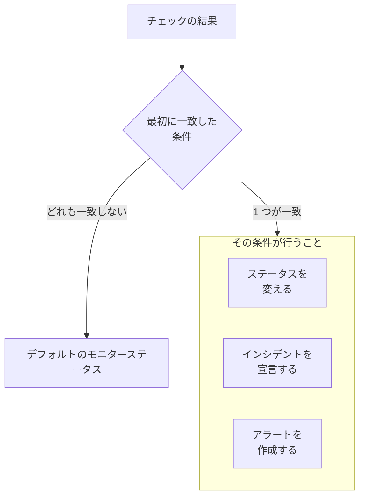

# モニターの作成

モニターは、ウェブサイト、API、ホスト、Kubernetes クラスターなど、あなたが運用しているものをチェックし、動かなくなったときに知らせます。**モニターを作成** は、まず何を監視するか、次に何をチェックするか、最後にどのくらいの頻度で行うかを尋ねます。種類、名前、チェック対象以外はすべて、ほとんどのモニターに合うデフォルト値から始まります。

> [!NOTE]
> モニターを作成するには、Project Owner、Project Admin、Project Member、Monitor Admin、Monitor Member のいずれかのロール、または Create Monitor 権限を持つカスタムロールが必要です。

## モニター情報

最初のステップでは、何を監視するか、モニターに何という名前を付けるかを尋ねます。

:::steps
### モニターの作成を開く

**モニター** に移動し、**モニターを作成** をクリックします。フォームは最初のステップ **モニター情報** で開きます。

### モニターの種類を選ぶ

最初の質問は **モニターの種類** です。何を監視しますか？

- 最もよく作成される 6 つの種類が先頭に並びます。**ウェブサイト**、**API**、**Ping**、**ポート**、**SSL 証明書**、そして cron ジョブや Webhook のハートビート用の **受信リクエスト** です。
- **その他のモニターの種類** には、ほかのすべての種類がカテゴリーごとに表示されます。たとえば **インフラストラクチャ**（Kubernetes、Docker、ホスト）や **テレメトリ**（ログ、メトリクス、トレース）です。自分でステータスを設定するモニター **手動** は **その他** にあります。
- または検索ボックスに入力します。`k8s`、`postgres`、`heartbeat`、`tls` など、普段使っている言葉を理解し、**Enter** で最初の候補を選びます。

選んだ種類は 1 行に縮みます。別の種類を選ぶには **変更** をクリックします。選択中に **Escape** を押すと、元の種類のままになります。

### モニターに名前を付ける

**名前** を入力します。アラートやインシデントのタイトルに使われます。**説明** と **ラベル** は任意で、**その他の項目** の中にあります。

**手動** モニターにはこれ以上何も必要ないため、**モニターを作成** はこのステップにあります。それ以外の種類では **次へ** をクリックします。
:::

## 条件

2 番目のステップでは、何をチェックするかを尋ね、何を問題とみなすかを決めます。

:::steps
### チェック対象を入力する

このステップはチェック対象の入力から始まります。ウェブサイトならその URL で、ボックスに例が表示されます。ほかの種類では、ホスト、クエリ、クラスター、ログフィルターなどを入力します。タイムアウトや再試行など、ほとんどのモニターで変更しない設定は **その他の項目** に折りたたまれています。

プローブがチェックするモニターでは、**モニターをテスト** で保存前にチェックを 1 回実行できます。**プローブを選択** でプローブを選び、**テストを実行** をクリックします。結果は **モニターテスト結果** に表示されます。

### 条件を確認する

その下の **モニター条件** は、モニターがステータスを変える、インシデントを宣言する、アラートを作成するタイミングを決めます。新しいモニターは、ほとんどのモニターに合う条件から始まり、それぞれが何をチェックし何をするかを示す 1 行に折りたたまれています。たとえば新しいウェブサイトモニターは、サイトが応答しないかエラーのステータスコードで応答したときにオフラインになり、インシデントを宣言します。

条件をクリックすると開いて変更できます。**条件を追加** は、開いた状態で入力できる条件を 1 つ追加します。順序を変えるには、条件の左にあるハンドルをドラッグします。

### 次のステップに進む

**次へ** をクリックします。**次へ** をクリックするまで、このステップで未入力として示されるものはありません。
:::

### 条件の評価方法

各チェックの結果は上から順に条件を通り、最初に一致した条件が何が起きるかを決めます。その条件は、モニターのステータスを変える、インシデントを宣言する、アラートを作成する、またはその組み合わせを行います。どれにも一致しない場合、モニターは **デフォルトのモニターステータス** を表示します。これは条件の下にある **その他の項目** で設定します（別のものを選ばない限り **稼働中**）。

デフォルト条件のように自動で解決するよう設定されたインシデントとアラートは、条件に一致しなくなると自動的に解決します。複数のプローブがチェックするモニターは、プローブの結果がそろったときにだけ変わります。デフォルトでは、有効で接続中のすべてのプローブが同じ結果になる必要があります。必要な数を減らすには、モニターの **構成 → プローブと間隔** ページで **プローブの合意** を設定します。

## プローブと間隔

プローブがチェックするモニターは、このステップで終わります。ウェブサイト、API、Ping、IP、ポート、SSL 証明書、DNS、DNSSEC、NTP、ドメイン、SQL クエリ、データベースのヘルス、シンセティックモニター、Custom JavaScript Code、外部ステータスページです。**プローブ** はチェックを実行するマシンで、プロジェクトのデフォルトのプローブが最初から選ばれています。**監視間隔** は **5 分ごと** から始まります。

:::steps
### プローブを選ぶ

選ばれている **プローブ** をそのまま使うか、別のものを選びます。プローブのないモニターはチェックされません。プライベートネットワーク内のものをチェックするには、そのネットワーク内で [カスタムプローブ](/docs/probe/custom-probe) を実行し、ここで選びます。

### チェックの頻度を選ぶ

**毎分** から **毎週** までの中から **監視間隔** を選びます。シンセティックモニター、Custom JavaScript Code、SSL 証明書のモニターには、5 分以上の間隔が提示されます。

### モニターを作成する

**モニターを作成** をクリックします。新しいモニターのページが開きます。あとでプローブや間隔を変えるには、そのページで **構成 → プローブと間隔** を開きます。
:::

手動以外のほかの種類はすべて、**条件** ステップから作成されます。

## テンプレートやリンクから始める

モニターテンプレートや、OneUptime のほかの場所（メトリクスのグラフ、ネットワークデバイス、検出ルール）にあるモニター作成リンクは、種類が選ばれ、残りが入力された状態で **モニターを作成** を開きます。別の種類を選ぶには **変更** をクリックします。テンプレートのフォームも同じ種類の選択を使います。[モニターテンプレート](/docs/monitor/monitor-templates) を参照してください。

モニターの種類ごとに、設定、デフォルト条件、例をまとめた専用ページがあります。次に読むとよいページ:

:::cards
- [Web サイト モニター](/docs/monitor/website-monitor): ページが読み込まれるか、何を返すかをチェックします。
- [API モニター](/docs/monitor/api-monitor): メソッド、ヘッダー、ボディを指定してエンドポイントを呼び出します。
- [モニターテンプレート](/docs/monitor/monitor-templates): 1 つの構成から多数のモニターを作成し、そろえたまま保ちます。
- [インシデント](/docs/incidents/index): モニターがインシデントを宣言したあとに起きること。
:::
