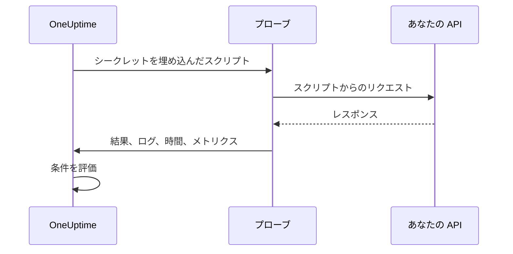

# カスタム コード モニター

カスタム コード モニターは、あなたが書いた JavaScript のスクリプトを、プローブからスケジュールに従って実行します。ほかのモニターの種類では表現できないチェックに使います。たとえば、ログインしてから認証付きの API を呼び出す処理、複数ステップのトランザクション、複数のレスポンスから計算する値などです。スクリプトが例外を投げるとチェックは失敗し、スクリプトが返した値は条件やインシデントのテンプレートで使えます。

:::cards
- [モニターを作成する](#カスタム-コード-モニターを作成する): スクリプトを書き、それを実行するプローブを選びます。
- [スクリプトを書く](#スクリプトを書く): そのまま動く複数ステップの API チェックから始められます。
- [シークレットを使う](#モニター-シークレットを使う): パスワードやトークンをスクリプトに書かずに済みます。
- [カスタムメトリクスを記録する](#カスタムメトリクス): スクリプトが計算した任意の数値をグラフにできます。
:::

## 仕組み

チェックのたびに、プローブはモニター シークレットを埋め込んだ状態で、隔離された JavaScript のサンドボックス内でスクリプトを実行します。スクリプトは必要なものを呼び出し、結果を返すか例外を投げます。プローブは結果、スクリプトのログメッセージ、実行時間、記録されたメトリクスを報告し、OneUptime はそれらに対して条件を評価します。



サンドボックスは Node.js ではありません。`require`、`process`、`fetch`、ファイルシステムはなく、使えるのは [下に挙げるモジュール](#スクリプトで使えるモジュール) だけです。

## 始める前に

- スクリプトが呼び出すすべてのエンドポイントに到達できる **プローブ**。ネットワーク内のエンドポイントには [カスタムプローブ](/docs/probe/custom-probe) を使います。
- プライベートアドレス (たとえば `10.0.0.5`) を呼び出すには、プローブ側でそれを許可する必要があります。そのプローブに `PROBE_ALLOW_PRIVATE_NETWORK_MONITORS=true` を設定してください。ループバック、リンクローカル、クラウドのメタデータのアドレスは常に拒否されます。[プライベートネットワークへのアクセス](/docs/self-hosted/private-network-access) を参照してください。
- スクリプトが必要とするパスワード、API キー、トークンを、[モニター シークレット](/docs/monitor/monitor-secrets) として保存しておきます。

## カスタム コード モニターを作成する

:::steps
### 新しいモニターを始める

**モニター** に移動し、**モニターを作成** をクリックします。**モニターの種類** で **その他のモニターの種類** をクリックし、**Synthetic Monitoring** の下の **Custom JavaScript Code** を選ぶか、検索ボックスに `script` と入力します。**名前** を入力し、**次へ** をクリックします。

### スクリプトを追加する

**JavaScript コード** エディターにスクリプトを書きます。[下の例](#スクリプトを書く) から始めましょう。

### テストする

**モニターをテスト** をクリックしてプローブからスクリプトを 1 回実行し、結果を確認します。

### 条件を確認する

モニターには最初から 2 つの条件があります。スクリプトが失敗するとオフラインになってインシデントを宣言し、失敗しなければオンラインになります。必要に応じて変更するか独自の条件を追加し ([条件](#条件) を参照)、**次へ** をクリックします。

### プローブを選んで作成する

エンドポイントに到達できる **プローブ** と **監視間隔** を選び (カスタム コード モニターでは 5 分以上の間隔を選べます)、**モニターを作成** をクリックします。
:::

## スクリプトを書く

スクリプトは `async` 関数の本体です。トップレベルで `await` を使い、`return` で結果を返し、`throw` でチェックを失敗させられます。次の例はログインし、受け取ったトークンでエンドポイントを呼び出し、レスポンスが想定どおりでなければ失敗します。

```javascript title="Custom code monitor script"
// 1. Log in. axios rejects a 4xx or 5xx response, which fails the check.
const login = await axios.post("https://api.example.com/v1/login", {
  username: "monitoring@example.com",
  password: "{{monitorSecrets.ApiPassword}}",
});

// 2. Call an endpoint that needs the token.
const orders = await axios.get("https://api.example.com/v1/orders?limit=10", {
  headers: { Authorization: `Bearer ${login.data.token}` },
  timeout: 10000,
});

// 3. Fail the check when the data is wrong, not only when the request fails.
if (!Array.isArray(orders.data.items)) {
  throw new Error("The orders endpoint returned no items");
}

console.log(`Fetched ${orders.data.items.length} orders`);

// 4. Return what the criteria and incident templates should see.
return {
  data: orders.data.items.length,
};
```

| 目的 | 方法 | OneUptime が記録するもの |
| --- | --- | --- |
| 結果を報告する | 任意の JSON 値で `return { data: ... }` | **結果**。保持されるのは `data` プロパティだけで、`return 5` では結果は記録されません。 |
| チェックを失敗させる | `throw new Error("...")` | **スクリプトエラー**。デフォルトの条件がこれをインシデントにします。 |
| 痕跡を残す | `console.log(...)` | **ログメッセージ**。1 回の実行につき最大 1,000 件です。 |

実行を確認するには、モニターの **概要** を開きます。**モニターの概要** カードにはプローブ、実行時間、エラーが表示され、**詳細をさらに表示** で結果、スクリプトエラー、ログメッセージを見られます。過去のチェックについては **モニタリングログ** に同じ概要があります。

> [!NOTE]
> このサンドボックスの `axios` はリダイレクトをたどらず、そのリクエストはプローブに設定されたプロキシを経由しません。最終的な URL をリクエストしてください。

## モニター シークレットを使う

スクリプトのどこでも、シークレットを `{{monitorSecrets.NAME}}` として参照できます。OneUptime は、スクリプトがプローブに届く前に、参照をシークレットの値にプレーンテキストとして置き換えます。そのため、文字列として使うときはシークレットを引用符で囲み、数値やブール値として使うときは何も付けずに書きます。

```javascript
// Used as a string: wrap it in quotes.
const apiKey = "{{monitorSecrets.ApiKey}}";

// Used as a number or a boolean: leave it bare.
const retryLimit = {{monitorSecrets.RetryLimit}};
const verbose = {{monitorSecrets.Verbose}};

// Check the secret was filled in without logging the secret itself.
console.log(apiKey.length > 0);
```

引用符を含むシークレットの値は、それを囲む文字列を壊します。モニターが使えない参照は、書かれたままスクリプトに残ります。シークレットを作成し、使えるモニターを選ぶ方法は [モニター シークレット](/docs/monitor/monitor-secrets) を参照してください。

## カスタムメトリクス

`oneuptime.captureMetric()` 関数を使うと、スクリプトからカスタムメトリクスを記録できます。これらのメトリクスは OneUptime に保存され、Metric Explorer でダッシュボードのグラフにできます。

```javascript
oneuptime.captureMetric(name, value, attributes);
```

| パラメーター | 型 | 説明 |
| --- | --- | --- |
| `name` | string、必須 | メトリクス名 (例: `"api.response.time"`)。自動的に `custom.monitor.` という接頭辞付きで保存されます。 |
| `value` | number、必須 | メトリクスの数値。数値でない値は無視されます。 |
| `attributes` | object、任意 | 追加のコンテキストを表すキーと値のペア。文字列、数値、ブール値が記録されます (メトリクスの属性は測定値ではなくディメンションなので、数値とブール値はテキストとして保存されます)。それ以外の型の値は無視されます。 |

### 例

```javascript
const response = await axios.get("https://api.example.com/health");

// Capture a simple metric
oneuptime.captureMetric("api.response.time", response.data.latency);

// Capture a metric with attributes
oneuptime.captureMetric("api.queue.depth", response.data.queueDepth, {
  region: "us-east-1",
  environment: "production",
});

return {
  data: response.data,
};
```

記録したメトリクスは、Metric Explorer に `custom.monitor.api.response.time` のような名前で表示され、モニターの **メトリクス** ページの **カスタムメトリクス** にも表示されます。OneUptime はすべてのデータポイントにモニターとプローブを付けるので、グラフにしたり、アラートを設定したり、モニター、プローブ、指定したカスタム属性で絞り込んだりできます。

### 上限

| 上限 | 値 | 上限を超えた場合 |
| --- | --- | --- |
| スクリプト 1 回の実行あたりのメトリクス | 100 | 以降の呼び出しは無視されます。 |
| メトリクス名の長さ | 200 文字 | 名前が切り詰められます。 |
| メトリクスあたりの属性 | 50 | 以降の属性は破棄されます。 |
| 属性キーの長さ | 200 文字 | キーが切り詰められます。 |
| 属性値の長さ | 1000 文字 | 値が切り詰められます。 |

### 予約済みの属性キー

一部の属性名は OneUptime 自身のもので、スクリプトからは書き込めません。スクリプトがそれを設定すると、その属性は破棄され (メトリクス自体は記録されます)、キー名を示す警告が OneUptime のサーバーログに書き込まれます。対象は次のとおりです。

- モニターの識別情報: `monitorId`、`projectId`、`monitorName`、`probeName`、`probeId`、`isCustomMetric`。
- `oneuptime.` と `resource.` の名前空間にあるすべて。これらには、OneUptime が取り込み時に付ける識別子が入ります。
- リソースの識別属性: `service.name`、`host.name`、`k8s.cluster.name`、`iot.fleet.name`、`proxmox.cluster.name`、`vmware.vcenter.name`、`ceph.cluster.name`、`storage.array.name`、`docker.swarm.cluster.name`。

これらの名前は単なるラベルではありません。OneUptime はこれらを、データポイントがどのリソースに属するかの主張として読み取ります。`service.name: payments-api` を付けたメトリクスはそのサービスのメトリクスタブに表示され、後から `service.name` でグループ化したメトリクスモニターを作ると、そのアラートはそのサービスに関連付けられ、サービスのオーナーを呼び出し、そのサービスのメンテナンス期間中は鳴らなくなります。モニターをサービスやホストに関連付けたいときは、代わりにモニター自身のラベルを使ってください。

## 条件

カスタム コード モニターの条件では、次をチェックできます。

| フィルタータイプ | チェック内容 | フィルター条件 |
| --- | --- | --- |
| **エラー** | スクリプトが投げたエラー (ある場合)。 | 含む、Not Contains、Equal To、Not Equal To、Is Empty、Is Not Empty |
| **Result Value** | スクリプトが返した `data`。数値なら数値として比較されます。 | 同じもの、さらに Greater Than、Less Than、Greater Than Or Equal To、Less Than Or Equal To、真、偽 |
| **実行時間（ms）** | スクリプトの実行時間。 | 数値の比較 |

デフォルトの条件は、**エラー** が空ならモニターをオンラインにし、空でなければオフラインにします (スクリプトが再び成功すると自動的に解決するインシデント付き)。インシデントとアラートのテンプレートでは、実行内容を `{{result}}`、`{{scriptError}}`、`{{logMessages}}`、`{{executionTimeInMs}}` として使えます。[インシデント & アラート テンプレート](/docs/monitor/incident-alert-templating) を参照してください。

### 返されたデータでアラートを出す

スクリプトが `data` として返したものがモニターの **Result Value** で、条件でこれを比較できます。たとえば _Result Value is Equal To `UP`_ のように指定します。

`data` がオブジェクトや配列の場合は、Result Value フィルターの **フィールドパス（任意）** を入力すると、値全体ではなく 1 つのフィールドを比較できます。入れ子のフィールドにはドットを、配列の要素には `[n]` を使います。

```javascript
const response = await axios.get("https://api.example.com/health");

return {
  data: {
    status: response.data.status, // "UP"
    cpu_busy_percent: response.data.cpu, // 42
    healthy: response.data.healthy, // true
    checks: response.data.checks, // [{ name: "db", latency: 12 }]
  },
};
```

| フィールドパス | 比較対象 | 条件の例 |
| --- | --- | --- |
| `status` | `"UP"` | Not Equal To `UP` |
| `cpu_busy_percent` | `42` | Greater Than `90` |
| `healthy` | `true` | 偽 |
| `checks[0].latency` | `12` | Greater Than `500` |

チェックしたいフィールドごとにフィルターを 1 つ追加します。フィルターごとに独自の条件と値を設定できます。

- 単一の数値や文字列を返すスクリプトのように値全体を比較するときは、フィールドパスを空のままにします。
- Greater Than、Less Than などの数値の条件は数値にしか一致しないので、フィールドは `"42"` ではなく `42` として返してください。真と偽はブール値にしか一致しません。
- 返されたデータにないフィールド (存在しないキーや、末尾を超えた配列のインデックス) は空として比較されます。一致するのは **Is Empty** だけで、ほかの条件は一致しません。
- 名前にドットを含むフィールドは、パスで指定できません。
- Terraform では、フィルターの `custom_code_monitor_options` でフィールドパスを設定します。[モニターステップ](/docs/terraform/monitor-steps#comparing-one-field-of-a-scripts-result) を参照してください。

## スクリプトで使えるモジュール

| 名前 | 内容 |
| --- | --- |
| `axios` | Promise ベースの HTTP クライアントです。`axios(...)` のほか、`axios.get`、`post`、`put`、`patch`、`delete`、`head`、`options`、`request`、`create` を呼び出せます。リクエストとレスポンスのサイズには上限があり (それぞれ 10 MB)、リダイレクトはたどらず、プローブのプロキシは使いません。 |
| `crypto` | `createHash` と `createHmac` (`update()` を 1 回呼んでから `digest()`)、`randomBytes`、`randomInt`、`randomUUID`。Node.js の `crypto` モジュールではないので、暗号化や署名はありません。 |
| `http`、`https` | `axios` に渡すための `Agent` クラスだけです。たとえば `httpsAgent: new https.Agent({ rejectUnauthorized: false })` のように使います。`request` や `get` はありません。 |
| `console.log` | デバッグ用にデータを記録します。あるのは `console.log` だけで、`console.error` などはありません。 |
| `oneuptime.captureMetric` | カスタムメトリクスを記録します。[カスタムメトリクス](#カスタムメトリクス) を参照してください。 |
| `setTimeout`、`clearTimeout`、`sleep(ms)` | スクリプト内で待機します。待機がスクリプトのタイムアウトを超えることはありません。 |

## 考慮事項

- **タイムアウト。** 60 秒を超えて実行されたスクリプトは停止され、チェックは "Script execution timed out" で失敗します。セルフホストのプローブでは、`PROBE_CUSTOM_CODE_MONITOR_SCRIPT_TIMEOUT_IN_MS` で上限を変更できます。
- **メモリ。** 実行ごとに、メモリ上限が 128 MB の専用サンドボックスが割り当てられます。
- **リダイレクト。** `axios` はリダイレクトをたどらないので、リダイレクトする URL ではリクエストが失敗します。最終的な URL を使ってください。

## トラブルシューティング

:::details チェックが "Script execution timed out" で失敗する
スクリプトの実行が時間の上限を超えました。遅いエンドポイントがそれを示すエラーですぐに失敗するよう、各リクエストに独自の `timeout` (ミリ秒) を指定してください。
:::

:::details リクエストがステータス 301 または 302 で失敗する
ここでの `axios` はリダイレクトをたどりません。URL をリダイレクト先のアドレスに変更してください。
:::

:::details 内部アドレスへのリクエストが拒否される
プローブがプライベートネットワークのアドレスを許可していません。ネットワーク内のプローブに `PROBE_ALLOW_PRIVATE_NETWORK_MONITORS=true` を設定し、そのプローブからモニターを実行してください。[プライベートネットワークへのアクセス](/docs/self-hosted/private-network-access) を参照してください。
:::

:::details シークレットが埋め込まれない
モニターがそのシークレットを使えないか、参照の名前がシークレットの名前と完全には一致していません。[モニター シークレット](/docs/monitor/monitor-secrets) を参照してください。
:::

## 次のステップ

:::cards
- [合成モニター](/docs/monitor/synthetic-monitor): API を呼び出す代わりに、本物のブラウザーを操作します。
- [モニター シークレット](/docs/monitor/monitor-secrets): スクリプトが使う認証情報を保存します。
- [インシデント & アラート テンプレート](/docs/monitor/incident-alert-templating): スクリプトの結果とログをインシデントに入れます。
:::
