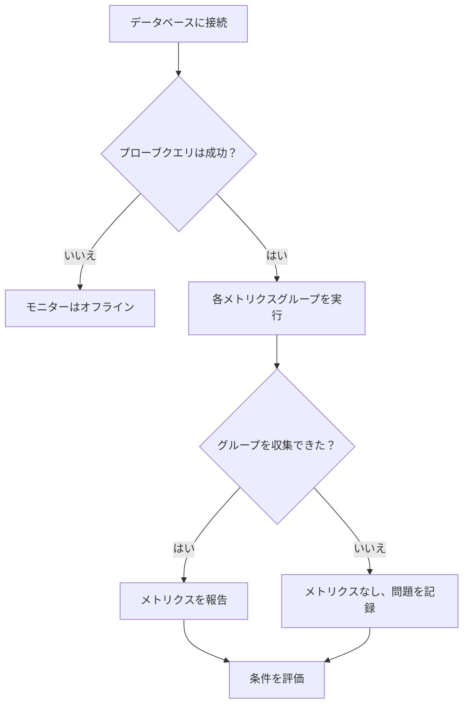

# データベースヘルス モニター

データベースヘルス モニターは、スケジュールに従って PostgreSQL、MySQL、Microsoft SQL Server に接続し、サーバー自身のヘルスシグナル（接続数の余裕、ブロックされたセッション、レプリケーションの遅延、キャッシュヒット率、データベースサイズ、トランザクション ID の周回、そのほか 30 余り）を報告します。Web サイトのダウンをアラートするのと同じように、これらをアラートできます。

SQL を書く必要はありません。プローブはエンジンごとに決まった読み取り専用のカタログクエリを実行し、名前付きの数値を少数だけ報告します。

:::cards
- [監視用ユーザーを作成する](#監視用ユーザーを作成する): 各エンジンに必要な権限。最も重要なステップです。
- [モニターを作成する](#データベースヘルス-モニターを作成する): プローブをデータベースに向け、収集する内容を選びます。
- [収集されるメトリクス](#収集されるメトリクス): すべての系列と、それを報告するエンジン。
- [条件を設定する](#条件を設定する): 接続、ブロッキング、遅延、周回をアラートします。
:::

## データベースのヘルスか SQL クエリか

2 種類のデータベースモニターは別々の問いに答えるもので、組み合わせて使うことを想定しています。

| | データベースのヘルス | [SQL クエリ](/docs/monitor/sql-monitor) |
|---|---|---|
| 答える問い | 「データベースそのものは健全か」 | 「データは期待どおりか」 |
| クエリ | 組み込み、エンジンごと、読み取り専用 | 自分で書いたもの |
| 報告するもの | 名前付きの数値メトリクス（[収集されるメトリクス](#収集されるメトリクス)を参照） | 行数、スカラー値、最初の行、実行時間 |
| 典型的なアラート | 使用中の接続が 90% を超えた | 直近 5 分間のキャンセル注文が 50 件を超えた |
| 必要な権限 | 統計情報/DMV の読み取り（[監視用ユーザーを作成する](#監視用ユーザーを作成する)を参照） | クエリが触れるテーブルへの `SELECT` |

業務上の条件をアラートしたいなら SQL クエリ モニターを使います。業務上の条件が崩れるより前に、サーバーの接続数が尽きかけていることを知りたいなら、こちらを使います。

## 対応データベース

| データベース | 既定のポート |
|---|---|
| **PostgreSQL** | `5432` |
| **MySQL** | `3306` |
| **Microsoft SQL Server** | `1433` |

Azure SQL Database と Azure SQL Managed Instance は **Microsoft SQL Server** として接続します。必要な権限は異なります。[監視用ユーザーを作成する](#監視用ユーザーを作成する)を参照してください。

同じワイヤープロトコルを話す PostgreSQL 互換・MySQL 互換のエンジンもたいていは動作しますが、公開される統計ビューが少ない場合があり、その場合は該当するメトリクスが収集されず、利用不可として報告されます。公式にテストしているのは上の 3 つのエンジンだけです。

アプリケーション、クラスター、ホストが使うすべてのデータベース（この 3 つのエンジンと、ほかの多くのエンジン）には、エンジンのメトリクス、ログ、呼び出し元のサービスをまとめた専用のページもあります。[データベース](/docs/telemetry/databases)を参照してください。データベースヘルス モニターの接続先のホストとポートがデータベースのエンドポイントの 1 つと一致する場合、そのモニターのアラートとインシデントはそのデータベースのページにも表示されます（[データベースのアラート](/docs/telemetry/databases#alerts-on-a-database)を参照）。

## 仕組み

チェックのたびに、プローブは次のことを行います。

1. 設定した資格情報でデータベースに接続します。
2. 軽いプローブクエリを 1 つ実行します。**モニターをオフラインにしうるのは、このステートメントの失敗だけです。**
3. 有効な各[メトリクスグループ](#メトリクスグループ)のカタログクエリを、ステートメントのタイムアウトを付けて 1 つずつ実行します。
4. 収集した数値を報告し、収集できなかったグループごとに理由を書いたメモを添えます。



OneUptime に送られるのは名前付きの数値の集計値だけです。クエリのテキスト、テーブルの行、スキーマ名はネットワークの外に出ません。クエリが読むのはエンジン自身の統計ビュー（`pg_stat_activity`、`performance_schema.global_status`、`sys.dm_exec_sessions` など）で、データそのものは決して読みません。

チェックはプローブから実行されるので、データベースはプローブから到達できれば十分です。[カスタムプローブ](/docs/probe/custom-probe)をネットワーク内に置けば、OneUptime からデータベースへの経路はまったく必要ありません。

## 始める前に

- データベースのホストとポートにネットワークで到達できる**プローブ**。データベースがインターネットから到達できるなら OneUptime がホストするプローブを、そうでなければネットワーク内の[カスタムプローブ](/docs/probe/custom-probe)を使います。
- 次のセクションの手順で作成した**監視用ユーザー**と、その接続情報。

## 監視用ユーザーを作成する

**これが最も重要なステップです。** モニターは、通常のログインには見えない統計ビューを読みます。権限の足りないログインは必ずしもエラーで失敗するとは限らず、PostgreSQL では誤った答えを返します。ここに挙げる権限だけを持つ専用のログインを作成してください。

### PostgreSQL

```sql
CREATE USER oneuptime_health WITH PASSWORD 'a-strong-password';
GRANT CONNECT ON DATABASE mydb TO oneuptime_health;
-- The one grant that matters. Without it, see the note below.
GRANT pg_monitor TO oneuptime_health;
```

`pg_monitor` は組み込みロール（PostgreSQL 10 以降）で、統計ビューと監視ビューへの読み取りアクセスを付与します。テーブルへのアクセスは付与しません。

> [!IMPORTANT]
> **PostgreSQL で `pg_monitor` が省略できない理由。** このロールがないと `pg_stat_activity` は失敗せず、成功したうえで監視セッション自身の行だけを返します。実際には火を噴いているサーバーでも、接続数は `1`、ブロックされたセッションは `0`、レプリケーションの遅延は `0` のまま変わりません。そのためプローブは、それらのクエリを実行する**前に**、ログインが `pg_monitor`（または `pg_read_all_stats`）のメンバーか、スーパーユーザーであることを確認します。どれにも当たらない場合、プローブは Connections、Activity、Locks の各グループを利用不可として報告し、必要な `GRANT` を添えます。何も報告しないのが正直な答えであり、`1` を報告するのはそうではありません。

`pg_monitor` を使えないマネージドサービスでは、`pg_read_all_stats` が同じビューをカバーします。Amazon RDS では `GRANT rds_superuser` は不要で、`GRANT pg_monitor TO oneuptime_health;` は `rds_superuser` のメンバーとして実行できます。

### MySQL

```sql
CREATE USER 'oneuptime_health'@'%' IDENTIFIED BY 'a-strong-password';
-- INNODB_TRX (open transactions, longest query) and replication status.
GRANT PROCESS, REPLICATION CLIENT ON *.* TO 'oneuptime_health'@'%';
-- Status counters, server variables, and lock waits.
GRANT SELECT ON performance_schema.* TO 'oneuptime_health'@'%';
-- Database size: information_schema.TABLES only shows tables the login can see.
GRANT SELECT ON mydb.* TO 'oneuptime_health'@'%';
FLUSH PRIVILEGES;
```

MySQL の `performance_schema` が有効（`performance_schema = ON`、5.6 以降の既定値）である必要があります。無効な場合は Connections、Throughput、Locks の各グループが利用不可として報告され、直すには権限ではなくサーバーの再起動が必要です。

### Microsoft SQL Server と Azure SQL Managed Instance

```sql
-- A server-level grant only runs while the current database is master.
USE master;
CREATE LOGIN oneuptime_health WITH PASSWORD = 'a-strong-password';
-- Every DMV the monitor reads. On SQL Server 2022 and later,
-- VIEW SERVER PERFORMANCE STATE alone is also enough.
GRANT VIEW SERVER STATE TO oneuptime_health;

USE mydb;
CREATE USER oneuptime_health FOR LOGIN oneuptime_health;
```

ほかのデータベースから実行すると、`GRANT VIEW SERVER STATE` は Msg 4621「Permissions at the server scope can only be granted when the current database is master」で失敗します。

> [!WARNING]
> **テーブルの読み取り権限だけでは足りません。** データを読むことしかできないログイン（`db_datareader` などの「読み取りアクセス」ロール）は、接続はできてもデータベースサイズしか取得できません。SQL Server は、モニターが読むビューを `The user does not have permission to perform this action.`（Msg 297）で拒否します。その直前のメッセージが、拒否されたものを示します。サーバービュー（トランザクションログの領域と tempdb の空き領域を含む）なら Msg 300 `VIEW SERVER STATE`（2022 では `VIEW SERVER PERFORMANCE STATE`）、レプリケーションのビューなら Msg 262 `VIEW DATABASE STATE`（2022 では `VIEW DATABASE PERFORMANCE STATE`）です。モニターはオンラインのまま、Connections、Activity、Throughput、Locks、Storage、Replication の各グループに権限が足りないと報告し、その横に上の `GRANT` を表示します。`VIEW SERVER STATE` があればすべてカバーできます。
>
> 拒否しないビューが 2 つあります。権限がないと、`sys.dm_exec_sessions` と `sys.dm_exec_requests` は黙ってモニター自身のセッションだけを返します。モニターはこの 2 つを単独では読まず、必ず拒否するビューと一緒に読むので、権限の不足が「接続 1 件」として記録されることはありません。

### Azure SQL Database

Azure SQL Database にはサーバーレベルの権限がなく、`GRANT VIEW SERVER STATE` はそこでは失敗します。そのため、同じビューはデータベースレベルの権限で開きます。`master` にログインを作成し、監視するデータベースにそのログインのユーザーを作り、権限は `master` ではなくそのデータベースで付与します。

```sql
-- Connected to master, as the server admin:
CREATE LOGIN oneuptime_health WITH PASSWORD = 'a-strong-password';

-- Connected to the monitored database:
CREATE USER oneuptime_health FOR LOGIN oneuptime_health;
GRANT VIEW DATABASE STATE TO oneuptime_health;
```

vCore のデータベースと、S2 以上の DTU のデータベースならこれで十分です。**Basic、S0、S1** と、**エラスティックプール**内のすべてのデータベースでは、データベースの権限がどうであれ、Azure はサーバー管理者、Microsoft Entra 管理者、サーバーロール `##MS_ServerStateReader##` のメンバーにしかこれらのビューを読ませません。その場合は、サーバー管理者がログインをこのロールにも追加します。

```sql
-- Connected to master, as the server admin:
ALTER SERVER ROLE ##MS_ServerStateReader## ADD MEMBER oneuptime_health;
```

`##MS_ServerStateReader##` はすべてのサービスレベルで機能するので、`VIEW DATABASE STATE` で足りなかったときの代替手段にもなります。新しいロールメンバーシップの反映には数分かかることがあり、新しい接続にしか適用されません。プローブはチェックのたびに新しい接続を開きます。

包含データベースユーザー（監視対象のデータベースで `CREATE USER oneuptime_health WITH PASSWORD = '...'` として作成した、ログインを持たないユーザー）は、S2 以上では `VIEW DATABASE STATE` で機能しますが、`##MS_ServerStateReader##` には参加できません。サーバーロールに入れられるのはログインだけだからです。包含ユーザーをこのロールに移すには、そのユーザーを削除し（`DROP USER oneuptime_health;`）、上の手順に従います。

プローブは Azure SQL Database をバージョンではなく `SERVERPROPERTY('EngineEdition')` で識別します。Azure SQL Database は実際に何を実行していても `12.0.2000.8` を報告し、これは SQL Server 2014 と読めてしまうからです。そのためモニターの**エンジン**は `Azure SQL Database 12.0.2000.8` と表示され、権限の不足は `VIEW SERVER STATE` ではなく、必ず上の Azure 用ステートメントとして表示されます。

- **Azure SQL Database ではレプリケーションを収集しません。** Azure SQL Database には `sys.dm_hadr_database_replica_states` がないため、Replication グループはそこでは毎回失敗として報告されるのではなく、スキップされます。Azure 独自のレプリカビュー（`sys.dm_database_replica_states`、`sys.dm_geo_replication_link_status`）はまだ読みません。
- **接続はデータベース単位です。** `VIEW DATABASE STATE` の場合、Azure SQL Database は監視対象のデータベースのセッションしか見せないので、Connections は論理サーバーではなくそのデータベースを数えます。気にかけるデータベースはそれぞれ監視してください。
- **エラスティックプールでは、TempDB Free Space はプールの値です。** プール内のデータベースは 1 つの tempdb を共有します。

## データベースヘルス モニターを作成する

:::steps
### 新しいモニターを始める

**モニター** に移動し、**モニターを作成** をクリックします。**モニターの種類** で **その他のモニターの種類** をクリックし、**Database Monitoring** の下の **データベースのヘルス** を選ぶか、検索ボックスに `health` と入力します。**名前** を入力し、**次へ** をクリックします。

### 接続情報を入力する

**データベースの種類** を選び、ホスト、ポート、データベース名、監視用ユーザーの資格情報を入力します。パスワードは入力せずに[モニターシークレット](#パスワードにモニターシークレットを使う)として参照してください。各フィールドの説明は[設定](#設定)にあります。

### 収集する内容を選ぶ

オフにする理由がない限り、**メトリクスグループ** のグループはすべてオンのままにします。[メトリクスグループ](#メトリクスグループ)を参照してください。

### 接続をテストする

**モニターをテスト** をクリックして保存前にチェックを 1 回実行し、何が収集されたかを確認します。

### 条件を決める

モニターの初期の条件を確認し、独自の条件を追加します。[条件を設定する](#条件を設定する)を参照してください。その後、**次へ** をクリックします。

### プローブを選んで作成する

データベースに到達できる **プローブ** と **監視間隔** を選び、**モニターを作成** をクリックします。
:::

## 設定

| フィールド | 入力する内容 |
|---|---|
| **データベースの種類** | PostgreSQL、MySQL、Microsoft SQL Server。種類を選ぶと既定のポートが設定され、実行するクエリが決まります。 |
| **ホスト** | プローブから到達できるデータベースのホスト（例: `db.internal`）。 |
| **ポート** | データベースのポート。 |
| **データベース名** | 接続するデータベース。データベース単位のメトリクス（サイズ、キャッシュヒット率、一時ファイルへの書き出し）はこのデータベースについて報告され、サーバー単位のメトリクス（接続、稼働時間、レプリケーション）はサーバー全体について報告されます。ただし Azure SQL Database では、接続は監視対象のデータベースの分だけが数えられます。 |
| **Windows 統合認証を使用** | Microsoft SQL Server のみ。ユーザー名とパスワードの代わりに、プローブのプロセスの ID で認証します。SQL クエリ モニターのページの [Windows 統合認証](/docs/monitor/sql-monitor#windows-統合認証)を参照してください。設定方法は同じです。 |
| **ユーザー名** | 監視用ユーザー。Windows 統合認証を使わない場合は必須です。 |
| **パスワード** | パスワード。平文で入力せず、`{{monitorSecrets.name}}` で[モニターシークレット](/docs/monitor/monitor-secrets)を参照します（[モニターシークレットを使う](#パスワードにモニターシークレットを使う)を参照）。 |
| **SSL/TLS を使用** | TLS で接続します。有効にすると、自己署名証明書のために **サーバー証明書を検証** をオフにできます。 |
| **メトリクスグループ** | 実行するグループ: 接続、アクティビティ、スループット、ロックとブロッキング、ストレージ、レプリケーション、メンテナンス。既定ではすべてオンです。[メトリクスグループ](#メトリクスグループ)を参照してください。モニターの詳細には **収集するメトリクスグループ** として表示されます。 |

### その他の項目

| フィールド | 既定値 | 上限 | 制限する内容 |
|---|---|---|---|
| **接続タイムアウト（ms）** | `10000` | `30000` | 接続の確立を待つ時間。 |
| **ステートメントのタイムアウト（ms）** | `10000` | `60000` | 個々のカタログクエリの上限時間。 |

ステートメントのタイムアウトの既定値は、意図的に SQL クエリ モニターより短くしています。健全なサーバーならこれらのクエリはミリ秒単位で返るので、`pg_stat_activity` に 10 秒かかるなら、役に立つシグナルは「このサーバーは問題を抱えている」であって、さらに待つことではありません。上限を超える値は上限まで下げられます。

## パスワードにモニターシークレットを使う

パスワードがモニターに平文で保存されないようにするには:

:::steps
1. **モニター → 設定 → シークレット** に移動し、[モニターシークレット](/docs/monitor/monitor-secrets)を作成します。
2. 名前を付け（例: `dbPassword`）、このモニターにアクセスを許可します。
3. モニターの **パスワード** フィールドに `{{monitorSecrets.dbPassword}}` と入力します。
:::

シークレットは、設定がプローブに渡される前にサーバー側で解決されます。ホスト、ユーザー名、データベース名の各フィールドも同じ参照を受け付けます。資格情報がログ、モニターのフィード、アラートのテンプレートに書き込まれることはありません。

## メトリクスグループ

グループは、オンとオフを切り替える単位であり、権限の不足が報告される単位でもあります。グループがあるので、権限が 1 つ足りなくても失うのはモニター全体ではなく 1 グループだけで済みます。グループのステートメントは 1 つずつ実行されるので、グループが一部だけ収集されることがあり、その場合は `collectedGroups` と `unavailableGroups` の両方に現れます。よくあるのは、`VIEW SERVER STATE` のないログインでの SQL Server の Storage グループで、データベースサイズは収集されますが、ログ領域と tempdb の空き領域は収集されません。

| グループ | 収集するもの | 必要なもの |
|---|---|---|
| Connections | 接続数、設定された上限、中断された接続、サーバーの稼働時間 | PostgreSQL: `pg_monitor`。MySQL: `performance_schema`。SQL Server: `VIEW SERVER STATE` |
| Activity | 最も長く実行中のクエリ、最も長く開いているトランザクション、開いているトランザクション | PostgreSQL: `pg_monitor`。MySQL: `PROCESS`。SQL Server: `VIEW SERVER STATE` |
| Throughput | トランザクション、クエリ、キャッシュヒット率、ディスクの読み取りと書き込み、I/O 時間 | PostgreSQL: `CONNECT` 以外は不要。MySQL: `performance_schema`。SQL Server: `VIEW SERVER STATE` |
| Locks | ブロックされたセッション、ロック待ち、デッドロック、テーブルロック待ち | PostgreSQL: `pg_monitor`。MySQL: `performance_schema`。SQL Server: `VIEW SERVER STATE` |
| Storage | データベースサイズ、一時ファイルへの書き出し、ログ領域、tempdb の空き領域 | PostgreSQL: `CONNECT` 以外は不要。MySQL: データベースへの `SELECT`。SQL Server: データベースサイズには不要、ログ領域と tempdb の空き領域には `VIEW SERVER STATE` |
| Replication | 接続中のレプリカ、秒数とバイト数でのレプリケーションの遅延、非アクティブなスロット、リカバリー状態 | PostgreSQL: `pg_monitor`。MySQL: `REPLICATION CLIENT`。SQL Server: `VIEW SERVER STATE`。Azure SQL Database では収集しない |
| Maintenance | トランザクション ID の周回までの余裕、デッドタプル、autovacuum が一度も処理していないテーブル、チェックポイント | PostgreSQL: `pg_monitor` |

Azure SQL Database では、この表で `VIEW SERVER STATE` とある箇所を `VIEW DATABASE STATE` と読み替えてください。Basic、S0、S1、エラスティックプールでは `##MS_ServerStateReader##` です。[Azure SQL Database](#azure-sql-database)を参照してください。

グループをオフにしても何も通知されません。メトリクスも、収集の問題も、アラートも出ません。オフにするのが正しいのは次の 2 つの場合です。

- **権限を得られない場合。** グループをオフにすれば、チェックのたびに収集の問題が繰り返されることがなくなります。
- **クエリのコストが高すぎる場合。** MySQL では **ストレージ** がよくある候補です。データベースサイズは `information_schema.TABLES` を合計して求めるので、数万のテーブルを持つスキーマでは負荷が無視できず、しかもチェックのたびに実行されます。オフにするか、そのモニターの間隔を 5 分にしてください。

すべてのグループのチェックを外しても、何も収集しないことにはなりません。空のリストはすべてのグループに戻されるので、何も収集しない状態のモニターが黙って保存されることはありません。

## メトリクスを収集できないときに起きること

**権限の不足でモニターがオフラインになることはありません。** これはこのモニタータイプの最も重要な振る舞いなので、正確に説明しておきます。

| 失敗したもの | モニターのステータス | 表示される内容 |
|---|---|---|
| **接続**、またはプローブクエリ（誤った資格情報、接続拒否、TLS の失敗、接続のタイムアウト） | **オフライン** | `Database Is Online` が false になり、それに結び付けたインシデントとオンコールポリシーが発動します。 |
| **グループ**（権限の不足、無効な `performance_schema`、ステートメントのタイムアウト） | **オンラインのまま** | そのグループが読めなかったメトリクスは 0 ではなく、**存在しません**。グラフの線は描かれず、それらの系列のしきい値は一致せず、そこからインシデントが起きることもありません。チェックは、グループ、理由、そして（あれば）実行すべき `GRANT` を示す収集の問題を 1 件記録します。これはモニターのサマリーに表示され、**Metric Groups Failed** に数えられます。 |
| **エンジンがそもそもメトリクスを提供できない**（標準の MySQL にはデッドロックのカウンターがない。SQL Server は既定で接続の上限を無制限にしているので「使用率」に意味がない） | **オンラインのまま** | メトリクスは単に存在しません。これは収集の問題では**ありません**。Metric Groups Failed にも数えられず、直す必要もありません。[収集されるメトリクス](#収集されるメトリクス)の Engines 列を参照してください。 |

存在しないものは、あくまで存在しません。測定していない値が `0` として報告されることはありません。でっち上げたゼロのグラフは、隙間よりも悪いからです。隙間なら目で見てわかります。

> [!TIP]
> 可視性が失われたことをアラートするには、`Database Collection Error` か **Metric Groups Failed** のしきい値を使います。どちらもインシデントではなくアラートにしてください。取り消された権限はチケットで扱う問題であり、呼び出すほどのものではありません。

### "The user does not have permission to perform this action"

これは、接続はできてもサーバーの状態ビューを読めないログインに対する SQL Server のメッセージ（Msg 297）です。常に権限の不足を意味し、データベースの障害を意味することはありません。SQL Server はこのメッセージを、拒否した権限を示すメッセージの次に送り、モニターは両方を表示します。例: `VIEW SERVER STATE permission was denied on object 'server', database 'master'. The user does not have permission to perform this action.` その横には、プローブの接続先のプラットフォームに合った修正用のステートメントが表示されます。

- **SQL Server または Azure SQL Managed Instance**: `GRANT VIEW SERVER STATE TO oneuptime_health;` を `master` で実行します（モニターには `GRANT VIEW SERVER STATE TO [<monitoring_login>]; -- run in master` と表示されます）。
- **Azure SQL Database**: `GRANT VIEW DATABASE STATE TO oneuptime_health;` を監視対象のデータベースで実行します。Basic、S0、S1、エラスティックプールでは、代わりに `##MS_ServerStateReader##` のメンバーにします。[Azure SQL Database](#azure-sql-database)を参照してください。

その間もデータベースサイズは収集され続けます。Storage グループのうち、どのログインでも読めるメトリクスはこれだけだからです。

## 収集されるメトリクス

8 つのカテゴリーに 41 の系列があります。Engines 列は、その系列を実際に提供できるエンジンです。それ以外のエンジンでは、その系列は単に存在しません。Group 列は系列が属する収集グループで、オンとオフを切り替える単位であり、まとめて欠ける単位でもあります。

### 可用性

| メトリクス | 系列 | Group | Engines |
|---|---|---|---|
| **Uptime** (s) | `oneuptime.monitor.database.uptime.seconds` | Connections | PostgreSQL, MySQL, SQL Server |
| **Metric Groups Failed** | `oneuptime.monitor.database.metric.groups.failed` | Connections | PostgreSQL, MySQL, SQL Server |

### 接続

| メトリクス | 系列 | Group | Engines |
|---|---|---|---|
| **Connections** | `oneuptime.monitor.database.connections.total` | Connections | PostgreSQL, MySQL, SQL Server |
| **Active Connections** | `oneuptime.monitor.database.connections.active` | Connections | PostgreSQL, MySQL, SQL Server |
| **Maximum Connections** | `oneuptime.monitor.database.connections.max` | Connections | PostgreSQL, MySQL |
| **Connections Used** (%) | `oneuptime.monitor.database.connections.used.percent` | Connections | PostgreSQL, MySQL |
| **Idle In Transaction** | `oneuptime.monitor.database.connections.idle.in.transaction` | Connections | PostgreSQL |
| **Aborted Connects** | `oneuptime.monitor.database.connections.aborted.total` | Connections | MySQL |

### スループット

| メトリクス | 系列 | Group | Engines |
|---|---|---|---|
| **Transactions** | `oneuptime.monitor.database.transactions.total` | Throughput | PostgreSQL, SQL Server |
| **Queries** | `oneuptime.monitor.database.queries.total` | Throughput | MySQL, SQL Server |
| **Slow Queries** | `oneuptime.monitor.database.queries.slow.total` | Throughput | MySQL |
| **Rollback Ratio** (%) | `oneuptime.monitor.database.rollback.percent` | Throughput | PostgreSQL |
| **Longest Running Query** (s) | `oneuptime.monitor.database.query.longest.seconds` | Activity | PostgreSQL, MySQL, SQL Server |
| **Longest Open Transaction** (s) | `oneuptime.monitor.database.transaction.longest.seconds` | Activity | PostgreSQL, MySQL, SQL Server |
| **Open Transactions** | `oneuptime.monitor.database.transaction.open.count` | Activity | MySQL |

### ロックとブロッキング

| メトリクス | 系列 | Group | Engines |
|---|---|---|---|
| **Blocked Sessions** | `oneuptime.monitor.database.sessions.blocked` | Locks | PostgreSQL, MySQL, SQL Server |
| **Lock Waits** | `oneuptime.monitor.database.locks.waiting` | Locks | PostgreSQL, MySQL, SQL Server |
| **Deadlocks** | `oneuptime.monitor.database.deadlocks.total` | Locks | PostgreSQL, SQL Server |
| **Table Lock Waits** | `oneuptime.monitor.database.table.locks.waited.total` | Locks | MySQL |

標準の MySQL にはデッドロックのカウンターが一切ないため、Deadlocks は PostgreSQL と SQL Server だけにあります。

### キャッシュと I/O

| メトリクス | 系列 | Group | Engines |
|---|---|---|---|
| **Cache Hit Ratio** (%) | `oneuptime.monitor.database.cache.hit.percent` | Throughput | PostgreSQL, MySQL, SQL Server |
| **Disk Reads** | `oneuptime.monitor.database.disk.reads.total` | Throughput | PostgreSQL, MySQL, SQL Server |
| **Disk Writes** | `oneuptime.monitor.database.disk.writes.total` | Throughput | MySQL, SQL Server |
| **I/O Read Time** (ms) | `oneuptime.monitor.database.io.read.time.ms` | Throughput | PostgreSQL, SQL Server |
| **I/O Write Time** (ms) | `oneuptime.monitor.database.io.write.time.ms` | Throughput | PostgreSQL, SQL Server |
| **Page Life Expectancy** (s) | `oneuptime.monitor.database.page.life.expectancy.seconds` | Throughput | SQL Server |
| **Memory Grants Pending** | `oneuptime.monitor.database.memory.grants.pending` | Throughput | SQL Server |

PostgreSQL が I/O の読み取り時間と書き込み時間を測るのは、`track_io_timing` がオンのときだけです。既定ではオフで、その場合 PostgreSQL は両方を `0` と報告します。つまり PostgreSQL では、この 2 つの系列が平坦なゼロなら、たいていは「速い」ではなく「測っていない」という意味です。これはサーバーの設定であって、権限の問題ではありません。

### 記憶域

| メトリクス | 系列 | Group | Engines |
|---|---|---|---|
| **Database Size** (バイト) | `oneuptime.monitor.database.size.bytes` | Storage | PostgreSQL, MySQL, SQL Server |
| **Temp Bytes Written** (バイト) | `oneuptime.monitor.database.temp.bytes.total` | Storage | PostgreSQL |
| **Temp Disk Tables** | `oneuptime.monitor.database.temp.disk.tables.total` | Storage | MySQL |
| **Log Space Used** (%) | `oneuptime.monitor.database.log.space.used.percent` | Storage | SQL Server |
| **TempDB Free Space** (バイト) | `oneuptime.monitor.database.tempdb.free.bytes` | Storage | SQL Server |

### レプリケーション

| メトリクス | 系列 | Group | Engines |
|---|---|---|---|
| **Connected Replicas** | `oneuptime.monitor.database.replica.count` | Replication | PostgreSQL, SQL Server |
| **Replication Lag** (s) | `oneuptime.monitor.database.replication.lag.seconds` | Replication | PostgreSQL, MySQL |
| **Replication Lag (Bytes)** (バイト) | `oneuptime.monitor.database.replication.lag.bytes` | Replication | PostgreSQL, SQL Server |
| **Is In Recovery** | `oneuptime.monitor.database.is.in.recovery` | Replication | PostgreSQL |
| **Inactive Replication Slots** | `oneuptime.monitor.database.replication.slots.inactive` | Replication | PostgreSQL |

レプリケーションのメトリクスは、レプリケーションのリンクのうちモニターが接続している側から報告されます。接続中のレプリカと送信キューを見るにはプライマリーにモニターを向け、各スタンバイが実際にどれだけ遅れているかを見るにはスタンバイごとにモニターを向けます。

秒数での遅延は、レプリカが大きく遅れていても、アイドル状態のプライマリーでは何も新しく書き込まれていないためゼロになります。**Replication Lag (Bytes)** にはこの死角がないので、両方をアラートしてください。

### メンテナンス

| メトリクス | 系列 | Group | Engines |
|---|---|---|---|
| **Transaction ID Used** (%) | `oneuptime.monitor.database.transaction.id.used.percent` | Maintenance | PostgreSQL |
| **Dead Tuples** | `oneuptime.monitor.database.dead.tuples` | Maintenance | PostgreSQL |
| **Tables Never Autovacuumed** | `oneuptime.monitor.database.tables.never.autovacuumed` | Maintenance | PostgreSQL |
| **Requested Checkpoints** | `oneuptime.monitor.database.checkpoints.requested.total` | Maintenance | PostgreSQL |
| **Timed Checkpoints** | `oneuptime.monitor.database.checkpoints.timed.total` | Maintenance | PostgreSQL |

> [!IMPORTANT]
> **Transaction ID Used** は、作成するすべての PostgreSQL モニターで条件を設定する価値があります。この値が 100% に達すると PostgreSQL はすべての書き込みを拒否し、復旧にはデータベースを止めたうえでのシングルユーザーモードでの vacuum が必要になるのに、ほとんど誰も監視していません。崖のずっと手前でアラートしてください。80% なら、たいていのワークロードで何日もの余裕があります。

`total` で終わるカウンターは、サーバーの起動時からの累積値です。レートを得るには 2 つの時点を比べます。単独の値はその値自身の履歴と比べてはじめて意味を持ち、サーバーが再起動するとゼロに戻ります（**Uptime** を見ればわかります）。

## 条件を設定する

| フィルタータイプ | チェックする内容 |
|---|---|
| **Database Is Online** | データベースに到達でき、プローブクエリが成功したかどうか。モニター作成時に付いているオフラインの条件で、到達可能性を反映する唯一のチェックです。 |
| **Database Metric** | メトリクスを選んで比較します: Greater Than、Less Than、Greater Than Or Equal To、Less Than Or Equal To、Equal To、Not Equal To。メトリクスの選択肢には、選んだエンジンが提供できるメトリクスしか出ないので、ずっと満たされないままの条件を作ってしまうことはありません（例外が 1 つあり、Microsoft SQL Server 向けに出る Replication のメトリクスは Azure SQL Database では収集されません）。あるチェックでメトリクスが収集されなかった場合（グループが失敗した、またはエンジンがそのメトリクスを報告しない場合）、フィルターは一致せず、「false」としても一致しません。スキップされます。権限の問題で誰かが呼び出されることはありません。 |
| **Database Collection Error** | そのチェックの収集の問題のサマリーで、利用不可のグループごとに「グループ: メッセージ」が 1 つ入ります。可視性が失われたことに気づくには空でないときにアラートし、特定のグループを見張るには Contains を使います。 |
| **JavaScript Expression** | 完全に制御できます。[JavaScript 式](/docs/monitor/javascript-expression)を参照してください。 |

しきい値は整数です。`90.5` ではなく `90` と書いてください。パーセンテージと秒数は整数として比較されます。

**Database Is Online** と **Database Metric** は一定期間にわたってチェックできます。**この条件を一定期間にわたって評価する** にチェックを入れ、**評価** で値の評価方法（例: **All Values**）を選び、**過去（分単位）** を入力します。期間で評価する場合、値がないことの意味はフィルターの **データがない場合** の設定で決まります。権限の不足で誰も呼び出されないように、**Ignore** のままにしておいてください。

### JavaScript 式の変数

データベースヘルス モニターでは、式から次の変数にアクセスできます。

| 変数 | 型 | 説明 |
|---|---|---|
| `isOnline` | boolean | 接続とプローブクエリの両方が成功したかどうか |
| `engineVersion` | string | サーバーが報告したバージョン文字列（SQL Server では `ProductVersion` そのもの。モニターのサマリーにはプラットフォーム名が横に表示されます） |
| `connectionError` | string | サニタイズした接続エラー。エラーがなければ空 |
| `collectedGroups` | array | このチェックで値を返したグループ |
| `unavailableGroups` | array | 収集できなかったステートメントを含むグループ。それぞれに理由と対処法が付きます。一部だけ収集されたグループは両方のリストに入ります |
| `metrics` | object | 収集した値。キーは系列名で、収集されなかった系列は存在しません |

```javascript
{{isOnline}} === true && {{collectedGroups}}.length >= 5
```

式で 1 つのメトリクスを読むには、`metrics` オブジェクト全体にインデックスでアクセスします。系列名にはドットが含まれるので、波かっこの中には書けません。

```javascript
{{metrics}}['oneuptime.monitor.database.connections.used.percent'] > 90
```

1 つのメトリクスにしきい値を設定するなら、式ではなく **Database Metric** を使ってください。系列を自動で解決し、エンジンが提供できるものだけを選択肢に出し、値が収集されなかったときは何もない値と比べるのではなくチェックをスキップします。

### 例: PostgreSQL のプライマリー

| 順序 | 条件 | フィルター |
|---|---|---|
| 1 | **オフライン** | `Database Is Online` が `false`。 |
| 2 | **機能低下** | `Database Metric` → Connections Used が `90` より大きい。単発のスパイクで呼び出されないよう、All Values で 5 分間評価します。 |
| 3 | **機能低下** | `Database Metric` → Transaction ID Used が `80` より大きい。 |
| 4 | **機能低下** | `Database Metric` → Blocked Sessions が `0` より大きい状態が 5 分間続く。 |
| 5 | **オンライン** | `Database Is Online` が `true`。 |

条件は上から順に評価され、最初に一致したものが採用されるので、アラートの条件を先に、正常の条件を最後に並べます。

オフラインの条件にはオンコールポリシーを結び付け、**Metric Groups Failed** や `Database Collection Error` に基づくものはオンコールポリシーを付けないアラートのままにします。

## 考慮すべき点

- **クエリはチェックのたびに実行されます。** 設計上は軽いクエリですが、「軽い」かどうかは間隔次第です。数千のセッションを持つサーバーに 1 分間隔でチェックすると、`pg_stat_activity` のスキャンが望む以上に増えます。容量のメトリクスなら 5 分で十分です。
- **気にかけるデータベースにモニターを向けてください。** サイズ、キャッシュヒット率、一時ファイルへの書き出しはデータベース単位です。接続、稼働時間、レプリケーションはサーバー単位で、そのインスタンスのどのデータベースから見ても同じ値です。
- **モニターはデータベースごとではなくインスタンスごとに 1 つ**にしてください。データベースごとのサイズとキャッシュのメトリクスが特に必要な場合は別ですが、そうでなければサーバー単位のクエリが新しい情報もなく増えるだけです。例外は Azure SQL Database で、接続をデータベース単位で報告するので、そこではデータベースごとに監視します。
- **カウンターではなくレートをアラートしてください。** `total` で終わるものは増える一方なので、「より大きい」のしきい値は一度発火すると回復しません。グラフにするか、時間枠の中で比較してください。
- **平文のパスワードよりモニターシークレットを使ってください。** そうすれば資格情報は保存時に暗号化され、モニターに表示されることもありません。
- **モニターは書き込みを一切行いません。** どのクエリも統計ビューの読み取りで、PostgreSQL では読み取り専用トランザクションの中で、MySQL では読み取り専用セッションで実行されます。読めなかったものはメトリクスの欠落として報告され、障害として報告されることはありません。

## トラブルシューティング

:::details モニターはオフラインだが、データベースは稼働している
オフラインとは、プローブが接続できなかったか、プローブクエリが失敗したという意味です。原因は、プローブからホストやポートに到達できない、ログインが拒否された、TLS が失敗した、接続がタイムアウトした、のいずれかです。エラーはモニターのサマリーに表示されます。プローブからデータベースに到達できることを確認し（OneUptime がホストするプローブには公開アドレスが必要です。そうでなければ[カスタムプローブ](/docs/probe/custom-probe)を使います）、ユーザー名とパスワード（またはそのモニターシークレット）を確認し、自己署名証明書なら **サーバー証明書を検証** をオフにします。その後、**モニターをテスト** をクリックしてもう一度確認します。
:::

:::details PostgreSQL で Connections、Activity、Locks がない
ログインが `pg_monitor` にも `pg_read_all_stats` にも属しておらず、スーパーユーザーでもないため、プローブは誤った数値を記録する代わりにそれらのグループをスキップしています。[PostgreSQL](#postgresql)の説明どおりに `GRANT pg_monitor TO oneuptime_health;` を実行してください。
:::

:::details MySQL で Connections、Throughput、Locks がない
ログインに `performance_schema` への `SELECT` がないか、サーバーで `performance_schema` が無効になっています。モニターのサマリーに MySQL のメッセージが表示されます。権限の不足なら、[MySQL](#mysql)のステートメントを実行してください。`performance_schema` が無効な場合は、サーバーの設定で `performance_schema = ON` にして再起動する必要があります。
:::

:::details PostgreSQL で I/O Read Time と I/O Write Time が常に 0
PostgreSQL がこれらを測るのは `track_io_timing` がオンのときだけで、既定ではオフです。実際の値を見るには、サーバーの設定か、マネージドサービスのパラメーターグループでオンにしてください。権限の不足ではありません。
:::

:::details Metric Groups Failed がチェックのたびに 0 を超える
どのチェックでも収集できないグループがあるため、同じ収集の問題が繰り返されています。モニターのサマリーには、グループ、理由、それを直す `GRANT` が表示されます。その権限を付与するか、付与できない場合は **メトリクスグループ** でそのグループをオフにして、問題が繰り返されないようにします。
:::

## 次のステップ

:::cards
- [SQL クエリ モニター](/docs/monitor/sql-monitor): サーバーのヘルスと並べて、独自のクエリの結果をアラートします。
- [データベース](/docs/telemetry/databases): 各データベースのメトリクス、ログ、呼び出し元を 1 ページで確認します。
- [モニター シークレット](/docs/monitor/monitor-secrets): 監視用ユーザーのパスワードを暗号化して保管します。
- [カスタム プローブ](/docs/probe/custom-probe): ネットワーク内のデータベースに到達します。
:::
