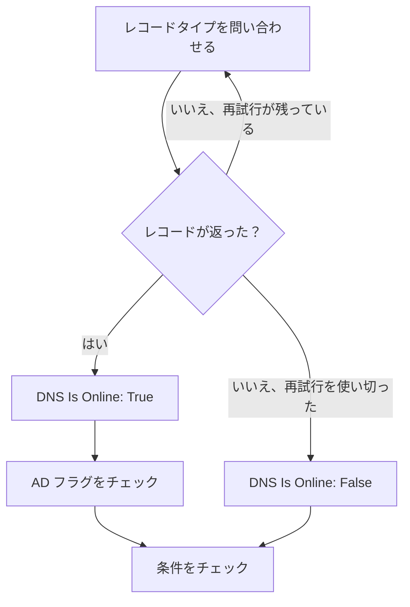

# DNS モニター

DNS モニターは、スケジュールに沿って DNS レコードを問い合わせ、その応答をチェックします。名前が解決されるか、どれくらい速いか、レコードに何が書かれているかです。DNS の障害、変更されたり消えたりしたレコード、遅いリゾルバーを、ユーザーが気づく前に見つけるために使います。

:::cards
- [モニターを作成する](#dns-モニターを作成する): ダッシュボードで 6 ステップ。
- [設定オプション](#設定オプション): 名前、レコードタイプ、DNS サーバー。
- [監視条件](#監視条件): 名前解決、レコード、応答時間、DNSSEC。
- [トラブルシューティング](#トラブルシューティング): モニターと `dig` の結果が食い違うとき。
:::

## しくみ

チェックのたびに、プローブは DNS サーバーに 1 つの名前の 1 つのレコードタイプを問い合わせます。たとえば `example.com` の `A` レコードです。サーバーがそのタイプのレコードを 1 つ以上返せば、名前はオンラインです。失敗した、タイムアウトした、またはレコードを返さなかったクエリは、1 秒後に、設定した再試行回数まで再試行されます。その後、プローブは検証を行うリゾルバーに、応答に DNSSEC の authenticated data（AD）フラグが付いているかを尋ね、OneUptime が結果をモニターの条件に通します。



自身のネットワーク接続を失ったプローブは結果を報告しないため、DNS をオフラインにすることはありません。

## 始める前に

- **モニターを作成できるロール**: Project Owner、Project Admin、Project Member、Monitor Admin、Monitor Member のいずれか、または Create Monitor 権限を持つカスタムロール。
- **DNS サーバーに到達できるプローブ。** 新しいモニターには、プロジェクトのデフォルトのプローブが選ばれます。社内リゾルバーなど、プライベートネットワーク上の DNS サーバーに問い合わせるには、そのネットワーク内の [カスタムプローブ](/docs/probe/custom-probe) を使います。

## DNS モニターを作成する

:::steps
### 新しいモニターを始める

**モニター** に移動し、**モニターを作成** をクリックします。**モニターの種類** で **その他のモニターの種類** をクリックし、**DNS Monitoring** の下の **DNS** を選びます。

### 名前を付ける

`example.com A records` のような **名前** を入力し、**次へ** をクリックします。

### クエリを入力する

問い合わせる **ドメイン名**（たとえば `example.com`）を入力し、その **レコードタイプ** を選びます。特定のサーバーに問い合わせるには **DNS サーバー（任意）** に入力します。空のままにすると、プローブ自身のリゾルバーを使います。

### テストする

**モニターをテスト** をクリックし、**プローブを選択** でプローブを選んで **テストを実行** をクリックします。**モニターテスト結果** に、プローブが受け取ったレコードが表示されます。

### 条件を確認する

**モニター条件** は [デフォルト条件](#デフォルト条件) から始まります。名前が解決されなければオフライン、解決されればオンラインです。レコードの内容をチェックするには **DNS Record Value** フィルターを追加し、**次へ** をクリックします。

### プローブを選んで作成する

**プローブ** と **監視間隔**（**5 分ごと** から始まります）をそのまま使うか変更し、**モニターを作成** をクリックします。モニターのページが開きます。
:::

## 設定オプション

| 項目 | デフォルト | 入力する内容 |
| --- | --- | --- |
| **ドメイン名** | なし | 問い合わせる名前。`example.com` や `_sip._tcp.example.com` など。`PTR` レコードの場合は逆引き名で、`34.216.184.93.in-addr.arpa` など。 |
| **レコードタイプ** | `A` | 問い合わせるレコードタイプ。[レコードタイプ](#レコードタイプ) を参照してください。 |
| **DNS サーバー（任意）** | プローブのリゾルバー | 代わりに問い合わせる DNS サーバー。`8.8.8.8` や `ns1.example.com` など。`CAA` を含むすべてのレコードタイプをこのサーバーに問い合わせます。 |
| **ポート**（**その他の項目** の下） | `53` | **DNS サーバー（任意）** のサーバーのポート。DNSSEC のチェックも同じポートに問い合わせます。 |
| **タイムアウト（ms）**（**その他の項目** の下） | `5000` | 応答を待つ時間（ミリ秒）。 |
| **再試行**（**その他の項目** の下） | `3` | 最初の試行が失敗した後の再試行回数。`0` は 1 回だけ試行することを意味します。 |

### レコードタイプ

**DNS Record Value** の条件は、入力したテキストを、プローブが書き出した形の各レコードと比較します。そのため、次の形式に合わせてください。

| レコードタイプ | 内容 | 値の形式（条件用） |
| --- | --- | --- |
| `A` | IPv4 アドレス | `93.184.216.34` |
| `AAAA` | IPv6 アドレス | `2606:2800:220:1:248:1893:25c8:1946` |
| `CNAME` | この名前がエイリアスとして指す名前 | `example.net` |
| `MX` | メールサーバー | `10 mail.example.com`（優先度、次にサーバー） |
| `NS` | ネームサーバー | `ns1.example.com` |
| `TXT` | SPF や検証用レコードなどのテキスト | `v=spf1 include:_spf.example.com ~all` |
| `SOA` | ゾーンの権威の開始（start of authority） | `ns1.example.com hostmaster.example.com 2024010101 7200 3600 1209600 3600`（サーバー、連絡先、シリアル、refresh、retry、expire、最小 TTL） |
| `PTR` | アドレスが逆に指す名前（逆引き DNS） | `server1.example.com` |
| `SRV` | サービス | `10 5 5060 sip.example.com`（優先度、重み、ポート、ターゲット） |
| `CAA` | その名前の証明書の発行を許可された認証局 | `0 letsencrypt.org`（フラグ、次に認証局） |

複数の文字列に分かれた `TXT` レコードは、1 つの値に連結されます。

## 監視条件

条件は、名前をオンライン、機能低下、オフラインのどれとみなすか、そしてそれによってインシデントを宣言するかアラートを作成するかを決めます。各条件は 1 つ以上のフィルターをチェックします。

| フィルター | 条件 | チェック内容 |
| --- | --- | --- |
| **DNS Is Online** | **真**、**偽** | クエリがそのタイプのレコードを 1 つ以上返したかどうか。 |
| **DNS Response Time (in ms)** | **Greater Than**、**Less Than**、**Greater Than Or Equal To**、**Less Than Or Equal To** | クエリにかかった時間。 |
| **DNS Record Exists** | **真**、**偽** | そのタイプのレコードが返ってきたかどうか。 |
| **DNS Record Value** | **含む**、**Not Contains**、**Starts With**、**Ends With**、**Equal To**、**Not Equal To** | レコードの値。いずれか 1 つのレコードが一致すれば、フィルターは一致します。 |
| **DNSSEC Is Valid** | **真**、**偽** | 検証を行うリゾルバーが応答に AD フラグを付けるかどうか。 |

**DNS Record Value** は、レコードの _いずれか_ が一致すれば一致します。`A` レコードが複数ある場合、**Equal To** `93.184.216.34` はそのうち 1 つがそのアドレスなら一致し、**Not Equal To** はそのうち 1 つがそのアドレスでなければ一致します。

**DNSSEC Is Valid** は、**DNS サーバー（任意）** のサーバーにその **ポート** で問い合わせ、空の場合は Google Public DNS（`8.8.8.8`）に問い合わせます。そのため、設定するサーバーは DNSSEC を検証するものにしてください。プローブがこのチェックを実行できないとき、フィルターには値がなく、どちらにも一致しません。署名済みゾーンを完全にチェックするには [DNSSEC モニター](/docs/monitor/dnssec-monitor) を使います。

フィルターが 2 つ以上ある場合、**一致条件** で **すべて** が一致する必要があるか、**いずれか** 1 つでよいかを決めます。条件の **アクション** は、その条件が何をするかを決めます。モニターのステータスを変える、アラートを作成する、インシデントを宣言する、またはそのいくつかです。

### デフォルト条件

新しい DNS モニターは 2 つの条件から始まります。

- **オフライン** — すべての再試行の後も、名前が解決されないか、そのタイプのレコードがない場合。モニターは **オフライン** になり、「_monitor name_ is offline」というインシデントが作成されます。インシデントは名前が再び解決されると自動で解決します。
- **オンライン** — 名前が解決される場合。モニターは **稼働中** になります。

条件は上から順にチェックされ、最初に一致したものが何が起きるかを決めます。どれにも一致しない場合、モニターはデフォルトのステータスを表示します。条件の下にある **その他の項目** で別のものを選ばない限り **稼働中** です。

### 一定期間にわたる評価

**この条件を一定期間にわたって評価する** はフィルターの下にあるチェックボックスで、**DNS Is Online** と **DNS Response Time (in ms)** で使えます。オンにすると、最新のチェックではなく、過去のチェックの期間を評価します。**評価** で集計方法を選び、**過去（分単位）** で 2 分から 60 分までの期間を選びます。

| 集計 | 一致するとき |
| --- | --- |
| **平均**、**合計**、**Maximum Value**、**Minimum Value** | 期間全体でのその値が条件を満たすとき。**DNS Response Time (in ms)** のみ。 |
| **All Values** | 期間内のすべてのチェックが条件を満たすとき。 |
| **Any Value** | 期間内の少なくとも 1 つのチェックが条件を満たすとき。 |

**All Values** は、期間が本当にデータで埋まってから一致します。作成されたばかりのモニターや、チェックが記録されなくなったモニターには、直近 N 分について何かを言えるだけの履歴がないため、条件は手元の 1 つの値で一致せずに待ちます。**Any Value** は「1 回でもしきい値を超えたらすぐに知らせる」ための設定で、引き続きすぐに発火します。

**データがない場合** は、期間が条件を裏付けられない間に何が起きるかを決めます。

| オプション | 何が起きるか | 用途 |
| --- | --- | --- |
| **Ignore**（デフォルト） | 条件は一致しません。 | 通常のしきい値アラート。 |
| **トリガー** | データがないこと自体を問題とみなします。 | 沈黙そのものが障害となるチェック。 |
| **Treat As Zero** | 期間を 1 つのゼロとして比較します。 | イベントがないことが本当にゼロを意味するカウンター。 |

### 条件の例

| 目的 | フィルター | 条件 | 値 |
| --- | --- | --- | --- |
| 名前が解決されなくなったらオフラインにする | **DNS Is Online** | **偽** | — |
| 名前の唯一の `A` レコードが変わったらアラートを出す | **DNS Record Value** | **Not Equal To** | `93.184.216.34` |
| `MX` レコードが自分のドメインの外を指したらアラートを出す | **DNS Record Value** | **Not Contains** | `example.com` |
| DNS が遅いときに機能低下にする | **DNS Response Time (in ms)** | **Greater Than** | `500` |
| DNSSEC の検証に失敗したらアラートを出す | **DNSSEC Is Valid** | **偽** | — |

## トラブルシューティング

:::details モニターはオフラインなのに、手元では名前が解決される
プローブが別のサーバーに、または別のレコードタイプを問い合わせました。**レコードタイプ** を確認してください。`CNAME` しかない名前や、`AAAA` レコードしかない名前には `A` レコードがありません。同じサーバーに対する `dig` と比べます。

```bash
dig @8.8.8.8 example.com A
```
:::

:::details 正しいアドレスがあるのに Not Equal To の条件が発火する
**DNS Record Value** は、いずれか 1 つのレコードが一致すれば一致します。レコードが複数あると、**Not Equal To** はそのうち 1 つでも違えば発火します。特定の値がレコードの中にあることをチェックするには、最初に一致したものが優先されるので、条件の順序を利用します。

1. デフォルトのオフラインの条件を一番上に残します: **DNS Is Online** / **偽**。
2. その下に、**DNS Record Value** / **Equal To** / 期待する値 の条件を追加し、モニターを **稼働中** にします。
3. さらにその下に、**DNS Is Online** / **真** の条件を追加し、モニターを **オフライン** にしてインシデントを宣言します。これは値を持たない応答にだけ一致します。
:::

:::details DNSSEC Is Valid が一度も一致しない
**DNS サーバー（任意）** のサーバーが DNSSEC を検証しないため AD フラグを付けないか、プローブがチェックを実行できませんでした。`8.8.8.8` で検証するには項目を空のままにするか、[DNSSEC モニター](/docs/monitor/dnssec-monitor) を使います。
:::

## 次のステップ

:::cards
- [DNSSEC モニター](/docs/monitor/dnssec-monitor): 署名済みゾーンの信頼の連鎖を検証します。
- [ドメイン モニター](/docs/monitor/domain-monitor): ドメインの登録と有効期限を見守ります。
- [カスタム プローブ](/docs/probe/custom-probe): 自分のネットワークから社内の DNS サーバーに問い合わせます。
- [インシデント 概要](/docs/incidents/index): モニターがインシデントを宣言した後に起きること。
:::
