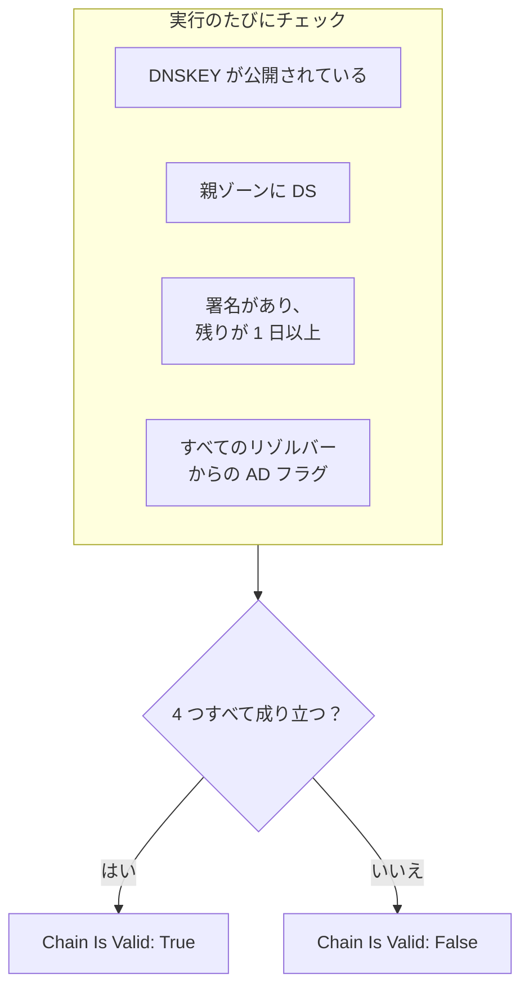

# DNSSEC モニター

DNSSEC モニターは、署名済みの DNS ゾーンが引き続き検証に通ることをチェックします。鍵を公開しているか、親ゾーンがそのゾーンを保証しているか、署名の有効期限が切れていないか、検証を行うリゾルバーがそのゾーンを受け入れているかです。リゾルバーがドメインに対して `SERVFAIL` を返し始める前に、壊れた信頼の連鎖を見つけるために使います。

:::cards
- [モニターを作成する](#dnssec-モニターを作成する): ダッシュボードで 6 ステップ。
- [チェックされる内容](#しくみ): 有効な連鎖を支えるチェック。
- [監視条件](#監視条件): 連鎖の有効性、鍵、DS レコード、署名、リゾルバー、ネームサーバー。
- [ベストプラクティス](#ベストプラクティス): うまく機能するしきい値とリゾルバー。
:::

## しくみ

チェックのたびに、プローブはゾーンに対して一連の DNS クエリを実行します。

| クエリ | 問い合わせ先 | わかること |
| --- | --- | --- |
| `DNSKEY` | **リゾルバー** の最初のリゾルバー | ゾーンが署名鍵を公開しているかどうか。 |
| `DS` | **リゾルバー** の最初のリゾルバー | 親ゾーンがそのゾーンの delegation signer レコードを公開しているかどうか。 |
| `SOA`（DNSSEC レコード付き） | **リゾルバー** の最初のリゾルバー | ゾーンのレコードが署名されているかどうか（その `SOA` レコードに署名する `RRSIG`）、そして最も早く期限が切れる署名がいつ切れるか。 |
| `A`（DNSSEC 検証付き） | **リゾルバー** のすべてのリゾルバー | 検証を行う各リゾルバーがゾーンを受け入れているかどうか。リゾルバーはこれを authenticated data（AD）フラグで示します。 |
| `NS`、次に `SOA` | 最初のリゾルバー、次にそれが示す各権威ネームサーバー | すべてのネームサーバーが同じ SOA シリアルを返すかどうか。**ネームサーバーの一貫性をチェック** がオンのときだけ。 |

検証を行うリゾルバーはルートから下へ信頼の連鎖をチェックするので、AD フラグは連鎖全体が成り立っていることを示します。次のすべてが成り立つとき、連鎖は有効とみなされます。

残りが 1 日未満の署名はすでに壊れているとみなされるため、リゾルバーがゾーンを拒否し始める最大 1 日前に知ることができます。連鎖が壊れている、またはネームサーバーがずれているとわかったチェックは、OneUptime が結果をモニターの条件に通す前に、1 秒後に、設定した再試行回数まで再実行されます。1 回の試行のクエリはすべて、**タイムアウト（ms）** の 3 倍の期限を共有します。時間切れになった試行はタイムアウトを報告し、ゾーンについての判定は下しません。

## 始める前に

- **モニターを作成できるロール**: Project Owner、Project Admin、Project Member、Monitor Admin、Monitor Member のいずれか、または Create Monitor 権限を持つカスタムロール。
- **署名済みのゾーン。** ゾーンが署名されていて、その DS レコードがレジストラ経由で親ゾーンに公開されている必要があります。
- **プローブからの送信 DNS。** 指定したリゾルバーへ、そしてネームサーバーの一貫性チェックのためにゾーンの権威ネームサーバーへ。新しいモニターには、プロジェクトのデフォルトのプローブが選ばれます。

## DNSSEC モニターを作成する

:::steps
### 新しいモニターを始める

**モニター** に移動し、**モニターを作成** をクリックします。**モニターの種類** で **その他のモニターの種類** をクリックし、**DNS Monitoring** の下の **DNSSEC** を選びます。

### 名前を付ける

`example.com DNSSEC` のような **名前** を入力し、**次へ** をクリックします。

### ゾーンを入力する

**ゾーン（ドメイン名）** に、検証するゾーン（たとえば `example.com`）を入力します。**リゾルバー** はデフォルトのままにするか、カンマ区切りで独自のものを並べます。ネットワークが任意のサーバーへの DNS をブロックしていない限り、**ネームサーバーの一貫性をチェック** はオンのままにします。

### テストする

**モニターをテスト** をクリックし、**プローブを選択** でプローブを選んで **テストを実行** をクリックします。**モニターテスト結果** に、各チェックで見つかった内容が表示されます。

### 条件を確認する

**モニター条件** は [デフォルト条件](#デフォルト条件) から始まります。連鎖が壊れていればオフライン、有効ならオンラインです。署名の期限が切れる前に警告を受けるには、条件を追加して（[ベストプラクティス](#ベストプラクティス) を参照）、**次へ** をクリックします。

### プローブを選んで作成する

**プローブ** と **監視間隔**（**5 分ごと** から始まります）をそのまま使うか変更し、**モニターを作成** をクリックします。モニターのページが開きます。
:::

## 設定オプション

| 項目 | デフォルト | 入力する内容 |
| --- | --- | --- |
| **ゾーン（ドメイン名）** | なし | 検証するゾーン。`example.com` など。 |
| **リゾルバー** | `1.1.1.1, 8.8.8.8, 9.9.9.9` | 問い合わせる検証リゾルバー（カンマ区切り）。連鎖が有効とみなされるには、すべてが AD フラグを返す必要があります。 |
| **ネームサーバーの一貫性をチェック** | オン | 各権威ネームサーバーに直接問い合わせ、SOA シリアルを比較します。ネットワークが任意のサーバーへの送信 DNS をブロックしている場合はオフにします。 |
| **署名有効期限の警告（日数）**（**その他の項目** の下） | `7` | モニターと一緒に保存されます。**DNSSEC Signature Expires In Days** フィルターは条件で指定した値を使うので、しきい値はそこで設定します。 |
| **タイムアウト（ms）**（**その他の項目** の下） | `10000` | 各 DNS クエリを待つ時間（ミリ秒）。1 回の試行は合計でこの最大 3 倍かかることがあります。 |
| **再試行**（**その他の項目** の下） | `3` | 最初の試行が失敗した後の再試行回数。`0` は 1 回だけ試行することを意味します。 |

## 監視条件

条件は、ゾーンをオンライン、機能低下、オフラインのどれとみなすか、そしてそれによってインシデントを宣言するかアラートを作成するかを決めます。各条件は 1 つ以上のフィルターをチェックします。

| フィルター | 条件 | チェック内容 |
| --- | --- | --- |
| **DNSSEC Chain Is Valid** | **真**、**偽** | 上の 4 つのチェックがすべて成り立つこと。鍵が公開されている、親ゾーンに DS がある、署名があって残りが 1 日以上、すべてのリゾルバーから AD フラグ。 |
| **DNSSEC DNSKEY Record Exists** | **真**、**偽** | ゾーンが DNSKEY レコードを 1 つ以上公開していること。 |
| **DNSSEC DS Record Exists At Parent** | **真**、**偽** | 親ゾーンがそのゾーンの DS レコードを公開していること。 |
| **DNSSEC Signature Expires In Days** | **Greater Than**、**Less Than**、**Greater Than Or Equal To**、**Less Than Or Equal To** | 最も早く期限が切れる署名（RRSIG）が切れるまでの日数（整数）。 |
| **DNSSEC Resolver Consensus (AD Flag)** | **真**、**偽** | **リゾルバー** のすべてのリゾルバーが AD フラグを返すこと。 |
| **DNSSEC Nameservers Are Consistent** | **真**、**偽** | すべての権威ネームサーバーが同じ SOA シリアルで応答すること。**ネームサーバーの一貫性をチェック** がオフの間は常に **真**。 |

フィルターが 2 つ以上ある場合、**一致条件** で **すべて** が一致する必要があるか、**いずれか** 1 つでよいかを決めます。条件の **アクション** は、その条件が何をするかを決めます。モニターのステータスを変える、アラートを作成する、インシデントを宣言する、またはそのいくつかです。

### デフォルト条件

新しい DNSSEC モニターは 2 つの条件から始まります。

- **連鎖が壊れている** — **DNSSEC Chain Is Valid** が **偽** の場合。モニターは **オフライン** になり、「_monitor name_ DNSSEC chain is broken」というインシデントが作成されます。インシデントは連鎖が再び有効になると自動で解決します。
- **連鎖が有効** — モニターは **稼働中** になります。

条件は上から順にチェックされ、最初に一致したものが何が起きるかを決めます。どれにも一致しない場合、モニターはデフォルトのステータスを表示します。条件の下にある **その他の項目** で別のものを選ばない限り **稼働中** です。

デフォルトの条件は、署名の期限切れやネームサーバーの一貫性を単独では見張りません。下の例のように、それらの条件を追加します。

### 条件の例

| 目的 | フィルター | 条件 | 値 |
| --- | --- | --- | --- |
| 連鎖が壊れたらオフラインにする（デフォルト） | **DNSSEC Chain Is Valid** | **偽** | — |
| 署名の期限が切れる前に警告する | **DNSSEC Signature Expires In Days** | **Less Than** | `7` |
| DS レコードを失った委任を検出する | **DNSSEC DS Record Exists At Parent** | **偽** | — |
| 意見が食い違うリゾルバーを検出する | **DNSSEC Resolver Consensus (AD Flag)** | **偽** | — |
| ずれたネームサーバーを検出する | **DNSSEC Nameservers Are Consistent** | **偽** | — |

## ベストプラクティス

1. **常に到達できるリゾルバーを選ぶ。** 連鎖が有効とみなされるにはすべてのリゾルバーが AD フラグを返す必要があるため、プローブが到達できないリゾルバーがあると、再試行を使い切った時点でチェックが失敗します。デフォルトの `1.1.1.1`、`8.8.8.8`、`9.9.9.9` は 3 つの異なる事業者が運用しているので、あるリゾルバーでは検証に通り別のリゾルバーでは通らないゾーンも検出できます。
2. **署名の期限が切れる前に警告を受ける。** 署名ツールは署名の期限が切れる前にゾーンに再署名するので、期限間近の署名は再署名が止まったことを意味します。**DNSSEC Signature Expires In Days** / **Less Than** / `7` でアラートを作成する条件と、`2` でインシデントを宣言する 2 つ目の条件を追加します。最初に一致した条件が優先されるので、両方を連鎖を有効とする条件より上にドラッグし、`2` 日の条件を先にします。再署名が機能している間は静かなままになるよう、署名ツールが通常、再署名までに署名に残す期間より低いしきい値を選びます。
3. **署名済みのゾーンをすべて監視する。** apex ドメイン、署名済みのサブドメイン、別の事業者に委任されたゾーンも含めます。
4. **ネームサーバーの一貫性チェックはオンのままにし、** その条件を追加します。プライマリからの転送が止まったセカンダリを検出でき、これは DNSSEC の検証だけでは見逃すことがあります。

## トラブルシューティング

:::details 連鎖が壊れていると報告されるが、`dig` ではゾーンが検証に通る
**リゾルバー** のいずれかのリゾルバーが AD フラグを返しませんでした。プローブから到達できなかったか、DNSSEC を検証しないリゾルバーです。**モニターテスト結果** と各チェックの概要にある **リゾルバーのチェック** の表に、各リゾルバーの応答とエラーが表示されます。プローブが到達できないリゾルバーを外し、検証を行うリゾルバーだけを並べます。
:::

:::details 変更の直後にネームサーバーの一貫性がないと報告される
ゾーンの変更後しばらくの間、セカンダリはプライマリより遅れることがあります。チェックの概要にある **ネームサーバーの一貫性** の表に、各ネームサーバーの SOA シリアルが表示されます。1 つが遅れたままなら、そのセカンダリは転送が止まっています。すべてのネームサーバーがエラーを示す場合は、プローブが直接問い合わせることをブロックされている可能性があります。**ネームサーバーの一貫性をチェック** をオフにします。
:::

:::details チェックがタイムアウトを報告する
1 回の試行のクエリはすべて、**タイムアウト（ms）** の 3 倍を共有します。遅いリゾルバーや到達できないリゾルバーがその時間を使い切ります。**リゾルバー** から外すか、タイムアウトを長くします。
:::

## 次のステップ

:::cards
- [DNS モニター](/docs/monitor/dns-monitor): 名前が解決されるか、そのレコードに何が書かれているかをチェックします。
- [ドメイン モニター](/docs/monitor/domain-monitor): ドメインの登録と有効期限を見守ります。
- [SSL 証明書モニター](/docs/monitor/ssl-certificate-monitor): ドメインで提供される証明書を見守ります。
- [インシデント 概要](/docs/incidents/index): モニターがインシデントを宣言した後に起きること。
:::
