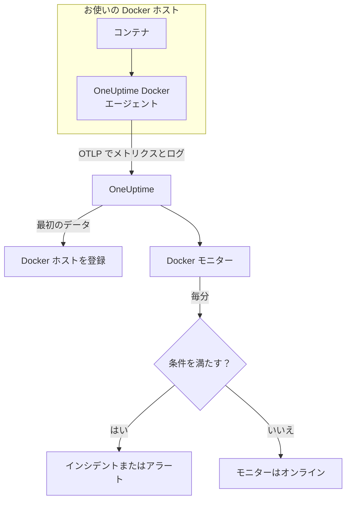

# Docker モニター

Docker モニターは 1 台の Docker ホスト上のコンテナを監視し、コンテナが高負荷になったとき、メモリが不足したとき、クラッシュループに陥ったときに知らせます。OneUptime の Docker エージェントがホストから送信するメトリクスを読み取るため、外部からのプローブは行いません。エージェントをインストールし、テンプレートまたは独自のクエリからモニターを作成します。

:::cards
- [モニターを作成する](#docker-モニターを作成する): ダッシュボードでの 6 つのステップ。
- [テンプレート](#既製のアラートテンプレート): コンテナごとに 1 件のインシデントを作る 6 個の既製アラート。
- [メトリクス](#収集されるメトリクス): エージェントが収集する内容と、各メトリクスの意味。
- [ログ](#収集されるログ): コンテナのログと、そのために必要なログドライバー。
:::

## 仕組み

OneUptime の Docker エージェントは、ホスト上でコンテナとして動作します。30 秒ごとに Docker Engine API からコンテナの統計を読み取り、コンテナのログファイルを追跡し、その両方を OTLP で OneUptime に送信します。ホストからの最初のデータで、そのホストが OneUptime に登録されます。

Docker モニターは 1 台のホストに結び付きます。毎分、そのホストのコンテナメトリクスに対してクエリを実行し、結果を条件と比較します。



## 始める前に

- **Docker エージェントをインストールします**。ホストに入れてください。[Docker エージェントのガイド](/docs/telemetry/docker-host) で、インストール、アップグレード、確認方法を説明しています。
- **ホストが登録されていることを確認します。** 最初のデータが届くと、エージェントの `DOCKER_HOST_NAME` の名前で **製品 → インフラストラクチャ → Docker → すべてのホスト** に表示されます。
- **コンテナのログが必要な場合**、コンテナを Docker の `json-file` ログドライバーで実行します。[ログドライバーの要件](#ログドライバーの要件) を参照してください。

## Docker モニターを作成する

:::steps
### 新しいモニターを始める

**モニター** に移動し、**モニターを作成** をクリックします。

### Docker Container を選ぶ

**モニターの種類** で **その他のモニターの種類** をクリックし、**インフラストラクチャ** の下の **Docker Container** を選ぶか、検索ボックスに `docker` と入力します。**名前** を入力し（インシデントとアラートのタイトルに使われます）、**次へ** をクリックします。

### ホストを選ぶ

**Docker モニターの設定** で、**Docker ホスト** からホストを選びます。データを送信したすべてのホストが一覧に表示されます。

### 監視する対象を選ぶ

3 つのタブのいずれかを選びます。

- **Quick Setup** – [テンプレート](#既製のアラートテンプレート) をクリックします。メトリクス、集計、時間範囲、しきい値が設定され、下の条件がテンプレートのものに置き換わります。**時間範囲** は引き続き変更できます。
- **Custom Metric** – **Docker メトリクス** からメトリクスを 1 つ選び、**集計** と **時間範囲** を設定します。**コンテナ名** と **コンテナイメージ** で一部のコンテナに絞り込めます。
- **詳細** – **メトリクスを選択** でクエリと数式を自分で作成します。**グループ化** に `resource.container.name` を指定すると、コンテナを 1 つずつ判定できます。

### 条件を確認する

**モニター条件** の各条件を開き、**メトリクス**、**集計**、**条件**、**しきい値** を確認します。テンプレートを使った場合は入力済みです。**Custom Metric** または **詳細** の場合、モニターは [デフォルトの条件](#デフォルトの条件) から始まり、これはメトリクスがゼロに落ちたことしか検知しないので、独自のしきい値を設定してください。

### モニターを作成する

**モニターを作成** をクリックします。OneUptime がモニターのページを開き、毎分評価します。作成されたインシデントとアラートは、ホストの **インシデント** と **アラート** のページにも表示されます。
:::

> [!TIP]
> 複数のテンプレートを一度に設定するには、**製品 → インフラストラクチャ → Docker** からホストを開き、**推奨事項** に移動します。使うテンプレートと呼び出す相手を選ぶと、OneUptime がテンプレートごとに 1 つのモニターを作成します。

## モニター設定

| 項目 | タブ | 役割 |
| --- | --- | --- |
| **Docker ホスト** | すべて | 必須。すべてのクエリをホストの `resource.host.name` に限定します。OneUptime はすべてのクエリに `resource.container.runtime = docker` も追加します。 |
| **Docker メトリクス** | Custom Metric | エージェントのカタログにあるメトリクス 1 つ。CPU、メモリ、ネットワーク、ブロック I/O、コンテナに分類されています。 |
| **コンテナ名** | Custom Metric、詳細 | 任意。`resource.container.name` との完全一致。例：`my-container`。 |
| **コンテナイメージ** | Custom Metric、詳細 | 任意。`resource.container.image.name` との完全一致。例：`nginx:latest`。 |
| **集計** | Custom Metric | サンプルの組み合わせ方：**平均**、**最大**、**最小**、**合計**、**カウント**。初期値はメトリクスの通常の集計です。 |
| **時間範囲** | すべて | クエリが読み取る移動ウィンドウで、**Past 1 Minute** から **Past 365 Days** まで。新しいモニターは **Past 1 Minute** から始まり、テンプレートは独自の値を設定します。 |
| **メトリクスを選択** | 詳細 | クエリビルダー：**メトリクス**、**集計の基準**、**属性で絞り込み**、**グループ化**、さらにクエリを組み合わせる **メトリクスを追加** と **数式を追加**。 |

## 既製のアラートテンプレート

**Quick Setup** には 6 つのテンプレートがあります。それぞれが完全なモニターを作ります。`resource.container.name` でグループ化したクエリ、発火する条件、回復する条件です。コンテナは 1 つずつ判定されるため、忙しいコンテナが別のコンテナを隠すことはなく、しきい値を超えたコンテナごとに専用のインシデントとアラートが作られます。しきい値は出発点なので編集できます。

表に別の記載がない限り、条件はそのウィンドウのすべての分で成り立つ場合にのみ発火し、しきい値から 10% 離れたところで回復するため、境界付近を行き来する値でばたつくことはありません。

| テンプレート | 重大度 | 監視対象 | 発火する条件 | 回復する条件 |
| --- | --- | --- | --- | --- |
| High Container CPU Usage | 警告 | `container.cpu.utilization`、コンテナごとの Max、過去 5 分 | 80 を超える（一つのコアに対する %） | 72 以下 |
| High Container Memory Usage | 警告 | `container.memory.percent`、コンテナごとの Max、過去 5 分 | 85% を超える | 76.5% 以下 |
| Container Restart Loop | 重大 | コンテナごとの `container.restarts` の増加、過去 15 分 | ウィンドウ内で 3 回を超える再起動（合計） | 2.7 以下 |
| Container CPU Throttling | 警告 | コンテナごとの `container.cpu.throttling_data.throttled_time` の増加（ms）、過去 5 分 | ウィンドウ内で 1000 ms を超える（合計） | 900 ms 以下 |
| High Container Process Count | 警告 | `container.pids.count`、コンテナごとの Max、過去 5 分 | 2000 を超える | 1800 以下 |
| Container Down (Low Uptime) | 重大 | `container.uptime`、コンテナごとの Min、過去 1 分 | 0 に等しい | 0 を超える |

**重大度** は選択リストに表示されるラベルです。テンプレートが作成するインシデントとアラートは、プロジェクトで最も重大なインシデントとアラートの重大度から始まります。条件で変更してください。

> [!NOTE]
> `container.cpu.utilization` は `docker stats` が表示する数値で、100% はホスト全体ではなく CPU 1 コア分です。そのため 2 コアを使うコンテナは 200 になります。マルチコアのホストでは、しきい値 80 はマシンに対する割合ではなく CPU の予算です。

> [!NOTE]
> `container.memory.percent` は、コンテナにメモリ上限が設定されていればその上限で、設定されていなければ**ホスト**の総メモリで割ります。超過をメモリ不足による強制終了の前兆と見なす前に、コンテナが `--memory` 付きで起動されたかを確認してください。

> [!WARNING]
> `container.restarts` と `container.cpu.throttling_data.throttled_time` は増加しかしないため、この 2 つのテンプレートはウィンドウ内でどれだけ増えたかでアラートを出します。1 分ごとの Maximum クエリと Minimum クエリを数式で差し引いて合計します。エージェントの 30 秒ごとの収集では実際の動きの約半分しか見えませんが、しきい値はそれを織り込み済みです。エージェントの `collection_interval` を 60 秒以上にすると、1 分に 1 つのサンプルしか入らず、どちらのテンプレートもアラートを出さなくなります。

> [!CAUTION]
> **Container Down (Low Uptime)** は、停止したまま止まっているコンテナを検知できません。エージェントは実行中のコンテナしか報告しないため、停止したコンテナはデータをまったく送らず、その稼働時間が 0 になることはありません。稼働し続ける必要があるサービスでは、提供している機能も監視してください。たとえば [API モニター](/docs/monitor/api-monitor) を使います。

## 収集されるメトリクス

エージェントは OpenTelemetry の `docker_stats` レシーバーを Docker ソケットに対して 30 秒ごとに使います。各コンテナのメトリクスは、その識別情報をリソース属性として持ちます：`resource.container.name`、`resource.container.image.name`、`resource.container.id`、`resource.container.runtime`（`docker`）、`resource.host.name`。

### CPU

| メトリクス | 説明 |
| --- | --- |
| `container.cpu.utilization` | CPU 使用率。100% が CPU 1 コア分です（`docker stats` の CPU% 列）。 |
| `container.cpu.usage.total` | コンテナの起動以降に使った CPU 時間（ナノ秒）。生涯カウンター。 |
| `container.cpu.throttling_data.throttled_time` | 起動以降、コンテナが CPU 上限でスロットリングされたナノ秒数。生涯カウンター。 |
| `container.cpu.throttling_data.throttled_periods` | コンテナの起動以降のスロットリング期間の数。生涯カウンター。 |

### メモリ

| メトリクス | 説明 |
| --- | --- |
| `container.memory.usage.total` | 使用中のメモリ（バイト）。 |
| `container.memory.usage.limit` | メモリ上限（バイト）。 |
| `container.memory.percent` | コンテナの上限、または上限がない場合はホストの総メモリに対するメモリ使用率（%）。 |

### ネットワーク

| メトリクス | 説明 |
| --- | --- |
| `container.network.io.usage.rx_bytes` | 受信したバイト数。生涯カウンター。 |
| `container.network.io.usage.tx_bytes` | 送信したバイト数。生涯カウンター。 |

### ブロック I/O

| メトリクス | 説明 |
| --- | --- |
| `container.blockio.io_service_bytes_recursive.read` | ブロックデバイスから読み取ったバイト数。 |
| `container.blockio.io_service_bytes_recursive.write` | ブロックデバイスに書き込んだバイト数。 |

### コンテナ

| メトリクス | 説明 |
| --- | --- |
| `container.uptime` | コンテナの起動からの秒数。実行中のコンテナだけが報告します。 |
| `container.restarts` | 作成以降にコンテナが再起動した回数。生涯カウンター。 |
| `container.pids.count` | コンテナ内のタスク数。cgroup の pids コントローラーはプロセスだけでなくスレッドも数えます。 |

**Docker メトリクス** の一覧には、`container.cpu.usage.percpu`、`container.memory.rss`、`container.memory.cache`、ネットワークパケットのカウンターもあります。同梱のエージェント設定ではこれらは有効になっていないため、使う前にホストの **メトリクス** ページを確認してください。`container.cpu.throttling_data.throttled_periods` は一覧にないので、**詳細** から照会します。

## 監視条件

条件は、モニターのクエリまたは数式の 1 つをしきい値と比較します。Docker モニターの条件には **フィルタータイプ** がなく、すべてのルールが次の項目でメトリクスの値をチェックします。

| 項目 | 役割 |
| --- | --- |
| **メトリクス** | チェックするクエリまたは数式（変数名で指定）。 |
| **集計** | ウィンドウ内の値を 1 つの答えにする方法：**平均**、**合計**、**Maximum Value**、**Minimum Value**、**All Values**（すべての値が一致する必要がある）、**Any Value**（1 つで十分）。 |
| **条件** | **Greater Than**、**Less Than**、**Greater Than Or Equal To**、**Less Than Or Equal To**、**Equal To**、または異常条件の **Anomalously High**、**Anomalously Low**、**Anomalous**。 |
| **しきい値** | 比較する値。メトリクスに単位がある場合は、横に単位の一覧が表示されます。異常条件では表示されません。 |
| **感度** | 異常条件のみ。**低**（4σ）、**中**（3σ、既定）、**高**（2σ）。 |
| **ベースラインウィンドウ** | 異常条件のみ。履歴 14 日（既定）、28 日、60 日、90 日。 |
| **データがない場合** | **その他の項目** の中にあります。ウィンドウにサンプルがないときの動作：**Ignore**（既定）、**Treat As Zero**、**トリガー**。 |

異常条件は、各値をベースラインの週の同じ時間帯と比較します。ベースラインウィンドウに十分な履歴がたまるまでは「Learning」状態のままで、何も作成しません。

各条件には、一致したときの動作も指定します。モニターのステータスの変更、アラートの作成、インシデントの宣言です。条件は上から順にチェックされ、最初に一致したものが結果を決めます。

### デフォルトの条件

テンプレートから作らないモニターは、2 つの条件から始まります。

| 順序 | 条件 | 一致するとき | 結果 |
| --- | --- | --- | --- |
| 1 | Check if _monitor name_ is offline | 最初のクエリのいずれかの値が `0` | モニターを **オフライン** にし、インシデント「_monitor name_ is offline」を宣言します。モニターが回復すると自動的に解決します。 |
| 2 | Check if _monitor name_ is online | いずれかの値が `0` を超える | モニターを **稼働中** にします。 |

> [!IMPORTANT]
> 無応答はどちらの条件にも一致しません。データの送信を止めたホストは、モニターを元の状態のままにします。データが止まったときに知らせを受けるには、条件の **データがない場合** を **トリガー** に設定します。OneUptime 自身がデータを受信していなかった時間は、決してデータなしとは扱われません。そのような時間を含むウィンドウのチェックは代わりに待機します。詳しくは [OneUptime がデータを受信していないとき](/docs/monitor/when-oneuptime-is-not-receiving) を参照してください。

## 収集されるログ

エージェントは各コンテナの `*-json.log` ファイルも追跡し、各行を次の内容を持つ OpenTelemetry のログレコードとして送信します。

| 項目 | 値 |
| --- | --- |
| `resource.host.name` | ホスト。`DOCKER_HOST_NAME` から取得します。 |
| `resource.container.id` | 完全なコンテナ ID。 |
| `resource.container.runtime` | 常に `docker`。 |
| `attributes["log.iostream"]` | `stdout` または `stderr`。 |
| `severityText` / `severityNumber` | 行の中にレベルがあれば、そのレベルのキーワードから読み取ります（`[ERROR]`、`app.INFO:`、`{"level":"warn"}`、`level=error`）。レベルのない行はストリームから決まります。`stderr` は `ERROR`、`stdout` は `INFO` です。 |
| `body` | コンテナが書き込んだ行。スタックトレースの行のように、空白や閉じ括弧で始まる行は前の行に連結されます。 |
| `time` | その行に対する Docker デーモンのタイムスタンプ。 |

ログは、ホストの **ログ** ページと各コンテナのページに表示されます。

### ログドライバーの要件

エージェントがログを読み取れるのは、Docker の `json-file` ログドライバーを使うコンテナだけです。これは Docker の既定ですが、コンテナやデーモン全体が別のドライバーを使っている場合があります。

| ドライバー | エージェントから見える内容 |
| --- | --- |
| `json-file` | すべての行。 |
| `local` | なし。ファイルがバイナリで、エージェントは解析できません。 |
| `journald`、`syslog`、`fluentd`、`gelf`、`awslogs`、`splunk`、… | なし。ログは別の場所に送られるため、追跡するファイルがありません。 |
| `none` | なし。ログは破棄されます。 |

コンテナのドライバーと、デーモンの既定を確認します。

```bash
docker inspect <container> --format '{{.HostConfig.LogConfig.Type}}'
docker info --format '{{.LoggingDriver}}'
```

`json-file` に切り替えます。Docker はコンテナの作成時にログドライバーを決めるため、変更後は各コンテナを作り直してください。再起動では古いドライバーのままです。

:::tabs
@tab Docker Compose
各サービスにドライバーをローテーション付きで設定します。

```yaml title="docker-compose.yml"
services:
  my-app:
    image: my-app:latest
    logging:
      driver: "json-file"
      options:
        max-size: "100m"
        max-file: "5"
```

その後、サービスを作り直します。

```bash
docker compose up -d --force-recreate <service>
```
@tab Docker デーモン
以降に作成するすべてのコンテナで `json-file` を既定にします。

```json title="/etc/docker/daemon.json"
{
  "log-driver": "json-file",
  "log-opts": {
    "max-size": "100m",
    "max-file": "5"
  }
}
```

Docker デーモンを再起動し、各コンテナを削除して作り直します。

```bash
docker rm -f <container>
docker run ... <image>
```
:::

## トラブルシューティング

:::details ホストが Docker ホスト の一覧にない
ホストはエージェントのデータから自動登録されます。エージェントのコンテナが実行中で、ホストが **製品 → インフラストラクチャ → Docker → すべてのホスト** に表示されていることを確認してください。[Docker エージェントのガイド](/docs/telemetry/docker-host) に、ホスト上で行う確認があります。
:::

:::details メトリクスは届くがログのページが空
コンテナがほぼ確実に `json-file` ログドライバーを使っていません。[ログドライバーの要件](#ログドライバーの要件) のコマンドで確認し、ログが必要なコンテナを切り替えて作り直してください。
:::

:::details エージェントが「no files match the configured criteria」とログに出す
エージェントは `/var/lib/docker/containers/*/*-json.log` を探しましたが、何も見つかりませんでした。ホスト上のどのコンテナも `json-file` を使っていないか、エージェントの `/var/lib/docker/containers` のマウント（`-v /var/lib/docker/containers:/var/lib/docker/containers:ro`）がないか空であるか、エージェントが macOS 版 Docker Desktop で動作していてコンテナのファイルが Linux VM の中にあるかのいずれかです。
:::

:::details データが誤ったホスト名で届く
OneUptime は `resource.host.name` でホストを識別し、エージェントはこれを `DOCKER_HOST_NAME` から取得します。最初のデータの後に `DOCKER_HOST_NAME` を変えると、最初のホストの名前が変わるのではなく 2 台目のホストができ、モニターは作成時の名前に結び付いたままになります。
:::

:::details CPU のアラートが発火しない
**High Container CPU Usage** テンプレートと同じように、クエリを `resource.container.name` でグループ化し、**最大** で集計してください。忙しいホストですべてのコンテナを平均すると、アイドル状態のコンテナに引き下げられます。100% は 1 コア分を意味するので、複数のコアを使えるコンテナにはより高いしきい値が必要です。
:::

:::details 再起動ループまたはスロットリングのテンプレートがアラートを出さなくなった
どちらも、同じ 1 分間の 2 つのサンプルの間にカウンターがどれだけ増えたかを測ります。エージェントの `collection_interval` が 60 秒以上だと、1 分に 1 つのサンプルしか入らず、増加は常に 0 になり、どちらのテンプレートも発火しません。エージェントの既定の 30 秒のままにしてください。
:::

## 次のステップ

:::cards
- [Docker エージェント](/docs/telemetry/docker-host): このモニターが読み取るエージェントのインストール、アップグレード、トラブルシューティング。
- [Podman モニター](/docs/monitor/podman-monitor): Podman ホスト向けの同じモニター。
- [Docker Swarm モニター](/docs/monitor/docker-swarm-monitor): Swarm クラスターのタスクを監視します。
- [インシデント 概要](/docs/incidents/index): 条件がインシデントを宣言した後に起こること。
:::
