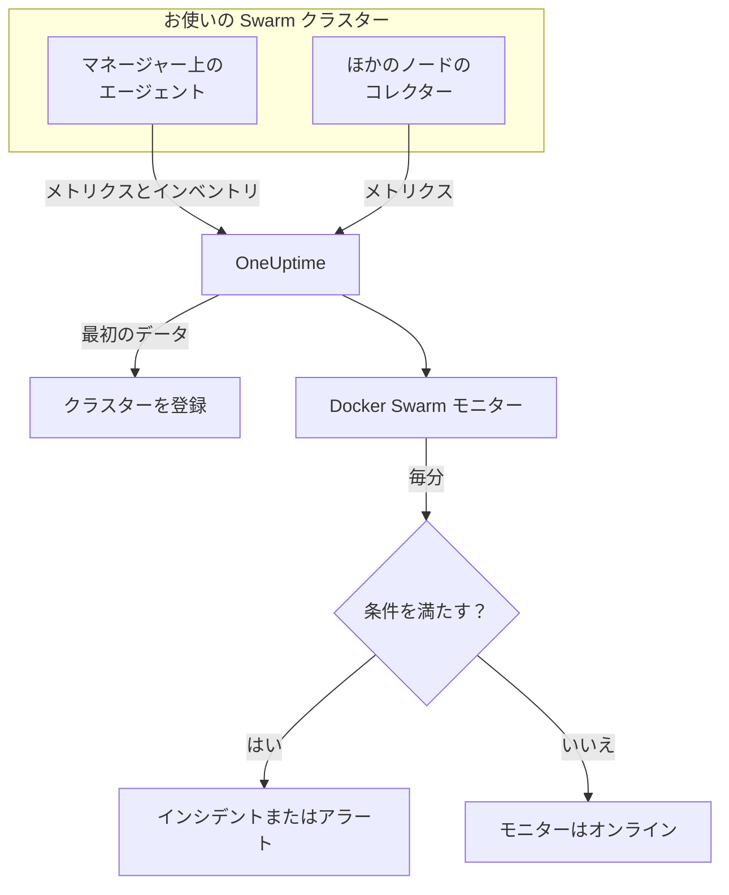

# Docker Swarm モニター

Docker Swarm モニターは、Swarm クラスターのサービスタスクの背後にあるコンテナを監視し、タスクが再起動したとき、高負荷になったとき、メモリが不足したときに知らせます。OneUptime の Docker Swarm エージェントが送信するコンテナメトリクスを読み取るため、外部からのプローブは行いません。エージェントをインストールし、テンプレートまたは独自のクエリからモニターを作成します。

:::cards
- [モニターを作成する](#docker-swarm-モニターを作成する): ダッシュボードでの 6 つのステップ。
- [テンプレート](#既製のアラートテンプレート): タスクごとに 1 件のインシデントを作る 4 個の既製アラート。
- [メトリクス](#収集されるメトリクス): アラートに使えるコンテナメトリクス。
- [フィルター](#モニター設定): モニターをサービス、タスク、イメージに絞り込みます。
:::

## 仕組み

OneUptime の Docker Swarm エージェントはマネージャーノード上で動作します。そのコレクターは 30 秒ごとにノードの Docker デーモンからコンテナの統計を読み取り、各バッチにクラスター名 `docker.swarm.cluster.name` を付けます。隣で動く小さなインベントリポーラーは、5 分ごとに Swarm API からクラスターのノード、サービス、タスクを読み取ります。最初のデータでクラスターが OneUptime に登録されます。

コレクターは、自身が動作しているノード上のコンテナしか見ません。すべてのノードからメトリクスを得るには、同じ `DOCKER_SWARM_CLUSTER_NAME` で各ノードにコレクターを実行します。

Docker Swarm モニターは 1 つのクラスターに結び付きます。毎分、そのクラスターのコンテナメトリクスに対してクエリを実行し、結果を条件と比較します。

## 始める前に

- **Docker Swarm エージェントをインストールします**。マネージャーノードに入れてください。[Docker Swarm エージェントのガイド](/docs/telemetry/docker-swarm) で、インストールとアップグレード、ほかのノードでのコレクターの実行を説明しています。
- **クラスターが登録されていることを確認します。** 最初のデータが届くと、エージェントの `DOCKER_SWARM_CLUSTER_NAME` の名前で **製品 → インフラストラクチャ → Docker Swarm → すべてのクラスター** に表示されます。

## Docker Swarm モニターを作成する

:::steps
### 新しいモニターを始める

**モニター** に移動し、**モニターを作成** をクリックします。

### Docker Swarm を選ぶ

**モニターの種類** で **その他のモニターの種類** をクリックし、**インフラストラクチャ** の下の **Docker Swarm** を選ぶか、検索ボックスに `swarm` と入力します。**名前** を入力し（インシデントとアラートのタイトルに使われます）、**次へ** をクリックします。

### クラスターを選ぶ

**Docker Swarm モニターの設定** で、**Docker Swarm クラスター** からクラスターを選びます。データを送信したすべてのクラスターが一覧に表示されます。

### 監視する対象を選ぶ

3 つのタブのいずれかを選びます。

- **Quick Setup** – [テンプレート](#既製のアラートテンプレート) をクリックします。メトリクス、集計、時間範囲、しきい値が設定され、下の条件がテンプレートのものに置き換わります。**時間範囲** は引き続き変更できます。
- **Custom Metric** – **Docker Swarm メトリクス** からメトリクスを 1 つ選び、**集計** と **時間範囲** を設定します。[フィルター](#モニター設定) で一部のタスクに絞り込めます。
- **詳細** – **メトリクスを選択** でクエリと数式を自分で作成します。**グループ化** に `resource.container.name` を指定すると、タスクを 1 つずつ判定できます。

### 条件を確認する

**モニター条件** の各条件を開き、**メトリクス**、**集計**、**条件**、**しきい値** を確認します。テンプレートを使った場合は入力済みです。**Custom Metric** または **詳細** の場合、モニターは [デフォルトの条件](#デフォルトの条件) から始まり、これはメトリクスがゼロに落ちたことしか検知しないので、独自のしきい値を設定してください。

### モニターを作成する

**モニターを作成** をクリックします。OneUptime がモニターのページを開き、毎分評価します。作成されたインシデントとアラートは、クラスターの **インシデント** と **アラート** のページにも表示されます。
:::

> [!TIP]
> 複数のテンプレートを一度に設定するには、**製品 → インフラストラクチャ → Docker Swarm** からクラスターを開き、**推奨事項** に移動します。使うテンプレートと呼び出す相手を選ぶと、OneUptime がテンプレートごとに 1 つのモニターを作成します。

## モニター設定

| 項目 | タブ | 役割 |
| --- | --- | --- |
| **Docker Swarm クラスター** | すべて | 必須。すべてのクエリを `resource.docker.swarm.cluster.name` に限定します。エージェントが付けるリソース属性はこれだけなので、モニターは `container.runtime` や `host.name` のフィルターを追加しません。 |
| **サービス名** | Custom Metric、詳細 | 任意。`docker.swarm.service.name` との完全一致。例：`web`。 |
| **ノード名** | Custom Metric、詳細 | 任意。`docker.swarm.node.name` との完全一致。例：`swarm-node-1`。 |
| **コンテナ名** | Custom Metric、詳細 | 任意。`resource.container.name` との完全一致。タスクのコンテナ名は `<service>.<slot>.<taskid>` で、例は `web.1.abc123` です。 |
| **コンテナイメージ** | Custom Metric、詳細 | 任意。`resource.container.image.name` との完全一致。例：`nginx:latest`。 |
| **Docker Swarm メトリクス** | Custom Metric | [カタログ](#収集されるメトリクス) にあるメトリクス 1 つ。 |
| **集計** | Custom Metric | サンプルの組み合わせ方：**平均**、**最大**、**最小**、**合計**、**カウント**。初期値はメトリクスの通常の集計です。 |
| **時間範囲** | すべて | クエリが読み取る移動ウィンドウで、**Past 1 Minute** から **Past 365 Days** まで。新しいモニターは **Past 1 Minute** から始まり、テンプレートは独自の値を設定します。 |
| **メトリクスを選択** | 詳細 | クエリビルダー：**メトリクス**、**集計の基準**、**属性で絞り込み**、**グループ化**、さらにクエリを組み合わせる **メトリクスを追加** と **数式を追加**。 |

> [!WARNING]
> 同梱のエージェントはまだ `docker.swarm.service.name` と `docker.swarm.node.name` を設定しないため、**サービス名** または **ノード名** を入力したモニターはデータを見つけられません。代わりに **コンテナイメージ** で絞り込むか、`resource.container.name` でグループ化してください。

## 既製のアラートテンプレート

**Quick Setup** には 4 つのテンプレートがあります。それぞれが完全なモニターを作ります。`resource.container.name` でグループ化したクエリ、発火する条件、回復する条件です。タスクは 1 つずつ判定され、それぞれ専用のインシデントとアラートを持ち、その根本原因には影響を受けたタスクとその値が一覧表示されます。しきい値は出発点なので編集できます。

表に別の記載がない限り、条件はそのウィンドウのすべての分で成り立つ場合にのみ発火し、しきい値から 10% 離れたところで回復するため、境界付近を行き来する値でばたつくことはありません。

| テンプレート | 重大度 | 監視対象 | 発火する条件 | 回復する条件 |
| --- | --- | --- | --- | --- |
| Task Down (Low Uptime) | 重大 | `container.uptime`、タスクごとの Min、過去 1 分 | いずれかの値が 60 秒未満 | すべての値が 66 秒以上 |
| High Task CPU Usage | 警告 | `container.cpu.utilization`、タスクごとの Avg、過去 5 分 | 80 を超える（一つのコアに対する %） | 72 以下 |
| High Task Memory Usage | 警告 | `container.memory.percent`、タスクごとの Avg、過去 5 分 | 85% を超える | 76.5% 以下 |
| High Task Process Count | 警告 | `container.pids.count`、タスクごとの Max、過去 5 分 | 500 を超える | 450 以下 |

**重大度** は選択リストに表示されるラベルです。テンプレートが作成するインシデントとアラートは、プロジェクトで最も重大なインシデントとアラートの重大度から始まります。条件で変更してください。

> [!NOTE]
> **Task Down (Low Uptime)** は、再起動はレベルではなくイベントであるため、新しいサンプルが 1 つあるだけで発火します。Swarm は代わりのタスクに新しいコンテナ、つまり新しい系列を与えるため、テンプレートは 0 ではなく 1 分未満の稼働時間を探します。デプロイやスケールアップでも発火し、新しいタスクの稼働時間が 1 分を超えると解消します。終了して置き換えられないタスクは何も送らないため、検知されません。

## 収集されるメトリクス

エージェントのコレクターは OpenTelemetry の `docker_stats` レシーバーを使うため、メトリクスは標準のコンテナメトリクスで、タスクのコンテナごとに 1 つの系列です。`docker_swarm_*` メトリクスはありません。ノード、サービス、タスクはインベントリとして追跡され、クラスターの **サービス**、**タスク**、**ノード** などのページに表示されます。

### CPU

| メトリクス | 単位 | 説明 |
| --- | --- | --- |
| `container.cpu.utilization` | % | タスクのコンテナの CPU 使用率。100% が CPU 1 コア分です。 |

### メモリ

| メトリクス | 単位 | 説明 |
| --- | --- | --- |
| `container.memory.usage.total` | バイト | タスクのコンテナが使っているメモリ。 |
| `container.memory.percent` | % | コンテナの上限、またはサービスが上限を設定していない場合はノードの総メモリに対するメモリ使用率。 |

### ネットワーク

| メトリクス | 単位 | 説明 |
| --- | --- | --- |
| `container.network.io.usage.rx_bytes` | バイト | タスクのコンテナが受信したバイト数。生涯カウンター。 |
| `container.network.io.usage.tx_bytes` | バイト | タスクのコンテナが送信したバイト数。生涯カウンター。 |

### コンテナ

| メトリクス | 単位 | 説明 |
| --- | --- | --- |
| `container.pids.count` | 個数 | タスクのコンテナ内のプロセス。急増はフォーク爆弾やリークの兆候かもしれません。 |
| `container.uptime` | 秒 | タスクのコンテナが動作している時間。再スケジュールまたは再起動されたタスクは、0 から新しいコンテナを始めます。 |

各系列は、コンテナの識別情報をリソース属性として持ちます：`resource.container.name`（`<service>.<slot>.<taskid>`）、`resource.container.image.name`、`resource.docker.swarm.cluster.name`。

## 監視条件

条件は、モニターのクエリまたは数式の 1 つをしきい値と比較します。Docker Swarm モニターの条件には **フィルタータイプ** がなく、すべてのルールが次の項目でメトリクスの値をチェックします。

| 項目 | 役割 |
| --- | --- |
| **メトリクス** | チェックするクエリまたは数式（変数名で指定）。 |
| **集計** | ウィンドウ内の値を 1 つの答えにする方法：**平均**、**合計**、**Maximum Value**、**Minimum Value**、**All Values**（すべての値が一致する必要がある）、**Any Value**（1 つで十分）。 |
| **条件** | **Greater Than**、**Less Than**、**Greater Than Or Equal To**、**Less Than Or Equal To**、**Equal To**、または異常条件の **Anomalously High**、**Anomalously Low**、**Anomalous**。 |
| **しきい値** | 比較する値。メトリクスに単位がある場合は、横に単位の一覧が表示されます。異常条件では表示されません。 |
| **感度** | 異常条件のみ。**低**（4σ）、**中**（3σ、既定）、**高**（2σ）。 |
| **ベースラインウィンドウ** | 異常条件のみ。履歴 14 日（既定）、28 日、60 日、90 日。 |
| **データがない場合** | **その他の項目** の中にあります。ウィンドウにサンプルがないときの動作：**Ignore**（既定）、**Treat As Zero**、**トリガー**。 |

異常条件は、各値をベースラインの週の同じ時間帯と比較します。ベースラインウィンドウに十分な履歴がたまるまでは「Learning」状態のままで、何も作成しません。

各条件には、一致したときの動作も指定します。モニターのステータスの変更、アラートの作成、インシデントの宣言です。条件は上から順にチェックされ、最初に一致したものが結果を決めます。

### デフォルトの条件

テンプレートから作らないモニターは、2 つの条件から始まります。

| 順序 | 条件 | 一致するとき | 結果 |
| --- | --- | --- | --- |
| 1 | Check if _monitor name_ is offline | 最初のクエリのいずれかの値が `0` | モニターを **オフライン** にし、インシデント「_monitor name_ is offline」を宣言します。モニターが回復すると自動的に解決します。 |
| 2 | Check if _monitor name_ is online | いずれかの値が `0` を超える | モニターを **稼働中** にします。 |

> [!IMPORTANT]
> 無応答はどちらの条件にも一致しません。データの送信を止めたクラスターは、モニターを元の状態のままにします。データが止まったときに知らせを受けるには、条件の **データがない場合** を **トリガー** に設定します。OneUptime 自身がデータを受信していなかった時間は、決してデータなしとは扱われません。そのような時間を含むウィンドウのチェックは代わりに待機します。詳しくは [OneUptime がデータを受信していないとき](/docs/monitor/when-oneuptime-is-not-receiving) を参照してください。

## トラブルシューティング

:::details クラスターが Docker Swarm クラスター の一覧にない
クラスターはエージェントのデータから自動登録されます。エージェントがマネージャーノードで実行中であること、`DOCKER_SWARM_CLUSTER_NAME` が設定されていること、クラスターが **製品 → インフラストラクチャ → Docker Swarm → すべてのクラスター** に表示されていることを確認してください。[Docker Swarm エージェントのガイド](/docs/telemetry/docker-swarm) に、ノード上で行う確認があります。
:::

:::details 一部のタスクにしかメトリクスがない
コレクターは自身が動作しているノードの Docker デーモンを読み取るため、そのノード上のタスクしか見えません。同じ `DOCKER_SWARM_CLUSTER_NAME` で、すべてのノードにコレクターを実行してください。
:::

:::details サービスやノードで絞り込んだモニターがデータを見つけない
**サービス名** と **ノード名** は `docker.swarm.service.name` と `docker.swarm.node.name` に一致させますが、同梱のエージェントはこれらを設定しません。これらを空にして **コンテナイメージ** で絞り込むか、`resource.container.name` でグループ化してください。
:::

:::details すべてのタスクが 1 つの系列として表示される
テンプレートと同じように、リソース属性 `resource.container.name` でグループ化してください。属性名だけの `container.name` は何にも一致しないため、すべてのタスクが名前の空の 1 つの系列にまとまります。
:::

## 次のステップ

:::cards
- [Docker Swarm エージェント](/docs/telemetry/docker-swarm): このモニターが読み取るエージェントのインストールとアップグレード。
- [Docker モニター](/docs/monitor/docker-monitor): 1 台の Docker ホストのコンテナを監視します。
- [インシデント 概要](/docs/incidents/index): 条件がインシデントを宣言した後に起こること。
- [オンコールスケジュール](/docs/on-call/schedules): タスクが壊れたときに誰を呼び出すかを決めます。
:::
