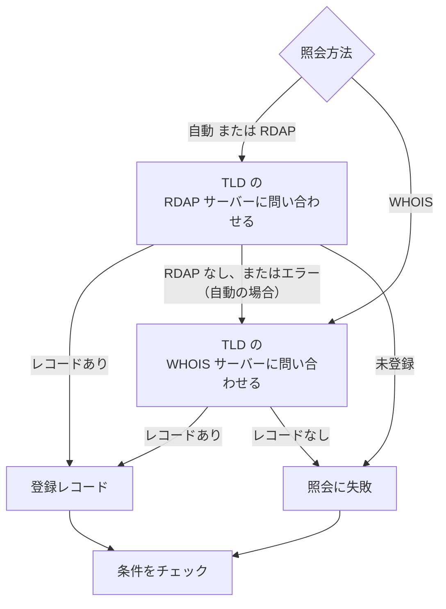

# ドメイン モニター

ドメインモニターは、スケジュールに沿ってドメインの登録レコードを読み取り、有効期限、レジストラ、ネームサーバー、ステータスコードを追跡して、期限が切れる前に警告します。ウェブサイト、API、メールが依存するすべてのドメインに使います。登録の期限が切れると、それらがすべて一度に止まります。

:::cards
- [モニターを作成する](#ドメインモニターを作成する): ダッシュボードで 6 ステップ。
- [照会方法](#照会方法): RDAP、WHOIS、そして **自動** がデフォルトである理由。
- [デフォルト条件](#デフォルト条件): 設定なしで、30 日前に期限切れを警告。
- [トラブルシューティング](#トラブルシューティング): 廃止された WHOIS サーバー、プロキシ、欠けた日付。
:::

## しくみ

チェックのたびに、プローブは **照会方法** に応じて RDAP または WHOIS でドメインの登録レコードを照会し、見つかった内容を正規化します。有効期限、レジストラ、ネームサーバー、ステータスコードです。失敗した照会は、設定した再試行回数まで再試行されます。その後、OneUptime がレコードをモニターの条件に通します。

照会で登録データを得られない場合（TLD のサービスが廃止されている、またはドメインが登録されていないため）、モニターは空の有効期限のまま正常と報告されるのではなく、モニターのプローブ応答に理由が表示された状態で **オフライン** と報告されます。「このドメインは空いています」と答えるレジストリ（たとえば DENIC の `Status: free`）は、正常なレコードではなく **未登録** として扱われます。

国際化ドメイン名はどちらの形式でも受け付けます。`münchen.de` は照会の前に A ラベル（`xn--mnchen-3ya.de`）に変換されます。

## 始める前に

- **モニターを作成できるロール**: Project Owner、Project Admin、Project Member、Monitor Admin、Monitor Member のいずれか、または Create Monitor 権限を持つカスタムロール。
- **プローブからレジストリへの送信アクセス。** 新しいモニターには、プロジェクトのデフォルトのプローブが選ばれます。[カスタムプローブ](/docs/probe/custom-probe) は次に到達できる必要があります。

| 宛先 | プロトコル | 用途 |
| --- | --- | --- |
| `https://data.iana.org/rdap/dns.json` | HTTPS、ポート 443 | 各 TLD の RDAP サーバーの場所を示す IANA の RDAP ブートストラップレジストリ。一度取得され、24 時間キャッシュされます。 |
| レジストリの RDAP サーバー | HTTPS、ポート 443 | RDAP の照会。 |
| WHOIS サーバー | TCP ポート 43 | WHOIS の照会。 |

RDAP のリクエストは、プローブの `HTTP_PROXY_URL` / `HTTPS_PROXY_URL` / `NO_PROXY` の設定に従います。WHOIS は生のソケットで動き、これらには従いません。プローブが `data.iana.org` に到達できない場合、**自動** は WHOIS にフォールバックし、5 分後に再び IANA を試します。

## ドメインモニターを作成する

:::steps
### 新しいモニターを始める

**モニター** に移動し、**モニターを作成** をクリックします。**モニターの種類** で **その他のモニターの種類** をクリックし、**Basic Monitoring** の下の **ドメイン** を選びます。

### 名前を付ける

`example.com registration` のような **名前** を入力し、**次へ** をクリックします。

### ドメインを入力する

**ドメイン名**（たとえば `example.com`）を入力します。特に理由がなければ、**照会方法** は **自動** のままにします（[照会方法](#照会方法) を参照）。

### テストする

**モニターをテスト** をクリックし、**プローブを選択** でプローブを選んで **テストを実行** をクリックします。**モニターテスト結果** に、プローブが読み取った登録レコードと、RDAP と WHOIS のどちらが応答したかが表示されます。

### 条件を確認する

**モニター条件** は [デフォルト条件](#デフォルト条件) から始まります。登録の期限が切れているか読み取れなければオフライン、30 日以内に期限が切れるならアラートです。必要なら変更して、**次へ** をクリックします。

### プローブを選んで作成する

**プローブ** と **監視間隔**（**5 分ごと** から始まります）をそのまま使うか変更し、**モニターを作成** をクリックします。モニターのページが開きます。
:::

## 設定オプション

| 項目 | デフォルト | 入力する内容 |
| --- | --- | --- |
| **ドメイン名** | なし | 登録されたドメイン。`example.com` など。貼り付けたアドレスも使えます。`https://example.com/pricing` は `example.com` として読み取られます。 |
| **照会方法** | **自動** | **自動**、**RDAP**、**WHOIS** のいずれか。[照会方法](#照会方法) を参照してください。 |
| **タイムアウト（ms）**（**その他の項目** の下） | `10000` | 各登録照会を待つ時間（ミリ秒）。 |
| **再試行**（**その他の項目** の下） | `3` | 最初の試行が失敗した後の再試行回数。`0` は 1 回だけ試行することを意味します。 |

失敗した照会はすべて、試行の間に 1 秒の間隔を置いて再試行されます。レジストリがドメインは登録されていない、または登録サービスがないと答えた場合も、その答えが一時的な障害だった場合に備えて再試行されます。形式が誤ったドメイン名だけは、照会せずにすぐ報告されます。

タイムアウトはチェック全体ではなく、各リクエストに適用されます。RDAP を試してから WHOIS にフォールバックする **自動** のチェックは、2 倍以上の時間がかかることがあります。

### 照会方法

登録データは 2 つのプロトコルで読み取ることができ、どちらが機能するかは TLD によって異なります。

| 方法 | 動作 |
| --- | --- |
| **自動** | デフォルト。TLD が RDAP サービスを公開していれば RDAP を使い、公開していないか、RDAP の照会に失敗したときは WHOIS にフォールバックします。 |
| **RDAP** | RDAP のみ。TLD が RDAP サービスを公開していない場合は、わかりやすいエラーで失敗します。 |
| **WHOIS** | WHOIS のみ。 |

**RDAP**（[RFC 9083](https://www.rfc-editor.org/rfc/rfc9083)）は、ICANN が義務付けた WHOIS の後継です。各 TLD の権威サーバーは [IANA のブートストラップレジストリ](https://www.rfc-editor.org/rfc/rfc9224) から見つけるため、レジストリが移転しても正しいままです。すべての gTLD が RDAP サーバーを公開しています。TLD の RDAP サーバーがドメインは登録されていないと答えた場合、**自動** はそれを答えとして受け取り、WHOIS には問い合わせません。

**WHOIS** には同等の検出の仕組みがありません。クライアントは TLD から WHOIS ホストへの固定の対応表を同梱しており、その対応表は古くなります。Identity Digital のすべての TLD（`.digital`、`.email`、`.life`、`.today`、`.zone` ほか約 290 個）は、今も廃止されたホストに対応付けられたままで、そのホストはどの問い合わせにもレコードの代わりに `TLD is not supported.` という文字列そのものを返します。RDAP サービスをまったく公開していない多くの ccTLD（`.io`、`.co`、`.de`、`.ch`、`.jp` など）では、WHOIS が唯一の選択肢です。

## 監視条件

条件は、ドメインを正常と異常のどちらとみなすか、そしてそれによってインシデントを宣言するかアラートを作成するかを決めます。各条件は 1 つ以上のフィルターをチェックします。

| フィルター | 条件 | チェック内容 |
| --- | --- | --- |
| **Is Online** | **真**、**偽** | 登録照会そのものが成功したかどうか。 |
| **Is Request Timeout** | **真**、**偽** | すべての試行で照会がタイムアウトしたかどうか。 |
| **Domain Expires In Days** | **Greater Than**、**Less Than**、**Greater Than Or Equal To**、**Less Than Or Equal To** | 登録の期限が切れるまでの日数（切り上げて丸 1 日単位）。 |
| **Domain Is Expired** | **真**、**偽** | 有効期限が過ぎたかどうか。 |
| **Domain Registrar** | **含む**、**Not Contains**、**Starts With**、**Ends With**、**Equal To**、**Not Equal To** | レジストラの名前。 |
| **Domain Name Server** | **含む**、**Not Contains**、**Starts With**、**Ends With**、**Equal To**、**Not Equal To** | ドメインのネームサーバー。いずれか 1 つが一致すれば一致します。 |
| **Domain Status Code** | **含む**、**Not Contains**、**Starts With**、**Ends With**、**Equal To**、**Not Equal To** | ドメインの EPP ステータスコード。いずれか 1 つが一致すれば一致します。 |

ステータスコードは、どちらのプロトコルが応答したかにかかわらず EPP 名（`clientTransferProhibited`）に正規化されるので、**自動** が RDAP と WHOIS を切り替えても条件は一致し続けます。レジストラの _名前_ は応答したサービスが公開するものそのままで、2 つのプロトコルの間でわずかに異なることがあるため、**Domain Registrar** の条件には **Equal To** よりも **含む** を使うことをおすすめします。

日付は ISO 8601 に正規化されます。レジストリが解析できない形式で公開した日付は保存されずに省かれるため、期限の条件は判定できずに一致しません。黙って「期限切れではない」と答え続けることはありません。

フィルターが 2 つ以上ある場合、**一致条件** で **すべて** が一致する必要があるか、**いずれか** 1 つでよいかを決めます。条件の **アクション** は、その条件が何をするかを決めます。モニターのステータスを変える、アラートを作成する、インシデントを宣言する、またはそのいくつかです。

### デフォルト条件

新しいドメインモニターは 3 つの条件から始まるので、何も設定しなくても登録の期限が切れる前に警告します。

1. **ドメインのチェックに失敗** — 登録の期限が切れているか、登録データを読み取れなかった場合。モニターは **オフライン** になり、「_monitor name_ domain check failed」というインシデントが作成されます。インシデントは登録が読み取れて有効な状態に戻ると自動で解決します。
2. **ドメインの期限が近い** — 登録の期限は切れていないが、30 日以内に切れる場合。「_monitor name_ domain expires soon」という **アラート** が作成されます。
3. **ドメインの期限は切れていない** — モニターは **稼働中** になります。

「期限が近い」の警告はインシデントではなくアラートです。ステータスページには表示されず、オンコールポリシーを追加しない限り誰も呼び出さず、モニターのステータスも変えません。プロジェクトの 2 番目のアラート重大度を使い、新しいプロジェクトでは **低** です。更新が登録レコードに反映されると、アラートは自動で解決します。有効期限を公開しないレジストリでは警告の手がかりがないため、警告は出ません。

条件は上から順にチェックされ、最初に一致したものが何が起きるかを決めます。そのため「期限が近い」は「期限は切れていない」より上にあります。期限が近いドメインはまだ期限が切れていないので、両方に一致してしまうからです。

もっと早く警告を受けるには、「期限が近い」の条件にある **Domain Expires In Days** フィルターの値を、たとえば `60` に変更します。代わりに誰かを呼び出すには、その条件の **アクション** を開き、**フィルターが一致したとき、インシデントを宣言します。** をオンにするか、アラートのまま **オンコールポリシー** でオンコールポリシーを追加します。

:::details 警告ができる前に作成されたモニターに警告を追加する
OneUptime がこの警告を追加する前に作成されたモニターには、「期限が近い」の条件がありません。追加するには:

1. モニターで **構成 → 条件** を開き、**監視条件を編集** をクリックします。
2. **条件を追加** をクリックします。フィルターを **Domain Is Expired** / **偽** に設定し、**フィルターを追加** をクリックして、2 つ目を **Domain Expires In Days** / **Less Than Or Equal To** / `30` に設定します。**一致条件** は **すべて** のままにします（フィルターが 2 つになるとフィルターの下に表示されます）。
3. **アクション** で **フィルターが一致したとき、アラートを作成します。** をオンにし、**フィルターが一致したとき、モニターのステータスを変更します。** はオフのままにして、アラートを作成してもモニターのステータスは変えないようにします。
4. 新しい条件を、モニターをオンラインとする条件より上にドラッグして、保存します。
:::

### 条件の例

| 目的 | フィルター | 条件 | 値 |
| --- | --- | --- | --- |
| ドメインの期限が 30 日以内に切れるときにアラートを出す（デフォルト） | **Domain Expires In Days** | **Less Than Or Equal To** | `30` |
| ドメインの期限が切れたらオフラインにする | **Domain Is Expired** | **真** | — |
| 登録を読み取れないときにオフラインにする | **Is Online** | **偽** | — |
| ネームサーバーが変わったらアラートを出す | **Domain Name Server** | **Not Contains** | `ns1.example.com` |
| ドメインの移管ロックが解除されたらアラートを出す | **Domain Status Code** | **Not Contains** | `clientTransferProhibited` |

**Domain Name Server** と **Domain Status Code** は _いずれか_ 1 つの値が一致すれば一致するので、**Not Contains** は、ネームサーバーまたはステータスコードのうち 1 つでもテキストを含まなければ一致します。

## ベストプラクティス

1. **更新のための時間を確保する** — デフォルトの警告は期限の 30 日前に届きます。更新に承認や時間のかかる支払いが必要な場合は、60 日に延ばします。
2. **照会の失敗も対象にする** — オフラインの条件に **Is Online** / **偽** フィルターを含めて、読み取れない登録が正常と取り違えられないようにします。新しいモニターではデフォルト条件に含まれていますが、それより前に作成されたモニターには手動で追加する必要があります。ときどきプローブにレート制限をかける WHOIS サーバーをやり過ごすには、そのフィルターの下の **この条件を一定期間にわたって評価する** にチェックを入れ、**All Values** を選びます。そうすると、期間内のすべての照会が失敗したときだけドメインがオフラインになります。
3. **重要なドメインをすべて監視する** — 主要ドメイン、別途登録されたサブドメイン、メールや API に使うドメインも含めます。
4. **レジストラの変更を追跡する** — 不正な移管を検出するために、**Domain Registrar** / **Not Contains** / 自分のレジストラの名前 の条件を追加します。

## トラブルシューティング

:::details WHOIS サーバーが「answered without any registration data」となる
TLD の WHOIS ホストが廃止されている、プローブにレート制限をかけている、または一時的に故障しています。Identity Digital の TLD にいまも対応付けられているホストのような廃止されたホストは、毎回 `TLD is not supported.` と答えます。**照会方法** が **WHOIS** のままで失敗が続く場合は、**自動** に切り替えて、RDAP サービスがある TLD ではプローブがそれを読むようにします。
:::

:::details チェックが「No RDAP service is published」で失敗する
モニターが **RDAP** を使っていて、TLD が RDAP サービスを公開していません。多くの ccTLD がそうです。**照会方法** を、WHOIS にフォールバックする **自動** に切り替えます。
:::

:::details ドメインが未登録と報告される
レジストリがドメインは空いていると答えました。綴りと、サブドメインではなく `example.com` のような登録されたドメインを入力したことを確認します。
:::

:::details プロキシの内側のプローブで照会が失敗する
RDAP はプローブのプロキシ設定を経由しますが、WHOIS は経由しません。WHOIS のために送信 TCP ポート 43 を許可するか、RDAP サービスを公開している TLD には **自動** または **RDAP** を使います。
:::

:::details 有効期限が空で、期限の条件が一度も発火しない
レジストリが有効期限を公開していないか、解析できない形式で公開しています。日付がないと期限の条件は判定できないため、何も起きません。**Is Online** では、引き続きレコードを読み取れるかどうかがわかります。
:::

## 次のステップ

:::cards
- [SSL 証明書モニター](/docs/monitor/ssl-certificate-monitor): ドメインの証明書の期限が切れる前に警告を受けます。
- [DNS モニター](/docs/monitor/dns-monitor): ドメインのレコードが解決されるか、何が書かれているかをチェックします。
- [DNSSEC モニター](/docs/monitor/dnssec-monitor): 署名済みゾーンの信頼の連鎖を検証します。
- [エスカレーションルール](/docs/on-call/escalation-rules): アラートとインシデントで誰を呼び出すかを決めます。
:::
