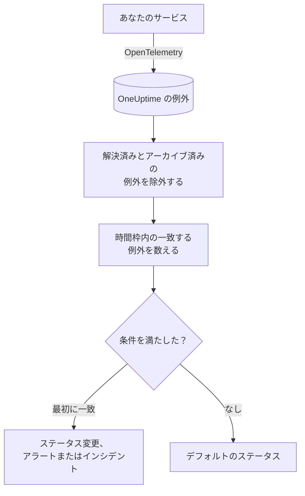

# 例外モニター

例外モニターは、サービスが OneUptime に報告する例外のうち、フィルター（メッセージ、例外タイプ、環境、サービス）に一致するものを時間枠の中で数えます。その数が条件を満たすと、モニターのステータスを変えたり、アラートを作成したり、インシデントを宣言したりします。本番環境での新しいクラッシュ、1 つの例外タイプ、エラーの急増でアラートを出すために使います。

:::cards
- [モニターを作成する](#例外モニターを作成する): 数える例外と、アラートを出すタイミングを選びます。
- [環境](#環境): モニターを `production` に絞ります。
- [評価のしくみ](#評価のしくみ): 何が数えられるか、例外を解決すると何が起こるか。
- [条件](#条件): 条件とデフォルト。
:::

## しくみ



OneUptime は毎分、モニターのフィルターに一致し、時間枠内に発生した例外を数えます。解決済みにした例外やアーカイブした例外は除きます。その数をモニターの条件と上から順に比べ、最初に一致した条件で何が起こるかが決まります。どれにも一致しなければ、モニターはデフォルトのステータスに戻ります。

## 始める前に

- サービスが OpenTelemetry で例外を OneUptime に送っていること。[OpenTelemetry](/docs/telemetry/open-telemetry) を参照してください。
- モニターを環境に絞るには、サービスがリソース属性 `deployment.environment` を設定している必要があります。

## 例外モニターを作成する

:::steps
### 新しいモニターを始める

**モニター** に移動し、**モニターを作成** をクリックします。

### Exceptions を選ぶ

**モニターの種類** で **その他のモニターの種類** をクリックし、**テレメトリ** の下の **例外** を選ぶか、検索ボックスに `exceptions` と入力します。**名前** を入力し、**次へ** をクリックします。

### 数える例外を選ぶ

**例外モニターの設定** で、**例外メッセージでフィルター**、**例外タイプ**、**環境**、**例外の監視期間（時間）** を設定します。空のままのフィルターはすべての例外に一致します。フィルターの下の **例外のプレビュー** に、現在一致する例外が表示されます。

### 絞り込む（任意）

**その他の項目** を開くと、テレメトリサービスやインフラエンティティでフィルターしたり、解決済みやアーカイブ済みの例外も数えたりできます。

### 条件を設定する

**モニター条件** カードは 2 つの条件から始まります。一致する例外があるときはインシデント付きでオフライン、1 件も一致しないときはオンラインです。アラートを受け取りたい内容に合わせて変更します（[条件](#条件) を参照）。

### モニターを作成する

**モニターを作成** をクリックします。モニターは **概要** ページで開き、1 分以内に最初の評価が行われます。
:::

## 何を照会するか

| 項目 | 一致するもの | デフォルト |
| --- | --- | --- |
| **例外メッセージでフィルター** | メッセージにこのテキストを含む例外。大文字と小文字は区別しません。 | 空: すべての例外 |
| **例外タイプ** | これらのタイプのいずれかの例外。`TypeError, NullReferenceException` のようにカンマで区切ります。タイプ名は完全に一致する必要があります。 | 空: すべてのタイプ |
| **環境** | これらの環境のいずれかからの例外。カンマで区切ります（[環境](#環境) を参照）。 | 空: すべての環境 |
| **例外の監視期間（時間）** | 直近 5 秒から直近 24 時間までの例外。 | **過去 1 分** |
| **テレメトリサービスでフィルター**（**その他の項目** 内） | 選んだサービスのいずれかからの例外。 | 空: すべてのサービス |
| **インフラエンティティで絞り込み**（**その他の項目** 内） | 選んだホスト、Pod、コンテナー、その他のエンティティのいずれかからの例外。 | 空: すべてのエンティティ |
| **解決済みの例外を含める**（**その他の項目** 内） | 解決済みとしてマークされた例外も数えます。 | オフ |
| **アーカイブされた例外を含める**（**その他の項目** 内） | アーカイブされた例外も数えます。 | オフ |

例外が数えられるには、設定したすべてのフィルターに一致する必要があります。

### 環境

環境は、各例外の OpenTelemetry リソース属性 `deployment.environment` から取られます。例外エクスプローラーが `env:production` でフィルターするのと同じ値です。環境を 1 つ、またはカンマで区切って複数入力します。例外は、その環境がいずれかと一致すると数えられます。

一致は完全一致で、大文字と小文字を区別します。`production` は `Production` や `prod` には一致しません。このフィルターを設定すると、環境のない例外は数えられません。環境のない例外も含め、すべての環境の例外を数えるには空のままにします。

環境のフィルターは他のすべてのフィルターと組み合わされます。そのため、1 つのテレメトリサービスと `production` に絞ったモニターは、そのサービスの本番の例外だけを数えます。

API でモニターを作成するときは、ステップの `exceptionMonitor` の `environments` に環境名のリストを設定します。

```json
{
  "exceptionMonitor": {
    "telemetryServiceIds": [],
    "environments": ["production"],
    "exceptionTypes": [],
    "message": "",
    "includeResolved": false,
    "includeArchived": false,
    "lastXSecondsOfExceptions": 300
  }
}
```

## 評価のしくみ

- **毎分。** 例外モニターはプローブでチェックされないため、設定する間隔も **プローブと間隔** ページもありません。
- **数えるのは発生回数で、例外タイプではありません。** モニターは、一致する例外が **例外の監視期間（時間）** 内に発生するたびに数えます。40 回スローされた 1 つの例外は 40 と数えます。
- **解決済みとアーカイブ済みの例外は除外されます。** **解決済みの例外を含める** や **アーカイブされた例外を含める** をオンにしない限り、解決済みにした例外やアーカイブした例外の発生は数えられません。そのため、例外を解決済みにすると、その例外が開いたインシデントが閉じることがあります。解決済みの例外が再び発生すると、自動で未解決に戻り、再び数えられます。
- **例外がなければカウントは 0。**
- **OneUptime 自身の停止は沈黙ではありません。** OneUptime 自身がデータを受信していなかった時間（再起動中、アップグレード中、遅れの取り戻し中）が時間枠に含まれている間、チェックは待ちます。ステータスは変わらず、インシデントやアラートが開かれたり解決されたりすることもありません。[OneUptime がデータを受信していないとき](/docs/monitor/when-oneuptime-is-not-receiving) を参照してください。
- **条件は上から順に。** 最初に一致した条件で決まるため、最も重大なものを先頭に置きます。

ステータスの変化はすべて、その理由とともにモニターの **ステータスタイムライン** に記録されます。

## 条件

例外モニターの条件の **フィルタータイプ** は 1 つだけです。時間枠内で一致した例外の数である **Exception Count** です。**フィルター条件** と **値** を選びます。

| フィルター条件 | 例外の数が次のとき一致 |
| --- | --- |
| **Greater Than** | 値より大きい |
| **Greater Than Or Equal To** | 値以上 |
| **Less Than** | 値より小さい |
| **Less Than Or Equal To** | 値以下 |
| **Equal To** | 値とちょうど等しい |
| **Not Equal To** | 値以外 |

例外の数には異常の条件がありません。比べるベースラインがないためです。

新しい例外モニターは次の条件から始まります。

| 条件 | フィルター | 効果 |
| --- | --- | --- |
| Check if … has exceptions | **Exception Count** **Greater Than** `0` | モニターをオフラインにし、インシデントを宣言します（自動で解決） |
| Check if … has no exceptions | **Exception Count** **Equal To** `0` | モニターをオンラインにします |

## 実例: 本番の例外だけ

API が本番で例外をスローするたびにインシデントにしたく、staging では何もしたくないとします。**環境** を `production` に、**例外の監視期間（時間）** を **過去 5 分** にし、デフォルトの条件はそのままにします。直近 5 分間は次のとおりです。

| 例外 | 環境 | 状態 | 数えられる？ |
| --- | --- | --- | --- |
| `TypeError` × 3 | `production` | アクティブ | はい: 3 |
| `TypeError` × 40 | `staging` | アクティブ | いいえ: 別の環境 |
| `TimeoutError` × 2 | なし | アクティブ | いいえ: 環境なし |
| `NullReferenceException` × 4 | `production` | 発生後に解決済み | いいえ: 解決済み |

**Exception Count** は 3 なので **Greater Than** `0` が一致し、モニターはオフラインになってインシデントが宣言されます。アクティブな本番の例外がない 5 分間が過ぎると、オンラインの条件が一致し、インシデントは自動で解決します。

## トラブルシューティング

:::details エクスプローラーには例外が表示されるのに、モニターは 0 と数える
**環境** の値をエクスプローラーの `env:` フィルターと比べてください。一致は完全一致で大文字と小文字を区別し、フィルターを設定すると環境のない例外は除外されます。次に、それらの例外が解決済みやアーカイブ済みになっていないか確認します。モニターの **条件** ページ（**構成** の下）を開き、**監視条件を編集** をクリックすると、**例外のプレビュー** にフィルターが一致しているものが表示されます。
:::

:::details 例外を解決したらインシデントも解決した
想定どおりの動作です。解決済みの例外は数えられないため、カウントが下がって条件が一致しなくなりました。例外が再び発生すると、未解決に戻って再び数えられます。それでも数えるには **解決済みの例外を含める** をオンにします。
:::

:::details 例外タイプのフィルターに何も一致しない
**例外タイプ** は、例外が報告されたときのタイプ名（`TypeError` など）と完全一致で比較されます。例外エクスプローラーからタイプをコピーしてください。
:::

## 次のステップ

:::cards
- [トレース モニター](/docs/monitor/traces-monitor): 失敗したスパンとエンドポイントでアラートを出します。
- [ログ モニター](/docs/monitor/logs-monitor): ログの量と内容でアラートを出します。
- [インシデント & アラート テンプレート](/docs/monitor/incident-alert-templating): 役に立つアラートのタイトルと説明を書きます。
- [OpenTelemetry](/docs/telemetry/open-telemetry): 例外を OneUptime に送ります。
:::
