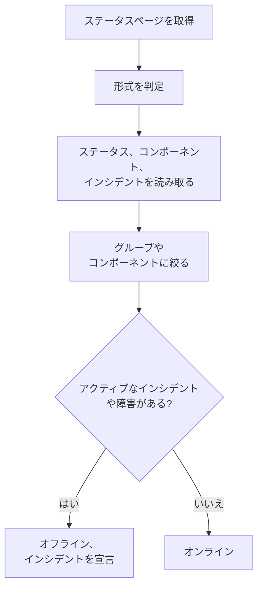

# 外部ステータス ページ モニター

外部ステータス ページ モニターは、あなたが依存しているサービス (AWS、GCP、Azure、GitHub、OpenAI、Anthropic など多数) の公開ステータスページを監視し、そのプロバイダーが障害やパフォーマンスの低下を報告したときにアラートを出します。依存先の問題をプロバイダーが報告した時点ですぐに知り、自分たちの問題と区別するために使います。

:::cards
- [モニターを作成する](#外部ステータス-ページ-モニターを作成する): ステータスページの URL を貼り付け、監視対象を選びます。
- [範囲を絞る](#構成オプション): 1 つのコンポーネントグループや 1 つのコンポーネントを監視します。
- [条件](#監視条件): デフォルトで何をダウンと見なすか。
- [よく使われるステータスページ](#よく使われるステータスページの-url): 多くのチームが依存しているサービスの URL です。
:::

## 仕組み

チェックのたびに、プローブはステータスページを取得し、その形式を判定して、全体のステータス、コンポーネント、アクティブなインシデントを読み取ります。モニターをコンポーネントグループやコンポーネントに絞っている場合は、それらだけが対象になります。そのうえで、条件がモニターをオンラインかオフラインかに決めます。

次の用途に使えます。

- アプリケーションが依存するサードパーティのサービスの可用性の監視
- 依存先のプロバイダーで障害が起きたときのアラート
- 個々のコンポーネントのステータスの追跡
- 1 つのコンポーネントグループ (たとえば OpenAI の "APIs" だけ) への監視の絞り込み。ページのほかの場所にある無関係なインシデントでモニターが発火しなくなります
- ユーザーに影響が出る前のパフォーマンス低下の検出
- 自分たちのインシデントと依存先のプロバイダーの問題の関連付け

## サポートされているプロバイダー

| プロバイダー | 説明 |
| ------------------------ | ---------------------------------------------------------------------- |
| **自動** (デフォルト) | ステータスページの形式を自動で判定します |
| **Atlassian Statuspage** | Atlassian Statuspage で動いているステータスページ (JSON API) |
| **incident.io** | incident.io で動いているステータスページ (例: `https://status.openai.com`) |
| **RSS** | RSS フィードを提供しているステータスページ |
| **Atom** | Atom フィードを提供しているステータスページ |

### 自動判定

**自動** に設定すると、OneUptime は次の順序でステータスページの形式を自動で判定します。

1. まず incident.io のステータスページ API (`/proxy/<host>`) を試します。
2. 次に Atlassian Statuspage の JSON API (`/api/v2/status.json`、`/api/v2/components.json`、`/api/v2/incidents/unresolved.json`) を試します。
3. それらが失敗した場合は、ページを RSS または Atom のフィードとして解析しようとします。
4. 最後の手段として、HTTP で到達できるかどうかの基本的なチェックを行います。

> [!NOTE]
> incident.io を最初にチェックするのは、一部の incident.io のステータスページ (`https://status.openai.com` など) が、コンポーネントグループとアクティブなインシデントを省いた限定的な Atlassian 互換のエンドポイントも公開しているためです。incident.io を先にチェックすることで、グループを含むより豊富なデータが使われます。

到達可能性のチェックは、明示的に選んだプロバイダーが失敗したときのフォールバックでもあります。これはページが応答するかどうか (`2xx` または `3xx` の応答ならオンライン) だけを伝え、コンポーネントやインシデントは報告しません。

## 外部ステータス ページ モニターを作成する

:::steps
### 新しいモニターを始める

**モニター** に移動し、**モニターを作成** をクリックします。**モニターの種類** で **その他のモニターの種類** をクリックし、**Basic Monitoring** の下の **外部ステータスページ** を選ぶか、検索ボックスに `statuspage` と入力します。**名前** を入力し、**次へ** をクリックします。

### ステータスページの URL を入力する

**ステータスページ URL** を入力します。形式がわかっている場合を除き、**プロバイダー** は **自動** のままにします。

### 必要なら範囲を絞る

**その他の項目** を開いて **コンポーネントグループのフィルター（任意）** (たとえば `APIs`) を入力し、1 つのコンポーネントだけを監視するには **コンポーネント名フィルター（任意）** を入力します (グループを設定している場合はそのグループ内で絞り込みます)。

### テストする

**モニターをテスト** をクリックしてページを 1 回取得し、見つかったプロバイダー、コンポーネント、インシデントを確認します。

### 条件を確認する

条件のステップは [デフォルトの条件](#デフォルトの条件) から始まります。これは、プロバイダーが範囲内のアクティブなインシデントや障害を報告したときにモニターをオフラインにします。必要なら変更し、**次へ** をクリックします。

### プローブを選んで作成する

**プローブ** と **監視間隔** (最初は **5 分ごと**) を選び、**モニターを作成** をクリックします。
:::

## 構成オプション

| オプション | 入力する内容 | デフォルト |
| --- | --- | --- |
| **ステータスページ URL** | ステータスページの URL。Atlassian Statuspage や incident.io で動いているサイトでは、通常はルートの URL です (例: `https://status.example.com`)。RSS/Atom フィードの場合は、フィードの URL を直接入力します。 | — |
| **プロバイダー** | 形式を判定させるなら **自動**、わかっているなら **Atlassian Statuspage**、**incident.io**、**RSS**、**Atom** のいずれか。 | **自動** |
| **コンポーネントグループのフィルター（任意）** | モニターの対象を絞るグループ。**その他の項目** にあります。 | すべてのグループ |
| **コンポーネント名フィルター（任意）** | 監視するコンポーネント。**その他の項目** にあります。 | 範囲内のすべてのコンポーネント |
| **タイムアウト（ms）** | ステータスページを待つ最大時間。**その他の項目** にあります。 | `10000` (10 秒) |
| **再試行** | 最初の試行が失敗した後、1 秒間隔で何回再試行するか。`0` は 1 回だけ試行することを意味します。**その他の項目** にあります。 | `3` (最大 4 回の試行) |

### コンポーネントグループのフィルター

ステータスページがコンポーネントをグループに分けている場合は、モニターを 1 つのグループに絞れます。たとえば `https://status.openai.com` で `APIs` と入力すると、モニターは OpenAI の API サービスに絞られます。

コンポーネントグループを設定すると、**アクティブなインシデントの数** と **全体のステータス** は、そのグループのコンポーネントだけを使って計算されます。無関係なグループ (たとえば ChatGPT) に影響するインシデントでは、"APIs" グループに絞ったモニターは発火しません。

コンポーネントグループによる絞り込みは、**Atlassian Statuspage** と **incident.io** のプロバイダーでサポートされています。RSS と Atom のフィードはコンポーネントグループを公開していません。

### コンポーネント名フィルター

ステータスページが複数のコンポーネントを報告している場合は、コンポーネント名を指定してそのコンポーネントだけを監視できます。フィルターは、入力した文字列を名前に含むコンポーネントに、大文字と小文字を区別せずに一致します。`actions` は "Actions" という名前のコンポーネントに一致します。

コンポーネントグループも設定している場合、コンポーネント名フィルターはそのグループ **内** で適用されるので、大きなグループの中の 1 つのコンポーネントだけを対象にできます。どちらのフィルターも指定しない場合は、範囲内のすべてのコンポーネントを監視します。RSS や Atom のフィードでは、名前のフィルターはフィードの項目のタイトルと照合されます。

> [!WARNING]
> 何にも一致しないフィルターは正常に見えます。範囲内にコンポーネントがなければ、障害を報告するものがないからです。綴りをステータスページと照らし合わせ、**モニターをテスト** でフィルターが何を残すかを確認してください。

## 監視条件

外部サービスをオンラインとオフラインのどちらと見なすかを決める条件を、次に基づいて設定できます。

| フィルタータイプ | チェック内容 | フィルター条件 |
| --- | --- | --- |
| **External Status Page Is Online** | ステータスページに到達でき、ステータスのデータを返しているかどうか | 真 または 偽 |
| **External Status Page Overall Status** | ページが報告する全体のステータス | Equal To、Not Equal To、含む、Not Contains、Starts With、Ends With |
| **External Status Page Component Status** | 範囲内のコンポーネントのステータス (コンポーネントグループ / コンポーネント名のフィルターを反映): 稼働中、メンテナンス中、パフォーマンス低下、部分的な障害、大規模な障害、全面的な障害 | Equal To、Not Equal To、含む、Not Contains、Starts With、Ends With |
| **External Status Page Active Incidents** | ステータスページで現在アクティブなインシデントの数 (フィルターを設定している場合はコンポーネントグループ / コンポーネントに絞られます) | Equal To、Not Equal To、および数値の比較 |
| **External Status Page Response Time (in ms)** | ステータスページのデータの取得にかかる時間 | Greater Than、Less Than、Greater Than Or Equal To、Less Than Or Equal To |

全体のステータスはページに書かれているそのままなので、値はプロバイダーによって異なります。Atlassian Statuspage は `All Systems Operational` のような独自の説明を、フィードは `operational` や `degraded_performance` を、到達可能性のチェックは `reachable` や `unreachable` を報告します。これらの比較は大文字と小文字を区別します。障害でアラートを出すには、通常は **External Status Page Active Incidents** と **External Status Page Component Status** のほうが信頼できます。

RSS や Atom のフィードでは、直近 24 時間の項目がアクティブなインシデントとして数えられます。RSS の項目は公開日で、Atom のエントリーは更新日で判断します。

### デフォルトの条件

デフォルトでは、OneUptime はステータスページにとって本当に重要なもの、つまり単に到達できるかどうかではなく、アクティブなインシデントとコンポーネントの状態に基づいて条件を作成します。

| 条件 | フィルター | 効果 |
| --- | --- | --- |
| Offline | 次の **いずれか**: ページがオンラインでない、範囲内に 1 つ以上のアクティブなインシデントがある、範囲内のコンポーネントがパフォーマンス低下、部分的な障害、大規模な障害、全面的な障害のいずれかを報告している | モニターをオフラインにし、インシデントを宣言します。条件が一致しなくなるとインシデントは自動で解決します |
| Online | 次の **すべて**: ページがオンラインである、範囲内にアクティブなインシデントがない | モニターをオンラインにします |

アクティブなインシデントの数とコンポーネントのステータスはコンポーネントグループ / コンポーネント名のフィルターを反映するので、これらのデフォルトの条件は自動的に、関心のあるコンポーネントだけを対象にします。

## テンプレート変数

外部ステータス ページ モニターからインシデントやアラートを作成するときは、タイトル、説明、対処メモで次の変数を使えます ([インシデント & アラート テンプレート](/docs/monitor/incident-alert-templating) を参照)。

| 変数 | 説明 |
| ------------------------- | ------------------------------------------------------------------------------- |
| `{{isOnline}}`            | ステータスページがオンラインかどうか (true/false) |
| `{{responseTimeInMs}}`    | 応答時間 (ミリ秒) |
| `{{failureCause}}`        | 失敗の理由 (ある場合) |
| `{{overallStatus}}`       | 全体のステータスを示す値 |
| `{{activeIncidentCount}}` | アクティブなインシデントの数 (フィルターがある場合はその範囲内) |
| `{{componentStatuses}}`   | コンポーネントのステータスの JSON 配列 (`name`、`status`、`description`、`groupName`) |
| `{{provider}}`            | 判定されたプロバイダー (Atlassian Statuspage、incident.io、RSS、Atom)。到達可能性のチェックの後は空です |
| `{{componentGroup}}`      | モニターが絞られているコンポーネントグループ (ある場合) |
| `{{componentName}}`       | モニターが絞られているコンポーネント (ある場合) |

## よく使われるステータスページの URL

よく使われるサービスのステータスページの一覧です。その多くは Atlassian Statuspage か incident.io を使っているので、**自動** のプロバイダーが自動で判定します。どちらでも作られておらず、フィードでもないページは到達可能性のチェックしか受けられません。そうしたページでは、プロバイダーが RSS や Atom のフィードを公開していれば、代わりにそれを監視してください。

| サービス | ステータスページの URL |
| ---------------------------- | --------------------------------------------- |
| AWS                          | `https://health.aws.amazon.com/health/status` |
| Google Cloud Platform        | `https://status.cloud.google.com`             |
| Microsoft Azure              | `https://status.azure.com`                    |
| GitHub                       | `https://www.githubstatus.com`                |
| OpenAI                       | `https://status.openai.com`                   |
| Anthropic                    | `https://status.anthropic.com`                |
| Cloudflare                   | `https://www.cloudflarestatus.com`            |
| Datadog                      | `https://status.datadoghq.com`                |
| PagerDuty                    | `https://status.pagerduty.com`                |
| Twilio                       | `https://status.twilio.com`                   |
| Stripe                       | `https://status.stripe.com`                   |
| Slack                        | `https://status.slack.com`                    |
| Atlassian (Jira, Confluence) | `https://status.atlassian.com`                |
| Vercel                       | `https://www.vercel-status.com`               |
| Netlify                      | `https://www.netlifystatus.com`               |
| DigitalOcean                 | `https://status.digitalocean.com`             |
| Heroku                       | `https://status.heroku.com`                   |
| MongoDB Atlas                | `https://status.cloud.mongodb.com`            |
| Fastly                       | `https://status.fastly.com`                   |
| New Relic                    | `https://status.newrelic.com`                 |
| Sentry                       | `https://status.sentry.io`                    |
| CircleCI                     | `https://status.circleci.com`                 |

## ベストプラクティス

- **自動プロバイダーを使う** — 正確な形式がわかっている場合を除き、自動判定はほとんどのステータスページでうまく機能します。
- **コンポーネントグループに絞る** — プロバイダーの一部だけに依存している場合 (たとえば OpenAI の "APIs" だけ)、無関係なインシデントによるノイズを防げます。
- **特定のコンポーネントを監視する** — 特定のサービスだけに依存している場合に有効です。
- **自分のモニターと組み合わせる** — 外部ステータス ページ モニターを、自分たちの API モニターや Web サイトのモニターと組み合わせます。両方が同時にダウンしたとき、依存先のステータスページが根本原因をより早く示してくれます。

## トラブルシューティング

:::details モニターはオフラインだが、インシデントは使っていない部分に関するものだ
**コンポーネントグループのフィルター**、**コンポーネント名フィルター**、またはその両方でモニターの範囲を絞ってください。そうすれば、アクティブなインシデントの数とコンポーネントのステータスは範囲内のものだけを数えます。
:::

:::details 障害が起きてもモニターがオフラインにならない
フィルターが何にも一致していない (正常に見える) か、ページが到達可能性のチェックしか受けていない可能性があります。**モニターをテスト** を実行し、見つかったプロバイダーとコンポーネントを確認してください。
:::

:::details 自動が誤った形式を選ぶ、またはコンポーネントが見つからない
ページが使っているとわかっているものを **プロバイダー** に設定してください。RSS や Atom のフィードの場合は、ステータスページではなくフィード自体の URL を入力します。
:::

:::details 社内のステータスページに到達できない
プローブは、許可されていない限りプライベートネットワークのアドレスを拒否します。ネットワーク内のプローブに `PROBE_ALLOW_PRIVATE_NETWORK_MONITORS=true` を設定してください。[プライベートネットワークへのアクセス](/docs/self-hosted/private-network-access) を参照してください。
:::

## 次のステップ

:::cards
- [インシデント & アラート テンプレート](/docs/monitor/incident-alert-templating): プロバイダーのステータスをインシデントのタイトルに入れます。
- [API モニター](/docs/monitor/api-monitor): プロバイダーのステータスと並べて、自分たちのエンドポイントをチェックします。
- [モニターの作成](/docs/monitor/create-monitor): すべてのモニターの種類に共通する手順です。
:::
