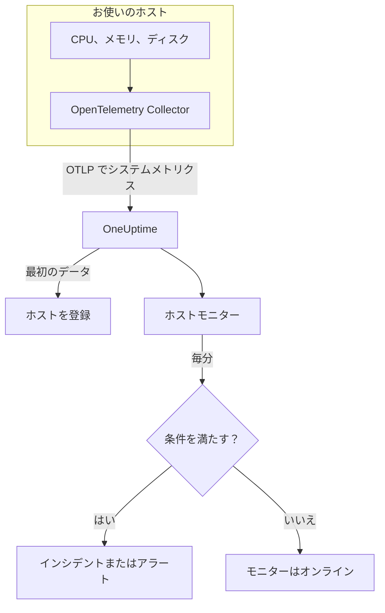

# ホスト モニター

ホストモニターは 1 台のマシン（CPU、メモリ、ディスク、負荷、プロセス）を監視し、飽和したときやいっぱいになりつつあるときに知らせます。OpenTelemetry Collector がホストから送信する OpenTelemetry メトリクス `system.*` を読み取ります。これは **ホスト** 製品が表示するのと同じデータなので、外部からのプローブは行いません。

:::cards
- [モニターを作成する](#ホストモニターを作成する): ダッシュボードでの 6 つのステップ。
- [テンプレート](#既製のアラートテンプレート): CPU、メモリ、ディスク、負荷、プロセス向けの 5 個の既製アラート。
- [メトリクス](#収集されるメトリクス): アラートに使えるホストのメトリクスとその単位。
- [ホストか Server / VM か](#ホストモニターか-server-vm-モニターか): 2 つのマシン用モニターのどちらを使うか。
:::

## 仕組み

ホスト上で、`hostmetrics` レシーバーを使う OpenTelemetry Collector が動作します。30 秒ごとにホストの CPU、メモリ、ディスク、ネットワーク、負荷、プロセスの数値を読み取り、OTLP で OneUptime に送信します。ホストからの最初のデータで、そのホストが **ホスト** に登録されます。

ホストモニターは 1 台のホストに結び付きます。毎分、そのホストのメトリクスに対してクエリを実行し、結果を条件と比較します。

### ホストモニターか Server / VM モニターか

OneUptime にはマシン用のモニターが 2 つあります。同じホストで両方を動かすこともできます。

| | ホストモニター | Server / VM モニター |
| --- | --- | --- |
| **エージェント** | `hostmetrics` レシーバーを使う OpenTelemetry Collector | OneUptime のインフラストラクチャエージェント |
| **データ** | OpenTelemetry メトリクス `system.*` と `process.*`。**ホスト** のページがグラフ表示するものと同じ | エージェントがモニターに送るステータスレポート |
| **条件** | 任意のメトリクスクエリまたは数式に対するしきい値や異常検知 | CPU、メモリ、ディスクの使用率などの組み込みチェック |
| **セットアップ** | コレクターをインストールすると、ホストが自動登録される | モニターを作成し、そのシークレットキーをエージェントに渡す |

ホストがすでに OpenTelemetry のデータを送信している場合や、同じコレクターからログやより豊富なメトリクスが欲しい場合は、ホストモニターを使います。もう一方については [サーバー / VM モニター](/docs/monitor/server-monitor) を参照してください。

## 始める前に

- **ホストで OpenTelemetry Collector を実行します**。`hostmetrics` レシーバーを使います。[ホスト OpenTelemetry Collector](/docs/telemetry/host-otel-collector) で Linux、macOS、Windows を扱っており、**製品 → インフラストラクチャ → ホスト → ドキュメント** に既製の設定があります。
- **使用率のメトリクスを有効にします。** `system.cpu.utilization`、`system.memory.utilization`、`system.filesystem.utilization` はレシーバーでは任意ですが、CPU、メモリ、ファイルシステムのテンプレートに必要です。ダッシュボードの設定では有効になっています。
- **ホストが登録されていることを確認します。** 最初のデータが届くと、`host.name` の名前で **製品 → インフラストラクチャ → ホスト → すべてのホスト** に表示されます。

## ホストモニターを作成する

:::steps
### 新しいモニターを始める

**モニター** に移動し、**モニターを作成** をクリックします。

### ホスト を選ぶ

**モニターの種類** で **その他のモニターの種類** をクリックし、**インフラストラクチャ** の下の **ホスト** を選びます。**名前** を入力し（インシデントとアラートのタイトルに使われます）、**次へ** をクリックします。

### 対象のホストを選ぶ

**ホストモニターの設定** で、**ホスト** からマシンを選びます。データを送信したすべてのホストが一覧に表示されます。

### 監視する対象を選ぶ

3 つのタブのいずれかを選びます。

- **Quick Setup** – [テンプレート](#既製のアラートテンプレート) をクリックします。メトリクス、集計、時間範囲、しきい値が設定され、下の条件がテンプレートのものに置き換わります。**時間範囲** は引き続き変更できます。
- **Custom Metric** – **ホストのメトリクス** からメトリクスを 1 つ選び、**集計** と **時間範囲** を設定します。
- **詳細** – **メトリクスを選択** でクエリと数式を自分で作成します。たとえば `state` でのフィルターや `mountpoint` でのグループ化です。

### 条件を確認する

**モニター条件** の各条件を開き、**メトリクス**、**集計**、**条件**、**しきい値** を確認します。テンプレートを使った場合は入力済みです。**Custom Metric** または **詳細** の場合、モニターは [デフォルトの条件](#デフォルトの条件) から始まり、これはメトリクスがゼロに落ちたことしか検知しないので、独自のしきい値を設定してください。

### モニターを作成する

**モニターを作成** をクリックします。OneUptime がモニターのページを開き、毎分評価します。作成されたインシデントとアラートは、ホストの **インシデント** と **アラート** のページにも表示されます。
:::

> [!TIP]
> 複数のテンプレートを一度に設定するには、**製品 → インフラストラクチャ → ホスト** からホストを開き、**推奨事項** に移動します。使うテンプレートと呼び出す相手を選ぶと、OneUptime がテンプレートごとに 1 つのモニターを作成します。

## モニター設定

| 項目 | タブ | 役割 |
| --- | --- | --- |
| **ホスト** | すべて | 必須。すべてのクエリをホストの `resource.host.name` に限定します。 |
| **ホストのメトリクス** | Custom Metric | [カタログ](#収集されるメトリクス) にあるメトリクス 1 つ。CPU、メモリ、ディスク、ネットワーク、負荷、プロセスに分類されています。 |
| **集計** | Custom Metric | サンプルの組み合わせ方：**平均**、**最大**、**最小**、**合計**、**カウント**。初期値はメトリクスの通常の集計です。 |
| **時間範囲** | すべて | クエリが読み取る移動ウィンドウで、**Past 1 Minute** から **Past 365 Days** まで。新しいモニターは **Past 1 Minute** から始まり、テンプレートは独自の値を設定します。 |
| **メトリクスを選択** | 詳細 | クエリビルダー：**メトリクス**、**集計の基準**、**属性で絞り込み**、**グループ化**、さらにクエリを組み合わせる **メトリクスを追加** と **数式を追加**。 |

## 既製のアラートテンプレート

**Quick Setup** には 5 つのテンプレートがあります。それぞれが完全なモニターを作ります。クエリ、発火する条件、回復する条件です。しきい値は出発点なので編集できます。

条件はそのウィンドウのすべての分で成り立つ場合にのみ発火し、しきい値から 10% 離れたところで回復するため、境界付近を行き来する値でばたつくことはありません。

| テンプレート | 重大度 | 監視対象 | 発火する条件 | 回復する条件 |
| --- | --- | --- | --- | --- |
| High CPU Utilization | 警告 | `user` と `system` の状態の `system.cpu.utilization` を合計してパーセントで表示、過去 5 分 | 80% を超える | 72% 以下 |
| High Memory Utilization | 警告 | `used` の状態の `system.memory.utilization` をパーセントで、過去 5 分 | 85% を超える | 76.5% 以下 |
| High Filesystem Usage | 重大 | `system.filesystem.utilization`、`mountpoint` と `device` ごとの Max をパーセントで、過去 5 分 | 90% を超える | 81% 以下 |
| High Load Average (1m) | 警告 | `system.cpu.load_average.1m`、Avg、過去 5 分 | 4 を超える | 3.6 以下 |
| High Process Count | 警告 | `system.processes.count`、Max、過去 5 分 | 2000 を超える | 1800 以下 |

**重大度** は選択リストに表示されるラベルです。テンプレートが作成するインシデントとアラートは、プロジェクトで最も重大なインシデントとアラートの重大度から始まります。条件で変更してください。

- **CPU** はビジー時間（`user` と `system` の合計）で、ホストの **概要** がグラフ表示するのと同じ数値です。iowait と steal は含みません。
- **メモリ** はバッファーとページキャッシュを除くため、大部分がキャッシュのホストで発火することはありません。
- **ファイルシステム** はマウントごとに 1 件のインシデントを作ります。snap の `squashfs` マウントや macOS の `devfs` のような読み取り専用の疑似ファイルシステムは常に 100% 使用中なので、コレクターの `filesystem` スクレイパーで除外してください。
- **ロードアベレージ** はコア数で割っていない実行キューの長さそのものです。4 は 2 コアのホストでは飽和、32 コアのホストではごく普通なので、大きなホストでは引き上げてください。
- **プロセス数** はホストの合計ではなく、最も多い単一のプロセス状態（`running`、`sleeping`、…）を比較するため、プロセス一覧とは一致しません。プロセスのスクレイパーは Linux でのみ報告します。

## 収集されるメトリクス

**ホストのメトリクス** の一覧には次のメトリクスがあります。それぞれが `resource.host.name` を持ち、モニターはこれでクエリを 1 台のホストに限定します。

> [!IMPORTANT]
> 使用率のメトリクスはパーセントではなく 0 から 1 の比率です。生のメトリクスに対するしきい値で 80% を表すには `0.8` を使います。テンプレートは数式でパーセントに変換するため、しきい値は 80、85、90 になっています。

### CPU

| メトリクス | 単位 | 説明 |
| --- | --- | --- |
| `system.cpu.utilization` | 比率 | 各 `state`（`user`、`system`、`idle`、…）に費やされた CPU 時間の割合。`state` でフィルターしてください。すべての状態の平均は、有用なしきい値に決して届きません。 |
| `process.cpu.utilization` | 比率 | ホスト上の各プロセスの CPU 使用率。 |

### メモリ

| メトリクス | 単位 | 説明 |
| --- | --- | --- |
| `system.memory.utilization` | 比率 | 各 `state`（`used`、`free`、`cached`、…）の物理メモリの割合。使用中のメモリには `state = used` でフィルターします。 |
| `system.memory.usage` | バイト | メモリ使用量（バイト）。 |

### ディスク

| メトリクス | 単位 | 説明 |
| --- | --- | --- |
| `system.filesystem.utilization` | 比率 | 各ファイルシステムの使用中の容量の割合。`mountpoint` と `device` ごと。 |
| `system.filesystem.usage` | バイト | ファイルシステムの使用量（バイト）。 |

### ネットワーク

| メトリクス | 単位 | 説明 |
| --- | --- | --- |
| `system.network.io` | バイト | 送受信したバイト数。生涯カウンター。 |

### 負荷

| メトリクス | 単位 | 説明 |
| --- | --- | --- |
| `system.cpu.load_average.1m` | 個数 | 直近 1 分のロードアベレージ。 |
| `system.cpu.load_average.5m` | 個数 | 直近 5 分のロードアベレージ。 |
| `system.cpu.load_average.15m` | 個数 | 直近 15 分のロードアベレージ。 |

### プロセス

| メトリクス | 単位 | 説明 |
| --- | --- | --- |
| `system.processes.count` | 個数 | ホスト上のプロセス。プロセスの `status` ごとに 1 つの系列。 |

**詳細** のクエリビルダーには、これらだけでなく、ホストが送信するすべてのメトリクスが表示されます。

## 監視条件

条件は、モニターのクエリまたは数式の 1 つをしきい値と比較します。ホストモニターの条件には **フィルタータイプ** がなく、すべてのルールが次の項目でメトリクスの値をチェックします。

| 項目 | 役割 |
| --- | --- |
| **メトリクス** | チェックするクエリまたは数式（変数名で指定）。 |
| **集計** | ウィンドウ内の値を 1 つの答えにする方法：**平均**、**合計**、**Maximum Value**、**Minimum Value**、**All Values**（すべての値が一致する必要がある）、**Any Value**（1 つで十分）。 |
| **条件** | **Greater Than**、**Less Than**、**Greater Than Or Equal To**、**Less Than Or Equal To**、**Equal To**、または異常条件の **Anomalously High**、**Anomalously Low**、**Anomalous**。 |
| **しきい値** | 比較する値。メトリクスに単位がある場合は、横に単位の一覧が表示されます。異常条件では表示されません。 |
| **感度** | 異常条件のみ。**低**（4σ）、**中**（3σ、既定）、**高**（2σ）。 |
| **ベースラインウィンドウ** | 異常条件のみ。履歴 14 日（既定）、28 日、60 日、90 日。 |
| **データがない場合** | **その他の項目** の中にあります。ウィンドウにサンプルがないときの動作：**Ignore**（既定）、**Treat As Zero**、**トリガー**。 |

異常条件は、各値をベースラインの週の同じ時間帯と比較します。ベースラインウィンドウに十分な履歴がたまるまでは「Learning」状態のままで、何も作成しません。

各条件には、一致したときの動作も指定します。モニターのステータスの変更、アラートの作成、インシデントの宣言です。条件は上から順にチェックされ、最初に一致したものが結果を決めます。

### デフォルトの条件

テンプレートから作らないモニターは、2 つの条件から始まります。

| 順序 | 条件 | 一致するとき | 結果 |
| --- | --- | --- | --- |
| 1 | Check if _monitor name_ is offline | 最初のクエリのいずれかの値が `0` | モニターを **オフライン** にし、インシデント「_monitor name_ is offline」を宣言します。モニターが回復すると自動的に解決します。 |
| 2 | Check if _monitor name_ is online | いずれかの値が `0` を超える | モニターを **稼働中** にします。 |

> [!IMPORTANT]
> 無応答はどちらの条件にも一致しません。データの送信を止めたホストは、モニターを元の状態のままにします。ホストが沈黙したときに知らせを受けるには、条件の **データがない場合** を **トリガー** に設定します。OneUptime 自身がデータを受信していなかった時間は、決してデータなしとは扱われません。そのような時間を含むウィンドウのチェックは代わりに待機します。詳しくは [OneUptime がデータを受信していないとき](/docs/monitor/when-oneuptime-is-not-receiving) を参照してください。

## トラブルシューティング

:::details ホストが ホスト の一覧にない
ホストはコレクターのデータから自動登録されます。それには `host.name` とホストの OS の種類が必要で、どちらもコレクターの `resourcedetection` プロセッサーから得られます。コレクターが実行中で、ホストが **製品 → インフラストラクチャ → ホスト → すべてのホスト** に表示されていることを確認してください。設定は [ホスト OpenTelemetry Collector](/docs/telemetry/host-otel-collector) で説明しています。
:::

:::details CPU やメモリのしきい値が発火しない
使用率のメトリクスは最大 `1.0` の比率なので、手入力したしきい値 `80` を超えることはありません。`0.8` を使うか、パーセントに変換するテンプレートから始めてください。また `state` でもフィルターします（CPU は `user` と `system`、メモリは `used`）。すべての状態の平均は、1 を状態の数で割った値の近くにとどまります。
:::

:::details 別のホストでインシデントが発火する
モニターは、選んだホストと等しい `resource.host.name` ですべてのクエリを限定します。同じ `host.name` を報告するホストは 1 つの系列にまとまってしまうので、ホストごとに一意の名前を付けてください。
:::

:::details 常にいっぱいのマウントで High Filesystem Usage が発火する
`/snap` 配下の snap の `squashfs` ループマウントや macOS の `devfs` のような読み取り専用の疑似ファイルシステムは、仕様上 100% 使用中で、回復することはありません。コレクターの `filesystem` スクレイパーから除外してください。
:::

## 次のステップ

:::cards
- [ホスト OpenTelemetry Collector](/docs/telemetry/host-otel-collector): このモニターが読み取るコレクターをインストールして設定します。
- [サーバー / VM モニター](/docs/monitor/server-monitor): エージェントがデータを送るマシン用のモニター。
- [メトリクス モニター](/docs/monitor/metrics-monitor): ホストやサービスをまたいで、あらゆるメトリクスでアラートを出します。
- [インシデント 概要](/docs/incidents/index): 条件がインシデントを宣言した後に起こること。
:::
