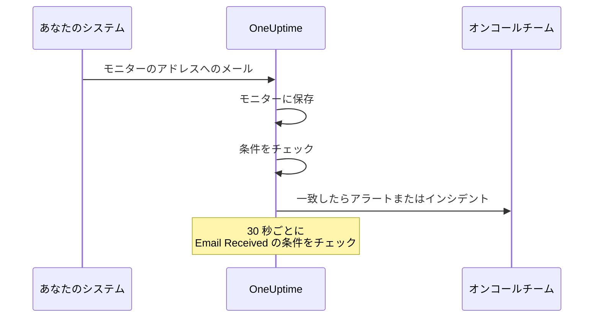

# 受信メール モニター

受信メール モニターは、1 つのモニター専用のメールアドレスを提供します。メールを送れるもの (バックアップジョブ、レガシーシステム、クラウドプロバイダーのアラートなど) はすべて、その結果をこのアドレスに送ります。OneUptime はすべてのメールを条件に照らしてチェックし、モニターをダウンにしたり、インシデントを開いたり、アラートを作成したりし、問題解消の知らせが届けばそれらを解決します。

:::cards
- [モニターを作成する](#受信メール-モニターを作成する): アドレスを取得し、送信元をそこに向けます。
- [アドレスを確認する](#送信元でアドレスを確認する): 送信元からの確認メールをモニター上で読みます。
- [条件を書く](#使用できるフィルタータイプ): 件名、差出人、本文で照合したり、メールが届かなくなったらアラートを出したりします。
- [メールをアラートで使う](#テンプレート変数): 件名と本文をタイトルや説明に入れます。
:::

## 仕組み

メールはプッシュ型です。あなたのシステムが送信し、OneUptime が待ち受けます。各メールは届いた時点でモニターの条件に照らしてチェックされます。届いている *はずの* メールを調べる条件は、さらにスケジュールに従って 30 秒ごとにチェックされます。



1. 受信メール モニターを作成すると、OneUptime はそのモニターに固有のメールアドレスを割り当てます。
2. そのアドレスに送られたメールはすべてモニターに保存され、条件に照らして上から順に評価されます。最初に一致した条件が結果を決めます。
3. 一致した条件は、モニターのステータスを変更し、アラートを作成し、インシデントを宣言できます。**インシデントを自動解決** がオンのインシデントや、**アラートを自動解決** がオンのアラートは、後で別の条件 (たとえばモニターをオンラインにする条件) が一致したときに解決されます。

## 受信メール モニターを作成する

:::steps
### 新しいモニターを始める

**モニター** に移動し、**モニターを作成** をクリックします。

### Incoming Email を選ぶ

**モニターの種類** で **その他のモニターの種類** をクリックし、**Inbound Monitoring** の下の **Incoming Email** を選ぶか、検索ボックスに `email` と入力します。**名前** を入力し、**次へ** をクリックします。

### 条件を確認する

**条件** のステップは [デフォルトの条件](#最初から用意されているもの) から始まります。これは、メールに `error` が含まれているとモニターをオフラインにします。条件をクリックして変更するか、**条件を追加** をクリックして追加します。よくある設定は [構成の例](#構成の例) を参照してください。

### モニターを作成する

**モニターを作成** をクリックします。モニターは **概要** ページで開き、最初のメールが届くまで、**受信メールアドレス** カードにアドレスがコピーボタン付きで表示されます。

### アドレスにメールを送る

システムが通知をこのアドレスに送るように設定します。送信元から先にアドレスの確認を求められた場合は、[送信元でアドレスを確認する](#送信元でアドレスを確認する) を参照してください。
:::

> [!NOTE]
> アドレスにはモニターのシークレットキーが含まれるため、モニターを編集できる人だけがこれを見られます。それ以外の人には、設定の詳細が非表示になっていることが示されます。

## メールアドレスの形式

各受信メール モニターには、次の形式の固有のアドレスが割り当てられます。

```text
monitor-{secret-key}@{inbound-domain}
```

シークレットキーは UUID です。たとえば `monitor-3f2b8c1e-5d4a-4f6b-9a7c-2e1d0b9f8a6c@inbound.yourdomain.com` のようになります。最初のメールが届いた後も、アドレスはモニターの **概要** ページの **受信メールアドレス** カードに、最後のメールが届いた日時と並んで表示されます。モニターの **ドキュメント** ページにも表示されます。

## メールアドレスをリセットまたはカスタマイズする

モニターの **設定** タブに移動します。**受信メールアドレス** カードには現在のアドレスが表示され、それを置き換える 2 つの方法があります。

| 操作 | 内容 | 使う場面 |
| --- | --- | --- |
| **アドレスをリセット** | モニターに新しいランダムなアドレス `monitor-{secret-key}@{inbound-domain}` を割り当てます。モニターにカスタムアドレスがある場合、リセットするとそれは削除されます。実行前に確認を求められます。 | アドレスが漏れた場合や、そこに送信しているものを遮断したい場合。 |
| **アドレスをカスタマイズ** | @ より前の部分を選べます。たとえば `nightly-backups@{inbound-domain}` です。**アドレス名** に入力し (名前を入力しても、アドレス全体を貼り付けてもかまいません)、**アドレスを保存** をクリックします。 | 人が見てわかるアドレスにしたい場合。 |

どちらの操作も、最後に新しいアドレスをコピーボタン付きで表示します。

> [!WARNING]
> **古いアドレスはすぐに使えなくなります**。そこに送られたメールは無視されるので、このモニターにメールを送るすべてのシステムを更新してください。

カスタムアドレスのルール:

- 3〜64 文字。使えるのは小文字、数字、ドット (`.`)、ハイフン (`-`)、アンダースコア (`_`) で、ドットを 2 つ続けることはできません。先頭と末尾は英字か数字でなければなりません。大文字は自動的に小文字になります。
- ドメインは常に、サーバーの受信メール用のドメインです。
- 名前はほかのモニターで使われていてはいけません。サーバー上のすべてのプロジェクトが受信メール用のドメインを共有するので、名前はそのすべてにわたって一意である必要があります。
- `monitor-{id}` と `workflow-{id}` の形式の名前は、生成されるアドレス用に予約されています。ドメイン自体に属するメールボックス名も予約されています: `abuse`、`admin`、`administrator`、`hostmaster`、`mailer-daemon`、`noc`、`postmaster`、`root`、`security`、`webmaster`。

カスタムアドレスも、生成されたアドレスと同じく認証情報です。それを知っている人は誰でも、このモニターが評価するメールを送れます。生成されたアドレスは事実上推測できませんが、短くわかりやすい名前は推測されます。それが重要なら、推測されにくい名前を選んでください。

API を使う場合も、既存のモニターに対して Monitor API で同じことができます。カスタムアドレスを使うには `incomingEmailCustomLocalPart` に名前を設定し、生成されたアドレスに戻すには `null` を設定します。リセットするには、同じ更新で新しい `incomingEmailSecretKey` を書き込み、`incomingEmailCustomLocalPart` を `null` に設定します。

## 送信元でアドレスを確認する

一部のサービスは、新しいアドレスでメールを読めることを誰かが証明するまで、そのアドレスにアラートを送りません。まず確認メールを送り、それはほかのメールと同じようにモニターに届きます。読むには次のようにします。

:::steps
### サービスにアドレスを追加する

モニターのアドレスをサービスに追加して保存します。サービスが確認メールを送ります。

### 最新のメールを開く

OneUptime でモニターを開きます。**概要** ページの **モニターの概要** カードに最新のメールが表示されます。**差出人** と **件名** が確認メールのものであることを確かめ、**詳細をさらに表示** をクリックします。

### コードまたはリンクをコピーする

コードまたはリンクは **メール本文 (テキスト)** にあります。**メール本文 (HTML)** には HTML のソースが表示されるので、そこからリンクをコピーする場合は、リンク内の `&amp;` をすべて `&` に変えてください。

### 確認を完了する

メールの指示どおりに確認を完了します。
:::

その後に別のメールが届いていると、カードには確認メールが表示されなくなります。**モニタリングログ** を開き、**メール** 列の件名で確認メールを見つけ、その行の **概要を表示** をクリックしてください。

> [!IMPORTANT]
> **条件もそのメールを見ます。** 確認メールもほかのメールと同じように評価されます。"if you received this in error" のような文言は、デフォルトの条件 `error` に一致してモニターをオフラインにします。これを避けるには、確認している間、モニターの **設定** ページの **監視** カードで **このモニターをチェック** をオフにしてください (確認を求められます)。監視をオフにしたモニターもメールは記録し、**モニターの概要** カードにも表示されます。ただし何も評価しないので、そのメールには **モニタリングログ** の行ができません。別のメールが届く前に読んでください。終わったら、モニターのページ上部のバナーにある **監視をオンにする** を押すか、スイッチをオンに戻してください。

**確認はアドレスに結びついています。** [アドレスをリセットまたはカスタマイズする](#メールアドレスをリセットまたはカスタマイズする) と、サービスからは新しい受信者に見えるので、もう一度確認が必要です。

### Azure Monitor のアクショングループ

2026 年 7 月から、Azure はアクショングループのすべての新しい **Email** の受信者をワンタイムパスコードで確認するという要件を順次導入しています。確認が済むまで、アクショングループはそのアドレスにアラートもテスト通知も送りません。

:::steps
1. モニターのアドレスを使った **Email** の通知をアクショングループに追加し、アクショングループを保存します。Azure は `azure-noreply@microsoft.com` のような Microsoft のアドレスから確認メールを送ります。
2. 上の説明どおりにモニターでメールを読み、アクショングループを保存してから 30 分以内に指示に従ってください。パスコードの有効期限が切れた場合は、アクショングループを開いて **Resend** を選びます。
3. アクショングループを開いて **Test** を選び、テスト通知を送ります。これは本物のアラートと同じようにモニターに届くので、条件が Azure のメールに一致するかどうかもわかります。
:::

確認は同じ Azure テナント内のすべてのアクショングループに適用されるので、各アドレスの確認は 1 回で済みます。

### Amazon SNS

SNS トピックへのメールのサブスクリプションは、確認されるまで何も受信しません。サブスクリプションを作成すると、Amazon SNS がアドレスに確認メールを送ります。上の説明どおりにモニターでメールを読み、その **Confirm subscription** リンクをブラウザーで開いてください。SNS は 48 時間以内に確認されなかったサブスクリプションを削除します。そうなった場合は、サブスクリプションを作り直してください。

## 最初から用意されているもの

新しい受信メール モニターは、メール本文を読む 2 つの条件とともに作成されます。

| 条件 | フィルタータイプ | フィルター条件 | 値 | 効果 |
| -------- | ----------- | ---------------- | ------- | -------------------------------------------- |
| Offline  | Email Body  | 含む | `error` | モニターをオフラインにし、インシデントを開く |
| Online   | Email Body  | Not Contains | `error` | モニターをオンラインにする |

これは、ジョブやサードパーティのツールが自分の結果をメールで送るよくあるケースに合っています。本文に `error` を含むメッセージはモニターをダウンさせ、その語を含まない次のメッセージがモニターを復帰させてインシデントを解決します。本文の照合は大文字と小文字を区別しないので、`Error` や `ERROR` も一致します。

値は、送信元が実際に書く内容 (`FAILED`、`exit code 1` など) に変更してください。

> [!NOTE]
> これらのデフォルトはデッドマンスイッチでは **ありません**。メールが届かなくなっても、ここにあるものは何も発火しません。件名、差出人、本文、受信者だけを読む条件は、メールが届いたときにだけ評価され、それ以外のときは評価されません。沈黙に対してアラートを受けたい場合は、**Email Received** / **Not Recieved In Minutes** の条件を追加してください。[例 3](#例-3-ハートビートのモニター-メールなし-アラート) を参照してください。

## 使用できるフィルタータイプ

次のメールのフィールドに基づいて条件を作成できます。

| フィルタータイプ | 説明 |
| ------------------------- | ----------------------------------------------------------------------------------- |
| **メールの件名** | 受信したメールの件名 |
| **Email From Address** | 差出人のメールアドレス。表示名を除いた小文字のアドレスだけです |
| **Email Body** | メール本文のプレーンテキストの部分 |
| **Email To Address** | 受信者のメールアドレス |
| **Email Received** | メールの受信時刻に基づく条件 |
| **JavaScript Expression** | true に評価されなければならない独自の JavaScript 式 |

条件がメールを読む前に、モニター自身のアドレスはマスクされるので、**Email To Address**、**メールの件名**、**Email Body** では `[REDACTED]` と表示されます。

## フィルター条件

### 文字列のフィルター (件名、差出人、本文、宛先)

| フィルター条件 | 説明 | 例 |
| ---------------- | ----------------------------------------- | ---------------------------------- |
| **含む** | フィールドが指定したテキストを含む | 件名が "CRITICAL" を含む |
| **Not Contains** | フィールドが指定したテキストを含まない | 件名が "TEST" を含まない |
| **Equal To** | フィールドが指定したテキストと完全に一致する | 差出人が "alerts@service.com" に等しい |
| **Not Equal To** | フィールドが指定したテキストと一致しない | 件名が "OK" に等しくない |
| **Starts With** | フィールドが指定したテキストで始まる | 件名が "[ALERT]" で始まる |
| **Ends With** | フィールドが指定したテキストで終わる | 件名が "- Production" で終わる |
| **Is Empty** | フィールドが空 | 本文が空 |
| **Is Not Empty** | フィールドに内容がある | 件名が空でない |

これらの比較はすべて大文字と小文字を区別しません。値が空のフィルターは一致しません。

### 時間ベースのフィルター (Email Received)

ダッシュボードでは、これらの条件は "Recieved" と綴られています。

| フィルター条件 | 説明 | 例 |
| --------------------------- | ----------------------------------- | -------------------------------- |
| **Recieved In Minutes** | X 分以内にメールを受信した | 30 分以内にメールを受信 |
| **Not Recieved In Minutes** | X 分間メールを受信していない | 60 分間メールを受信していない |

一度もメールを受信していないモニターは、作成時刻を最後のメールとして数えます。

### JavaScript Expression

| フィルター条件 | 説明 |
| --------------------- | ------------------------------------- |
| **Evaluates To True** | 式が真とみなされる値を返す |

式はメールのフィールドが何もバインドされていないサンドボックスで実行されるので、チェックのきっかけになったメッセージの件名、差出人、本文、受信者を読むことはできません。メールの内容で照合するには、フィルタータイプ **メールの件名**、**Email From Address**、**Email Body**、**Email To Address** を使ってください。

## 構成の例

各例は条件の組です。条件にはフィルター、**一致条件** (フィルターの **すべて** か **いずれか**)、アクション (モニターのステータスの変更、アラートの作成、インシデントの宣言) があります。アラートやインシデントの **その他の項目** で **アラートを自動解決** (または **インシデントを自動解決**) をオンにすると、2 つ目の条件が 1 つ目の条件で開いたものを解決します。

### 例 1: 重大なメールでアラートを作成する

| 条件 | フィルター | 一致条件 | アクション |
| --- | --- | --- | --- |
| 重大なメール | **メールの件名** 含む `CRITICAL`、**メールの件名** 含む `ALERT`、**メールの件名** 含む `ERROR` | **いずれか** | ステータスをオフラインに変更、アラートを作成 |
| 回復のメール | **メールの件名** 含む `RESOLVED`、**メールの件名** 含む `RECOVERED` | **いずれか** | ステータスをオンラインに変更 |

重大な条件を最初に置いてください。条件は上から順にチェックされ、最初に一致したものが結果を決めます。

### 例 2: 特定の差出人を監視する

| 条件 | フィルター | 一致条件 | アクション |
| --- | --- | --- | --- |
| ジョブの失敗 | **Email From Address** Equal To `monitoring@legacy-system.com`、**メールの件名** 含む `Failed` | **すべて** | ステータスをオフラインに変更、インシデントを宣言 |
| ジョブの成功 | **Email From Address** Equal To `monitoring@legacy-system.com`、**メールの件名** 含む `Success` | **すべて** | ステータスをオンラインに変更 |

### 例 3: ハートビートのモニター (メールなし = アラート)

| 条件 | フィルター | アクション |
| --- | --- | --- |
| メールが遅れている | **Email Received** Not Recieved In Minutes `60` | ステータスをオフラインに変更、アラートを作成 |
| メールが届いた | **Email Received** Recieved In Minutes `60` | ステータスをオンラインに変更 |

1 つ目の条件は、60 分間メールが届かないときに発火します。完了メールを送るスケジュールジョブやバッチ処理に役立ちます。2 つ目は、メールが届くとすぐにアラートを解決します。OneUptime 自体がメールを受信していなかった分は 60 分に数えません。詳しくは [OneUptime がデータを受信していないとき](/docs/monitor/when-oneuptime-is-not-receiving) を参照してください。

## ユースケース

| ユースケース | モニターの役割 |
| --- | --- |
| レガシーシステムとの連携 | 古いシステムがメールでしか送らないアラートを OneUptime のインシデントに変え、回復のメールが届いたら解決します。 |
| サードパーティのサービス | クラウドプロバイダー (AWS、GCP、Azure)、セキュリティスキャナー、バックアップツールからの通知や、証明書の期限切れの警告を受信します。 |
| スケジュールジョブ | 完了メールが遅れたとき、またはジョブが失敗をメールで知らせたときにアラートを出します。 |
| アラートの集約 | Nagios、Zabbix などのツールからのメールアラートを集め、OneUptime をそれらを管理する唯一の場所にします。 |

## テンプレート変数

このモニターが作成するアラートとインシデントのタイトル、説明、対処メモでは、次の変数を使えます。条件のアラートとインシデントのフォームでは **テンプレート変数** の下に一覧があり、構文は [インシデント & アラート テンプレート](/docs/monitor/incident-alert-templating) で説明しています。

| 変数 | 説明 |
| --------------------- | ----------------------------------------------------------------- |
| `{{emailSubject}}`    | 受信したメールの件名 |
| `{{emailFrom}}`       | 差出人のメールアドレス |
| `{{emailTo}}`         | メールの宛先。このモニター自身のアドレスはマスクされます |
| `{{emailBody}}`       | メールのプレーンテキストの本文 |
| `{{emailReceivedAt}}` | メールを受信した日時 (UTC の ISO 8601 タイムスタンプ) |

- **タイトルにはそれぞれ 1 行だけが入ります。** タイトルでは、各変数は最大 150 文字の 1 行に切り詰められ、それより長かった場合は `...` で終わります。タイトルは 500 文字を超えられず、タイトルが長すぎるアラートやインシデントはまったく作成されないので、メール全体を引用すると、長いメールでモニターがアラートを出せなくなります。説明と対処メモには値全体が入ります。
- **このモニターのアドレスはマスクされます。** アドレスはパスワードのように働くので、メールを保存する前にマスクされ、`{{emailTo}}` は `monitor-[REDACTED]@{inbound-domain}` (カスタムアドレスの場合は `[REDACTED]@{inbound-domain}`) になります。
- **届かないメールのチェックは最後のメールを使います。** **Email Received** の条件が、時間内にメールが届かなかったためにアラートを開いた場合、変数はモニターが最後に受信したメールを表します。まだ 1 通も届いていなければ空です。

## モニターの概要の表示

モニターがメールを受信すると、**概要** ページの **モニターの概要** カードに最新のメールが表示されます。

- **最終メール受信日時**: 最新のメールを受信した日時
- **差出人**: 最後のメールの差出人
- **件名**: 最後のメールの件名

**詳細をさらに表示** をクリックすると、残りが表示されます。

- **メールヘッダー**: 最後のメールのすべてのヘッダー
- **メール本文 (テキスト)**: プレーンテキストの本文
- **メール本文 (HTML)**: HTML の本文。レンダリングせず HTML のソースとして表示されます

### 以前のメール

カードには最新のメールしか表示されません。モニターが評価したメールは、すべて **モニタリングログ** にも書き込まれます。**メール** 列には件名と差出人が表示され、その行の **概要を表示** でメール全体をカードと同じように見られます。監視をオフにしたモニターは何も評価しないので、受信したメールに行はできません。条件のいずれかが **Email Received** をチェックしている場合、モニターは届かないメールをチェックするたびにも行を書き込みます。その行の **メール** 列には "Scheduled check" と表示され、**概要を表示** にはチェック時点での最新のメール、またはまだ届いていなければ "No email yet" が表示されます。モニタリングログの保持期間はデフォルトで 1 日です。セルフホストのサーバーでは、管理者が Admin Dashboard の設定にある **モニターログ保持期間（日）** で変更できます。

## セルフホストでのセットアップ

OneUptime をセルフホストしている場合は、受信メールのプロバイダーを設定する必要があります。現在サポートされているのは次のとおりです。

- **SendGrid Inbound Parse** - セットアップ手順は [SendGrid 受信メール](/docs/self-hosted/sendgrid-inbound-email) を参照してください

設定するまで、モニターのアドレスのカードには、受信メールが構成されていないと表示されます。

## 考慮事項

- **メールアドレスのセキュリティ**: モニターのメールアドレスはパスワードのように働きます。知っている人は誰でもモニターにメールを送れます。公開せず、漏れた場合はモニターの **設定** タブからリセットしてください。
- **メールのサイズ**: OneUptime は、添付ファイルを含めて最大 50 MB の受信メールを受け付けます。添付ファイルは保存されず、保存されるのは名前、種類、サイズだけです。
- **処理時間**: メールは非同期で処理されます。メールの送信からアラートの作成まで、数秒の遅れが生じることがあります。
- **大文字と小文字の区別**: 文字列の比較 (含む、Equal To など) はすべて大文字と小文字を区別しません。
- **プレーンテキスト**: メール本文の条件は、メールのプレーンテキストの部分を読みます。HTML だけで送られたメールは、条件から見ると本文が空です。そのため `error` を含まず、デフォルトの条件はモニターをオンラインにします。

## トラブルシューティング

### メールが届かない

1. メールアドレスが正しいか (入力ミスがないか) 確認します。
2. 送信元がアドレスの確認を待っていないか確認します。Azure Monitor のアクショングループと Amazon SNS は、確認が済むまで新しいアドレスに何も送りません。[送信元でアドレスを確認する](#送信元でアドレスを確認する) を参照してください。
3. メールが迷惑メールフィルターでブロックされていないか確認します。
4. 受信メールのプロバイダーが正しく設定されているか確認します。
5. OneUptime のログにエラーメッセージがないか確認します。

### アラートが作成されない

1. 条件がメールの内容に一致するか確認します。モニター自身のアドレスは `[REDACTED]` と表示されること、HTML だけのメールは本文が空であることに注意してください。
2. 監視がオンになっているか確認します。モニターの **設定** ページの **監視** カードです。
3. **モニタリングログ** を開き、メールの行の **概要を表示** をクリックして、条件が何を読んだかを確認します。
4. 条件の順序を確認します。最初に一致したものが結果を決めます。

### アラートが解決されない

1. 解決の条件が回復のメールに一致するか確認します。
2. アラートを開いた条件で、**アラートを自動解決** (または **インシデントを自動解決**) がオンになっているか確認します。
3. 回復のメールが同じモニターのアドレスに送られているか確認します。

## 次のステップ

:::cards
- [インシデント & アラート テンプレート](/docs/monitor/incident-alert-templating): メールの件名と本文をアラートに入れます。
- [受信リクエスト モニター](/docs/monitor/incoming-request-monitor): 代わりに HTTP でハートビートや Webhook を受信します。
- [SendGrid 受信メール](/docs/self-hosted/sendgrid-inbound-email): セルフホストのサーバーで受信メールを設定します。
:::
