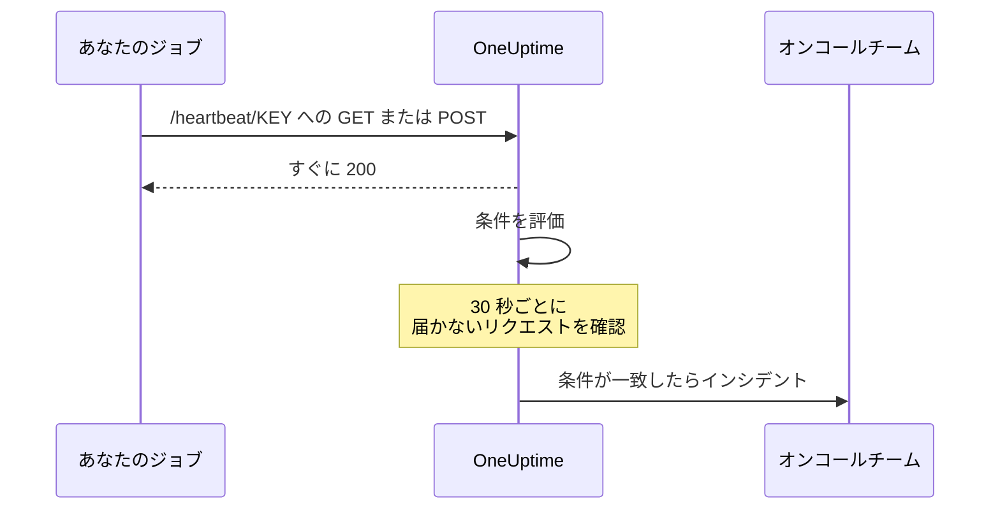
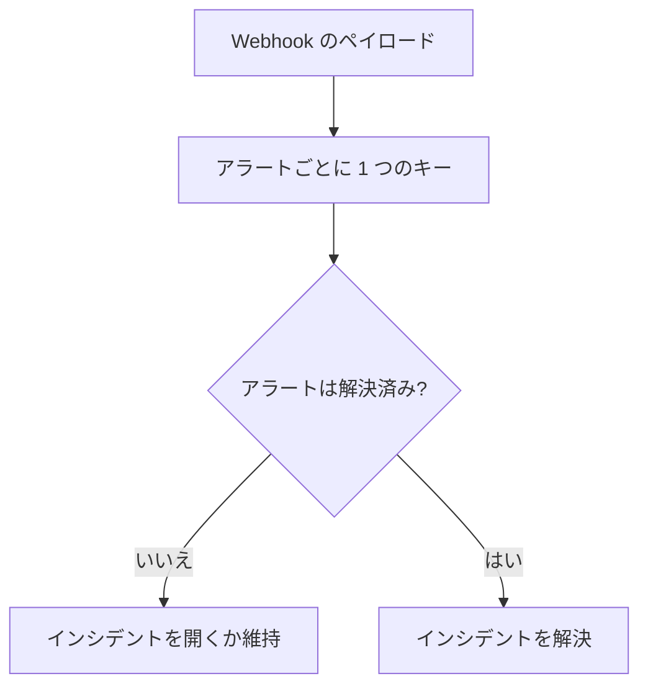

# 受信リクエスト モニター

受信リクエスト モニターは、ほかのシステムが HTTP リクエストを送るための URL を提供します。OneUptime はすべてのリクエストを条件に照らして評価し、モニターのステータスの変更、インシデントの宣言、オンコール当番の呼び出しを行えます。

このモニターは 2 つの異なる役割をこなします。

- **ハートビート監視** — cron ジョブ、ワーカー、デバイスがスケジュールに従って URL を呼び出し、呼び出しが届かなくなると OneUptime がインシデントを作成します。
- **他システムからのアラート受信** — Prometheus Alertmanager、Grafana、そのほか JSON を POST できるものがアラートを送り込み、OneUptime がそれぞれをインシデントに変換して、オンコールへエスカレーションし、回復時に自動で解決します。

どちらも同じモニターの種類を使います。両者を分けるのは、設定する条件です。

:::cards
- [モニターを作成する](#受信リクエスト-モニターを作成する): 数ステップでハートビート URL を手に入れます。
- [ハートビートを送る](#ハートビートを送る): curl、cron、Node.js、Python、Go から送れます。
- [呼び出しが止まったらアラートを出す](#10-分間ハートビートがなければオフラインにする-デッドマンスイッチ): モニターをデッドマンスイッチにします。
- [アラートを受信する](#他システムからのアラート受信): Alertmanager や Grafana のアラートごとに 1 つのインシデントを作ります。
:::

## 仕組み

外部からシステムをチェックするものはありません。あなたのシステムがモニターの URL を呼び出し、OneUptime はすぐに応答してから、モニターの条件に照らしてリクエストを評価します。届かなく *なった* リクエストを調べる条件は、さらに 30 秒ごとにバックグラウンドで再評価されるので、沈黙によってもインシデントが作成されます。



次の用途に使えます。

- cron ジョブやスケジュールされたタスクの監視
- バックグラウンドワーカーが動作していることの確認
- 外部から到達できないファイアウォール内のサービスの監視
- Prometheus Alertmanager、Grafana、その他のアラートシステムからのアラート受信
- HTTP を扱えるあらゆるシステムからのハートビート信号の追跡

## 受信リクエスト モニターを作成する

:::steps
### 新しいモニターを始める

**モニター** に移動し、**モニターを作成** をクリックします。

### 受信リクエストを選ぶ

**モニターの種類** で **受信リクエスト** を選びます。上部にある一般的な種類の 1 つです。**名前** を入力し、**次へ** をクリックします。

### 条件を確認する

**条件** のステップは [デフォルトの条件](#最初から用意されているもの) から始まります。ハートビートの場合は **条件を追加** をクリックし、新しい条件に **受信リクエスト** / **Not Recieved In Minutes** のフィルターを設定して、ステータスをオフラインに変えてインシデントを宣言するようにし、**インシデントを自動解決** をオンにします。そのあと、それをリストの一番上にドラッグします。理由は [条件の例](#条件の例) を参照してください。

### モニターを作成する

**モニターを作成** をクリックします。モニターは **概要** ページで開き、**最初のハートビートを送信** カードに、コピーボタン付きの **ハートビート URL** と `curl` コマンドの例が表示されます。

### 最初のリクエストを送る

その URL にリクエストを送るようにサービスを設定します ([ハートビートを送る](#ハートビートを送る) を参照)。最初のリクエストが届くと、カードはモニターの履歴に置き換わり、**ハートビート URL** カードに URL と最後のリクエストが届いた日時が表示されます。
:::

> [!NOTE]
> URL にはモニターのシークレットキーが含まれるため、モニターを編集できる人だけがこれを見られます。URL はいつでも、モニターの **ドキュメント** ページ (サイドメニューの **構成** セクション) で確認できます。

## リクエスト URL

モニターには次の形式の固有の URL があります。

```text
https://oneuptime.com/heartbeat/YOUR_SECRET_KEY
```

セルフホストの場合は、`https://oneuptime.com` を OneUptime インスタンスの URL に置き換えてください。

この URL には **GET** または **POST** のリクエストを送ります。HEAD は受け付けられ、GET として扱われます。PUT、PATCH、DELETE は 404 を返します。パスに含まれるシークレットキーが唯一の認証情報で、ヘッダーやトークンは不要です。クエリ文字列は無視されるので、条件で読み取りたいものはボディかヘッダーで送ってください。

> [!WARNING]
> この URL を知っている人は誰でもモニターを正常な状態にできるので、秘密として扱ってください。漏れた場合は、モニターの **設定** ページを開いて **受信リクエストのシークレットキーをリセット** をクリックし、すべての送信元を更新してください。送信したヘッダーはすべてモニターに保存され、モニターを閲覧できる人なら誰でも見られます。このエンドポイントへのヘッダーで API キーやトークンを送らないでください。

> [!IMPORTANT]
> OneUptime は空の JSON オブジェクト (`{}`) とともにすぐに `200` を返し、リクエストをキューで処理します。この応答はあらゆる検証の前に書き込まれるので、`200` はリクエストが受け付けられたことの確認では **ありません**。シークレットキーの誤り、削除されたモニター、無効化されたモニターでも `200` が返ります。リクエストが届いていることは、モニター自身のタイムラインで確認してください。

### リクエストボディを送る

ボディ内のフィールドを参照したい場合 (インシデントのタイトルの `{{requestBody.status}}`、インシデントのグループ化での JSON パス、JavaScript 式の条件など) は、`Content-Type: application/json` を送ってください。このドキュメントは全体を通してこの形式を前提にしています。ボディは JSON のオブジェクトか配列でなければなりません。不正な JSON や、`"error"` のような単独の値は `500` で拒否されます。

| コンテンツタイプ | 条件とテンプレートから見えるもの |
| --- | --- |
| `application/json` | 解析された JSON。 |
| `application/x-www-form-urlencoded` | 解析されたフォーム。角かっこ付きのキーは入れ子になり (`alerts[0][status]=firing`)、値はすべて文字列です。 |
| それ以外、またはなし | 空のボディ (`{}`)。そのため `requestBody` への参照はすべて何にも解決されません。 |

最大 50 MB のボディを受け付け、それより大きいものは `413` で拒否されます。ボディを `Content-Encoding: gzip` で圧縮しないでください。JSON として保存されず、その中へのパスが解決されなくなります。

### ハートビートを送る

各例は 1 つのリクエストを送ります。`YOUR_SECRET_KEY` は、モニターの URL にあるキーに置き換えてください。

:::tabs
@tab curl
```bash
# Simple GET request
curl https://oneuptime.com/heartbeat/YOUR_SECRET_KEY

# POST request with a JSON body
curl -X POST https://oneuptime.com/heartbeat/YOUR_SECRET_KEY \
  -H "Content-Type: application/json" \
  -d '{"status": "healthy", "version": "1.2.3"}'
```
@tab Cron
```bash
# Send a heartbeat every 5 minutes
*/5 * * * * curl -fsS https://oneuptime.com/heartbeat/YOUR_SECRET_KEY > /dev/null

# Or ping only when the job succeeds, so a failed run counts as a missed heartbeat
0 2 * * * /usr/local/bin/backup.sh && curl -fsS https://oneuptime.com/heartbeat/YOUR_SECRET_KEY > /dev/null
```
@tab Node.js
```javascript title="heartbeat.mjs"
// Node.js 18 or later: fetch is built in. Run with `node heartbeat.mjs`.
const response = await fetch(
  "https://oneuptime.com/heartbeat/YOUR_SECRET_KEY",
  {
    method: "POST",
    headers: { "Content-Type": "application/json" },
    body: JSON.stringify({ status: "healthy", version: "1.2.3" }),
  },
);

console.log(response.status); // 200
```
@tab Python
```python title="heartbeat.py"
# Python 3, standard library only. Run with `python3 heartbeat.py`.
import json
import urllib.request

request = urllib.request.Request(
    "https://oneuptime.com/heartbeat/YOUR_SECRET_KEY",
    data=json.dumps({"status": "healthy", "version": "1.2.3"}).encode(),
    headers={"Content-Type": "application/json"},
    method="POST",
)

with urllib.request.urlopen(request, timeout=10) as response:
    print(response.status)  # 200
```
@tab Go
```go title="heartbeat.go"
// Run with `go run heartbeat.go`.
package main

import (
	"bytes"
	"fmt"
	"net/http"
)

func main() {
	body := []byte(`{"status": "healthy", "version": "1.2.3"}`)

	resp, err := http.Post(
		"https://oneuptime.com/heartbeat/YOUR_SECRET_KEY",
		"application/json",
		bytes.NewReader(body),
	)
	if err != nil {
		panic(err)
	}
	defer resp.Body.Close()

	fmt.Println(resp.StatusCode) // 200
}
```
@tab PowerShell
```powershell
# Windows PowerShell 5.1 or PowerShell 7
Invoke-RestMethod -Method Post `
  -Uri "https://oneuptime.com/heartbeat/YOUR_SECRET_KEY" `
  -ContentType "application/json" `
  -Body '{"status": "healthy", "version": "1.2.3"}'
```
:::

## 監視条件

サービスをオンライン、機能低下、オフラインのどれと見なすかを決める条件を設定できます。条件の各フィルターには **フィルタータイプ** (何を見るか)、**フィルター条件** (どう比較するか)、**値** があります。

### 最初から用意されているもの

新しい受信リクエスト モニターは、リクエストボディを読む 2 つの条件とともに作成されます。

| 条件 | フィルタータイプ | フィルター条件 | 値 | 効果 |
| -------- | ------------ | ---------------- | ------- | -------------------------------------------- |
| Offline  | リクエストボディ | 含む | `error` | モニターをオフラインにし、インシデントを開く |
| Online   | リクエストボディ | Not Contains | `error` | モニターをオンラインにする |

これは、送信元がペイロードで自分の状態を報告するよくあるケースに合っています。ボディに `error` を含むリクエストはモニターをダウンさせ、その語を含まない次のリクエストがモニターを復帰させてインシデントを解決します。ボディがまったくないリクエストは「`error` を含まない」と見なされるので、単純なハートビートの呼び出しはモニターをオンラインに保ちます。

値は、送信元が実際に送るもの (`"status":"firing"`、`FAILED` など) に変更してください。比較はキーを含むボディ全体に対する、大文字と小文字を区別する部分文字列の検索なので、`{"error":null}` も `error` に一致します。

> [!NOTE]
> これらのデフォルトはデッドマンスイッチでは **ありません**。リクエストが届かなくなっても、ここにあるものは何も発火しません。沈黙に対してアラートを受けたい場合は、下で説明するように **受信リクエスト** / **Not Recieved In Minutes** の条件を追加してください。

### 使用できるフィルタータイプ

| フィルタータイプ | チェック内容 | 補足 |
| --------------------- | ------------------------------------------------------ | -------------------------------------------------------------------------------------------- |
| 受信リクエスト | 一定の時間内にリクエストを受信したかどうか | 何も届かないときに発火できる唯一のチェック |
| リクエストボディ | リクエストのボディ | 部分文字列の一致。オブジェクトのボディはコンパクトな JSON として比較されます |
| Request Header | リクエストヘッダーの名前 | ヘッダー名全体との完全一致。大文字と小文字は区別しません |
| Request Header Value | リクエストヘッダーの値 | ヘッダー値全体との完全一致。大文字と小文字は区別しません |
| JavaScript Expression | `requestBody` と `requestHeaders` を使った任意の式 | 最も柔軟な選択肢です。[JavaScript 式](/docs/monitor/javascript-expression) を参照してください |

### フィルター条件

フィルタータイプごとに、独自の条件のセットがあります。

| フィルタータイプ | 条件 |
| --- | --- |
| **受信リクエスト** | **Recieved In Minutes** — 指定した分数以内にリクエストを受信した。**Not Recieved In Minutes** — 指定した分数以内にリクエストを受信しなかった。(ダッシュボードではこの綴りで表示されます。) |
| **リクエストボディ**、**Request Header**、**Request Header Value** | **含む** と **Not Contains** |
| **JavaScript Expression** | **Evaluates To True** |

> [!NOTE]
> ヘッダーの名前と値は小文字にしたうえで、部分文字列ではなく名前や値の全体と比較されます。`application/json` は `application/json; charset=utf-8` に一致しません。部分文字列で比較するのは **リクエストボディ** だけです。プロキシや OneUptime 自身のロードバランサーが追加するヘッダー (`x-forwarded-for`、`x-real-ip`) も保存されます。

オブジェクトのボディは空白のないコンパクトな JSON として比較されるので、**リクエストボディ** / **含む** のフィルターは `"status":"firing"` と書く必要があります。整形されたペイロードから `"status": "firing"` をコピーすると、一致することはありません。

### 条件の例

#### 10 分間ハートビートがなければオフラインにする (デッドマンスイッチ)

| フィールド | 値 |
| --- | --- |
| **フィルタータイプ** | 受信リクエスト |
| **フィルター条件** | Not Recieved In Minutes |
| **値** | `10` |

#### リクエストボディの内容に基づいて機能低下にする

| フィールド | 値 |
| --- | --- |
| **フィルタータイプ** | リクエストボディ |
| **フィルター条件** | 含む |
| **値** | `"status":"degraded"` |

> [!IMPORTANT]
> デッドマンスイッチはデフォルトの条件の **上** に置いてください。条件は上から順にチェックされ、最初に一致したものが結果を決めます。バックグラウンドのチェックは最後のリクエストを読み直すので、デフォルトのオンラインの条件 ("Request Body Not Contains `error`") がそれに一致し続け、その下の条件には順番が回ってきません。**条件を追加** は末尾に条件を追加するので、上にドラッグしてください。

> [!WARNING]
> モニターがバックグラウンドで再評価されるのは、条件の少なくとも 1 つが **受信リクエスト** をチェックしている場合だけです。条件がリクエストボディ、Request Header、JavaScript 式だけをチェックするモニターは、リクエストが届いたときにだけ評価され、それ以外のときは評価されません。そのため、ひとりでにオフラインになることはありません。ハートビートが届かないときのアラームが必要なら、**受信リクエスト** の条件が必要です。

バックグラウンドのチェックは分単位で数え、値を *超えた* 時点で発火します。"Not Recieved In Minutes: 10" は、最後のリクエストから約 11 分後に発火します (チェックは 30 秒ごとに実行されます)。一度もリクエストを受信していないモニターは、作成時刻を最後のリクエストとして扱うので、新しいモニターに同じ条件を設定すると、送信元を接続していなくても作成から約 11 分後に発火します。値に数えられるのは OneUptime が受信していた分だけです。OneUptime 自体の再起動、アップグレード、遅れの取り戻しの間の分は数えません。詳しくは [OneUptime がデータを受信していないとき](/docs/monitor/when-oneuptime-is-not-receiving) を参照してください。

## 他システムからのアラート受信

Alertmanager、Grafana などのツールは、1 つ以上のアラートを記述した JSON ドキュメントを POST します。デフォルトでは条件はインシデントを **1 つ** だけ開くので、5 つのアラートを含むペイロードでもインシデントは 1 つになります。インシデントのグループ化はこれを変えます。ペイロードから値を取り出し、**異なる値ごとに別々のインシデント** を開き、それらはすべて同時に開いていられます。



### インシデントのグループ化を有効にする

:::steps
1. 条件を開き、**設定** を展開します。
2. **ペイロードのフィールドでインシデントとアラートをグループ化** をオンにします。
3. **次ごとに別々のインシデントを作成…** を入力します。各インシデントを自動で解決させたい場合は、**各インシデントを自動解決する条件…** のフィールドと値も入力します (下を参照)。その後、モニターを保存します。
:::

| フィールド | 例 | 役割 |
| ---------------------------------- | ---------------------------------------- | ---------------------------------------------------------------------- |
| 次ごとに別々のインシデントを作成… | `requestBody.alerts[*].labels.alertname` | 異なる値ごとにインシデントを分けるパス |
| 回復を示すフィールド | `requestBody.alerts[*].status` | アラートが回復したと判断するためにチェックするパス |
| 回復を意味する値 | `resolved` | 回復を示す正確な値 |
| 1 回のリクエストあたりの最大インシデント数 | `100` (デフォルト) | 値の種類が多いフィールドが無制限にインシデントを開かないようにする安全上限 |

### パスの構文

パスはリテラルの接頭辞 `requestBody.` で始まる必要があります。これがないパス (`alerts[*].labels.alertname`) は、何も知らせずに何にも一致しません。`{{ }}` で囲むのは任意で、`requestBody.status` と `{{requestBody.status}}` は同じように動作します。

- `[*]` は配列に展開され、**異なる** 値ごとに 1 つのインシデントになります。同じ値になる 2 つの要素は 1 つのインシデントにまとめられ、そのインシデントの状態 (発火中/解決済み) は **最初の** 一致した要素から取られます。**パス内でワイルドカードになるのは最初の `[*]` だけです**。`requestBody.groups[*].alerts[*].name` は何にも一致しません。
- `[0]` と `[last]` は 1 つの要素を選び、`[*]` の後に続けられます。
- オブジェクトと配列の値、空の文字列、null はスキップされます。`0` と `false` は有効なキーです。
- ボディは JSON オブジェクトでなければなりません。最上位が配列のペイロードはグループ化されません。

### 解決はイベント駆動

Webhook はそのペイロードにあるものしか表さないので、OneUptime はキーが現れなくなったという理由でインシデントを解決することはありません。インシデントが解決されるのは、ペイロードがそのキーの回復を明示したときだけです。次の 2 つがどちらも満たされている必要があります。

1. **回復を示すフィールド** と **回復を意味する値** が設定されていて、ペイロードと一致すること。比較は大文字と小文字を区別する完全一致で、`Resolved` は `resolved` に一致しません。
2. 条件のインシデントで、インシデントフォームの **その他の項目** にある **インシデントを自動解決** がオンになっていること。これがないと、一致した回復イベントは無視され、インシデントは開いたままになります。(アラートと **アラートを自動解決** についても同じです。) デフォルトのオフラインの条件では最初からオンになっていますが、自分で条件に追加したインシデントでは最初はオフです。

**1 回のリクエストあたりの最大インシデント数** は、作成だけでなく取り出しも制限します。上限を超えたキーは回復の判定からも見えないので、異なるキーの数が上限を超えるペイロードでは、上限の外で `resolved` を報告するアラートはインシデントを閉じません。

> [!NOTE]
> 1 つのモニターが、OneUptime の評価より速くリクエストを受信すると、OneUptime は最新のものを評価し、その間のものをスキップします。そのため Webhook が集中すると、発火中や解決済みのアラートが評価されないことがあります。セルフホストのサーバーでは、OneUptime アプリの環境で `INCOMING_REQUEST_INGEST_COALESCE_ENABLED=false` を設定すると、すべてのリクエストを個別に評価します。

> [!WARNING]
> **回復を示すフィールド** に `[*]` が含まれていて、**次ごとに別々のインシデントを作成…** に含まれていない場合、何も解決されません。`[*]` は両方に使うか、どちらにも使わないかのどちらかにしてください。`[*]` のない回復のパスはペイロード全体に対して評価されるので、ペイロードの最上位の `status: resolved` は、そのペイロード内のすべてのキーを解決します。自身のステータスがまだ発火中のアラートも含みます。

### インシデントに名前を付ける

グループ化のキーは、**パスの最後のセグメント** にちなんだ名前の変数として、インシデントとアラートのテンプレートで使えます。

| パス | 変数 |
| ---------------------------------------- | ----------------- |
| `requestBody.alerts[*].labels.alertname` | `{{alertname}}`   |
| `requestBody.alerts[*].fingerprint`      | `{{fingerprint}}` |
| `requestBody.commonLabels.severity`      | `{{severity}}`    |

ペイロード全体も一緒に使えるので、インシデントのタイトルを `{{alertname}}` にして、説明で `{{requestBody.commonAnnotations.summary}}` を参照する、といったことができます。[インシデント & アラート テンプレート](/docs/monitor/incident-alert-templating) を参照してください。

> [!WARNING]
> 変数名は、OneUptime が回復イベントを開いているインシデントと照合するための識別情報の一部です。グループ化のパスを最後のセグメントが異なるものに変えると、古いパスで現在開いているインシデントはすべて取り残されます。自動では解決できなくなり、手動で閉じる必要があります。

`[*]` が使えるのは、グループ化のパスの 2 つのフィールド **だけ** です。それ以外の場所では解決されず、解決されないプレースホルダーは空にならずに **そのまま** 表示されます。タイトルを `{{requestBody.alerts[*].labels.alertname}}` にすると、中かっこが残ったまま表示されます。`{{requestBody.alerts[0].annotations.summary}}` というタイトルは解決されますが、常にペイロードの最初のアラートを読み、このインシデントを開いたアラートを読むわけではありません。グループ化の変数と、ペイロードの共通の `commonAnnotations` フィールドを組み合わせて使ってください。

### 実例

Alertmanager の完全な構成は [Prometheus Alertmanager](/docs/integrations/prometheus-alertmanager) を参照してください。Grafana については [Grafana](/docs/integrations/grafana) を参照してください。

## ベストプラクティス

1. **時間の範囲を適切に設定する** — cron ジョブが 5 分ごとに実行されるなら、"Not Recieved In Minutes" のしきい値を 10〜15 分にして、ときどき起きる遅延を許容し、その条件を最初に置きます。
2. **意味のあるデータを含める** — リクエストボディで状態の情報を送り、きめ細かな条件を設定できるようにします。
3. **`Content-Type: application/json` 付きの POST を使う** — ボディの中身を読むものはすべて、これに依存しています。
4. **1 つのモニターで 2 つの役割を混ぜない** — イベント駆動のアラートを受信するモニターには一定のリズムがないので、そこに "Not Recieved In Minutes" の条件を置くと状態が頻繁に切り替わります。デッドマンスイッチには別のモニターを使ってください。
5. **モニター自体を見守る** — リクエストを送るサービスがエラーを適切に処理し、失敗したリクエストが見過ごされないようにします。

## トラブルシューティング

:::details 送信元は 200 を受け取るのに、モニターに何も表示されない
`200` はリクエストを検証する前に送られるので、リクエストが受け付けられた証拠にはなりません。URL のシークレットキーがモニターの **ハートビート URL** と一致していること、モニターが無効化されていないことを確認してください。そのうえで、モニターのタイムラインでリクエストが届いているかを確認します。
:::

:::details ハートビートが止まってもモニターがオフラインにならない
沈黙に気づけるのは **受信リクエスト** (**Not Recieved In Minutes**) の条件だけです。なければ追加し、デフォルトの条件より上にドラッグしてください。デフォルトのオンラインの条件はバックグラウンドのチェックのたびに最後のリクエストに一致し、最初に一致した条件が結果を決めます。
:::

:::details リクエストボディのフィルターが一致しない
`Content-Type: application/json` を送り、値をコンパクトな JSON で書いてください。`"status":"firing"` のように、コロンの後に空白を入れません。JSON またはフォームのコンテンツタイプがないと、ボディは解析されません。
:::

:::details Request Header のフィルターが一致しない
ヘッダーの名前と値は全体で比較されます。値の一部ではなく、`application/json; charset=utf-8` のような完全な値を指定してください。
:::

:::details 送信元が 500 を受け取る
リクエストは `Content-Type: application/json` と宣言していますが、ボディが JSON のオブジェクトでも配列でもありません。正しい JSON を送るか、別のコンテンツタイプを使ってください。
:::

## 次のステップ

:::cards
- [Prometheus Alertmanager](/docs/integrations/prometheus-alertmanager): 受信アラートの完全なセットアップです。
- [Grafana](/docs/integrations/grafana): 同じことを Grafana のアラートで行います。
- [インシデント & アラート テンプレート](/docs/monitor/incident-alert-templating): タイトルと説明で使えるすべての変数です。
- [JavaScript 式](/docs/monitor/javascript-expression): 式の構文と引用符のルールです。
:::
