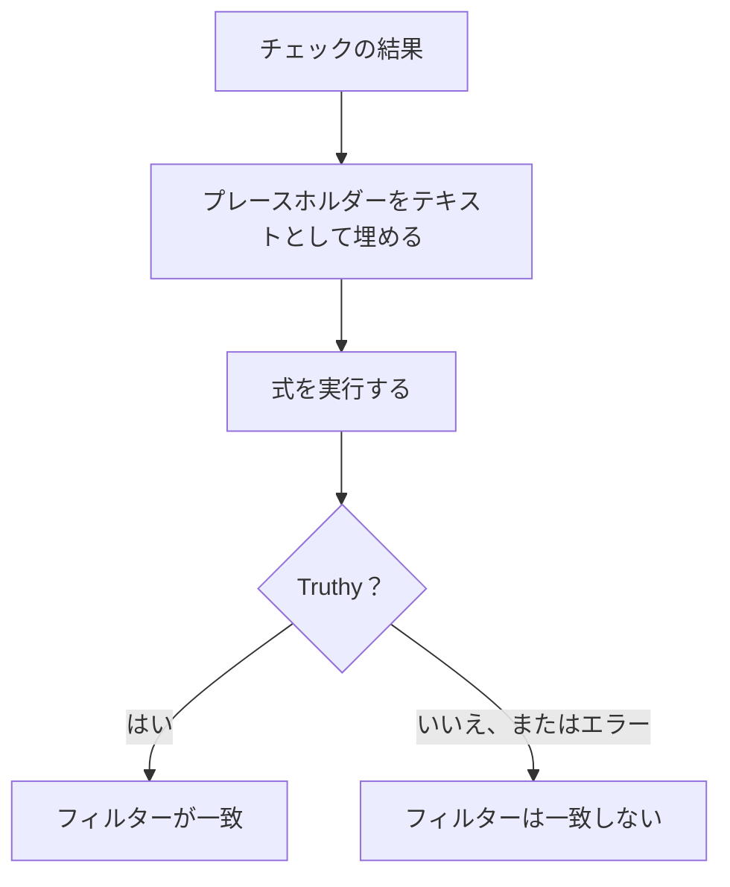

# JavaScript 式

**JavaScript Expression** 条件フィルターは、固定の比較の代わりに 1 行の JavaScript で、モニターの条件が満たされたかどうかを判定します。組み込みのフィルターでは表せない条件に使います。JSON 応答の奥深くにあるフィールド、互いに比較する 2 つの値、`&&` と `||` で組み合わせた複数のチェックなどです。

:::cards
- [しくみ](#しくみ): プレースホルダーが埋められてから、式が実行されます。
- [変数](#モニターの種類ごとの変数): 各モニターの種類で使えるもの。
- [例](#例): API、受信リクエスト、データベース向けの式。
- [引用符のルール](#引用符のルール): ほとんどの人がする間違い。
:::

## しくみ

式が実行される前に、式の中の各 `{{variable}}` プレースホルダーが、モニターの最新のチェックの値で置き換えられます。置き換えはプレーンテキストとして行われます。その結果が JavaScript として実行されます。truthy な値になればフィルターは一致し、それ以外はエラーも含めて一致しません。



プレースホルダーはテキストとして置き換えられるので、`{{responseBody.item}}` は生の値になります。文字列は JavaScript の文字列になるように引用符で囲む必要がありますが、数値や真偽値は囲みません。[引用符のルール](#引用符のルール) を参照してください。式は OneUptime サーバー上の隔離されたサンドボックスで実行されます。

## JavaScript Expression フィルターを追加する

:::steps
### 条件を開く

モニターで **構成 → 条件** を開いて **監視条件を編集** をクリックするか、**モニターを作成** の **条件** ステップを使います。変更したい条件の中で作業するか、新しい条件なら **条件を追加** をクリックします。

### フィルターを追加する

**フィルター** の下で **フィルターを追加** をクリックし、その **フィルタータイプ** を **JavaScript Expression** に設定します。**フィルター条件** は **Evaluates To True** です。

### 式を書く

[モニターの種類の変数](#モニターの種類ごとの変数) を使って、**値** に式を入力します。フィルターの下のリンク **ここで JavaScript の式を使う方法については、ドキュメントを参照してください。** は、このページを開きます。

### 保存する

モニターを保存します。フィルターはモニターの次のチェックで評価されます。
:::

## モニターの種類ごとの変数

JavaScript の式は、Website、API、Incoming Request、Incoming Email、SQL Query、Database Health の各モニターで使えます。

### ウェブサイトと API のモニター

| 変数 | 説明 | 型 |
| --- | --- | --- |
| `responseBody` | レスポンスボディ。JSON の場合は解析され、それ以外（HTML や XML など）の場合は文字列です。 | `string` または `JSON` |
| `responseHeaders` | レスポンスヘッダー。名前は小文字です。 | `Dictionary<string>` |
| `responseStatusCode` | レスポンスのステータスコード。 | `number` |
| `responseTimeInMs` | 応答時間（ミリ秒）。 | `number` |
| `isOnline` | モニターが応答をオンラインとみなすかどうか。 | `boolean` |

### 受信リクエストのモニター

| 変数 | 説明 | 型 |
| --- | --- | --- |
| `requestBody` | リクエストボディ。 | `string` または `JSON` |
| `requestHeaders` | リクエストヘッダー。名前は小文字です。 | `Dictionary<string>` |

### SQL クエリのモニター

| 変数 | 説明 | 型 |
| --- | --- | --- |
| `rowCount` | クエリが返した行数。 | `number` |
| `scalarValue` | 最初の行の最初の列。 | 任意 |
| `firstRow` | 最初の行（列と値の組）。 | `JSON` |
| `executionTimeInMs` | クエリにかかった時間（ミリ秒）。 | `number` |
| `queryError` | クエリのエラー（あった場合）。 | `string` |
| `isOnline` | データベースに到達でき、クエリが成功したかどうか。 | `boolean` |

### データベースのヘルスのモニター

`isOnline`、`engineVersion`、`connectionError`、`collectedGroups`、`unavailableGroups`、`metrics`。データベースヘルスモニターのページの [JavaScript 式の変数](/docs/monitor/database-health-monitor#javascript-式の変数) を参照してください。

### 受信メールのモニター

フィルターは使えますが、メールのフィールドは結び付けられていません。式では件名、送信者、本文、宛先を読み取れません。代わりにメールのフィルタータイプを使います。[受信メール モニター](/docs/monitor/incoming-email-monitor#使用できるフィルタータイプ) を参照してください。

## 例

以下の各行は、それぞれ 1 つの完全な式です。次のような JSON のレスポンスボディの場合:

```json
{
  "item": "hello",
  "count": 3,
  "items": [{ "name": "hello" }]
}
```

| 式 | 一致するとき |
| --- | --- |
| `"{{responseBody.item}}" === "hello"` | `item` フィールドが `hello` のとき。 |
| `{{responseBody.count}} > 2` | `count` フィールドが 2 より大きいとき。 |
| `"{{responseBody.items[0].name}}" === "hello"` | `items` の最初の要素の名前が `hello` のとき。 |
| `{{responseStatusCode}} === 200 && {{responseTimeInMs}} < 500` | ステータスが 200 で、応答に 0.5 秒もかからなかったとき。 |
| `/hel+o/.test("{{responseBody.item}}")` | `item` フィールドが正規表現に一致するとき。 |
| `"{{responseHeaders.content-type}}".startsWith("application/json")` | 応答が JSON のとき。ヘッダー名は小文字です。 |

条件は `&&` と `||` で組み合わせ、かっこでグループ化します。

```javascript
({{responseStatusCode}} === 200 || {{responseStatusCode}} === 204) && {{responseTimeInMs}} < 1000
```

`{"status": "degraded", "region": "eu"}` を `Content-Type: application/json` として受け取る受信リクエストのモニターの場合:

```javascript
"{{requestBody.status}}" === "degraded" && "{{requestBody.region}}" === "eu"
```

クエリが件数を返す SQL クエリのモニターで、件数が多いときやクエリが遅いときにアラートを出す場合:

```javascript
{{scalarValue}} > 50 || {{executionTimeInMs}} > 2000
```

データベースのヘルスのモニターでは、`metrics` オブジェクト全体にインデックスを付けて 1 つのメトリクスを読み取ります。系列名にはドットが含まれるため、波かっこの中には入れられません。

```javascript
{{metrics}}['oneuptime.monitor.database.connections.used.percent'] > 90
```

## 引用符のルール

`{{var}}` は値でテキストとして置き換えられます。文字列を比較するには、`"{{responseBody.item}}" === "hello"` のように引用符で囲みます。数値を比較するには、`{{responseStatusCode}} === 200` のように囲まずに書きます。

| 値の型 | 書き方 | 例 |
| --- | --- | --- |
| 文字列 | 引用符で囲む | `"{{responseBody.status}}" === "ok"` |
| 数値 | 囲まない | `{{responseTimeInMs}} < 500` |
| 真偽値 | 囲まない | `{{isOnline}} === true` |
| オブジェクトまたは配列 | 囲まずに、インデックスを付ける | `{{responseHeaders}}['content-type']` |

注意すべき点が 3 つあります。

- **引用符で囲んだプレースホルダーだけでは常に真になります。** `"{{responseBody.healthy}}"` は、フィールドが `false` のとき空でない文字列 `"false"` になります。比較するか（`"{{responseBody.healthy}}" === "true"`）、囲まずに書きます（`{{responseBody.healthy}} === true`）。
- **値はエスケープされません。** 二重引用符や改行を含む値は文字列を途中で終わらせ、式は失敗します。HTML ページのテキストを探すには、代わりに **レスポンスボディ** フィルターを使います。
- **存在しないパスは書いたまま残ります。** チェックにそのフィールドがない場合、`{{responseBody.item}}` は式の中にそのまま残り、たいていは構文エラーになります。そのため、フィルターは一致しません。

## 制限

式の実行時間は 5 秒です。それより長くかかる式や、エラーを投げる式は一致せず、エラーは OneUptime サーバーのログに書き込まれます。

## トラブルシューティング

:::details 式がまったく一致しない
まず引用符を確認します。引用符で囲んでいない文字列のプレースホルダーはむき出しの単語になり、これは構文エラーで、エラーは決して一致しません。次に、そのパスがチェックの結果に存在することを確認します。存在しないパスのプレースホルダーは埋められません。
:::

:::details 式が常に一致する
引用符で囲んだプレースホルダーだけでは空でない文字列になり、常に truthy です。値と比較してください。
:::

## 次のステップ

:::cards
- [インシデント & アラート テンプレート](/docs/monitor/incident-alert-templating): 同じプレースホルダーをインシデントのタイトルと説明で使います。
- [API モニター](/docs/monitor/api-monitor): HTTP エンドポイントとその応答をチェックします。
- [受信リクエスト モニター](/docs/monitor/incoming-request-monitor): 他のシステムから送られてくるリクエストを評価します。
:::
