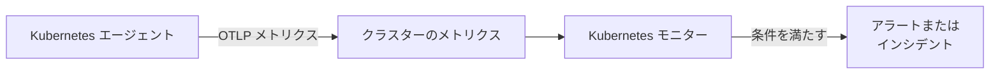

# Kubernetes モニター

Kubernetes モニターは、OneUptime の Kubernetes エージェントがクラスターから送信するメトリクス（ノード、Pod、コンテナ、ワークロード、オートスケーラー、コントロールプレーン）に基づいてアラートを出します。既製のアラートテンプレートから始めるか、メトリクスを 1 つ選ぶか、独自のクエリを書き、アラートやインシデントを作成するしきい値を設定します。

:::cards
- [エージェントをインストールする](/docs/monitor/kubernetes-agent): Helm コマンド 1 つでクラスターを OneUptime に取り込みます。
- [モニターを作成する](#kubernetes-モニターを作成する): クラスターを選び、テンプレート、メトリクス、クエリのいずれかを選びます。
- [アラートテンプレート](#既製のアラートテンプレート): CrashLoopBackOff から etcd まで、17 個の既製アラート。
- [条件](#監視条件): 静的なしきい値と異常検知。
:::

## 仕組み

エージェントはクラスターのメトリクスを OTLP で OneUptime に送信し、それぞれにクラスター名（`k8s.cluster.name`、チャートの `clusterName`）を付けます。新しい名前からの最初のデータでクラスターが **Kubernetes** に登録され、それ以降、Kubernetes モニターでそのクラスターを選べるようになります。モニターは毎分、自身の **時間範囲** にわたってそれらのメトリクスを照会し、集計して、結果を条件と比較します。

## 始める前に

- クラスター内で OneUptime の Kubernetes エージェントが動作していること。[Kubernetes エージェント (Helm インストール)](/docs/monitor/kubernetes-agent) を参照してください。インストールから数分後にクラスターが **Kubernetes** に表示されます。
- コントロールプレーンのテンプレート（**etcd No Leader**、**API Server Request Saturation**、**Scheduler Backlog**）には、エージェントのコントロールプレーンのスクレイプ（`controlPlane.enabled`）が必要です。マネージドクラスター（EKS、GKE、AKS）はこれらのエンドポイントを公開しないため、そこではこれらのモニターにデータが届きません。

## Kubernetes モニターを作成する

:::steps
### 新しいモニターを始める

**モニター** に移動し、**モニターを作成** をクリックします。**その他のモニターの種類** で **Kubernetes** を選ぶか、検索ボックスに `k8s` と入力します。

### クラスターを選ぶ

**Kubernetes クラスター** で選択します。一覧には、エージェントがデータを報告したすべてのクラスターが表示されます。

### 監視する対象を選ぶ

3 つのタブのいずれかを使います。

| タブ | 選択する内容 |
| --- | --- |
| **Quick Setup** | [既製のアラートテンプレート](#既製のアラートテンプレート)。メトリクス、スコープ、時間範囲、条件が入力されます。**時間範囲** は引き続き変更できます。 |
| **Custom Metric** | [メトリクスカタログ](#メトリクスカタログ) からメトリクスを 1 つ選び、次に **リソーススコープ**、フィルター、**集計**（平均、最大、最小、合計、カウント）、**時間範囲** を選びます。 |
| **詳細** | **リソーススコープ**、フィルター、**時間範囲** に加え、**メトリクスを選択** で独自のメトリクスクエリと数式を作成します。結果のライブグラフが表示されます。 |

### 条件を設定する

モニターがステータスを変えるタイミングと、アラートやインシデントを作成するタイミングを設定します。[監視条件](#監視条件) を参照してください。テンプレートを使った場合はすでに入力されているので、しきい値、重大度、オンコールポリシーを確認します。

### モニターを保存する

フォームを最後まで入力して保存します。モニターは **モニター** に表示され、最初の評価からステータスが条件に従います。
:::

## 設定オプション

### リソーススコープとフィルター

**リソーススコープ** はメトリクスを評価するレベルを設定し、フォームに表示されるフィルターを決めます。フィルターはすべて任意です。

| スコープ | 監視対象 | フィルター |
| --- | --- | --- |
| クラスター | クラスター全体 | — |
| Namespace | Namespace 内のリソース | **Namespace** |
| ワークロード | Deployment、StatefulSet、DaemonSet、Job、CronJob | **Namespace**、**ワークロード名** |
| ノード | クラスターのノード | **ノード名** |
| Pod | Pod | **Namespace**、**Pod 名** |

### 時間範囲

**時間範囲** は、モニターが評価されるたびにメトリクスクエリが対象とする期間で、**Past 1 Minute** から **Past 365 Days** まで選べます。短い期間（1～15 分）はアラートに向いており、長い期間はノイズの多いメトリクスを平滑化します。

### メトリクスクエリと数式

**詳細** タブでは、各クエリでメトリクス、その値の集計方法、任意の属性フィルターを指定します。**数式** は算術でクエリを組み合わせます。たとえばノード使用率のテンプレートは、使用量を割り当て可能な容量で割ります。

## メトリクスカタログ

**Custom Metric** タブでは、リソースの種類ごとに次のメトリクスを選べます。

| カテゴリ | メトリクス |
| --- | --- |
| Pod | Pod CPU Usage, Pod Memory Usage, Pod Phase (Code), Pod Filesystem Usage, Pod Memory Limit Utilization, Pod CPU Limit Utilization, Pod Network I/O (Cumulative, Both Directions) |
| ノード | Node CPU Usage, Node Allocatable CPU, Node Memory Usage, Node Filesystem Usage, Node Allocatable Memory, Node Ready Condition, Node Filesystem Available |
| コンテナ | Container Restarts, Container CPU Limit, Container CPU Request, Container Memory Limit, Container Memory Request, Container Ready |
| ワークロード | Deployment Available Replicas, Deployment Desired Replicas, DaemonSet Misscheduled Nodes, DaemonSet Ready Nodes, StatefulSet Ready Replicas, Job Failed Pods, Job Successful Pods |
| HPA | HPA Current Replicas, HPA Desired Replicas, HPA Max Replicas, HPA Min Replicas |
| コントロールプレーン | etcd Has Leader, API Server In-Flight Requests, Scheduler Pending Pods |

> [!NOTE]
> **Pod CPU Usage** と **Node CPU Usage** の単位はパーセントではなくコア数です。`0.18` は 0.18 コアを意味します。**Pod Phase (Code)** はコード（1 Pending、2 Running、3 Succeeded、4 Failed、5 Unknown）なので、最大または最小で集計し、合計は使わないでください。コントロールプレーンのメトリクスは、エージェントのコントロールプレーンのスクレイプが有効な場合にのみ届きます。

## 監視条件

### 評価される値

これらのモニターは常に **Metric Value**、つまり設定したメトリクスクエリまたは数式の値を評価します。条件フォームにフィルタータイプの選択はなく、**メトリクス**、**集計**、**条件**、**しきい値** が表示されます。

### 集計の種類

| 集計 | 説明 |
| --- | --- |
| 平均 | 期間内の平均値 |
| 合計 | すべての値の合計 |
| Maximum Value | 期間内の最大値 |
| Minimum Value | 期間内の最小値 |
| All Values | すべての値が条件に一致する必要がある |
| Any Value | 少なくとも 1 つの値が一致すればよい |

### 条件の種類

静的なしきい値は、入力した **しきい値** と比較されます。**Greater Than**、**Less Than**、**Greater Than Or Equal To**、**Less Than Or Equal To**、**Equal To** があります。

ベースラインに基づく異常検知にしきい値は不要です。次のいずれかの条件を選ぶと、フォームには代わりに **感度** と **ベースラインウィンドウ** が表示されます。

| 条件 | 値が次のときに一致 |
| --- | --- |
| **Anomalously High** | 想定範囲を上回る |
| **Anomalously Low** | 想定範囲を下回る |
| **Anomalous** | どちらかの方向に想定範囲を外れる |

各サンプルは、**ベースラインウィンドウ**（既定は 14 日、ほかに 28、60、90 日）から作られる、週の同じ時間帯のベースラインと比較されます。**感度** は想定範囲の幅を決めます。**低 (4σ — 著しい偏差のみ)**、既定の **中 (3σ — 推奨)**、**高 (2σ — ノイズが多い、非常に安定したサービス)** から選びます。異常条件は、選んだベースラインウィンドウ分以上のメトリクス履歴がたまるまで「Learning」状態のままで、アラートを出しません。

**その他の項目** にある **データがない場合** は、期間内にクエリが何も返さないときの動作を決めます。**Ignore**（既定）は一致せず、**トリガー** は無応答を問題として扱い、**Treat As Zero** はゼロとして比較します。OneUptime 自身がデータを受信していなかった時間は、決してデータなしとは扱われません。そのような時間を含む期間のチェックは代わりに待機します。詳しくは [OneUptime がデータを受信していないとき](/docs/monitor/when-oneuptime-is-not-receiving) を参照してください。

## 既製のアラートテンプレート

**Quick Setup** タブには、カテゴリ別に次のテンプレートが表示されます。それぞれ 2 つの条件を入力します。1 つは条件が成り立つ間モニターをオフラインにしてインシデントとアラートを作成し、もう 1 つは条件が解消したらモニターをオンラインに戻します。

| テンプレート | カテゴリ | 発火する条件 | 重大度 |
| --- | --- | --- | --- |
| CrashLoopBackOff Detection | ワークロード | Pod の作成以降、コンテナが 5 回を超えて再起動した | 重大 |
| Pod Stuck in Pending | スケジューリング | 15 分間のすべてのサンプルで、いずれかの Pod が Pending フェーズにある | 警告 |
| Node Not Ready | ノード | ノードが NotReady を報告した | 重大 |
| High Node CPU Utilization | ノード | ノードの平均 CPU 使用量が割り当て可能な CPU の 90% を超えた | 警告 |
| High Node Memory Utilization | ノード | ノードの平均メモリ使用量が割り当て可能なメモリの 85% を超えた | 警告 |
| Deployment Replica Mismatch | ワークロード | Deployment の利用可能なレプリカが 15 分間、希望数を下回っている | 警告 |
| Job Failures | ワークロード | Job に失敗した Pod がある | 警告 |
| etcd No Leader | コントロールプレーン | etcd に選出されたリーダーがいない | 重大 |
| API Server Request Saturation | コントロールプレーン | API サーバーが期間全体にわたって 200 件以上の処理中リクエストを抱えている | 重大 |
| Scheduler Backlog | スケジューリング | スケジューラーの保留中 Pod のキューが 5 分間空にならない | 警告 |
| High Node Disk Usage | ストレージ | ノードのファイルシステムの使用率が 90% を超えた | 警告 |
| DaemonSet Misscheduled Nodes | ワークロード | DaemonSet が、ノードセレクター、アフィニティ、トレレーションに合わなくなったノードで Pod を実行している | 警告 |
| High Node CPU Request Commitment | ノード | ノード上のコンテナの CPU リクエストの合計が割り当て可能な CPU の 90% を超えた | 警告 |
| High Node Memory Request Commitment | ノード | ノード上のコンテナのメモリリクエストの合計が割り当て可能なメモリの 90% を超えた | 警告 |
| HPA Saturated at Max Replicas | ワークロード | HPA が `maxReplicas` の 90% 以上で動作している | 重大 |
| Pod Memory Saturating Container Limit | ワークロード | Pod がコンテナのメモリ上限の 90% を超えて使用している | 重大 |
| Pod CPU Saturating Container Limit | ワークロード | Pod がコンテナの CPU 上限の 90% を超えて使用している | 警告 |

オブジェクト単位のメトリクスを使うテンプレートは、ノード、Pod、Deployment、Job、DaemonSet、HPA をそれぞれ個別に評価します。そのため、不健全な Pod が複数あるクラスターでは、クラスター全体で 1 件ではなく Pod ごとにインシデントが作成されます。

> [!NOTE]
> **CrashLoopBackOff Detection** は、レートではなく、現在の Pod におけるコンテナの累計再起動回数を読み取ります。クラッシュループの後に回復したコンテナは、その Pod が置き換えられるまでアラートを開いたままにします。

### 症状だけでなく原因を捉える

ノードレベルのテンプレート（High Node CPU Utilization、High Node Memory Utilization、Node Not Ready、Pod Stuck in Pending）は、リソース枯渇の連鎖の*終わり*、つまりクラスターがすでに機能低下しているときに発火します。次の 3 つのテンプレートは連鎖の*始まり*で発火し、たいていはそこに解決策があります。

- **Pod Memory Saturating Container Limit** と **Pod CPU Saturating Container Limit** は、自身の上限に張り付いたワークロードを捉えます。メモリ上限を超えると即座に OOMKill され、CPU 上限を超えるとカーネルが Pod をスロットリングするため、エラーを出さないまま遅くなります。どちらも CrashLoopBackOff や原因不明の遅延のよくある原因です。
- **HPA Saturated at Max Replicas** は、余裕のなくなったオートスケーラーを捉えます。Pod ごとの上限が低すぎるワークロードはスロットリングされたり強制終了されたりし、それが HPA のスケーリング基準となるメトリクスそのものを押し上げます。そのためオートスケーラーは、同じようにリソース不足のレプリカを上限に達するまで追加し続けます。解決策は上限を引き上げることで、`maxReplicas` を引き上げると悪化します。

オートスケールするワークロードを実行するすべての Namespace で、これらをまとめて有効にしてください。組み合わせることで、「本当に容量が足りない」のか「Pod ごとのリソースが不足している」のかを見分けられます。

> [!NOTE]
> 2 つの Pod 上限テンプレートは、Pod の使用量をコンテナの上限の**合計**で割るため、サイドカーを持つ Pod も正しく測定されます。kubelet が報告する Pod のメモリには回収可能なページキャッシュが含まれるため、ファイルを多用するワークロードは OOMKill されないままメモリテンプレートで高い値を示すことがあります。「強制終了寸前」ではなく「上限に近づいている」と読んでください。

## トラブルシューティング

:::details クラスターが Kubernetes クラスター の一覧にない
クラスターは、エージェントのデータから、エージェントのインストール時の `clusterName` で自動登録されます。エージェントの Pod が実行中で、クラスターが **製品 → インフラストラクチャ → Kubernetes → すべてのクラスター** に表示されていることを確認してください。[Kubernetes エージェント (Helm インストール)](/docs/monitor/kubernetes-agent) では、インストール方法とデータが届かないときの確認事項を説明しています。
:::

:::details コントロールプレーンのテンプレートが発火しない
**etcd No Leader**、**API Server Request Saturation**、**Scheduler Backlog** は、エージェントのコントロールプレーンのスクレイプでのみ収集されるメトリクスを読み取ります。エージェントの Helm の値で `controlPlane.enabled` を有効にしてください。既定では無効です。マネージドクラスター（EKS、GKE、AKS）はこれらのエンドポイントを公開しないため、そこではこれらのモニターにデータが届きません。
:::

:::details CPU のしきい値が発火しない
**Pod CPU Usage** と **Node CPU Usage** の単位はパーセントではなくコア数なので、しきい値 `80` は 80 コアを意味します。しきい値をコア数で設定するか、パーセントで比較する **High Node CPU Utilization** または **Pod CPU Saturating Container Limit** から始めてください。
:::

:::details Pod が回復しても CrashLoopBackOff Detection が開いたまま
テンプレートは現在の Pod におけるコンテナの累計再起動回数を読み取るため、いったん 5 を超えると回数は戻りません。アラートは、再デプロイ、退避、ノードのドレインなどで Pod が置き換えられると解決します。
:::

## 次のステップ

:::cards
- [Kubernetes エージェント (Helm インストール)](/docs/monitor/kubernetes-agent): Helm でエージェントをインストール、アップグレード、調整します。
- [Kubernetes エージェント](/docs/telemetry/kubernetes-agent): Namespace フィルター、コントロールプレーンのメトリクス、ログの重大度フィルター、AI エージェント。
- [メトリクス モニター](/docs/monitor/metrics-monitor): エージェントのカスタムメトリクスや eBPF メトリクスを含む、あらゆるメトリクスでアラートを出します。
- [インシデント & アラート テンプレート](/docs/monitor/incident-alert-templating): しきい値を超えた Pod やノードをインシデントのタイトルに入れます。
:::
