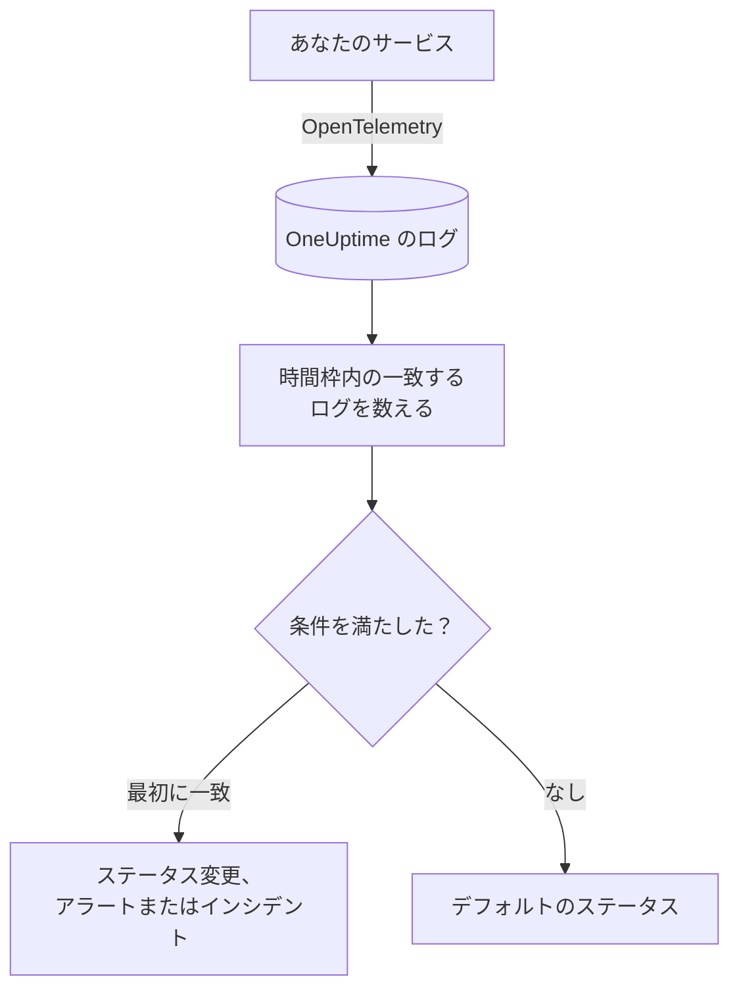
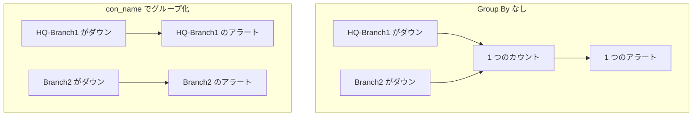

# ログ モニター

ログモニターは、サービスが OneUptime に送るログのうち、フィルター（テキスト、重大度、サービス、属性）に一致するものを時間枠の中で数えます。その数が条件を満たすと、モニターのステータスを変えたり、アラートを作成したり、インシデントを宣言したりします。エラーの急増、特定のエラーメッセージ、ログを出さなくなったサービスに気づくために使います。

:::cards
- [モニターを作成する](#ログモニターを作成する): 数えるログと、アラートを出すタイミングを選びます。
- [評価のしくみ](#評価のしくみ): 時間枠、カウント、1 分ごとのサイクル。
- [条件](#条件): しきい値、異常検知、デフォルト。
- [グループごとのアラート](#グループごとのアラートgroup-by): トンネル、ユーザー、インターフェースごとに 1 つのアラート。
:::

## しくみ



OneUptime は毎分、モニターのフィルターに一致し、時間枠内に届いたログを数えます。その数をモニターの条件と上から順に比べ、最初に一致した条件で何が起こるかが決まります。どれにも一致しなければ、モニターはデフォルトのステータスに戻ります。

## 始める前に

- サービスが OpenTelemetry（または OneUptime が取り込む別のログソース）でログを OneUptime に送っていること。[OpenTelemetry](/docs/telemetry/open-telemetry) を参照してください。
- トンネル名やユーザー名など、ログ行の中の値でフィルターやグループ化をするには、まず [ログパイプライン](/docs/telemetry/log-pipelines) でその値を属性にします。

## ログモニターを作成する

:::steps
### 新しいモニターを始める

**モニター** に移動し、**モニターを作成** をクリックします。

### Logs を選ぶ

**モニターの種類** で **その他のモニターの種類** をクリックし、**テレメトリ** の下の **ログ** を選ぶか、検索ボックスに `logs` と入力します。**名前** を入力し、**次へ** をクリックします。

### 数えるログを選ぶ

**ログモニターの設定** で、**このテキストを含むモニターログ**、**ログの監視期間（時間）**、**ログの重大度** を設定します。空のままのフィルターはすべてのログに一致します。フィルターの下の **ログのプレビュー** に、現在一致するログが表示されます。

### 絞り込む（任意）

**その他の項目** を開くと、テレメトリサービス、インフラエンティティ、属性でフィルターできます。モニター全体で 1 つではなく、トンネル、ユーザー、インターフェースごとに 1 つのアラートを受け取るには、**Group by Attributes** に属性を追加します（[グループごとのアラート](#グループごとのアラートgroup-by) を参照）。

### 条件を設定する

**モニター条件** カードは 2 つの条件から始まります。一致するログがないときはインシデント付きでオフライン、1 件以上一致するときはオンラインです。アラートを受け取りたい内容に合わせて変更します（[条件](#条件) を参照）。

### モニターを作成する

**モニターを作成** をクリックします。モニターは **概要** ページで開き、1 分以内に最初の評価が行われます。
:::

## 何を照会するか

| 項目 | 一致するもの | デフォルト |
| --- | --- | --- |
| **このテキストを含むモニターログ** | 本文にこのテキストを含むログ。大文字と小文字は区別しません。 | 空: すべてのログ |
| **ログの監視期間（時間）** | 直近 5 秒から直近 24 時間までのログ。 | **過去 1 分** |
| **ログの重大度** | 選んだ重大度のいずれかを持つログ。 | 空: すべての重大度 |
| **Group by Attributes** | フィルターではありません。これらの属性の値の組み合わせごとに別々に数えます。 | 空: 1 つのカウント |
| **テレメトリサービスでフィルター**（**その他の項目** 内） | 選んだサービスのいずれかからのログ。 | 空: すべてのサービス |
| **インフラエンティティで絞り込み**（**その他の項目** 内） | 選んだホスト、Pod、コンテナー、その他のエンティティのいずれかからのログ。 | 空: すべてのエンティティ |
| **属性でフィルター**（**その他の項目** 内） | 属性がすべての条件を満たすログ。条件ごとに「等しい」「含む」などの演算子があります。 | 空: 条件なし |

ログが数えられるには、設定したすべてのフィルターに一致する必要があります。

### ログの重大度

各ログは 7 つの重大度のいずれかで保存されます。OpenTelemetry のログでは、重大度はログの重大度番号から決まります。そのため、ロガーが出力したテキストではなく重大度で選んでください。

| 重大度 | OpenTelemetry の重大度番号 |
| --- | --- |
| **トレース** | 1–4 |
| **デバッグ** | 5–8 |
| **情報** | 9–12 |
| **警告** | 13–16 |
| **エラー** | 17–20 |
| **致命的** | 21–24 |
| **指定なし** | それ以外 |

## 評価のしくみ

- **毎分。** ログモニターはプローブでチェックされないため、設定する間隔も **プローブと間隔** ページもありません。
- **1 回の評価で 1 つの数値。** モニターは、すべてのフィルターに一致し、評価前の **ログの監視期間（時間）** 内に届いたログを数えます。**過去 5 分** なら各評価は 5 分さかのぼるため、連続する評価の時間枠は重なります。
- **ログがなければカウントは 0。** ログを出さなくなったサービスは 0 になり、デフォルトのオフライン条件はまさにこれを探します。
- **OneUptime 自身の停止は沈黙ではありません。** OneUptime 自身がデータを受信していなかった時間（再起動中、アップグレード中、遅れの取り戻し中）が時間枠に含まれている間、チェックは待ちます。ステータスは変わらず、インシデントやアラートが開かれたり解決されたりすることもありません。[OneUptime がデータを受信していないとき](/docs/monitor/when-oneuptime-is-not-receiving) を参照してください。
- **条件は上から順に。** 最初に一致した条件で決まるため、最も重大なものを先頭に置きます。グループ化されたモニターは動きが異なり、グループごとにすべての条件をチェックします（[条件の評価が異なる](#条件の評価が異なる) を参照）。

ステータスの変化はすべて、その理由とともにモニターの **ステータスタイムライン** に記録されます。

## 条件

ログモニターの条件の **フィルタータイプ** は 1 つだけです。時間枠内で一致したログの数である **Log Count** です。**フィルター条件** を選び、しきい値の条件なら **値** も選びます。

| フィルター条件 | ログの数が次のとき一致 |
| --- | --- |
| **Greater Than** | 値より大きい |
| **Greater Than Or Equal To** | 値以上 |
| **Less Than** | 値より小さい |
| **Less Than Or Equal To** | 値以下 |
| **Equal To** | 値とちょうど等しい |
| **Anomalously High** | この曜日・時間帯の想定範囲を上回る |
| **Anomalously Low** | その範囲を下回る |
| **Anomalous** | その範囲をどちらかの方向に外れる |

異常の条件には **値** がありません。**感度**（Low、デフォルトの Medium、High）と、14 日（デフォルト）、28 日、60 日、90 日の **ベースラインウィンドウ** を選びます。OneUptime はカウントを 1 分あたりの割合に変え、そのウィンドウ内の同じ曜日・時間帯と比べます。ベースラインの対象はモニターのサービスと重大度だけで、テキストと属性のフィルターは含まれません。その曜日・時間帯の履歴が十分にたまるまで、条件は学習中で発火しません。

新しいログモニターは次の条件から始まります。

| 条件 | フィルター | 効果 |
| --- | --- | --- |
| Check if … is offline | **Log Count** **Equal To** `0` | モニターをオフラインにし、インシデントを宣言します（自動で解決） |
| Check if … is online | **Log Count** **Greater Than** `0` | モニターをオンラインにします |

> [!TIP]
> 沈黙ではなくエラーでアラートを出すには、**ログの重大度** を **エラー** にし、オフライン条件を **Log Count** **Greater Than** 時間枠内で許容できるエラー数、に変更します。

## 実例: エラーの急増

checkout サービスが 5 分間に 50 件を超えるエラーを記録したらインシデントにしたいとします。

- **ログの重大度**: **エラー**
- **ログの監視期間（時間）**: **過去 5 分**
- **テレメトリサービスでフィルター**: `checkout`
- 条件 1: **Log Count** **Greater Than** `50`: モニターをオフラインにし、インシデントを宣言する
- 条件 2: **Log Count** **Less Than Or Equal To** `50`: モニターをオンラインにする

連続する 4 回の評価:

| 時刻 | 直近 5 分のエラーログ | 一致する条件 | 起こること |
| --- | --- | --- | --- |
| 10:00 | 12 | 2 | モニターはオンラインです。 |
| 10:01 | 64 | 1 | モニターがオフラインになり、インシデントが宣言されます。 |
| 10:02 | 81 | 1 | オフラインのままです。インシデントはすでに開いているため、2 つ目は宣言されません。 |
| 10:06 | 9 | 2 | モニターがオンラインに戻り、**インシデントを自動解決** がオンなのでインシデントは自動で解決します。 |

時間枠が重なるため、1 回のエラーの集中が終わったあとも最大 5 分間はカウントが高いままです。より早く回復させたいモニターには短い時間枠を使います。

## グループごとのアラート（Group By）

**Group by Attributes** は、ログモニターのカウントを属性値の組み合わせごと（IPsec トンネルごと、VPN ユーザーごと、ファイアウォールのインターフェースごと）のカウントに分け、グループごとに条件を評価します。これはメトリクスモニターの [Group By](/docs/monitor/metrics-monitor#系列ごとのアラートgroup-by) のログ版です。

### グループごとに 1 つのアラート

Group By がないと、終了した IPsec トンネルを監視するモニターはモニター全体で 1 つのカウントになり、**モニター全体で 1 つのアラート** を出します。そのアラートが開いている間に 2 つ目のトンネルが落ちても、新しいことは何も起きません。モニターはすでにアラート中だからです。

トンネル名で Group By すると、トンネル `HQ-Branch1` の終了で専用のアラートが開き、10 分後のトンネル `Branch2` の終了でその隣に **2 つ目の別のアラート** が開きます。



### 独立した解決

各グループのアラートやインシデントは、それぞれ独立して解決します。あるグループが条件を満たさなくなると（`HQ-Branch1` が時間枠内に終了を記録しなくなると）、そのアラートは解決しますが、`Branch2` のアラートは `Branch2` も止まるまで開いたままです。あるグループの回復で、別のグループのアラートが閉じることはありません。

ログモニターが見るのは状態ではなくイベントです。グループのアラートは、そのグループが時間枠の間ずっと条件を満たすものを何も記録しなかった時点で解決します。トンネルが復旧したかどうかは関係ありません。

### 例: Sophos の IPsec トンネルごとに 1 つのアラート

ここでは、ファイアウォールの syslog 行が対象プレフィックスなしの [Key=Value パーサー](/docs/telemetry/log-pipelines#keyvalue-parser) で属性に分割され、トンネル名が属性 `con_name` になっていることを前提とします。

```text
log_component="IPSec" con_name="HQ-Branch1" status="Terminated" message="IPSec Connection HQ-Branch1 between 10.171.4.117 and 10.171.4.118 for Child HQ-Branch1 terminated."
```

:::steps
1. **ログ** モニターを作成します。
2. **このテキストを含むモニターログ** を `terminated` に、**ログの監視期間（時間）** を **過去 5 分** に設定します。
3. **その他の項目** で、属性フィルター `log_component` = `IPSec` を追加します。
4. **Group by Attributes** に `con_name` を追加します。
5. フィルター **Log Count** **Greater Than** `0` で、タイトル `IPsec tunnel {{con_name}} terminated` のアラートまたはインシデントを作成する条件を追加します。
:::

これで、終了を記録した各トンネルが専用のアラート（`IPsec tunnel HQ-Branch1 terminated`、`IPsec tunnel Branch2 terminated`）を受け取り、それぞれが独立して解決します。

### タイトルと説明のグループ値

Group By の各属性の値は、メトリクス系列のラベルと同じく、アラートやインシデントのタイトル、説明、修復メモで使える [テンプレート変数](/docs/monitor/incident-alert-templating) です。`con_name` でグループ化すると `{{con_name}}` が使えます。ドットを含むキーはパスとして読まれるため、`sophos.con_name` は `{{sophos.con_name}}` になります。タイトルがまだグループを示していない場合はグループが付け加えられ（`IPsec tunnel terminated - Con Name: HQ-Branch1`）、`{{seriesResourceSuffix}}` と `{{seriesResourceSummary}}` はメトリクスモニターと同じように動きます。

### グループの数え方

- 属性は最大 10 個です。値の組み合わせごとに 1 つのグループになります。
- Group By の属性を持たないログは、その属性を **空の値** として数えます。そのため、属性のないログは独自のグループになり、そのアラートにはその属性の値が表示されません。すべてのアラートがグループ値なしで届く場合は、属性のキーを確認してください。対象プレフィックス付きのログパイプラインは `con_name` を `sophos.con_name` として保存します。
- 256 文字を超えるグループ値は 256 文字に切り詰められます。
- 1 回のチェックで評価されるのは最大 **100 グループ** で、ログが最も多い 100 グループです。それより多くのグループが一致した場合、残りはそのチェックでスキップされ、警告が記録されます。それらもカバーするには、モニターのフィルターを絞り込んでください。

### 条件の評価が異なる

- **すべての条件が評価されます。** グループ化されたメトリクスモニターと同じく、異なるグループが同時に異なる条件を満たすことがあります。2 つの条件を満たすグループでも、受け取るアラートは最初の条件からの 1 つだけです。そのため、条件は重大なものから順に並べてください。
- **グループは、時間枠内に何かを記録したときにだけ存在します。** そのため、**Equal To 0** や **Less Than** の条件は、少なくとも 1 回は記録したグループに対してだけ発火します。ログがまったく届かなくなったときにアラートを出すには、Group By なしのモニターを使います。
- **異常検知**（**Anomalously High**、**Anomalously Low**、**Anomalous**）はグループごとには評価されない（ベースラインはモニター全体が対象）ため、グループ化されたモニターではこれらのフィルターは決して一致しません。
- モニターのステータスは、いずれかのグループが満たした最初の条件に従います。どのグループもどの条件も満たさないときは、モニターはデフォルトのステータスに戻ります。

## トラブルシューティング

:::details モニターはオフラインなのに、サービスはログを出している
カウントが 0 だったので、フィルターがサービスの送るどのログにも一致していません。モニターの **条件** ページ（**構成** の下）を開き、**監視条件を編集** をクリックします。**ログのプレビュー** に、フィルターが今選んでいるものが表示されます。よくある原因は、重大度番号ではなくロガーが出力するテキストで重大度を選んでいること（[ログの重大度](#ログの重大度) を参照）、一致しないサービスや属性のフィルター、サービスのログの間隔より短い時間枠です。
:::

:::details 急増したのにアラートが出なかった
条件は上から順にチェックされ、最初の一致で決まります。**Log Count** **Greater Than** `0` のような広い条件が期待した条件より上にあると、先に一致して残りを止めてしまいます。最も重大な条件を一番上に置いてください。
:::

:::details 異常の条件がまったく発火しない
まだ学習中です。比較対象の曜日・時間帯に十分な履歴がありません。**Group by Attributes** を設定したモニターでは異常の条件は決して一致しないため、そこではしきい値を使います。
:::

:::details グループのアラートがグループ値なしで届く
Group By の属性を持たないログは空の値として数えられます。ログエクスプローラーでキーの正確な名前を確認してください。対象プレフィックス付きのログパイプラインは `con_name` を `sophos.con_name` として保存します。
:::

## 次のステップ

:::cards
- [ログパイプライン](/docs/telemetry/log-pipelines): ログ行を属性に分割して、フィルターやグループ化に使います。
- [インシデント & アラート テンプレート](/docs/monitor/incident-alert-templating): グループ値やカウントをタイトルと説明に入れます。
- [メトリクス モニター](/docs/monitor/metrics-monitor): メトリクスで、ホストごとやコンテナーごとにアラートを出します。
- [トレース モニター](/docs/monitor/traces-monitor): 失敗したスパンで同じようにアラートを出します。
:::
