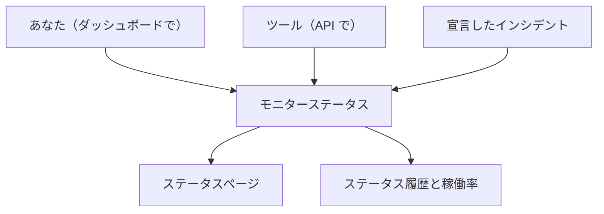

# 手動モニター

手動モニターには自動のチェックがありません。そのステータスは、ダッシュボードまたは API で設定したとおりになります。サードパーティへの依存、物理的なシステム、業務プロセスなど、OneUptime が自分ではチェックできないものを、ステータスページやインシデントで表すために使います。

:::cards
- [作成する](#手動モニターを作成する): ダッシュボードで 1 ステップ。
- [ステータスを変える](#ステータスを更新する): ダッシュボードで、または API を通じて自分のツールから。
- [インシデントとアラート](#インシデントとアラート): インシデントの宣言とステータスの設定を同じ手順で。
:::

## 手動モニターを使う場面

| ユースケース | 説明 |
| --- | --- |
| サードパーティのサービス | 依存しているが直接は監視できない外部サービスのステータスを追跡します。 |
| 物理インフラ | ネットワーク監視のないハードウェアや物理的なシステムを表します。 |
| 業務プロセス | サービスのステータスに影響する、技術以外のプロセスを追跡します。 |
| API によるステータス | 自分のツールに OneUptime API でステータスを設定させます。 |
| ステータスページのプレースホルダー | OneUptime の外で管理されているコンポーネントをステータスページに表示します。 |

ステータスページを公開しているプロバイダーには不要です。[外部ステータスページモニター](/docs/monitor/external-status-page-monitor) がそのページを追ってくれます。

## しくみ

手動モニターには監視間隔、プローブ、条件がありません。ステータスは、あなた、API を使うツール、または宣言したインシデントが変えるまで、設定したとおりのままです。新しいステータスは、モニターが表示されるすべての場所に表示されます。



変更はそれぞれモニターの **ステータスタイムライン** のエントリになるので、稼働率とステータス履歴は他のモニターと同じように保存されます。手動モニターはアクティブなモニターではないため、OneUptime Cloud では請求額に何も加算されません。

## 手動モニターを作成する

:::steps
### 新しいモニターを始める

**モニター** に移動し、**モニターを作成** をクリックします。

### 手動を選ぶ

**モニターの種類** で **その他のモニターの種類** をクリックし、**その他** の下の **手動** を選びます。

### 名前を付けて作成する

**名前** を入力し（必要なら **その他の項目** の下で **説明** も入力し）、**モニターを作成** をクリックします。手動モニターにはそれ以上何も必要ないので、この最初のステップから作成されます。
:::

## ステータスを更新する

### ダッシュボードで

:::steps
1. モニターを開き、サイドメニューの **ステータスタイムライン** をクリックします。
2. **モニターのステータスイベントを作成** をクリックします。
3. **モニターステータス** を選びます。**開始日時** は現在です。変更がもっと前に起きていた場合は、それより前の時刻を設定します。
4. **モニターのステータスイベントを作成** をクリックします。新しいステータスは、モニターと、それを載せているすべてのステータスページにすぐに表示されます。
:::

### API で

新しいステータスをモニターのステータスイベントとして送ります。`ApiKey` ヘッダーにはプロジェクトの [API キー](/docs/api-reference/api-reference) を入れます。

```bash
curl -X POST https://oneuptime.com/api/monitor-status-timeline \
  -H "ApiKey: $ONEUPTIME_API_KEY" \
  -H "Content-Type: application/json" \
  -d '{"data": {"monitorId": "<monitor id>", "monitorStatusId": "<monitor status id>"}}'
```

- `monitorId` はモニターの ID です。モニターのページの **ID** の行をクリックするとコピーできます。
- `monitorStatusId` は設定するステータスです。**モニター → 設定 → モニターステータス** で、そのステータスの行の **ID を表示** を選びます。
- `startsAt` は任意です。省略すると、変更は現在から始まります。
- セルフホスト環境では、`oneuptime.com` ではなく自分のホストにリクエストを送ります。

モニターがすでに持っているステータスを送ると `Monitor Status cannot be same as previous status.` で拒否され、何も記録されません。そのため、実行のたびに報告するツールはこの応答を無視してかまいません。

## インシデントとアラート

手動モニターは、モニターを選ぶすべての場所で、他のモニターと同じように選べます。

- インシデントを宣言し、**モニター** でモニターを選びます。**変更後のモニターステータス** を使うと、宣言と同時にモニターのステータスも設定され、インシデントを解決するとモニターは稼働中に戻ります。ただし、そのモニターに別の未解決のインシデントがある場合は戻りません。[インシデントの宣言](/docs/incidents/declaring-incidents#ステップ-2-影響を受けるリソース) を参照してください。
- 顧客に知らせずにチームで対処すべき問題について、そのモニターのアラートを作成します。
- 手作業で見守っている依存先を顧客に示すために、ステータスページに追加します。

## 次のステップ

:::cards
- [モニターの作成](/docs/monitor/create-monitor): 代わりにチェックしてくれるモニターの種類。
- [外部ステータス ページ モニター](/docs/monitor/external-status-page-monitor): 代わりにプロバイダーのステータスページを自動で追います。
- [ステータス ページ 概要](/docs/status-pages/index): モニターのステータスを顧客に表示します。
:::
