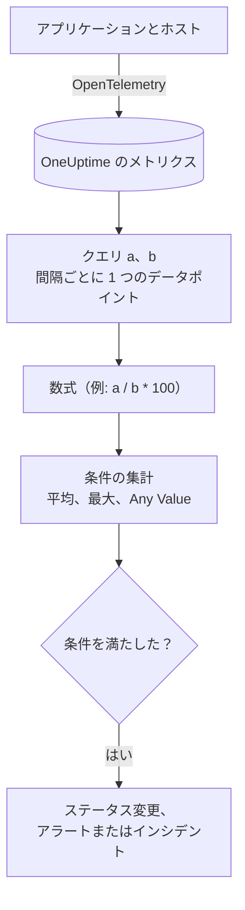

# メトリクス モニター

メトリクスモニターは、アプリケーションとインフラが OneUptime に送るメトリクスを照会し、比率や合計が必要なときは数式で組み合わせ、その結果をローリングの時間範囲で条件と比べます。リクエストレート、エラー率、キューの深さ、CPU、メモリー、ディスク（あらゆる数値の系列）に使えます。グループ化すれば、ホストやコンテナーごとに 1 つのアラートを出せます。

:::cards
- [モニターを作成する](#メトリクスモニターを作成する): クエリ、数式、時間範囲、条件。
- [評価のしくみ](#評価のしくみ): データポイント、数式、条件の集計。
- [実例](#実例-増えていくキュー): 同じデータを集計ごとに見る。
- [系列ごとのアラート](#系列ごとのアラートgroup-by): ホスト、コンテナー、マウントポイントごとに 1 つのアラート。
:::

## しくみ

OneUptime は毎分、モニターの各メトリクスクエリをその時間範囲で実行します。クエリは時間の区切りごとに 1 つのデータポイントを返し、数式はクエリを区切りごとに組み合わせます。そのあと各条件が、チェック対象のクエリまたは数式のデータポイントを 1 つにまとめ（平均、最大、または各ポイントのテスト）、その結果をしきい値と比べます。

## 始める前に

- アプリケーションやインフラが OpenTelemetry でメトリクスを OneUptime に送っていること。[OpenTelemetry](/docs/telemetry/open-telemetry) を参照してください。
- メトリクスの名前と、フィルターやグループ化に使う属性を把握しておきます。**メトリクス** と **グループ化** のリストには、OneUptime が受信済みの名前と属性だけが表示されます。

## メトリクスモニターを作成する

:::steps
### 新しいモニターを始める

**モニター** に移動し、**モニターを作成** をクリックします。

### Metrics を選ぶ

**モニターの種類** で **その他のモニターの種類** をクリックし、**テレメトリ** の下の **メトリクス** を選ぶか、検索ボックスに `metrics` と入力します。**名前** を入力し、**次へ** をクリックします。

### 時間範囲を選ぶ

**メトリクスモニターの設定** で **時間範囲** を選びます。各評価がどこまでさかのぼるかです。最初は **Past 1 Minute** です。

### メトリクスのクエリを追加する

**メトリクスを選択** で **メトリクス** と、その **集計の基準** を選びます。属性でフィルターしたり **グループ化** したりするには **フィルターとグループ化** を開きます。クエリをもう 1 つ追加するには **メトリクスを追加** を、組み合わせるには **数式を追加** をクリックします。クエリの下のチャートで時間範囲をプレビューでき、条件がチェックする値を確認できます。

### 条件を設定する

**モニター条件** では、各条件がチェックする **メトリクス**（クエリまたは数式）、その **集計**、**条件**、**しきい値** を選びます。新しいモニターが最初に持つ条件は [条件](#条件) を参照してください。

### モニターを作成する

**モニターを作成** をクリックします。モニターは **概要** ページで開き、1 分以内に最初の評価が行われます。
:::

## 何を照会するか

### メトリクスのクエリ

| 項目 | 役割 | デフォルト |
| --- | --- | --- |
| **メトリクス** | 照会するメトリクス。 | 必須 |
| **集計の基準** | 各時間区切りの値を 1 つのデータポイントにまとめる方法: 平均、合計、最小、最大、カウント、またはパーセンタイル（P50、P75、P90、P95、P99）。 | 平均 |
| **属性で絞り込み**（**フィルターとグループ化** 内） | 属性がこれらの条件を満たす系列だけ。 | フィルターなし |
| **グループ化**（**フィルターとグループ化** 内） | これらの属性の一意な値ごとに 1 つの系列（[系列ごとのアラート](#系列ごとのアラートgroup-by) を参照）。 | 1 つの系列 |

各クエリと数式には、追加した順に変数（`a`、`b`、`c` など）が割り当てられます。

### 数式

数式は、クエリの変数を `+`、`-`、`*`、`/`、`%`、`^` とかっこで、時間区切りごとに組み合わせます。変数は先頭に `$` を付けても付けなくても書けます。

- `a / b * 100`: `a` が `b` に占める割合（パーセント）
- `a + b`: 2 つのメトリクスの合計
- `a - b`: 両者の差

### ローリング時間枠

**時間範囲** は、各評価がどこまでさかのぼるかを決めます: **Past 1 Minute**、**過去 5 分**、**Past 10 Minutes**、**過去 15 分**、**過去 30 分**、**過去 1 時間**、**過去 2 時間**、**過去 3 時間**、**Past 6 Hours**、**Past 12 Hours**、**過去 1 日**、**過去 2 日**、**Past 3 Days**、**Past 7 Days**、**Past 14 Days**、**Past 30 Days**、**Past 60 Days**、**Past 90 Days**、**Past 180 Days**、**Past 365 Days**。

範囲が長いほど各時間区切りが広くなり、1 つのデータポイントが表す時間も長くなります。

| 時間範囲 | データポイント 1 つあたり |
| --- | --- |
| Past 1 Minute から 過去 3 時間 | 1 分 |
| Past 6 Hours、Past 12 Hours | 5 分 |
| 過去 1 日 | 15 分 |
| 過去 2 日、Past 3 Days | 30 分 |
| Past 7 Days | 1 時間 |
| Past 14 Days、Past 30 Days | 1 日 |
| Past 60 Days から Past 180 Days | 1 週間 |
| Past 365 Days | 1 か月 |

## 評価のしくみ

- **毎分。** メトリクスモニターはプローブでチェックされないため、設定する間隔も **プローブと間隔** ページもありません。
- **まずクエリ、次に数式。** 各クエリは、その **集計の基準** を使って、時間範囲の時間区切りごとに 1 つのデータポイントを返します。数式は、クエリのデータポイントから区切りごとに計算されます。
- **そのあと条件の集計。** 各条件は、その **メトリクス** のデータポイントを、しきい値と比べる値にまとめます。

| 集計 | 条件のチェック対象 |
| --- | --- |
| 平均 | データポイントの平均 |
| 合計 | データポイントの合計 |
| Maximum Value | 最も高いデータポイント |
| Minimum Value | 最も低いデータポイント |
| All Values | すべてのデータポイント: すべてが条件を満たす必要がある |
| Any Value | すべてのデータポイント: 1 つでも条件を満たせばよい |

- **条件は上から順に。** Group By のないモニターでは最初に一致した条件で決まるため、最も重大なものを先頭に置きます。グループ化されたモニターは、系列ごとにすべての条件をチェックします（[条件の評価が異なる](#条件の評価が異なる) を参照）。
- **データがないことはゼロではありません。** 時間範囲内にクエリがデータポイントを返さない場合、条件は **その他の項目** の **データがない場合** 設定に従います: **Ignore**（デフォルト。条件は一致しない）、**Treat As Zero**、**トリガー**。
- **OneUptime 自身の停止は沈黙ではありません。** OneUptime 自身がデータを受信していなかった時間（再起動中、アップグレード中、遅れの取り戻し中）が時間範囲に含まれている間、チェックは待ちます。**データがない場合** の設定にかかわらず、ステータスは変わらず、インシデントやアラートが開かれたり解決されたりすることもありません。[OneUptime がデータを受信していないとき](/docs/monitor/when-oneuptime-is-not-receiving) を参照してください。

## 条件

これらのモニターは常に **Metric Value**、つまり設定したメトリクスクエリまたは数式の集計値を評価します。条件のフォームにはフィルタータイプの選択はなく、**メトリクス**、**集計**、**条件**、**しきい値** が表示されます。メトリクスに単位がある場合は、しきい値の横で単位を選びます。

| 条件 | 値が次のとき一致 |
| --- | --- |
| **Greater Than** | しきい値より大きい |
| **Greater Than Or Equal To** | しきい値以上 |
| **Less Than** | しきい値より小さい |
| **Less Than Or Equal To** | しきい値以下 |
| **Equal To** | しきい値とちょうど等しい |
| **Anomalously High** | この曜日・時間帯の想定範囲を上回る |
| **Anomalously Low** | その範囲を下回る |
| **Anomalous** | その範囲をどちらかの方向に外れる |

異常の条件にはしきい値がありません。代わりにフォームには **感度**（Low、デフォルトの Medium、High）と **ベースラインウィンドウ**（デフォルトの 14 日、28 日、60 日、90 日）が表示され、各データポイントを、そのウィンドウから作った同じ曜日・時間帯のベースラインと比べます。その曜日・時間帯の履歴が十分にたまるまで、条件は学習中でアラートを出しません。

新しいメトリクスモニターは、最初のクエリに対する 2 つの条件から始まります。どちらも集計は **Any Value** です。

| 条件 | 条件 | 効果 |
| --- | --- | --- |
| Check if … is offline | **Equal To** `0` | モニターをオフラインにし、インシデントを宣言します（自動で解決） |
| Check if … is online | **Greater Than** `0` | モニターをオンラインにします |

> [!NOTE]
> オフライン条件は、報告された値 0 で発火するもので、沈黙では発火しません。メトリクスが届かなくなったときにアラートを出すには、その **データがない場合** を **トリガー** にします。

## 実例: 増えていくキュー

checkout のキューが深いままのときにインシデントにしたいとします。クエリ `a` はゲージ `checkout.queue.depth` で、**集計の基準** は最大、**時間範囲** は **過去 5 分** です。1 回の評価で、次の 1 分ごとのデータポイント 5 つが見えます。

| 分 | 10:01 | 10:02 | 10:03 | 10:04 | 10:05 |
| --- | --- | --- | --- | --- | --- |
| `a` | 640 | 980 | 1,500 | 1,620 | 1,100 |

**メトリクス** `a`、**条件** **Greater Than**、**しきい値** `1000` の条件は、**集計** ごとに異なる答えを出します。

| 集計 | 1,000 と比べる値 | 一致？ |
| --- | --- | --- |
| 平均 | 1,168 | はい |
| 合計 | 5,840 | はい |
| Maximum Value | 1,620 | はい |
| Minimum Value | 640 | いいえ |
| All Values | 640、980、1,500、1,620、1,100 | いいえ: 2 つのポイントが 1,000 を超えていない |
| Any Value | 640、980、1,500、1,620、1,100 | はい: 1,500 が超えている |

**平均** は持続的な滞留でアラートを出し、1 分だけ深い状態は無視します。**All Values** は範囲内のすべての分が深くなるまで待ちます。**Any Value** は最初の深い 1 分でアラートを出します。

## 系列ごとのアラート（Group By）

メトリクスクエリの **グループ化** は、そのクエリを属性の一意な値ごと（ホストごと、コンテナーごと、マウントポイントごと）の系列に分け、Group By を設定したモニターは各系列を独立して評価します。この 1 つの設定が、「フリート全体が不調」と「`prod-db-01` が不調」の違いになります。

### グループごとに 1 つのアラート

Group By を `host.name` にすると、50 台のホストを監視するディスク使用率モニターは **しきい値を超えたホストごとに 1 つのアラート（またはインシデント）** を出します。ホスト A がいっぱいになると専用のアラートが開き、10 分後にホスト B がいっぱいになると、その隣に 2 つ目の別のアラートが開きます。

Group By がないと、同じモニターは 1 つのスカラーになります。クエリはすべてのホストを 1 つの数値にまとめ、モニターは **モニター全体で 1 つのアラート** を出します。そのアラートが開いている間に 2 台目のホストがしきい値を超えても何も起きず（モニターはすでにアラート中で、新しく出すものがないため）、オンコールのエンジニアはホスト B のことを知りません。**ホストごとのアラートは Group By の設定で得られます。** ホストごと、コンテナーごと、マウントポイントごとに呼び出されたいなら、設定してください。

### 独立した解決

グループごとのアラートは、それぞれ自分のグループを追います。ホスト A がしきい値を下回ると、そのアラートは自動で解決し、ホスト B のアラートはホスト B が回復するまで開いたままです。あるグループの回復で、別のグループのアラートが閉じることはありません。

### 条件の評価が異なる

- **グループ化されたモニターはすべての条件を評価します。** そのため、重大度の段階が異なるグループで同時に発火することがあります。「Critical: 95 より大きい」を「Warning: 80 より大きい」の上に置くと、同じチェックで 96% のホストは重大なアラートを、85% のホストは警告のアラートを開きます。両方の段階を超えたホストでも受け取るアラートは、最初に一致した条件からのちょうど 1 つです。そのため、**条件は最も重大なものから順に並べてください**。
- **グループ化されていないモニターは、最初に一致した条件で止まります。** 発火するのはその条件だけです。これも、アラートの条件を正常な条件より上に置く理由です。広い正常な条件を先頭に置くと、ほぼ毎回のチェックで一致し、その下のアラート条件が評価されることがなくなります。

| ホスト | ディスク使用率 | Critical (> 95) | Warning (> 80) | 出されるアラート |
| --- | --- | --- | --- | --- |
| `prod-db-01` | 96% | はい | はい | Critical |
| `prod-db-02` | 85% | いいえ | はい | Warning |
| `prod-db-03` | 40% | いいえ | いいえ | なし |

### グループ化する属性の選び方

誰かを呼び出す理由になる、本当に別個のものを示す属性でグループ化します。フリート全体のホストメトリクスならホストの属性、コンテナーのメトリクスならコンテナーや Pod の属性、ファイルシステムやディスク I/O のメトリクスならマウントポイントやデバイスの属性、ネットワークのメトリクスならインターフェースの属性です。**グループ化** のドロップダウンにはコレクターが実際に送っている属性が入るため、キーを手入力するのではなくリストから選んでください。

すでにシステム全体で 1 つのスカラーであるメトリクス（クラスター全体のリーダーフラグ、スケジューラーの滞留、単一ホストのモニターでのそのホストの CPU）はグループ化しないでください。グループ化しても系列はちょうど 1 つで、変わるのはアラートのタイトルだけです。

グループ化の属性の値は、アラートやインシデントのタイトル、説明、修復メモで [テンプレート変数](/docs/monitor/incident-alert-templating) としても使えます。`host.name` でグループ化すると、タイトルを `Disk almost full on {{host.name}}` にできます。

## トラブルシューティング

:::details チャートではしきい値を超えているのに、モニターがアラートを出さなかった
まず条件の **集計** を確認します。**All Values** は時間範囲内のすべてのデータポイントがしきい値を超えたときだけ一致し、**平均** は短いスパイクを平らにします。次に、条件の **メトリクス** が意図したクエリまたは数式か（`a` は数式 `c` ではありません）、しきい値が思っている単位になっているかを確認します。
:::

:::details メトリクスが届かなくなったのに何も起きなかった
データポイントのない時間範囲は値 0 ではありません。**データがない場合** がデフォルトの **Ignore** のままだと、条件は一致しません。沈黙でアラートを出すには、条件の **その他の項目** で **トリガー** に設定します。
:::

:::details フリート全体で 1 つのアラートしか届かない
クエリに **グループ化** がないため、すべてのホストが 1 つの数値にまとめられています。クエリをホスト、コンテナー、マウントポイントの属性でグループ化してください（[系列ごとのアラート](#系列ごとのアラートgroup-by) を参照）。
:::

:::details 異常の条件がまったく発火しない
まだ学習中です。比較対象の曜日・時間帯に、**ベースラインウィンドウ** 内の十分な履歴がまだありません。
:::

## 次のステップ

:::cards
- [インシデント & アラート テンプレート](/docs/monitor/incident-alert-templating): ホストと値をアラートのタイトルに入れます。
- [ログ モニター](/docs/monitor/logs-monitor): ログの量と内容で、グループごとにアラートを出します。
- [ホスト モニター](/docs/monitor/host-monitor): ホスト向けの CPU、メモリー、ディスクの既製チェック。
- [OpenTelemetry](/docs/telemetry/open-telemetry): メトリクスを OneUptime に送ります。
:::
