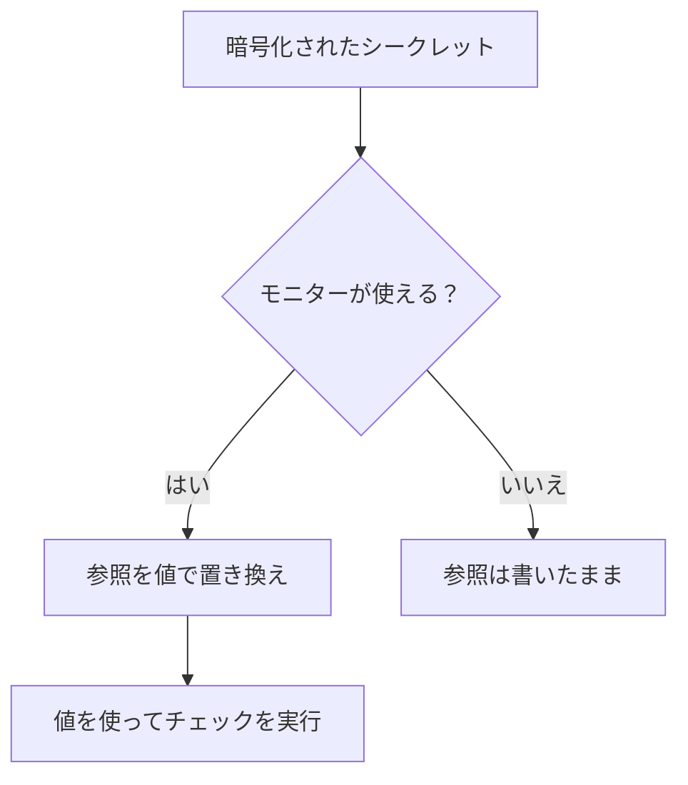

# モニター シークレット

モニターシークレットは、モニターが必要とするパスワード、API キー、トークンを、モニター自体の外に置いておくためのものです。値を一度だけ暗号化して保存し、どのモニターが使えるかを選び、モニターが必要とする場所で `{{monitorSecrets.NAME}}` として参照します。

:::cards
- [シークレットを追加する](#シークレットを追加する): 値を保存し、誰が使えるかを選びます。
- [アクセスを選ぶ](#シークレットを使えるモニターを選ぶ): すべてのモニター、特定のモニター、ラベル付きのモニター。
- [シークレットを使う](#シークレットを使う): `{{monitorSecrets.NAME}}` が使える場所。
:::

## シークレットがモニターに届くしくみ

シークレットは暗号化して保存され、保存した後は二度と表示されません。OneUptime はモニターをプローブに渡す前に、モニターが使えるそれぞれの参照を復号した値で置き換えます。モニターが使えない参照は、書いたまま残ります。

チェックを実行するプローブは値を受け取ります。そのため、シークレットを使うモニターは、信頼できるプローブで実行するべきです。OneUptime 自身のプローブか、自分で運用する [カスタムプローブ](/docs/probe/custom-probe) です。

## 始める前に

- **Growth プラン以上**（OneUptime Cloud の場合）。セルフホスト環境にはプランはありません。
- **シークレットを管理できるロール**: Project Owner、Project Admin、または Create Monitor Secret 権限を持つカスタムロール。

## シークレットを扱う

### シークレットを追加する

:::steps
1. **モニター → 設定 → シークレット** に移動し、**モニターシークレットを作成** をクリックします。
2. **名前** と **シークレットの値** を入力します。名前は参照に使うもので、たとえば `ApiKey` です。使えるのは英字、数字、ハイフン（`-`）、アンダースコア（`_`）だけで、1 つのプロジェクト内で 2 つのシークレットが同じ名前を持つことはできません。
3. **アクセス** ステップで、どのモニターが使えるかを選び（次のセクションを参照）、**モニターシークレットを作成** をクリックします。
:::

> [!IMPORTANT]
> シークレットは暗号化され、安全に保存されます。シークレットの値は保存後に二度と表示されません。表にも、編集フォームにも、API にも表示されません。値をなくした場合は、元の入手先から取得し直して、もう一度設定する必要があります。シークレットをローテーションするには、その行の **シークレット値を更新** ボタンを使います。削除して作り直す必要はありません。

### シークレットを使えるモニターを選ぶ

各シークレットには、3 つのアクセスオプションのいずれかがあります。

| オプション | シークレットを使えるモニター | 用途 |
| --- | --- | --- |
| **すべてのモニター** | プロジェクト内のすべてのモニター。後で作成するモニターも含みます。 | 多くのモニターで共有する認証情報。 |
| **特定のモニター** | 選んだモニターだけ。これがデフォルトで、これらのオプションができる前に作成されたシークレットもこの動作になります。 | 1 つまたは少数のモニター向けの認証情報。 |
| **ラベル付きのモニター** | 選んだラベルを 1 つ以上持つモニター。それらのラベルのいずれかをモニターに追加するとアクセスでき、ラベルを外すと、そのモニターの次の実行からアクセスできなくなります。 | 時間とともに変わるモニターのグループ向けの認証情報。 |

オプションは、シークレットの行の **編集** でいつでも変更できます。保持されるのは選んだオプションのリストだけです。**すべてのモニター** に切り替えるとシークレットのモニターとラベルのリストが空になり、**特定のモニター** と **ラベル付きのモニター** を切り替えると、切り替える前のリストが空になります。

シークレットが別のプロジェクトのモニターで使えることはありません。

> [!WARNING]
> シークレットを使えるモニターを編集できる人は誰でも、そのシークレットをモニターの接続先に送れます。**すべてのモニター** の場合、それはプロジェクトでモニターを作成または編集できるすべての人です。**ラベル付きのモニター** の場合は、それらのラベルのいずれかをモニターに追加できる人も含まれます。

API では、アクセスオプションは `monitorAccess` フィールドで、値は `All Monitors`、`Specific Monitors`、`Monitors With Labels` のいずれかです。リストは `monitors` と `labels` のフィールドに入ります。`monitorAccess` なしで作成したシークレットは `Specific Monitors` になります。

### シークレットを使う

シークレットを使うには、シークレットを受け付けるフィールドに `{{monitorSecrets.SECRET_NAME}}` と書きます。たとえば、リクエストヘッダー `Authorization: Bearer {{monitorSecrets.ApiKey}}` は、シークレット `ApiKey` の値を送ります。

シークレットを受け付けるモニターの種類とフィールドは次のとおりです。

| モニターの種類 | フィールド |
| --- | --- |
| API | URL、リクエストのヘッダーとボディ、クライアント証明書、秘密鍵、パスフレーズ（mTLS） |
| ウェブサイト | URL、クライアント証明書、秘密鍵、パスフレーズ（mTLS） |
| Ping, IP, ポート, NTP, SSL 証明書 | チェックするホストまたは URL |
| DNS | ドメイン名と DNS サーバー |
| DNSSEC, ドメイン | ドメイン名 |
| SQL クエリ | ホスト、データベース名、ユーザー名、パスワード、クエリ |
| データベースのヘルス | ホスト、データベース名、ユーザー名、パスワード |
| 外部ステータスページ | ステータスページの URL |
| シンセティックモニター, Custom JavaScript Code | スクリプト |
| ネットワークデバイス | SNMP コミュニティ文字列、SNMPv3 の認証キーとプライバシーキー |

シンセティックモニターや Custom JavaScript Code のモニターのスクリプトが実行される前にシークレットが埋められるので、スクリプト内の `{{monitorSecrets.ApiKey}}` のような参照は、実行時には復号された値になっています。

モニターが使えないシークレットを参照した場合、その参照はそのまま残り、値で置き換えられません。

保存する前にモニターをテストすると、埋められるのは **すべてのモニター** で使えるシークレットだけです。新しいモニターはまだどのリストにも載っておらず、ラベルもないためです。モニターを保存した後は、テストでもモニターが使えるすべてのシークレットが使われます。

## トラブルシューティング

:::details モニターが `{{monitorSecrets.NAME}}` を文字どおりに送る
モニターがそのシークレットを使えないか、名前が一致していません。その行の **編集** でシークレットのアクセスオプションを確認し、参照の名前がシークレットの名前と完全に同じであることを確認します。
:::

:::details 新しいモニターをテストしてもシークレットが埋められない
モニターを保存する前は、**すべてのモニター** で使えるシークレットだけが埋められます。モニターを保存してから、もう一度テストします。
:::

:::details フィールドがシークレットを無視する
シークレットを受け付けるのは上の表のフィールドだけです。それ以外のフィールドでは、`{{monitorSecrets.NAME}}` は書いたまま送られます。
:::

## 次のステップ

:::cards
- [API モニター](/docs/monitor/api-monitor): シークレットをリクエストヘッダーで送ります。
- [合成モニター](/docs/monitor/synthetic-monitor): ブラウザースクリプトの中でシークレットを使います。
- [SQL クエリ モニター](/docs/monitor/sql-monitor): データベースのパスワードを暗号化したままにします。
:::
