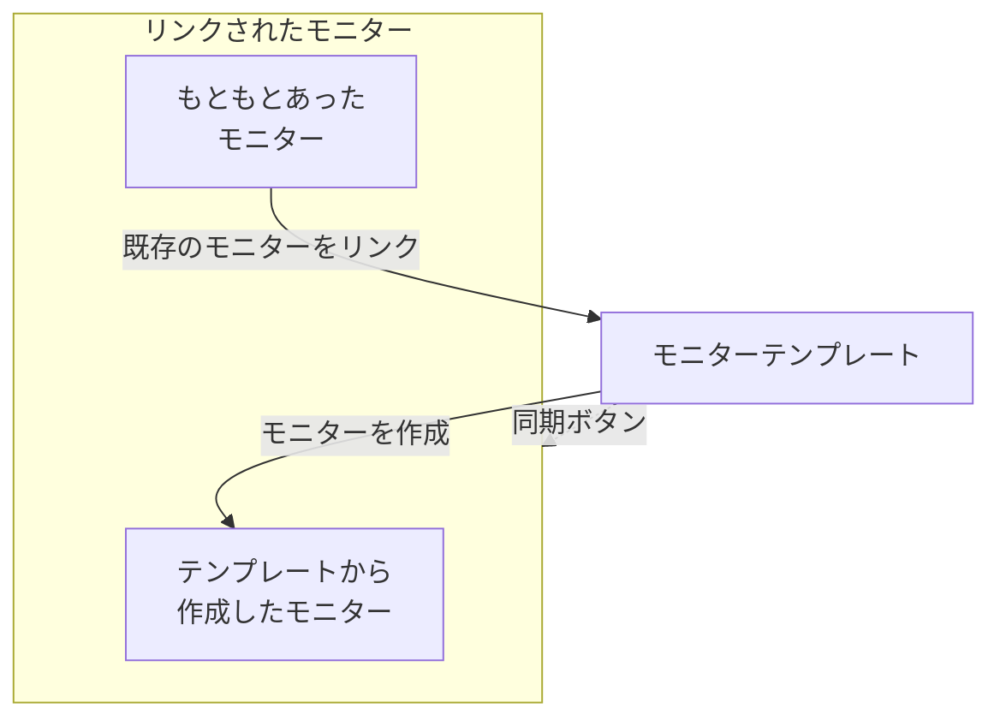

# モニターテンプレート

モニターテンプレートは、保存されたモニター構成（種類、条件、間隔、ラベル、カスタムフィールドのデフォルト値）で、ここから 1 クリックでモニターを作成できます。テンプレートから作成された、またはテンプレートにリンクされたモニターはつながったままです。テンプレートを変更してから、その変更をすべてのモニターに同期します。すべてのサービスで同じヘルスチェックを行う場合や、本番環境とステージング環境で同じ API チェックを行う場合など、多くのモニターを同じように動かしたいときにテンプレートを使います。

:::cards
- [テンプレートを作成する](#テンプレートを作成する): モニターの作成と同じく 4 ステップです。
- [テンプレートからモニターを作成する](#テンプレートからモニターを作成する): 1 クリックで作成するか、既存のモニターをリンクします。
- [変更を同期する](#リンクされたモニターに変更を同期する): 同期ボタンごとにコピーされる内容。
- [モニターごとの値を保持する](#モニターごとの値を保持する): 宛先やヘッダーを同期から保護します。
:::

## テンプレートのしくみ

テンプレート自体は何も監視しません。モニターはテンプレートから作成されるか、テンプレートにリンクされ、テンプレートのページに **リンクされたモニター** として一覧表示されます。テンプレートを変更しても、同期するまでそれらのモニターは何も変わりません。同期ボタンはそれぞれテンプレートの一部をリンクされたすべてのモニターにコピーし、保護したフィールドは各モニター自身の値を保ちます。



## 始める前に

- **テンプレートを作成できるロール**: Project Owner、Project Admin、Project Member、Monitor Admin、Monitor Member のいずれか、または Create Monitor Template 権限を持つカスタムロール。テンプレートの変更には同じロール、または Edit Monitor Template 権限が必要です。
- **リンクされたモニターを更新する権限。** 同期はあなたとしてリンクされた各モニターに書き込み、あなたの権限が及ばないモニターはスキップします。

## テンプレートを作成する

:::steps
### テンプレート一覧を開く

**モニター → 設定 → テンプレート** に移動し、**モニターテンプレートを作成** をクリックします。

### テンプレートに名前を付ける

**テンプレート情報** で、`Production API Health` のような **テンプレート名** と **テンプレートの説明** を入力し、**次へ** をクリックします。

### モニターのデフォルトを設定する

**モニターのデフォルト** で、モニターの作成と同じ選択画面から **モニターの種類** を選びます。必要なら **デフォルトのモニター名** を入力します。空のままにすると、各モニターは監視するリソースにちなんで名前が付けられます。**デフォルトのモニター説明** と **ラベル** は **その他の項目** の中にあります。**次へ** をクリックします。

### 条件と間隔を設定する

**条件** で、[モニターの作成](/docs/monitor/create-monitor#条件) と同じように、チェック対象と条件を入力します。上部の **テンプレートの同期設定** カードでは、フィールドを同期から保護できます（[モニターごとの値を保持する](#モニターごとの値を保持する) を参照）。プローブがチェックする種類では、最後のステップ **間隔** で **監視間隔** を尋ねられます。最後のステップで **モニターテンプレートを作成** をクリックします。
:::

テンプレートが一覧に追加されます。開くと、各部分のカードが並ぶページが表示されます。**テンプレート情報**、**モニターのデフォルト**、**監視条件**、**監視間隔**（**最小プローブ合意数** を含む）、**ラベル**、**カスタムフィールドのデフォルト値**（プロジェクトにモニターのカスタムフィールドがある場合）、**リンクされたモニター** です。各部分はそれぞれのカードで変更します。たとえば **条件を編集** や **間隔を編集** を使います。

## テンプレートからモニターを作成する

- **新しいモニター。** 一覧のテンプレートの行で **モニターを作成** をクリックするか、テンプレートのページで **テンプレートからモニターを作成** をクリックします。**モニターを作成** がテンプレートの種類と設定が入力された状態で開きます。必要なところを変更してから作成します。新しいモニターはテンプレートにリンクされます。
- **すでにあるモニター。** **リンクされたモニター** で **既存のモニターをリンク** をクリックし、モニターを選びます。同期するまで、それぞれの設定は保たれます。

**カスタムフィールドのデフォルト値** で設定した値は、テンプレートから作成されるすべてのモニターに書き込まれます。自動インポートルールやアラートポリシーがテンプレートから作成するモニターも含みます。

## リンクされたモニターに変更を同期する

テンプレートを編集しても、変わるのはテンプレートだけです。変更をリンクされたモニターにコピーするには、変更したカードの同期ボタンを使います。各ボタンには **Sync Criteria to 3 Linked Monitors** のように対象のモニター数が表示され、何もリンクされていない間はグレーアウトしています。同期は取り消せません。

| ボタン | リンクされた各モニターにコピーするもの | 変更しないもの |
| --- | --- | --- |
| **条件をリンクされたモニターに同期** | 条件と、宛先やリクエストオプションなどのステップ設定（保護されたフィールドを除く） | 監視間隔、最小プローブ合意数、名前、説明、ラベル、カスタムフィールドの値 |
| **間隔をリンクされたモニターに同期** | 監視間隔と最小プローブ合意数 | 条件、名前、説明、ラベル、カスタムフィールドの値 |
| **ラベルをリンクされたモニターに同期** | ラベルのみ | それ以外のすべて |
| **リンクされたモニターにカスタムフィールドを同期** | テンプレートにデフォルト値があるカスタムフィールド（各モニターの値を置き換えます） | テンプレートが空のままにしているカスタムフィールドと、それ以外のすべて |

1 つのモニターだけを同期するには、**リンクされたモニター** のその行で **テンプレートから同期** をクリックします。条件とステップ設定（保護されたフィールドを除く）、監視間隔、最小プローブ合意数、ラベルがコピーされ、モニターの名前、説明、カスタムフィールドの値はそのまま残ります。**テンプレートからリンク解除** はモニターの接続を切ります。モニターの設定はそのまま残ります。

同期のあと、更新されたモニターの数が概要に表示されます。**一部同期済み** は、リンクされたモニターの一部にまだ以前の構成が残っていることを意味します。通常は、あなたの権限がそれらに及んでいないためです。

## モニターごとの値を保持する

条件の同期では、宛先、リクエストヘッダー、タイムアウトなどのステップ設定もコピーされます。それらのフィールドを保護すれば、リンクされた各モニターは自身の値を保ちます。

:::steps
### テンプレートを開く

**モニター → 設定 → テンプレート** に移動し、テンプレートを開きます。

### 条件を編集する

**監視条件** カードで **条件を編集** をクリックします。

### フィールドを保護する

**テンプレートの同期設定** で、リンクされたモニターに残したい各フィールドの横にある **このフィールドを同期しない** にチェックを入れます。

### 保存する

変更を保存します。**監視条件** カードと各同期の確認画面に、保護されたフィールドが一覧表示されます。

### 同期する

**条件をリンクされたモニターに同期** を使うか、個々のリンクされたモニターで **テンプレートから同期** を使います。
:::

たとえば API テンプレートで **Monitor destination** と **Request headers** を保護します。本番とステージングのモニターはそれぞれの URL とヘッダーを保ちつつ、どちらもテンプレートの更新された条件とほかの保護されていない設定を受け取ります。

使えるオプションはモニターの種類によって異なります。宛先とポート、HTTP リクエストのオプション、データベース接続、DNS 設定、インフラストラクチャのセレクター、テレメトリのクエリなどがあります。クライアント証明書とその秘密鍵のように関連する認証情報は、まとめて保持されます。

### 除外の動作

- チェックを入れたフィールドは、既存の各モニターの現在の値を保ちます。空の値や未設定の値も含みます。リクエストヘッダーなどのコレクションは丸ごと保持されます。
- チェックを入れていないフィールドは、引き続きテンプレートから同期されます。保護したフィールドのチェックを外して保存すると、次の同期でテンプレートの値がコピーされます。
- 除外は一括同期と個別同期の両方に適用されます。除外はテンプレートに保存され、同期のたびに選ぶものではありません。
- 新しいモニターは引き続きテンプレートのフィールド値から始まります。除外が影響するのは既存のモニターへの同期だけです。
- 条件は常に同期されます。条件だけの同期では、監視間隔、ラベル、そのほかのモニター単位の設定は変わりません。
- 既存のテンプレートには、設定するまでフィールドの除外はありません。ネットワークデバイスのモニターは、引き続き自身のデバイスとの紐付けを自動で保ちます。

複数ステップのテンプレートでは、保護された値はステップ ID で対応付けられます。別々に作成された単一ステップのモニターも、単一ステップのテンプレートを受け取れます。保護されたステップを対応付けられない場合、どのモニターも更新される前に同期は拒否されます。そのため、新しいステップや並べ替えたステップが、誤ってほかのステップの宛先や認証情報をコピーすることはありません。

> [!IMPORTANT]
> 保存済みテンプレートのモニターの種類を（**モニターのデフォルトを編集** で）変更する前に、**条件を編集** で新しい種類に当てはまらない除外を外してください。テンプレートの除外はすべて、そのモニターの種類に存在するものでなければなりません。

## API での設定

テンプレートの各ステップは、`MonitorStep.value` オブジェクトの中で `doNotSyncFields` 配列を受け付けます。API モニターで宛先とヘッダーのコレクション全体を保護するには、次のようにします。

```json title="monitorSteps (excerpt)"
{
  "_type": "MonitorSteps",
  "value": {
    "monitorStepsInstanceArray": [
      {
        "_type": "MonitorStep",
        "value": {
          "id": "<step id>",
          "doNotSyncFields": ["monitorDestination", "requestHeaders"]
        }
      }
    ]
  }
}
```

サポートされているすべてのステップ設定を同期するには、配列を省略するか `[]` にします。サポートされていないフィールド名や、テンプレートのモニターの種類に当てはまらないフィールドは拒否されます。同期を制御するのはテンプレートの配列です。リンクされたモニター側の同様のメタデータで上書きされることはありません。

:::details モニターの種類ごとの doNotSyncFields のフィールド名
| モニターの種類 | フィールド名 |
| --- | --- |
| ウェブサイト、API、Ping、IP、ポート、SSL 証明書、NTP | `monitorDestination`, `requestTimeoutInMs`, `retryCount` |
| API のみ | `requestHeaders`, `requestType`, `requestBody` |
| ウェブサイトと API | `doNotFollowRedirects`, `allowSelfSignedCertificates`, `tlsClientAuthentication`（クライアント証明書、鍵、パスフレーズをまとめて） |
| ポート、NTP | `monitorDestinationPort` |
| シンセティックモニター、Custom JavaScript Code | `customCode` |
| シンセティックモニター | `browserTypes`, `screenSizeTypes`, `retryCountOnError` |
| DNS | `dnsMonitor.queryName`, `dnsMonitor.recordType`, `dnsMonitor.resolver`（DNS サーバーとポートをまとめて）, `dnsMonitor.timeout`, `dnsMonitor.retries` |
| ドメイン | `domainMonitor.domainName`, `domainMonitor.lookupMethod`, `domainMonitor.timeout`, `domainMonitor.retries` |
| DNSSEC | `dnssecMonitor.domainName`, `dnssecMonitor.resolvers`, `dnssecMonitor.checkNameserverConsistency`, `dnssecMonitor.signatureExpiryWarningDays`, `dnssecMonitor.timeout`, `dnssecMonitor.retries` |
| SQL クエリ | `sqlMonitor.connection`, `sqlMonitor.connectionTimeoutInMs`, `sqlMonitor.statementTimeoutInMs`, `sqlMonitor.query`, `sqlMonitor.maxRows` |
| データベースのヘルス | `databaseMonitor.connection`, `databaseMonitor.connectionTimeoutInMs`, `databaseMonitor.statementTimeoutInMs`, `databaseMonitor.enabledMetricGroups` |
| 外部ステータスページ | `externalStatusPageMonitor.statusPageUrl`, `externalStatusPageMonitor.provider`, `externalStatusPageMonitor.components`, `externalStatusPageMonitor.timeout`, `externalStatusPageMonitor.retries` |
| ログ、セキュリティイベント、トレース、AI / LLM、メトリクス、例外 | `logMonitor`, `securityEventsMonitor`, `traceMonitor`, `llmMonitor`, `metricMonitor`, `exceptionMonitor`（モニターの構成全体） |

インフラストラクチャのモニター（Kubernetes、Docker、ホスト、Podman、Proxmox、Docker Swarm、Ceph、ストレージアレイ、IoT デバイス）では、リソースセレクター、フィルター、メトリクスのクエリ、クエリの時間枠を保護できます。その名前は、その種類のテンプレートの **テンプレートの同期設定** に一覧表示されます。
:::

## トラブルシューティング

:::details 同期で「一部同期済み」と表示される
リンクされたモニターの一部が更新されませんでした。通常は、あなたの権限がそれらに及んでいないためです。リンクされたすべてのモニターを更新できる人に、同期をもう一度実行してもらいます。
:::

:::details 同期が「a template step cannot be matched to an existing monitor step」で失敗する
保護されたフィールドを、いずれかのモニターのステップに対応付けられなかったため、どのモニターも変更される前に同期が止まりました。テンプレートのステップにモニターのステップと同じ ID を付けるか、単一ステップのモニターには単一ステップのテンプレートを使います。
:::

:::details 同期ボタンがグレーアウトしている
テンプレートにリンクされたモニターがまだありません。テンプレートからモニターを作成するか、**リンクされたモニター** で **既存のモニターをリンク** をクリックします。
:::

:::details 保存が「Unsupported do not sync field」で失敗する
`doNotSyncFields` の名前が、テンプレートのモニターの種類のフィールドではありません。上のフィールド名と照らし合わせてください。
:::

## 次のステップ

:::cards
- [モニターの作成](/docs/monitor/create-monitor): テンプレートが入力するフォーム。
- [API モニター](/docs/monitor/api-monitor): API テンプレートが持つ設定。
- [モニター シークレット](/docs/monitor/monitor-secrets): 認証情報をコピーせずに複数のモニターで共有します。
- [Terraform のモニターステップ](/docs/terraform/monitor-steps): モニターとそのステップをコードとして管理します。
:::
