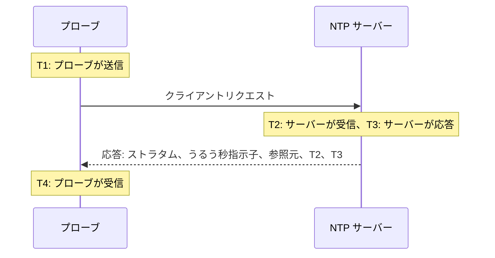

# NTP モニター

NTP モニターは、タイムサーバーが UDP ポート 123 で応答し、正しい時刻を提供しているかを確認します。つまり、同期していること、妥当なストラタムにあること、そしてその時計がプローブの時計と一致していることです。データセンターの GPS クロックや、社内のマシンが同期する内部サーバーなど、自分で運用しているタイムサーバーと、依存している公開サーバーの監視に使用します。

:::cards
- [モニターを作成する](#ntp-モニターを作成する): ダッシュボードでの 6 つの手順。
- [チェックが読み取る内容](#チェックが読み取る内容): ストラタム、時刻のずれ、うるう秒指示子、その他の応答内容。
- [監視条件](#監視条件): 到達性、同期、ストラタム、ずれ。
- [トラブルシューティング](#トラブルシューティング): サーバーは動いているのに、モニターが別の結果を示すとき。
:::

## 仕組み

チェックのたびに、プローブはランダムなローカルポートからサーバーの UDP ポートへ SNTP クライアントリクエスト（NTP バージョン 4、クライアントモード）を 1 つ送信し、応答を待ちます。数えるのはそのリクエストへの本物の応答だけです。プローブはリクエストの送信タイムスタンプにランダムな 64 ビットを入れ、それをそのまま返さないパケット、NTP パケットより短いパケット、サーバーモードでないパケットはすべて無視します。以前のチェックへの古い応答や偽装された応答によって、停止したサーバーが動いているように見えることはありません。

4 つのタイムスタンプから、プローブは **時刻のずれ** を ((T2 − T1) + (T3 − T4)) / 2 で求めます。これはサーバーの時計がプローブの時計からどれだけ離れているかを表します。正のずれは、サーバーが進んでいることを意味します。この式はリクエストと応答にかかる時間が等しいと仮定しているため、片方向だけが大きく遅い経路では、ずれが往復時間の半分まで偏ることがあります。

> [!NOTE]
> ずれはプローブ自身の時計を基準に測定されます。OneUptime Cloud のプローブは時計を同期した状態に保っています。[カスタムプローブ](/docs/probe/custom-probe) では、chrony や systemd-timesyncd でホストの時計も同期しておいてください。そうしないと、ずれのアラートがサーバーではなくプローブの問題である可能性があります。

応答したサーバーには、正しい時刻を返さなかった場合でも再度問い合わせません。無応答、拒否されたポート、失敗した DNS 解決は、新しいリクエストで再試行されます。サーバーがまったく応答しない場合、プローブはサーバーまでの経路もトレースし、その結果を **障害発生時のネットワーク経路** として添付します。自身のネットワーク接続を失ったプローブは結果を報告しないため、サーバーをオフラインにすることはありません。

## 始める前に

- **モニターを作成できるロール**: Project Owner、Project Admin、Project Member、Monitor Admin、Monitor Member のいずれか、または Create Monitor 権限を持つカスタムロール。
- **サーバーの UDP ポート 123 に到達できるプローブ。** 公開タイムサーバーはどのプローブからでもチェックできます。プライベートネットワーク上のサーバーには、そのネットワーク内の [カスタムプローブ](/docs/probe/custom-probe) を使用します。サーバーの前にあるファイアウォールは、[OneUptime Cloud のプローブの IP アドレス](/docs/configuration/ip-addresses) またはカスタムプローブからの TCP だけでなく UDP も通す必要があります。

## NTP モニターを作成する

:::steps
### 新しいモニターを開始する

**モニター** に移動し、**モニターを作成** をクリックします。**モニターの種類** の検索ボックスに `ntp` と入力し、**NTP** を選択します。**その他のモニターの種類** のネットワークグループにも表示されます。

### 名前を付ける

`GPS タイムサーバー` のような **名前** を入力し、**次へ** をクリックします。

### サーバーを入力する

**NTP サーバー** に、`time.example.com` や `192.168.1.10` のようなサーバーのホスト名または IP アドレスを入力します。リクエストはポート 123 に送られます。別のポートを使うには、**その他の項目** を開いて **ポート** を設定します。

### テストする

**モニターをテスト** をクリックし、**プローブを選択** でプローブを選んで **テストを実行** をクリックします。**モニターテスト結果** に、サーバーが応答したか、同期しているか、ストラタム、時計のずれの大きさが表示されます。

### 条件を確認する

**モニター条件** は [デフォルトの条件](#デフォルトの条件) から始まります。サーバーが正しい時刻を提供していなければオフライン、提供していればオンラインです。必要に応じて変更し、**次へ** をクリックします。

### プローブを選んで作成する

**プローブ** と **監視間隔**（最初は **5 分ごと**）をそのままにするか変更し、**モニターを作成** をクリックします。モニターのページが開きます。
:::

## 設定オプション

| 項目 | デフォルト | 入力する内容 |
| --- | --- | --- |
| **NTP サーバー** | なし | `time.example.com`、`192.168.1.10`、`2001:db8::123` のようなサーバー。`udp://` を付けずにホストだけを入力します。`time.example.com:1123` のようにホストの後ろに書いたポートは、**ポート** の代わりに使われます。 |
| **ポート**（**その他の項目** 内） | `123` | サーバーが NTP に応答する UDP ポート（`1` から `65535`）。`123` にするには空欄のままにします。 |
| **リクエストタイムアウト（秒）**（**その他の項目** 内） | `5` | 1 回の試行が、DNS 解決を含めて応答を待つ時間。最大は 60 秒です。 |
| **失敗時の再試行**（**その他の項目** 内） | プローブのデフォルト、通常は `3` | 応答が得られなかった試行を再試行する回数。最大は 3 です。 |

**失敗時の再試行** は最初の試行の _後_ の再試行を数えます。`0` ならチェックを 1 回、`2` なら最大 3 回実行し、試行の間に 1 秒の待機を挟みます。空欄の場合はプローブのデフォルトを使います。プローブの `PROBE_MONITOR_RETRY_LIMIT` で別の値が指定されていない限り 3 です。

## チェックが読み取る内容

モニターのページには、各プローブの最新のチェックが表示されます。

| 項目 | 意味 |
| --- | --- |
| **同期済み** | サーバーがストラタム 1〜15 で、うるう秒指示子のアラームなしに、実際のタイムスタンプを含む応答を返したかどうか。 |
| **時刻のずれ** | サーバーの時計がプローブの時計からどれだけ、どちらの方向に離れているか。健全なサーバーなら数ミリ秒以内です。 |
| **ストラタム** | サーバーが基準時計から何ホップ離れているか。独自の GPS や原子時計を持つサーバーは 1、ストラタム 1 のサーバーに同期するサーバーは 2、という具合です。16 は非同期を意味します。 |
| **参照元** | サーバーが何に同期しているか。ストラタム 1 では `GPS`、`PPS`、`NIST` のようなソース名、ストラタム 2 以降では上位サーバーのアドレスです。 |
| **うるう秒指示子** | うるう秒の予定がなければ 0、その日の終わりにうるう秒が挿入または削除される場合は 1 または 2、サーバーが自分の時計は同期していないと示している場合は 3 です。 |
| **ルート分散** | サーバー自身が見積もった、自分の時刻が真の時刻からどれだけ離れうるかの値。サーバーがソースに到達できない間は増え続けます。ntpd は、ルート遅延の半分とこの値の合計が 1.5 秒を超えたサーバーを信頼しなくなります。 |
| **ルート遅延** | サーバーから基準時計までの往復時間。 |
| **レスポンスタイム** | プローブがリクエストを送信してから応答を受信するまでの時間（DNS 解決を除く）。 |
| **サーバー時刻** | サーバーが応答を送信したときのサーバーの時計。 |

時刻の提供を拒否するサーバーは、代わりに **kiss-o'-death** を送ります。これは 4 文字のコードを持つストラタム 0 の応答です。よくあるコードは `RATE`（サーバーがプローブの頻度を制限している）、`DENY` と `RSTR`（アクセスルールがプローブを拒否している）、`INIT`（まだ同期していない）です。チェックはコードを表示し、サーバーは応答しているが同期していないものとして扱います。

## 監視条件

条件は、サーバーをオンライン、低下、オフラインのどれとみなすか、そしてそれによってインシデントを宣言するかアラートを作成するかを決めます。各条件は 1 つ以上のフィルターを確認します。

| フィルター | 条件 | 確認する内容 |
| --- | --- | --- |
| **NTP Is Online** | **真**、**偽** | サーバーがプローブのリクエストに NTP 応答を返したかどうか。kiss-o'-death も応答に含まれます。 |
| **NTP Is Synchronized** | **真**、**偽** | 応答したサーバーが同期した時刻を提供しているかどうか。サーバーが応答しない場合、このフィルターは確認されません。その場合は **NTP Is Online** を使います。 |
| **NTP Stratum** | **Greater Than**、**Greater Than Or Equal To**、**Less Than**、**Less Than Or Equal To**、**Equal To**、**Not Equal To** | サーバーのストラタム。kiss-o'-death の 0 は、非同期を意味する 16 として扱われます。 |
| **NTP Clock Offset (in ms)** | **Greater Than**、**Less Than**、**Greater Than Or Equal To**、**Less Than Or Equal To** | サーバーの時計がプローブの時計からどれだけ離れているか（方向は問いません）。 |
| **NTP Response Time (in ms)** | **Greater Than**、**Less Than**、**Greater Than Or Equal To**、**Less Than Or Equal To** | リクエストから応答までの時間。 |
| **NTP Root Dispersion (in ms)** | **Greater Than**、**Less Than**、**Greater Than Or Equal To**、**Less Than Or Equal To** | サーバー自身が見積もった最大誤差。 |

フィルターが 2 つ以上ある場合、**一致条件** で **すべて** が一致する必要があるか、**いずれか** 1 つでよいかを決めます。条件の **アクション** で、その条件が何をするかを決めます。モニターのステータスの変更、アラートの作成、インシデントの宣言、またはそれらの組み合わせです。

### デフォルトの条件

新しい NTP モニターは 2 つの条件から始まります。

- **オフライン** — サーバーが応答しない、同期していない、または時計がプローブの時計から `1000` ms 以上離れている。モニターは **オフライン** になり、「_モニター名_ is not serving good time」という名前のインシデントが作成されます。サーバーが再び正しい時刻を提供すると、自動的に解決されます。
- **オンライン** — サーバーが応答し、同期していて、時計がプローブの時計から `1000` ms 未満の範囲にある。モニターは **稼働中** になります。

条件は上から順に確認され、最初に一致したものが結果を決めます。間違った時刻で応答するサーバーは、意図的に停止として扱われます。そのサーバーに従うすべてのクライアントが、その時刻を取り込んでしまうからです。

### 一定期間にわたる評価

**この条件を一定期間にわたって評価する** は、各 NTP フィルターの下にあるチェックボックスです。オンにすると、最新のチェックの代わりに過去のチェックの範囲で判断します。**評価** で集計方法を、**過去（分単位）** で 2〜60 分の範囲を選びます。ストラタム、ずれ、ルート分散があるのはサーバーが応答したチェックだけなので、無応答が続いた範囲にはこれらのフィルターのデータがなく、**データがない場合** で動作が決まります。

### 条件の例

| 目的 | フィルター | 条件 | 値 |
| --- | --- | --- | --- |
| GPS サーバーがネットワークのソースに切り替わったときにアラートを出す | **NTP Stratum** | **Greater Than** | `1` |
| 時計がずれてきたときにアラートを出す | **NTP Clock Offset (in ms)** | **Greater Than** | `100` |
| サーバーの誤差の上限が大きくなったときにアラートを出す | **NTP Root Dispersion (in ms)** | **Greater Than** | `500` |
| 応答が遅くなったときにアラートを出す | **NTP Response Time (in ms)** | **Greater Than** | `1000` |

## トラブルシューティング

:::details サーバーは動いているのに、モニターは応答がなかったと表示する
リクエストか応答が途中で失われています。TCP は許可しても UDP は許可しないファイアウォール、プローブのアドレスを含まない ntpd の `restrict` や chrony の `allow` のルール、内部インターフェースでしか待ち受けていないサーバーは、いずれもこのように見えます。**障害発生時のネットワーク経路** で、経路がどこまで届いたかを確認できます。プローブを通すか、ネットワーク内の [カスタムプローブ](/docs/probe/custom-probe) からサーバーをチェックしてください。
:::

:::details サーバーがリクエストを拒否したとモニターが表示する
ホストが、その UDP ポートでは何も待ち受けていないと応答しました（ICMP port unreachable）。NTP サービスが停止しているか、別のポートで待ち受けています。サービスを起動するか、**ポート** を実際に使っているポートに設定してください。
:::

:::details サーバーが kiss-o'-death を返す
`RATE` は、サーバーがプローブの頻度を制限していることを意味します。プローブはチェックごとに 1 回しか問い合わせないため、**監視間隔** を長くするか、サーバーの制限からプローブのアドレスを除外すれば止まります。`DENY` と `RSTR` は、サーバーのアクセスルールがプローブを拒否していることを意味します。`INIT` と `STEP` はサーバーがまだ同期していないことを意味し、起動後の数分間は正常です。
:::

:::details 1 つのプローブ上のすべての NTP モニターで同じようなずれが出る
ずれているのはサーバーではなく、プローブの時計です。プローブのホストが時計を同期した状態に保っているか確認するか、別のプローブでモニターを実行してください。
:::

:::details チェックごとにずれが大きく変わる
プローブがサーバーから遠いか、経路の片方向がもう片方より遅くなっています。サーバーに近いプローブを使うか、**この条件を一定期間にわたって評価する** と **平均** で、数分間のずれをもとに判断してください。
:::

## 次のステップ

:::cards
- [Ping モニター](/docs/monitor/ping-monitor): ホスト自体に到達できるかを確認します。
- [ポート モニター](/docs/monitor/port-monitor): 同じホストの TCP サービスを確認します。
- [カスタム プローブ](/docs/probe/custom-probe): 自社ネットワーク内のタイムサーバーを確認します。
- [インシデント & アラート テンプレート](/docs/monitor/incident-alert-templating): ストラタムとずれをインシデントのタイトルに入れます。
:::
