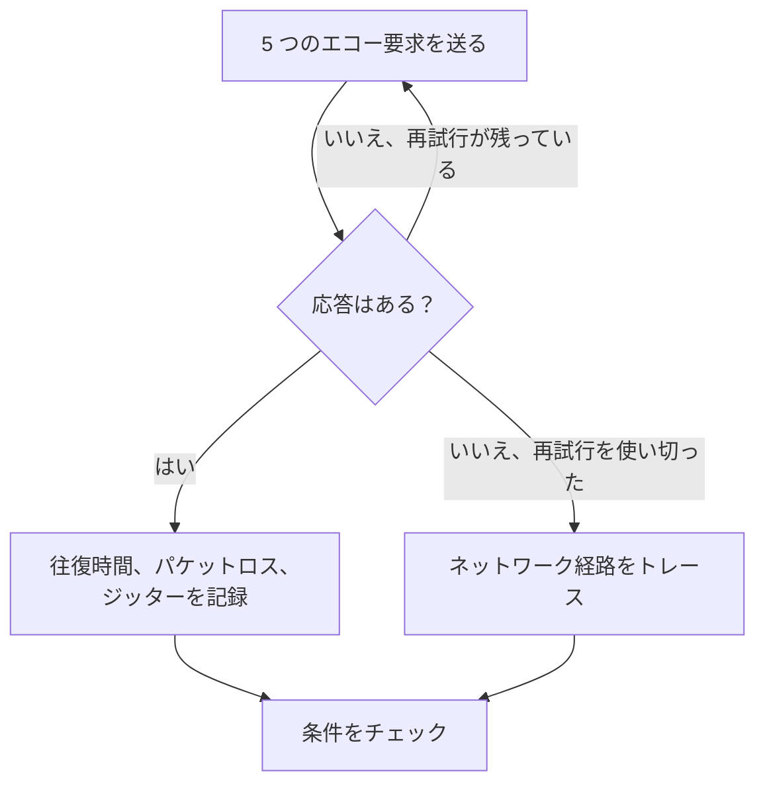

# Ping モニター

Ping モニターは、ホストが ping（ICMP エコー要求）に応答することをチェックし、往復時間、パケットロス、ジッターを測定します。サーバー、ルーター、ファイアウォールなど、ホスト名または IP アドレスで到達できる機器に使います。

:::cards
- [モニターを作成する](#ping-モニターを作成する): ダッシュボードで 6 ステップ。
- [設定オプション](#設定オプション): ホスト、タイムアウト、再試行。
- [監視条件](#監視条件): 到達性、レイテンシー、パケットロス、ジッター。
- [トラブルシューティング](#トラブルシューティング): ホストは動いているのにモニターがオフラインになるとき。
:::

## しくみ

チェックのたびに、プローブはホストに 5 つのエコー要求を送ります。少なくとも 1 つの応答が返ればホストはオンラインで、プローブは平均の往復時間をレスポンスタイムとして記録し、あわせてパケットロス、ジッター、最も速い応答と最も遅い応答を記録します。応答が返らなければ、許可した再試行回数まで再試行します。その後、OneUptime が結果をモニターの条件に通します。

チェックが失敗すると、プローブはホストまでの経路もトレースして名前を調べ、見つけた内容を **障害発生時のネットワーク経路** として結果に添付します。経路がどこで途切れたかを確認できます。

> [!NOTE]
> ホスティング事業者によっては、プローブが動くマシンで ICMP をブロックしています。ping をまったく送れないプローブは、代わりにホストの TCP ポート `80` をチェックするので、モニターは引き続きホストに到達できるかを示します。この場合、パケットロスとジッターは測定されません。

自身のネットワーク接続を失ったプローブは結果を報告しないため、ホストをオフラインにすることはありません。

## 始める前に

- **モニターを作成できるロール**: Project Owner、Project Admin、Project Member、Monitor Admin、Monitor Member のいずれか、または Create Monitor 権限を持つカスタムロール。
- **ホストに到達できるプローブ**（経路上で ICMP が許可されていること）。新しいモニターには、プロジェクトのデフォルトのプローブが選ばれます。ホストの前にファイアウォールがある場合は、[OneUptime Cloud のプローブの IP アドレス](/docs/configuration/ip-addresses) からの ICMP エコー要求を許可します。プライベートネットワーク上のホストには、そのネットワーク内で動く [カスタムプローブ](/docs/probe/custom-probe) が必要です。

## Ping モニターを作成する

:::steps
### 新しいモニターを始める

**モニター** に移動し、**モニターを作成** をクリックします。**モニターの種類** で **Ping** を選びます。

### 名前を付ける

`Core router` のような **名前** を入力し、**次へ** をクリックします。

### ホストを入力する

**ホスト名または IP アドレス** に、ping するホスト名、または IPv4 か IPv6 のアドレスを入力します。たとえば `example.com` や `192.168.1.1` です。`http://` やポートを付けず、ホストだけを入力します。

### テストする

**モニターをテスト** をクリックし、**プローブを選択** でプローブを選んで **テストを実行** をクリックします。**モニターテスト結果** に、プローブが観測した往復時間とパケットロスが表示されます。

### 条件を確認する

**モニター条件** は [デフォルト条件](#デフォルト条件) から始まります。ホストが応答しなければオフライン、応答すればオンラインです。必要なら変更して、**次へ** をクリックします。

### プローブを選んで作成する

**プローブ** と **監視間隔**（**5 分ごと** から始まります）をそのまま使うか変更し、**モニターを作成** をクリックします。モニターのページが開きます。
:::

## 設定オプション

| 項目 | デフォルト | 入力する内容 |
| --- | --- | --- |
| **ホスト名または IP アドレス** | なし | ping するホスト。`example.com`、`192.168.1.1`、`2001:db8::1` などです。ホスト名はチェックのたびに解決されるので、モニターは DNS の変更に追従します。 |
| **リクエストタイムアウト（秒）**（**その他の項目** の中） | `60` | 各試行で応答を待つ時間。最大は 60 秒です。 |
| **失敗時の再試行**（**その他の項目** の中） | プローブのデフォルト、通常は `3` | 失敗した試行を何回再試行するか。最大は 3 回です。 |

**失敗時の再試行** は最初の試行の _あと_ の再試行を数えるので、`0` ならチェックは 1 回、`2` なら最大 3 回実行されます。空欄の場合はプローブのデフォルトが使われます。プローブの `PROBE_MONITOR_RETRY_LIMIT` で別の値が指定されていない限り 3 です。タイムアウトを含むすべての失敗が、試行の間に 1 秒の間隔を置いて再試行されます。応答に 10 秒より長くかかった成功したチェックも、もう一度チェックされます。

ホスト名ではなく固定の IP アドレスを監視するには、代わりに [IP モニター](/docs/monitor/ip-monitor) を使えます。同じチェックを実行します。

## 監視条件

条件は、ホストをオンライン、機能低下、オフラインのどれとみなすか、そしてそれによってインシデントを宣言するかアラートを作成するかを決めます。各条件は 1 つ以上のフィルターをチェックします。

| フィルター | 条件 | チェック内容 |
| --- | --- | --- |
| **Is Online** | **真**、**偽** | 少なくとも 1 つのエコー要求に応答があったかどうか。 |
| **レスポンスタイム（ms）** | **Greater Than**、**Less Than**、**Greater Than Or Equal To**、**Less Than Or Equal To** | 応答の平均往復時間。 |
| **Packet Loss (in %)** | **Greater Than**、**Less Than**、**Greater Than Or Equal To**、**Less Than Or Equal To** | 5 つのエコー要求のうち、応答がなかったものの割合。 |
| **Jitter (in ms)** | **Greater Than**、**Less Than**、**Greater Than Or Equal To**、**Less Than Or Equal To** | 1 回のチェックで送ったパケットの往復時間の標準偏差。 |
| **Is Request Timeout** | **真**、**偽** | すべての試行で ping がタイムアウトしたかどうか。 |

フィルターが 2 つ以上ある場合、**一致条件** で **すべて** が一致する必要があるか、**いずれか** 1 つでよいかを決めます。条件の **アクション** は、その条件が何をするかを決めます。モニターのステータスを変える、アラートを作成する、インシデントを宣言する、またはそのいくつかです。

### デフォルト条件

新しい Ping モニターは 2 つの条件から始まります。

- **オフライン** — すべての再試行のあとも、ホストがどのエコー要求にも応答しないか、まったく到達できない場合。モニターは **オフライン** になり、「_monitor name_ is offline」という名前のインシデントが作成されます。インシデントはホストが再び応答すると自動で解決します。
- **オンライン** — ホストが応答した場合。モニターは **稼働中** になります。

条件は上から順にチェックされ、最初に一致したものが何が起きるかを決めます。どれにも一致しない場合、モニターはデフォルトのステータスを表示します。条件の下にある **その他の項目** で別のものを選ばない限り **稼働中** です。

### 一定期間にわたる評価

**この条件を一定期間にわたって評価する** はフィルターの下にあるチェックボックスで、**Is Online**、**レスポンスタイム（ms）**、**Packet Loss (in %)**、**Jitter (in ms)** で使えます。オンにすると、最新のチェックだけでなく、過去のチェックの期間を評価します。**評価** で集計方法を選び、**過去（分単位）** で 2 分から 60 分までの期間を選びます。

| 集計 | 一致するとき |
| --- | --- |
| **平均**、**合計**、**Maximum Value**、**Minimum Value** | 期間全体でのその値が条件を満たすとき。数値のフィルターのみ。 |
| **All Values** | 期間内のすべてのチェックが条件を満たすとき。 |
| **Any Value** | 期間内の少なくとも 1 つのチェックが条件を満たすとき。 |

**All Values** は、期間が本当にデータで埋まってから一致します。作成されたばかりのモニターや、チェックが記録されなくなったモニターには、直近 N 分について何かを言えるだけの履歴がないため、条件は手元の 1 つの値で一致せずに待ちます。**Any Value** は「1 回でもしきい値を超えたらすぐに知らせる」ための設定で、引き続きすぐに発火します。

**データがない場合** は、期間が条件を裏付けられない間に何が起きるかを決めます。

| オプション | 何が起きるか | 用途 |
| --- | --- | --- |
| **Ignore**（デフォルト） | 条件は一致しません。 | 通常のしきい値アラート。 |
| **トリガー** | データがないこと自体を問題とみなします。 | 沈黙そのものが障害となるチェック。 |
| **Treat As Zero** | 期間を 1 つのゼロとして比較します。 | イベントがないことが本当にゼロを意味するカウンター。 |

### 条件の例

| 目的 | フィルター | 条件 | 値 |
| --- | --- | --- | --- |
| ホストに到達できないときにオフラインにする | **Is Online** | **偽** | — |
| レイテンシーが高いときにアラートを出す | **レスポンスタイム（ms）** | **Greater Than** | `200` |
| パケットロスの多い回線でホストを機能低下にする | **Packet Loss (in %)** | **Greater Than** | `20` |
| 不安定な接続でアラートを出す | **Jitter (in ms)** | **Greater Than** | `30` |

レイテンシーが高い状態が続くときだけアラートを出すには、レスポンスタイムのフィルターで **この条件を一定期間にわたって評価する** をオンにし、**All Values** を **5** 分で選びます。

## トラブルシューティング

:::details ホストは動いているのに、モニターがオフラインになる
ホスト、またはその前にあるファイアウォールが、プローブからの ICMP エコー要求に応答していません。多くのサーバーやクラウドネットワークは、デフォルトで ping を破棄します。プローブからの ICMP エコー要求を許可するか、代わりに [ポート モニター](/docs/monitor/port-monitor) でホスト上のサービスを監視します。失敗したチェックの **障害発生時のネットワーク経路** に、経路がどこまで届いたかが表示されます。
:::

:::details チェックがホストについて「This probe could not resolve」で失敗する
プローブの DNS サーバーがそのホスト名を知りません。名前を確認するか、代わりに IP アドレスを入力します。社内ネットワーク内でしか解決されない名前には、そこで動く [カスタムプローブ](/docs/probe/custom-probe) が必要です。
:::

:::details パケットロスとジッターが空になる
チェックを実行したプローブは ping を送れないため、代わりに TCP ポート `80` をチェックしました。これはどちらも測定しません。ICMP の送信が許可されたプローブでモニターを実行します。
:::

## 次のステップ

:::cards
- [IP モニター](/docs/monitor/ip-monitor): 固定の IPv4 または IPv6 アドレスを監視します。
- [ポート モニター](/docs/monitor/port-monitor): ホストだけでなく、ホスト上のサービスをチェックします。
- [カスタム プローブ](/docs/probe/custom-probe): 自社ネットワーク上のホストに ping します。
- [インシデント](/docs/incidents/index): モニターがインシデントを宣言したあとに起きること。
:::
