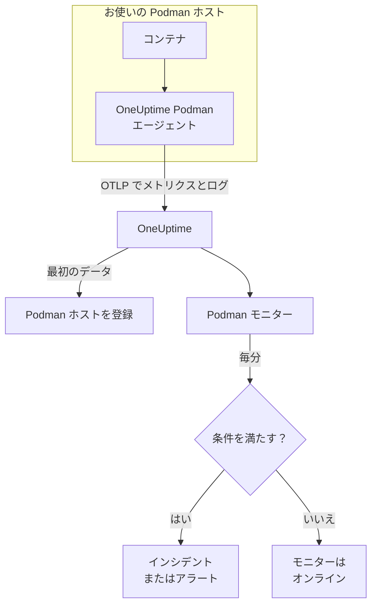

# Podman モニター

Podman モニターは 1 台の Podman ホスト上のコンテナを監視し、コンテナが高負荷になったとき、メモリが不足したとき、再起動を繰り返すときに知らせます。OneUptime の Podman エージェントがホストから送信するメトリクスを読み取るため、外部からのプローブは行いません。エージェントをインストールし、テンプレートまたは独自のクエリからモニターを作成します。

:::cards
- [モニターを作成する](#podman-モニターを作成する): ダッシュボードでの 6 つのステップ。
- [テンプレート](#既製のアラートテンプレート): コンテナごとに 1 件のインシデントを作る 5 個の既製アラート。
- [メトリクス](#収集されるメトリクス): エージェントが収集する内容と、各メトリクスの意味。
- [ログ](#収集されるログ): コンテナのログと、そのために必要なログドライバー。
:::

## 仕組み

OneUptime の Podman エージェントは、ホスト上でコンテナとして動作します。30 秒ごとに Podman の Docker 互換 API ソケットを通じてコンテナの統計を読み取り、コンテナのログファイルを追跡し、その両方を OTLP で OneUptime に送信します。ホストからの最初のデータで、そのホストが OneUptime に登録されます。

Podman モニターは 1 台のホストに結び付きます。毎分、そのホストのコンテナメトリクスに対してクエリを実行し、結果を条件と比較します。



## 始める前に

- **Podman エージェントをインストールします**。ホストに入れてください。[Podman エージェントのガイド](/docs/telemetry/podman-host) で、インストール、アップグレード、確認方法を説明しています。エージェントには `/run/podman/podman.sock` にある Podman の API ソケットが必要です。
- **ホストが登録されていることを確認します。** 最初のデータが届くと、エージェントの `PODMAN_HOST_NAME` の名前で **製品 → インフラストラクチャ → Podman → すべてのホスト** に表示されます。
- **コンテナのログが必要な場合**、コンテナを `k8s-file` ログドライバーで実行します。[ログドライバーの要件](#ログドライバーの要件) を参照してください。

## Podman モニターを作成する

:::steps
### 新しいモニターを始める

**モニター** に移動し、**モニターを作成** をクリックします。

### Podman Container を選ぶ

**モニターの種類** で **その他のモニターの種類** をクリックし、**インフラストラクチャ** の下の **Podman Container** を選ぶか、検索ボックスに `podman` と入力します。**名前** を入力し（インシデントとアラートのタイトルに使われます）、**次へ** をクリックします。

### ホストを選ぶ

**Podman モニターの設定** で、**Podman ホスト** からホストを選びます。データを送信したすべてのホストが一覧に表示されます。

### 監視する対象を選ぶ

3 つのタブのいずれかを選びます。

- **Quick Setup** – [テンプレート](#既製のアラートテンプレート) をクリックします。メトリクス、集計、時間範囲、しきい値が設定され、下の条件がテンプレートのものに置き換わります。**時間範囲** は引き続き変更できます。
- **Custom Metric** – **Podman メトリクス** からメトリクスを 1 つ選び、**集計** と **時間範囲** を設定します。**コンテナ名** と **コンテナイメージ** で一部のコンテナに絞り込めます。
- **詳細** – **メトリクスを選択** でクエリと数式を自分で作成します。**グループ化** に `resource.container.name` を指定すると、コンテナを 1 つずつ判定できます。

### 条件を確認する

**モニター条件** の各条件を開き、**メトリクス**、**集計**、**条件**、**しきい値** を確認します。テンプレートを使った場合は入力済みです。**Custom Metric** または **詳細** の場合、モニターは [デフォルトの条件](#デフォルトの条件) から始まり、これはメトリクスがゼロに落ちたことしか検知しないので、独自のしきい値を設定してください。

### モニターを作成する

**モニターを作成** をクリックします。OneUptime がモニターのページを開き、毎分評価します。作成されたインシデントとアラートは、ホストの **インシデント** と **アラート** のページにも表示されます。
:::

> [!TIP]
> 複数のテンプレートを一度に設定するには、**製品 → インフラストラクチャ → Podman** からホストを開き、**推奨事項** に移動します。使うテンプレートと呼び出す相手を選ぶと、OneUptime がテンプレートごとに 1 つのモニターを作成します。

## モニター設定

| 項目 | タブ | 役割 |
| --- | --- | --- |
| **Podman ホスト** | すべて | 必須。すべてのクエリをホストの `resource.host.name` に限定します。OneUptime はすべてのクエリに `resource.container.runtime = podman` も追加します。 |
| **Podman メトリクス** | Custom Metric | エージェントのカタログにあるメトリクス 1 つ。CPU、メモリ、ネットワーク、ブロック I/O、コンテナに分類されています。 |
| **コンテナ名** | Custom Metric、詳細 | 任意。`resource.container.name` との完全一致。例：`my-container`。 |
| **コンテナイメージ** | Custom Metric、詳細 | 任意。`resource.container.image.name` との完全一致。例：`nginx:latest`。 |
| **集計** | Custom Metric | サンプルの組み合わせ方：**平均**、**最大**、**最小**、**合計**、**カウント**。初期値はメトリクスの通常の集計です。 |
| **時間範囲** | すべて | クエリが読み取る移動ウィンドウで、**Past 1 Minute** から **Past 365 Days** まで。新しいモニターは **Past 1 Minute** から始まり、テンプレートは独自の値を設定します。 |
| **メトリクスを選択** | 詳細 | クエリビルダー：**メトリクス**、**集計の基準**、**属性で絞り込み**、**グループ化**、さらにクエリを組み合わせる **メトリクスを追加** と **数式を追加**。 |

## 既製のアラートテンプレート

**Quick Setup** には 5 つのテンプレートがあります。それぞれが完全なモニターを作ります。`resource.container.name` でグループ化したクエリ、発火する条件、回復する条件です。コンテナは 1 つずつ判定され、それぞれ専用のインシデントとアラートを持ちます。しきい値は出発点なので編集できます。

条件はそのウィンドウのすべての分で成り立つ場合にのみ発火し、しきい値から 10% 離れたところで回復するため、境界付近を行き来する値でばたつくことはありません。

| テンプレート | 重大度 | 監視対象 | 発火する条件 | 回復する条件 |
| --- | --- | --- | --- | --- |
| High Container CPU Usage | 警告 | `container.cpu.utilization`、コンテナごとの Avg、過去 5 分 | 80 を超える（一つのコアに対する %） | 72 以下 |
| High Container Memory Usage | 警告 | `container.memory.percent`、コンテナごとの Avg、過去 5 分 | 85% を超える | 76.5% 以下 |
| High Container Restart Count | 重大 | `container.restarts`、コンテナごとの Max、過去 5 分 | 合計で 5 回を超える再起動 | 4.5 以下 |
| High Container Process Count | 警告 | `container.pids.count`、コンテナごとの Max、過去 5 分 | 500 を超える | 450 以下 |
| Container Restarted (Low Uptime) | 重大 | `container.uptime`、コンテナごとの Min、過去 1 分 | 120 秒未満 | 132 秒以上 |

**重大度** は選択リストに表示されるラベルです。テンプレートが作成するインシデントとアラートは、プロジェクトで最も重大なインシデントとアラートの重大度から始まります。条件で変更してください。

2 つのパーセントのテンプレートは **平均** を使います。メトリクスがすでにコンテナごとのパーセントなので、1 分間の平均が持続的な値になります。再起動回数とプロセス数は **最大** を使い、しきい値を超えたサンプルが 1 つあればそれがシグナルです。

> [!NOTE]
> `container.cpu.utilization` は `podman stats` が表示する数値で、100% はコンテナの CPU 割り当て全体ではなく CPU 1 コア分です。複数のコアを割り当てたコンテナは健全な状態でも 100 を大きく超えるので、そうしたコンテナではしきい値を引き上げてください。

> [!NOTE]
> `container.restarts` は Podman が保持する累計で、ウィンドウ内の再起動回数ではありません。そのため **High Container Restart Count** は、コンテナを作り直して回数がリセットされるまで開いたままです。

> [!CAUTION]
> `container.uptime` は実行中のコンテナにしか存在しません。停止したまま止まっているコンテナはデータを送らないため、**Container Restarted (Low Uptime)** が捉えるのは再起動や再デプロイで、恒久的な停止は捉えません。2 分未満だけ動く想定のコンテナは、その生涯ずっとアラート状態のままです。

CPU スロットリングのテンプレートはありません。エージェントが収集するスロットリングのメトリクスは増加しかしないため、「一度でもスロットリングされた」というアラートは一度発火すると解消しません。どちらも引き続き収集されるので、グラフには表示できます。

## 収集されるメトリクス

エージェントは OpenTelemetry の `docker_stats` レシーバーを Podman の Docker 互換ソケット `/run/podman/podman.sock` に向けて 30 秒ごとに使います。各コンテナのメトリクスは、その識別情報をリソース属性として持ちます：`resource.container.name`、`resource.container.image.name`、`resource.container.id`、`resource.container.runtime`（`podman`）、`resource.host.name`。

### CPU

| メトリクス | 説明 |
| --- | --- |
| `container.cpu.utilization` | コンテナの CPU 使用率。100% が CPU 1 コア分です。 |
| `container.cpu.usage.total` | コンテナの起動以降に使った CPU 時間（ナノ秒）。生涯カウンター。 |
| `container.cpu.throttling_data.throttled_time` | コンテナが CPU 上限でスロットリングされたナノ秒数。生涯カウンター。 |
| `container.cpu.throttling_data.throttled_periods` | コンテナの起動以降のスロットリング期間の数。生涯カウンター。 |

### メモリ

| メトリクス | 説明 |
| --- | --- |
| `container.memory.usage.total` | 使用中のメモリ（バイト）。 |
| `container.memory.usage.limit` | メモリ上限（バイト）。 |
| `container.memory.percent` | コンテナの上限、または上限がない場合はホストのメモリに対するメモリ使用率（%）。 |

### ネットワーク

| メトリクス | 説明 |
| --- | --- |
| `container.network.io.usage.rx_bytes` | 受信したバイト数。生涯カウンター。 |
| `container.network.io.usage.tx_bytes` | 送信したバイト数。生涯カウンター。 |

### ブロック I/O

| メトリクス | 説明 |
| --- | --- |
| `container.blockio.io_service_bytes_recursive.read` | ブロックデバイスから読み取ったバイト数。 |
| `container.blockio.io_service_bytes_recursive.write` | ブロックデバイスに書き込んだバイト数。 |

### コンテナ

| メトリクス | 説明 |
| --- | --- |
| `container.uptime` | コンテナの起動からの秒数。実行中のコンテナだけが報告します。 |
| `container.restarts` | コンテナが再起動した回数。累計です。 |
| `container.pids.count` | コンテナ内のタスク数。cgroup の pids コントローラーはプロセスだけでなくスレッドも数えます。 |

**Podman メトリクス** の一覧には、`container.cpu.usage.percpu`、`container.memory.rss`、`container.memory.cache`、ネットワークパケットのカウンターもあります。同梱のエージェント設定ではこれらは有効になっていないため、使う前にホストの **メトリクス** ページを確認してください。`container.cpu.throttling_data.throttled_periods` は一覧にないので、**詳細** から照会します。

## 監視条件

条件は、モニターのクエリまたは数式の 1 つをしきい値と比較します。Podman モニターの条件には **フィルタータイプ** がなく、すべてのルールが次の項目でメトリクスの値をチェックします。

| 項目 | 役割 |
| --- | --- |
| **メトリクス** | チェックするクエリまたは数式（変数名で指定）。 |
| **集計** | ウィンドウ内の値を 1 つの答えにする方法：**平均**、**合計**、**Maximum Value**、**Minimum Value**、**All Values**（すべての値が一致する必要がある）、**Any Value**（1 つで十分）。 |
| **条件** | **Greater Than**、**Less Than**、**Greater Than Or Equal To**、**Less Than Or Equal To**、**Equal To**、または異常条件の **Anomalously High**、**Anomalously Low**、**Anomalous**。 |
| **しきい値** | 比較する値。メトリクスに単位がある場合は、横に単位の一覧が表示されます。異常条件では表示されません。 |
| **感度** | 異常条件のみ。**低**（4σ）、**中**（3σ、既定）、**高**（2σ）。 |
| **ベースラインウィンドウ** | 異常条件のみ。履歴 14 日（既定）、28 日、60 日、90 日。 |
| **データがない場合** | **その他の項目** の中にあります。ウィンドウにサンプルがないときの動作：**Ignore**（既定）、**Treat As Zero**、**トリガー**。 |

異常条件は、各値をベースラインの週の同じ時間帯と比較します。ベースラインウィンドウに十分な履歴がたまるまでは「Learning」状態のままで、何も作成しません。

各条件には、一致したときの動作も指定します。モニターのステータスの変更、アラートの作成、インシデントの宣言です。条件は上から順にチェックされ、最初に一致したものが結果を決めます。

### デフォルトの条件

テンプレートから作らないモニターは、2 つの条件から始まります。

| 順序 | 条件 | 一致するとき | 結果 |
| --- | --- | --- | --- |
| 1 | Check if _monitor name_ is offline | 最初のクエリのいずれかの値が `0` | モニターを **オフライン** にし、インシデント「_monitor name_ is offline」を宣言します。モニターが回復すると自動的に解決します。 |
| 2 | Check if _monitor name_ is online | いずれかの値が `0` を超える | モニターを **稼働中** にします。 |

> [!IMPORTANT]
> 無応答はどちらの条件にも一致しません。データの送信を止めたホストは、モニターを元の状態のままにします。データが止まったときに知らせを受けるには、条件の **データがない場合** を **トリガー** に設定します。OneUptime 自身がデータを受信していなかった時間は、決してデータなしとは扱われません。そのような時間を含むウィンドウのチェックは代わりに待機します。詳しくは [OneUptime がデータを受信していないとき](/docs/monitor/when-oneuptime-is-not-receiving) を参照してください。

## 収集されるログ

エージェントは各コンテナの `ctr.log` ファイルも追跡し、各行を次の内容を持つ OpenTelemetry のログレコードとして送信します。

| 項目 | 値 |
| --- | --- |
| `resource.host.name` | ホスト。`PODMAN_HOST_NAME` から取得します。 |
| `resource.container.id` | 完全なコンテナ ID。 |
| `resource.container.runtime` | 常に `podman`。 |
| `attributes["log.iostream"]` | `stdout` または `stderr`。 |
| `severityText` / `severityNumber` | 行の中にレベルがあれば、そのレベルのキーワードから読み取ります（`[ERROR]`、`app.INFO:`、`{"level":"warn"}`、`level=error`）。レベルのない行はストリームから決まります。`stderr` は `ERROR`、`stdout` は `INFO` です。 |
| `body` | コンテナが書き込んだ行。スタックトレースの行のように、空白や閉じ括弧で始まる行は前の行に連結されます。 |
| `time` | その行に対する Podman のタイムスタンプ。 |

ログは、ホストの **ログ** ページと各コンテナのページに表示されます。

### ログドライバーの要件

エージェントは、Podman の `k8s-file` ログドライバーが `/var/lib/containers/storage/overlay-containers/*/userdata/ctr.log` に書き込むファイルを読み取ります。rootful の Podman の既定は `journald` で、代わりに systemd ジャーナルに書き込むため、読み取るファイルがありません。

| ドライバー | エージェントから見える内容 |
| --- | --- |
| `k8s-file`（または Podman が同じように扱う `json-file`） | すべての行。 |
| `journald` | なし。ログは systemd ジャーナルにあります。 |
| `none` | なし。ログは破棄されます。 |

メトリクスはログドライバーに依存しません。コンテナが `journald` を使うホストでもメトリクスは報告され、**ログ** ページが空になるだけです。

コンテナのドライバーと、Podman の既定を確認します。

```bash
podman inspect <container> --format '{{.HostConfig.LogConfig.Type}}'
podman info --format '{{.Host.LogDriver}}'
```

`k8s-file` に切り替えます。Podman はコンテナの作成時にログドライバーを決めるため、変更後は各コンテナを作り直してください。再起動では古いドライバーのままです。

:::tabs
@tab podman run
ドライバーを指定してコンテナを起動します。

```bash
podman run --log-driver k8s-file ... <image>
```

既存のコンテナを切り替えるには、削除してから再度実行します。

```bash
podman rm -f <container>
podman run --log-driver k8s-file ... <image>
```
@tab Podman Compose
各サービスにドライバーを設定します。

```yaml title="docker-compose.yml"
services:
  my-app:
    image: my-app:latest
    logging:
      driver: "k8s-file"
      options:
        max-size: "100m"
```

その後、サービスを作り直します。

```bash
podman compose up -d --force-recreate <service>
```
@tab containers.conf
以降に作成するすべてのコンテナで `k8s-file` を既定にします。`/etc/containers/containers.conf`（rootful）または `~/.config/containers/containers.conf`（rootless）に設定します。

```toml title="containers.conf"
[containers]
log_driver = "k8s-file"
```

その後、各コンテナを削除して作り直します。
:::

## トラブルシューティング

:::details ホストが Podman ホスト の一覧にない
ホストはエージェントのデータから自動登録されます。エージェントのコンテナが実行中であること、Podman の API ソケットが有効であること、ホストが **製品 → インフラストラクチャ → Podman → すべてのホスト** に表示されていることを確認してください。[Podman エージェントのガイド](/docs/telemetry/podman-host) に、ホスト上で行う確認があります。
:::

:::details メトリクスは届くがログのページが空
コンテナがほぼ確実に `journald` を使っています。ログが必要なコンテナを `k8s-file` に切り替え（[ログドライバーの要件](#ログドライバーの要件) を参照）、作り直してください。
:::

:::details エージェントが「no files match the configured criteria」とログに出す
エージェントは `/var/lib/containers/storage/overlay-containers/*/userdata/ctr.log` を探しましたが、何も見つかりませんでした。ホスト上のどのコンテナも `k8s-file` を使っていないか、エージェントの `/var/lib/containers/storage` のマウントがないか空であるか、エージェントとコンテナが異なるモードで動作しているかのいずれかです。rootless のコンテナは rootful のパスでは届かない場所にストレージを置き、その逆も同様です。
:::

:::details データが誤ったホスト名で届く
OneUptime は `resource.host.name` でホストを識別し、エージェントはこれを `PODMAN_HOST_NAME` から取得します。最初のデータの後に `PODMAN_HOST_NAME` を変えると、最初のホストの名前が変わるのではなく 2 台目のホストができ、モニターは作成時の名前に結び付いたままになります。
:::

:::details CPU のアラートが発火しない
**High Container CPU Usage** テンプレートと同じように、クエリを `resource.container.name` でグループ化し、コンテナを 1 つずつ判定してください。忙しいホストですべてのコンテナを平均すると、アイドル状態のコンテナに引き下げられます。100% は 1 コア分を意味するので、複数のコアを使えるコンテナにはより高いしきい値が必要です。
:::

:::details 再起動回数のアラートが解消しない
`container.restarts` は累計なので、自然にしきい値を下回ることはありません。原因を直してから、回数をリセットするためにコンテナを作り直すか、しきい値を引き上げてください。
:::

## 次のステップ

:::cards
- [Podman エージェント](/docs/telemetry/podman-host): このモニターが読み取るエージェントのインストール、アップグレード、トラブルシューティング。
- [Docker モニター](/docs/monitor/docker-monitor): Docker ホスト向けの同じモニター。
- [インシデント 概要](/docs/incidents/index): 条件がインシデントを宣言した後に起こること。
- [オンコールスケジュール](/docs/on-call/schedules): コンテナが壊れたときに誰を呼び出すかを決めます。
:::
