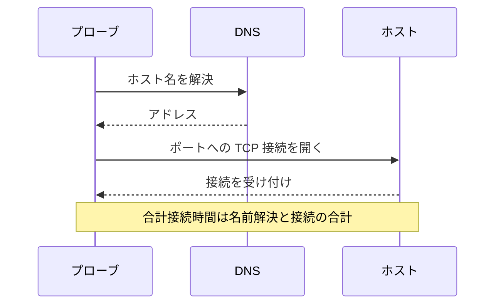

# ポート モニター

ポートモニターは、ホストがあるポートで TCP 接続を受け付けることをチェックし、接続にかかる時間を測定します。HTTP を話さないサービスや、HTTP をチェックしたくないサービス、つまりデータベース、メールサーバー、SSH、メッセージブローカーなどに使います。

:::cards
- [モニターを作成する](#ポートモニターを作成する): ダッシュボードで 6 ステップ。
- [接続時間](#接続時間): DNS、TCP、合計の各時間が測るもの。
- [監視条件](#監視条件): 到達性と接続時間。
- [トラブルシューティング](#トラブルシューティング): サービスは動いているのにモニターがオフラインになるとき。
:::

## しくみ

チェックのたびに、プローブはホスト名が指定されていればそれを解決し、ポートへの TCP 接続を開きます。接続が受け付けられた時点でポートはオンラインとなり、プローブは何も送らずに接続を閉じます。拒否された接続やタイムアウトした接続は、許可した再試行回数まで再試行されます。その後、OneUptime が結果をモニターの条件に通します。

プローブが開くのは TCP 接続だけです。SNMP エージェントのように UDP だけで待ち受けるサービスは、ポートモニターではチェックできません。

チェックが失敗すると、プローブはホストまでの経路もトレースして名前を調べ、見つけた内容を **障害発生時のネットワーク経路** として結果に添付します。経路がどこで途切れたかを確認できます。自身のネットワーク接続を失ったプローブは結果を報告しないため、サービスをオフラインにすることはありません。

## 始める前に

- **モニターを作成できるロール**: Project Owner、Project Admin、Project Member、Monitor Admin、Monitor Member のいずれか、または Create Monitor 権限を持つカスタムロール。
- **ポートに到達できるプローブ。** 新しいモニターには、プロジェクトのデフォルトのプローブが選ばれます。サービスの前にファイアウォールがある場合は、[OneUptime Cloud のプローブの IP アドレス](/docs/configuration/ip-addresses) からポートへの接続を許可します。データベースのようにプライベートネットワーク上にあるサービスには、そのネットワーク内で動く [カスタムプローブ](/docs/probe/custom-probe) が必要です。

## ポートモニターを作成する

:::steps
### 新しいモニターを始める

**モニター** に移動し、**モニターを作成** をクリックします。**モニターの種類** で **ポート** を選びます。

### 名前を付ける

`Orders database` のような **名前** を入力し、**次へ** をクリックします。

### ホストとポートを入力する

**ホスト名または IP アドレス** に、ポートのあるホストを入力します。たとえば `db.example.com` や `10.0.0.12` です。**ポート** には `5432` のようなポート番号を入力します。

### テストする

**モニターをテスト** をクリックし、**プローブを選択** でプローブを選んで **テストを実行** をクリックします。**モニターテスト結果** に、接続が開いたかどうかと、各部分にかかった時間が表示されます。

### 条件を確認する

**モニター条件** は [デフォルト条件](#デフォルト条件) から始まります。ポートが接続を受け付けなければオフライン、受け付ければオンラインです。必要なら変更して、**次へ** をクリックします。

### プローブを選んで作成する

**プローブ** と **監視間隔**（**5 分ごと** から始まります）をそのまま使うか変更し、**モニターを作成** をクリックします。モニターのページが開きます。
:::

## 設定オプション

| 項目 | デフォルト | 入力する内容 |
| --- | --- | --- |
| **ホスト名または IP アドレス** | なし | ホスト。`example.com`、`192.168.1.1`、`2001:db8::1` などです。`http://` を付けず、ホストだけを入力します。 |
| **ポート** | なし | 接続する TCP ポート。`1` から `65535` までです。 |
| **リクエストタイムアウト（秒）**（**その他の項目** の中） | `60` | 1 回の試行にかけられる時間。DNS の名前解決と TCP 接続の合計です。最大は 60 秒です。 |
| **失敗時の再試行**（**その他の項目** の中） | プローブのデフォルト、通常は `3` | 失敗した試行を何回再試行するか。最大は 3 回です。 |

**失敗時の再試行** は最初の試行の _あと_ の再試行を数えるので、`0` ならチェックは 1 回、`2` なら最大 3 回実行されます。空欄の場合はプローブのデフォルトが使われます。プローブの `PROBE_MONITOR_RETRY_LIMIT` で別の値が指定されていない限り 3 です。タイムアウトを含むすべての失敗が、試行の間に 1 秒の間隔を置いて再試行されます。10 秒より長くかかった成功した接続も、もう一度チェックされます。

よく使われるポート:

| ポート | サービス |
| --- | --- |
| `22` | SSH |
| `25` | SMTP |
| `80` | HTTP |
| `443` | HTTPS |
| `3306` | MySQL |
| `5432` | PostgreSQL |
| `6379` | Redis |
| `27017` | MongoDB |

> [!NOTE]
> 多くのホスティング事業者は、外向きの SMTP をブロックしています。ping を送れないプローブ（プローブはこれでそのような事業者の上で動いていることに気付きます）では、タイムアウトしたポート `25` のチェックはオンラインとみなされます。メールサーバーのポート `25` を確実にチェックするには、そこへの接続が許可された [カスタムプローブ](/docs/probe/custom-probe) でモニターを実行します。

## 接続時間

ホスト名の場合、プローブはチェックを 2 つのフェーズに分けて測定します。

| フェーズ | 開始 | 終了 |
| --- | --- | --- |
| **DNS の名前解決** | チェックの開始 | 最初の TCP 接続の試行 |
| **TCP 接続** | 最初の TCP 接続の試行 | 接続が受け付けられるまで。IPv6 と IPv4 のアドレスを切り替える時間も含みます |

**合計接続時間（DNS + TCP）** は、チェックの開始から接続が受け付けられるまでの時間です。これはポートモニターのレスポンスタイムでもあるため、レスポンスタイムを使う既存の条件、アラート、グラフはそのまま動きます。

対象が IP アドレスの場合は DNS の名前解決がないため、そのフェーズは省かれます。フェーズごとの測定が導入される前のチェック結果には、合計接続時間だけが表示されます。

## 監視条件

条件は、ポートをオンライン、機能低下、オフラインのどれとみなすか、そしてそれによってインシデントを宣言するかアラートを作成するかを決めます。各条件は 1 つ以上のフィルターをチェックします。

| フィルター | 条件 | チェック内容 |
| --- | --- | --- |
| **Is Online** | **真**、**偽** | ポートが接続を受け付けたかどうか。 |
| **合計接続時間（DNS + TCP）（ms）** | **Greater Than**、**Less Than**、**Greater Than Or Equal To**、**Less Than Or Equal To** | ホスト名の場合の DNS の名前解決を含む、接続時間全体。 |
| **Port DNS Lookup Time (in ms)** | **Greater Than**、**Less Than**、**Greater Than Or Equal To**、**Less Than Or Equal To** | 最初の TCP 試行の前の DNS の名前解決。対象が IP アドレスのときは値がありません。 |
| **Port TCP Connect Time (in ms)** | **Greater Than**、**Less Than**、**Greater Than Or Equal To**、**Less Than Or Equal To** | 最初の TCP 試行から接続が受け付けられるまで。IPv6 と IPv4 の切り替えを含みます。 |
| **Is Request Timeout** | **真**、**偽** | すべての試行で、DNS の名前解決または TCP 接続がタイムアウトを超えたかどうか。 |

対象が IP アドレスのとき、DNS の名前解決時間の条件には評価するものがありません。ホスト名と IP アドレスのどちらでも動く必要がある条件には、合計時間か TCP 接続時間を使います。

フィルターが 2 つ以上ある場合、**一致条件** で **すべて** が一致する必要があるか、**いずれか** 1 つでよいかを決めます。条件の **アクション** は、その条件が何をするかを決めます。モニターのステータスを変える、アラートを作成する、インシデントを宣言する、またはそのいくつかです。

### デフォルト条件

新しいポートモニターは 2 つの条件から始まります。

- **オフライン** — すべての再試行のあとも、ポートが接続を受け付けない場合。モニターは **オフライン** になり、「_monitor name_ is offline」という名前のインシデントが作成されます。インシデントはポートが再び接続を受け付けると自動で解決します。
- **オンライン** — ポートが接続を受け付けた場合。モニターは **稼働中** になります。

条件は上から順にチェックされ、最初に一致したものが何が起きるかを決めます。どれにも一致しない場合、モニターはデフォルトのステータスを表示します。条件の下にある **その他の項目** で別のものを選ばない限り **稼働中** です。

### 一定期間にわたる評価

**この条件を一定期間にわたって評価する** はフィルターの下にあるチェックボックスで、**Is Online**、**合計接続時間（DNS + TCP）（ms）**、**Port DNS Lookup Time (in ms)**、**Port TCP Connect Time (in ms)** で使えます。オンにすると、最新のチェックだけでなく、過去のチェックの期間を評価します。**評価** で集計方法を選び、**過去（分単位）** で 2 分から 60 分までの期間を選びます。

| 集計 | 一致するとき |
| --- | --- |
| **平均**、**合計**、**Maximum Value**、**Minimum Value** | 期間全体でのその値が条件を満たすとき。数値のフィルターのみ。 |
| **All Values** | 期間内のすべてのチェックが条件を満たすとき。 |
| **Any Value** | 期間内の少なくとも 1 つのチェックが条件を満たすとき。 |

**All Values** は、期間が本当にデータで埋まってから一致します。作成されたばかりのモニターや、チェックが記録されなくなったモニターには、直近 N 分について何かを言えるだけの履歴がないため、条件は手元の 1 つの値で一致せずに待ちます。**Any Value** は「1 回でもしきい値を超えたらすぐに知らせる」ための設定で、引き続きすぐに発火します。

**データがない場合** は、期間が条件を裏付けられない間に何が起きるかを決めます。

| オプション | 何が起きるか | 用途 |
| --- | --- | --- |
| **Ignore**（デフォルト） | 条件は一致しません。 | 通常のしきい値アラート。 |
| **トリガー** | データがないこと自体を問題とみなします。 | 沈黙そのものが障害となるチェック。 |
| **Treat As Zero** | 期間を 1 つのゼロとして比較します。 | イベントがないことが本当にゼロを意味するカウンター。 |

### 条件の例

| 目的 | フィルター | 条件 | 値 |
| --- | --- | --- | --- |
| ポートが閉じているときにオフラインにする | **Is Online** | **偽** | — |
| 接続が遅いときにアラートを出す | **合計接続時間（DNS + TCP）（ms）** | **Greater Than** | `500` |
| 接続が遅いときにサービスを機能低下にする | **合計接続時間（DNS + TCP）（ms）** | **Greater Than** | `200` |
| DNS が遅いときにアラートを出す | **Port DNS Lookup Time (in ms)** | **Greater Than** | `100` |
| TCP ハンドシェイクが遅いときにアラートを出す | **Port TCP Connect Time (in ms)** | **Greater Than** | `250` |

## トラブルシューティング

:::details サービスは動いているのに、モニターがオフラインになる
プローブが接続を開けませんでした。ファイアウォールが接続を破棄している、サービスがプライベートなインターフェースでだけ待ち受けている、またはポートが間違っています。インシデントの根本原因と、モニターの **モニタリングログ** にエラーが表示され、**障害発生時のネットワーク経路** に経路がどこまで届いたかが表示されます。ファイアウォールでプローブを通すか、ネットワーク内で [カスタムプローブ](/docs/probe/custom-probe) を使います。
:::

:::details DNS の名前解決時間がいつも空になる
対象が IP アドレスなので、名前解決するものがありません。代わりに **合計接続時間（DNS + TCP）（ms）** または **Port TCP Connect Time (in ms)** を使います。
:::

:::details UDP のサービスをチェックしたい
ポートモニターが開くのは TCP 接続だけです。DNS サーバーには [DNS モニター](/docs/monitor/dns-monitor) を、UDP ポート 123 のタイムサーバーには [NTP モニター](/docs/monitor/ntp-monitor) を使います。どちらも実際のクエリを送ります。
:::

## 次のステップ

:::cards
- [Ping モニター](/docs/monitor/ping-monitor): ホストそのものに到達できるかをチェックします。
- [SSL 証明書モニター](/docs/monitor/ssl-certificate-monitor): TLS ポートの証明書をチェックします。
- [データベースヘルス モニター](/docs/monitor/database-health-monitor): 開いたポートの先まで見て、データベースのヘルスを監視します。
- [カスタム プローブ](/docs/probe/custom-probe): 自社ネットワーク上のポートをチェックします。
:::
