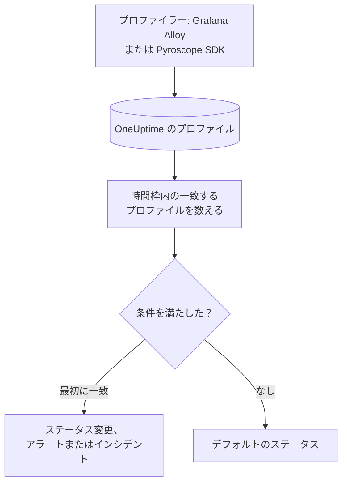

# プロファイル モニター

プロファイルモニターは、サービスが OneUptime に送る継続的プロファイルのうち、フィルター（プロファイルタイプ、サービス、属性）に一致するものを時間枠の中で数えます。その数が条件を満たすと、モニターのステータスを変えたり、アラートを作成したり、インシデントを宣言したりします。主な用途は、サービスからプロファイリングデータが届かなくなったことに気づくことです。

> [!IMPORTANT]
> ダッシュボードの **モニターを作成** には Profiles がありません。そのフィルター用のフォームがまだないためです。下で説明するとおり、[API](/docs/api-reference/api-reference) または [Terraform](/docs/terraform/monitor-steps) でプロファイルモニターを作成してください。作成後は、ダッシュボードのモニターの **条件** ページで条件を表示・編集できます。フィルターは API または Terraform でしか変更できません。

:::cards
- [モニターを作成する](#プロファイルモニターを作成する): API または Terraform で送る設定。
- [何を照会するか](#何を照会するか): プロファイルタイプ、サービス、属性、時間枠。
- [条件](#条件): 使える条件。
- [実例](#実例-プロファイルが届かなくなる): サービスがプロファイルを送らなくなったことを知る。
:::

## しくみ



OneUptime は毎分、モニターのフィルターに一致し、時間枠内に開始したプロファイルを数えます。その数をモニターの条件と上から順に比べ、最初に一致した条件で何が起こるかが決まります。どれにも一致しなければ、モニターはデフォルトのステータスに戻ります。

## 始める前に

- サービスが Grafana Alloy（eBPF）または Pyroscope SDK で継続的プロファイリングのデータを OneUptime に送っていること。[継続的プロファイリング](/docs/telemetry/profiles) を参照してください。
- モニターを作成できる API キーがあるか、OneUptime の Terraform プロバイダーが設定済みであること。
- 監視する各テレメトリサービスの ID と、そのサービスが送るプロファイルタイプ（`cpu`、`wall`、`alloc_objects`、`alloc_space`、`goroutine` など）を把握していること。

## プロファイルモニターを作成する

:::steps
### 数えるものを選ぶ

ステップの `profileMonitor` 設定を書きます。この例は、1 つのサービスの CPU プロファイルを直近 5 分間で数えます。

```json
{
  "profileMonitor": {
    "telemetryServiceIds": [],
    "profileTypes": ["cpu"],
    "profileType": "",
    "attributes": {},
    "lastXSecondsOfProfiles": 300
  }
}
```

サービスの ID を `telemetryServiceIds` に入れるか、すべてのサービスのプロファイルを数えるにはリストを空のままにします。各項目は [何を照会するか](#何を照会するか) で説明しています。

### モニターを作成する

[API](/docs/api-reference/api-reference) または [Terraform](/docs/terraform/monitor-steps) で、モニタータイプ `Profiles` と、この設定と少なくとも 1 つの条件を含むステップを持つモニターを作成します。Terraform では、`jsonencode()` で書いた設定をステップの `profile_monitor` 属性として渡します。

### ダッシュボードで確認する

**モニター** からモニターを開きます。1 分以内に最初の評価が行われ、条件が一致するとすぐにステータスが変わります。
:::

## 何を照会するか

| 項目 | 一致するもの | デフォルト |
| --- | --- | --- |
| `profileTypes` | これらのタイプのいずれかのプロファイル。`cpu` のように完全一致で比較します。 | 空: すべてのタイプ |
| `profileType` | タイプにこのテキストを含むプロファイル。大文字と小文字は区別しません。設定すると `profileTypes` は無視されます。 | 空 |
| `telemetryServiceIds` | これらのテレメトリサービスのいずれかからのプロファイル。 | 空: すべてのサービス |
| `entityKeys` | これらのホスト、Pod、コンテナー、その他のインフラエンティティのいずれかからのプロファイル。 | 空: すべてのエンティティ |
| `attributes` | 属性がこれらの値を持つプロファイル。 | 空: 条件なし |
| `lastXSecondsOfProfiles` | 評価前のこの秒数以内に開始したプロファイル。 | なし: 必ず設定してください。設定しないと保存済みのすべてのプロファイルが数えられ、カウントが 0 に下がることはありません |

プロファイルが数えられるには、設定したすべてのフィルターに一致する必要があります。

## 評価のしくみ

- **毎分。** プロファイルモニターはプローブでチェックされないため、設定する間隔も **プローブと間隔** ページもありません。
- **1 回の評価で 1 つの数値。** モニターは、すべてのフィルターに一致し、`lastXSecondsOfProfiles` 内に開始したプロファイルを数えます。プロファイラーは一定の間隔でアップロードするため、時間枠には複数回のアップロードが入る余裕を持たせてください。
- **プロファイルがなければカウントは 0。** プロファイラーがアップロードをやめたサービスは 0 になります。
- **OneUptime 自身の停止は沈黙ではありません。** OneUptime 自身がデータを受信していなかった時間（再起動中、アップグレード中、遅れの取り戻し中）が時間枠に含まれている間、チェックは待ちます。ステータスは変わらず、インシデントやアラートが開かれたり解決されたりすることもありません。[OneUptime がデータを受信していないとき](/docs/monitor/when-oneuptime-is-not-receiving) を参照してください。
- **条件は上から順に。** 最初に一致した条件で決まるため、最も重大なものを先頭に置きます。

ステータスの変化はすべて、その理由とともにモニターの **ステータスタイムライン** に記録されます。

## 条件

プロファイルモニターの条件のフィルターは 1 つだけです。時間枠内で一致したプロファイルの数である **Profile Count** です。これを値と比べます。

| フィルター条件 | プロファイルの数が次のとき一致 |
| --- | --- |
| **Greater Than** | 値より大きい |
| **Greater Than Or Equal To** | 値以上 |
| **Less Than** | 値より小さい |
| **Less Than Or Equal To** | 値以下 |
| **Equal To** | 値とちょうど等しい |
| **Not Equal To** | 値以外 |

プロファイルの数には異常の条件がありません。比べるベースラインがないためです。

## 実例: プロファイルが届かなくなる

checkout サービスでは、CPU プロファイルをアップロードする Pyroscope SDK が動いています。それが 5 分間届かなくなったらインシデントにしたいとします。

- `profileTypes`: `["cpu"]`、`telemetryServiceIds`: checkout サービス、`lastXSecondsOfProfiles`: `300`
- 条件 1: **Profile Count** **Equal To** `0`: モニターをオフラインにし、インシデントを宣言する
- 条件 2: **Profile Count** **Greater Than** `0`: モニターをオンラインにする

SDK がアップロードしている間は、各評価がいくつかのプロファイルを数え、条件 2 がモニターをオンラインに保ちます。SDK なしでサービスがデプロイされると、最後のアップロードから 5 分後にカウントが 0 に下がり、条件 1 が一致してインシデントが宣言されます。修正後の最初のアップロードでカウントが再び 0 を超え、そのインシデントで **インシデントを自動解決** がオンなら、インシデントは自動で解決します。

## トラブルシューティング

:::details モニターは 0 と数えるのに、OneUptime にはプロファイルが表示される
表示されているプロファイルとフィルターを比べてください。`profileTypes` はタイプと完全に一致する必要があり、`telemetryServiceIds` には正しいサービス ID が入っている必要があります。`lastXSecondsOfProfiles` が短いと、2 回のアップロードの間に収まってしまうこともあります。
:::

:::details モニターを作成 に Profiles がない
想定どおりです。ダッシュボードには、プロファイルモニターのフィルター用のフォームがまだありません。[プロファイルモニターを作成する](#プロファイルモニターを作成する) で説明しているとおり、API または Terraform で作成してください。
:::

## 次のステップ

:::cards
- [継続的プロファイリング](/docs/telemetry/profiles): Grafana Alloy または Pyroscope SDK からプロファイルを送ります。
- [モニターステップ](/docs/terraform/monitor-steps): Terraform からステップの設定を渡します。
- [トレース モニター](/docs/monitor/traces-monitor): 失敗したスパンでアラートを出します。
- [メトリクス モニター](/docs/monitor/metrics-monitor): CPU、メモリー、その他のメトリクスでアラートを出します。
:::
