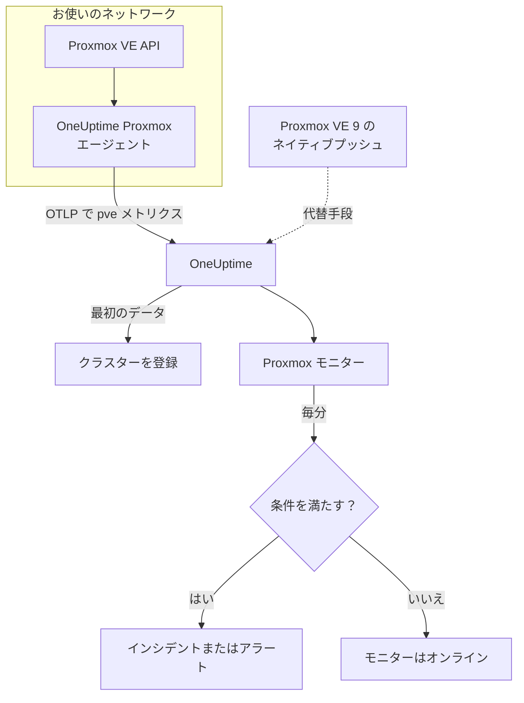

# Proxmox モニター

Proxmox モニターは 1 つの Proxmox VE クラスター（ノード、VM と LXC コンテナ、ストレージ、HA の状態、バックアップジョブの対象範囲、ストレージのレプリケーション）を監視し、ノードがオフラインになったとき、ゲストが停止したとき、ストレージがいっぱいになりつつあるときに知らせます。OneUptime の Proxmox エージェントが収集する `pve_*` メトリクスを読み取るため、外部からのプローブは行いません。

:::cards
- [モニターを作成する](#proxmox-モニターを作成する): ダッシュボードでの 6 つのステップ。
- [テンプレート](#既製のアラートテンプレート): ノード、ゲスト、ボリュームごとに 1 件のインシデントを作る 11 個の既製アラート。
- [リソースの識別](#リソースの識別): 1 つのノード、ゲスト、ストレージボリュームを対象にする方法。
- [メトリクス](#収集されるメトリクス): モニターがアラートに使えるすべての `pve_*` 系列。
:::

## 仕組み

OneUptime の Proxmox エージェントは、Proxmox VE API に到達できるマシン上で動作します。30 秒ごとに、クラスターとノードのコレクターで prometheus-pve-exporter をスクレイプし、各系列にそれが表すリソースのラベルを付け、クラスター名 `proxmox.cluster.name` を付けて OTLP で OneUptime に送信します。最初のデータでクラスターが登録されます。Proxmox VE 9 以降では、代わりに何もインストールせずにメトリクスをネイティブにプッシュできます。[ネイティブプッシュ](#proxmox-ve-のネイティブプッシュ) を参照してください。

Proxmox モニターは 1 つのクラスターに結び付きます。毎分、そのクラスターのメトリクスに対してクエリを実行し、結果を条件と比較します。

## 始める前に

- **Proxmox エージェントをインストールします**。Proxmox VE API に到達できる場所に、読み取り専用の API トークンを使って入れてください。[Proxmox エージェントのガイド](/docs/telemetry/proxmox) で、トークン、インストール、ネイティブプッシュを説明しています。
- **クラスターが登録されていることを確認します。** 最初のスクレイプから約 1 分後に、エージェントの `PROXMOX_CLUSTER_NAME` の名前で **製品 → インフラストラクチャ → Proxmox → すべてのクラスター** に表示されます。

## Proxmox モニターを作成する

:::steps
### 新しいモニターを始める

**モニター** に移動し、**モニターを作成** をクリックします。

### Proxmox を選ぶ

**モニターの種類** で **その他のモニターの種類** をクリックし、**インフラストラクチャ** の下の **Proxmox** を選ぶか、検索ボックスに `proxmox` と入力します。**名前** を入力し（インシデントとアラートのタイトルに使われます）、**次へ** をクリックします。

### クラスターを選ぶ

**Proxmox モニターの設定** で、**Proxmox クラスター** からクラスターを選びます。データを送信したすべてのクラスターが一覧に表示されます。

### 監視する対象を選ぶ

3 つのタブのいずれかを選びます。

- **Quick Setup** – [テンプレート](#既製のアラートテンプレート) をクリックします。メトリクス、フィルター、集計、時間範囲、しきい値が設定され、下の条件がテンプレートのものに置き換わります。**時間範囲** は引き続き変更できます。
- **Custom Metric** – **Proxmox メトリクス** からメトリクスを 1 つ選び、**集計** と **時間範囲** を設定します。[フィルター](#モニター設定) で、リソースの種類や 1 つのリソースに絞り込めます。
- **詳細** – **メトリクスを選択** でクエリと数式を自分で作成します。たとえば `pve_memory_usage_bytes / pve_memory_size_bytes` からメモリのパーセントを求めます。**グループ化** に `id` を指定すると、リソースを 1 つずつ判定できます。

### 条件を確認する

**モニター条件** の各条件を開き、**メトリクス**、**集計**、**条件**、**しきい値** を確認します。テンプレートを使った場合は入力済みです。**Custom Metric** または **詳細** の場合、モニターは [デフォルトの条件](#デフォルトの条件) から始まり、これはメトリクスがゼロに落ちたことしか検知しないので、独自のしきい値を設定してください。

### モニターを作成する

**モニターを作成** をクリックします。OneUptime がモニターのページを開き、毎分評価します。作成されたインシデントとアラートは、クラスターの **インシデント** と **アラート** のページにも表示されます。
:::

> [!TIP]
> 複数のテンプレートを一度に設定するには、**製品 → インフラストラクチャ → Proxmox** からクラスターを開き、**推奨事項** に移動します。使うテンプレートと呼び出す相手を選ぶと、OneUptime がテンプレートごとに 1 つのモニターを作成します。

## モニター設定

| 項目 | タブ | 役割 |
| --- | --- | --- |
| **Proxmox クラスター** | すべて | 必須。すべてのクエリを `resource.proxmox.cluster.name` に限定します。 |
| **リソーススコープ** | Custom Metric、詳細 | 任意。**ノード**、**ゲスト（VM / コンテナ）**、**ストレージ**、**クラスター** のいずれかで、`pve.scope` との完全一致です。 |
| **PVE ID** | Custom Metric、詳細 | 任意。`pve.id` との完全一致：ノード名（`pve1`）、VMID（`100`）、`<node>/<storage>`（`pve1/local`）。スコープと組み合わせて 1 つのリソースを対象にします。 |
| **ノード名** | Custom Metric、詳細 | 任意。ノード自身の系列だけ（`pve.scope = node` と `pve.id`）。そのノード上のゲストやストレージは選択できません。 |
| **ゲスト ID** | Custom Metric、詳細 | 任意。`qemu/100` や `lxc/101` のような生の `id` ラベルとの完全一致。設定すると、ほかのフィルターは無視されます。 |
| **Proxmox メトリクス** | Custom Metric | [カタログ](#収集されるメトリクス) にあるメトリクス 1 つ。 |
| **集計** | Custom Metric | サンプルの組み合わせ方：**平均**、**最大**、**最小**、**合計**、**カウント**。初期値はメトリクスの通常の集計です。 |
| **時間範囲** | すべて | クエリが読み取る移動ウィンドウで、**Past 1 Minute** から **Past 365 Days** まで。新しいモニターは **Past 1 Minute** から始まり、テンプレートは独自の値を設定します。 |
| **メトリクスを選択** | 詳細 | クエリビルダー：**メトリクス**、**集計の基準**、**属性で絞り込み**、**グループ化**、さらにクエリを組み合わせる **メトリクスを追加** と **数式を追加**。 |

## リソースの識別

すべての系列は、属する Proxmox リソースを示すデータポイントのラベル `id` を持ちます。

| `id` の値 | リソース |
| --- | --- |
| `node/<name>` | クラスターのノード。例：`node/pve1`。 |
| `qemu/<vmid>` | QEMU 仮想マシン。例：`qemu/100`。 |
| `lxc/<vmid>` | LXC コンテナ。例：`lxc/101`。 |
| `storage/<node>/<storage>` | ノード上のストレージボリューム。例：`storage/pve1/local`。 |

例外が 2 つあります。レプリケーションの系列（`pve_replication_*`）は `id` にレプリケーションの**ジョブ** ID（例：`100-0`）を持ち、クラスター全体の `pve_not_backed_up_total` には `id` がまったくありません。

フィルターは前方一致ではなく完全一致で比較するため、エージェントは `id` を、フィルターに使える 3 つの属性にも分割します。テンプレートはこれらを利用します。

| 属性 | 値 | `qemu/100` の場合 |
| --- | --- | --- |
| `pve.scope` | `node`、`guest`、`storage`、`cluster`（`qemu` と `lxc` はどちらも `guest`） | `guest` |
| `pve.type` | `node`、`qemu`、`lxc`、`storage` | `qemu` |
| `pve.id` | `id` の最初の `/` より後のすべて（`pve1`、`100`、`pve1/local`） | `100` |

リソースの種類で絞るには `pve.scope` または `pve.type`、1 つのリソースに絞るには `pve.id` または `id` でフィルターし、リソースを 1 つずつ判定するには `id` でグループ化します。

## 既製のアラートテンプレート

**Quick Setup** には 11 個のテンプレートがあります。それぞれが完全なモニターを作ります。クエリ、属性フィルター、グループ化、発火する条件、回復する条件です。ほとんどは `id` でグループ化するため、ノード、ゲスト、ボリューム、ジョブごとに専用のインシデントとアラートが作られます。しきい値は出発点なので編集できます。

表に別の記載がない限り、テンプレートは過去 5 分を読み取ります。条件はそのウィンドウのすべての分で成り立つ場合にのみ発火し、しきい値の条件はしきい値から 10% 離れたところで回復するため、境界付近を行き来する値でばたつくことはありません。

| テンプレート | 重大度 | 監視対象 | 発火する条件 | 回復する条件 |
| --- | --- | --- | --- | --- |
| Node Offline | 重大 | `pve.scope = node` の `pve_up`、`id` ごとの Min | 1 未満 | 1 になる |
| Guest Down | 警告 | `pve.scope = guest` の `pve_up` と `pve_onboot_status`、`id` ごとの Min | `pve_onboot_status` が 1 のときに `pve_up` が 1 未満 | `pve_up` が 1 に戻るか、起動時の自動開始がオフになる |
| Cluster Quorum at Risk | 重大 | `pve.scope = node` の `pve_up` ÷ `pve_node_info` × 100（どちらも合計）：オンラインのノードの割合 | 50% 以下 | 55% を超える |
| High Node CPU Usage | 警告 | `pve.scope = node` の `pve_cpu_usage_ratio`、`id` ごとの Avg | 0.9 を超える（ノードのコアの 90%） | 0.81 以下 |
| High Node Memory Usage | 警告 | `pve.scope = node` の `pve_memory_usage_bytes` ÷ `pve_memory_size_bytes` × 100、`id` ごと | 85% を超える | 76.5% 以下 |
| High Guest CPU Usage | 警告 | `pve.scope = guest` の `pve_cpu_usage_ratio`、`id` ごとの Avg、過去 15 分 | 15 分間ずっと 0.95 を超える（vCPU の 95%） | 0.855 以下 |
| Storage Near Full | 警告 | `pve.scope = storage` の `pve_disk_usage_bytes` ÷ `pve_disk_size_bytes` × 100、`id` ごと | 85% を超える | 76.5% 以下 |
| Container Root Disk Near Full | 警告 | `pve.type = lxc` に対する同じディスクの比率、`id` ごと | 90% を超える | 81% 以下 |
| HA Resource in Error State | 重大 | `state = error` の `pve_ha_state`、`id` ごとの Max | 0 を超える | 0 になる |
| Guest Not Backed Up | 警告 | `pve_not_backed_up_total`、Max（クラスター全体で一つの系列） | 0 を超える | 0 になる |
| Replication Failing | 重大 | `pve_replication_failed_syncs`、`id`（ジョブ ID）ごとの Max | 0 を超える | 0 になる |

**重大度** は選択リストに表示されるラベルです。テンプレートが作成するインシデントとアラートは、プロジェクトで最も重大なインシデントとアラートの重大度から始まります。条件で変更してください。

- **停止検知のテンプレートは最小を使います**。そのため、リソースが停止していたスクレイプが 1 回あれば発火し、稼働していたスクレイプに隠されることはありません。
- **Guest Down** は起動時に自動開始する設定のゲストだけを見るため、意図的に停止したゲストで誰かが呼び出されることはありません。
- **Cluster Quorum at Risk** は近似です。pve-exporter には corosync のメトリクスがないため、オンラインのノードを数えます。
- **High Guest CPU Usage** はノードのテンプレートより高く、遅く設定されています。ゲストは vCPU を使い切るのが普通なので、下がらないままのゲストだけが呼び出しの対象になります。
- **比率の数式** は両辺の **合計** を取ります。どちらも同じスクレイプから得られるため、結果は正しいパーセントになります。
- **Container Root Disk Near Full** は QEMU の VM を対象外にします。QEMU ゲストエージェントがないと、そのディスク使用量は 0 になるためです。
- **Guest Not Backed Up** が対象とするのはバックアップジョブへの所属だけです。pve-exporter はバックアップが実行されたか成功したかを報告しません。ゲストの一覧を得るには `pve_not_backed_up_info` を `id` でグループ化します。
- **レプリケーションの古さ**（現在時刻から最後の同期を引いた値）は、条件で時刻の計算ができないため、アラートに使えません。クラスターの **概要** ページに表示されるので、代わりに **Replication Failing** でアラートを出してください。

### Proxmox VE のネイティブプッシュ

Proxmox VE 9 以降は、組み込みの OpenTelemetry メトリクスサーバーを通じて、何もインストールせずにメトリクスをプッシュできます。[Proxmox エージェントのガイド](/docs/telemetry/proxmox) を参照してください。OneUptime はプッシュを同じ `pve_*` 系列に変換するため、カタログと、CPU、メモリ、ストレージのテンプレートはそのまま使えます。

**Node Offline** と **Cluster Quorum at Risk** も動作します。各ノードは自身のステータスだけをプッシュするため、報告が止まったノードは、まだ動いているノードによって停止（`pve_up` = 0）と報告されます。[ノードの報告が止まったとき](/docs/telemetry/proxmox#when-a-node-stops-reporting) を参照してください。**Guest Down**、**HA Resource in Error State**、**Guest Not Backed Up**、**Replication Failing** には、エージェントだけが収集するデータが必要です。

## 収集されるメトリクス

エージェントは、クラスターとノードの両方のコレクターで 30 秒ごとに prometheus-pve-exporter をスクレイプします。これにはエクスポーターの `backup-info` と `replication` のコレクター（どちらも既定で有効）も含まれます。

### 可用性

| メトリクス | 単位 | 説明 |
| --- | --- | --- |
| `pve_up` | — | ノードまたはゲストが起動中・実行中なら 1、そうでなければ 0。 |
| `pve_uptime_seconds` | 秒 | ノードまたはゲストの稼働時間。 |
| `pve_version_info` | 個数 | ラベルに含まれる Proxmox VE のリリース。常に 1。 |

### ノード

| メトリクス | 単位 | 説明 |
| --- | --- | --- |
| `pve_node_info` | 個数 | ノードのメタデータ。常に 1。合計すると報告中のノード数になります。 |
| `pve_cpu_usage_ratio` | 比率 | 利用可能な CPU に対する使用中の CPU の比率（0–1）。 |
| `pve_cpu_usage_limit` | コア | 利用可能な CPU（コア数）。ゲストの場合はその vCPU。 |
| `pve_memory_usage_bytes` | バイト | 使用中のメモリ。 |
| `pve_memory_size_bytes` | バイト | 総メモリ。 |

CPU とメモリの系列は、各ゲストについても `qemu/*` と `lxc/*` の ID で報告されます。

### ゲスト

| メトリクス | 単位 | 説明 |
| --- | --- | --- |
| `pve_guest_info` | 個数 | ラベルに含まれるゲストのメタデータ（名前、ノード、種類 `qemu` または `lxc`）。常に 1。 |
| `pve_network_receive_bytes` | バイト | ゲストが受信したバイト数。生涯カウンター。 |
| `pve_network_transmit_bytes` | バイト | ゲストが送信したバイト数。生涯カウンター。 |
| `pve_disk_read_bytes` | バイト | ゲストがディスクから読み取ったバイト数。生涯カウンター。 |
| `pve_disk_write_bytes` | バイト | ゲストがディスクに書き込んだバイト数。生涯カウンター。 |
| `pve_onboot_status` | 個数 | ノードの起動時にゲストが開始する設定なら 1。この設定のゲストが停止しているのは、たいてい計画外のダウンタイムです。 |

### ストレージ

| メトリクス | 単位 | 説明 |
| --- | --- | --- |
| `pve_disk_usage_bytes` | バイト | ディスクまたはストレージの使用中のバイト数。QEMU ゲストでは、QEMU ゲストエージェントがインストールされていない限り 0 になります。 |
| `pve_disk_size_bytes` | バイト | ディスクまたはストレージの総容量。 |
| `pve_storage_info` | 個数 | ストレージのメタデータ。常に 1。合計するとストレージボリュームの数になります。 |

### HA

| メトリクス | 単位 | 説明 |
| --- | --- | --- |
| `pve_ha_state` | — | 各 HA リソースについて、HA の状態（`started`、`stopped`、`error`、…）ごとに 1 つの系列があり、現在の状態で 1 になります。状態でアラートを出すには `state` ラベルでフィルターします。 |

### バックアップ

エクスポーターのクラスターレベルの `backup-info` コレクターから得られます。報告するのはバックアップ**ジョブ**の対象範囲だけです。

| メトリクス | 単位 | 説明 |
| --- | --- | --- |
| `pve_not_backed_up_total` | 個数 | どのバックアップジョブにも入っていないゲスト。`id` のない、クラスター全体で一つの系列。 |
| `pve_not_backed_up_info` | 個数 | 対象外のゲストごとに 1 つの系列で、常に 1、ゲストの `id` のラベル付き。ゲストがバックアップジョブに加わると消えます。 |

### レプリケーション

エクスポーターのノードレベルの `replication` コレクターから得られます。系列はクラスターにレプリケーションジョブがある場合にのみ存在し、`id` にジョブ ID を持ちます。

| メトリクス | 単位 | 説明 |
| --- | --- | --- |
| `pve_replication_failed_syncs` | 個数 | 連続して失敗した同期の試行。0 を超えるとレプリカが古くなりつつあります。 |
| `pve_replication_duration_seconds` | 秒 | 最後の同期にかかった時間。 |
| `pve_replication_last_sync_timestamp_seconds` | 秒 | 最後に**成功した**同期の Unix 時刻。 |
| `pve_replication_last_try_timestamp_seconds` | 秒 | 最後の**試行**の Unix 時刻。最後の同期より新しければ、最新の試行は失敗しています。 |
| `pve_replication_next_sync_timestamp_seconds` | 秒 | 次に予定されている同期の Unix 時刻。 |
| `pve_replication_info` | 個数 | ラベルに含まれるジョブのメタデータ（種類、ソース、ターゲット、ゲスト）。常に 1。 |

## 監視条件

条件は、モニターのクエリまたは数式の 1 つをしきい値と比較します。Proxmox モニターの条件には **フィルタータイプ** がなく、すべてのルールが次の項目でメトリクスの値をチェックします。

| 項目 | 役割 |
| --- | --- |
| **メトリクス** | チェックするクエリまたは数式（変数名で指定）。 |
| **集計** | ウィンドウ内の値を 1 つの答えにする方法：**平均**、**合計**、**Maximum Value**、**Minimum Value**、**All Values**（すべての値が一致する必要がある）、**Any Value**（1 つで十分）。 |
| **条件** | **Greater Than**、**Less Than**、**Greater Than Or Equal To**、**Less Than Or Equal To**、**Equal To**、または異常条件の **Anomalously High**、**Anomalously Low**、**Anomalous**。 |
| **しきい値** | 比較する値。メトリクスに単位がある場合は、横に単位の一覧が表示されます。異常条件では表示されません。 |
| **感度** | 異常条件のみ。**低**（4σ）、**中**（3σ、既定）、**高**（2σ）。 |
| **ベースラインウィンドウ** | 異常条件のみ。履歴 14 日（既定）、28 日、60 日、90 日。 |
| **データがない場合** | **その他の項目** の中にあります。ウィンドウにサンプルがないときの動作：**Ignore**（既定）、**Treat As Zero**、**トリガー**。 |

異常条件は、各値をベースラインの週の同じ時間帯と比較します。ベースラインウィンドウに十分な履歴がたまるまでは「Learning」状態のままで、何も作成しません。

各条件には、一致したときの動作も指定します。モニターのステータスの変更、アラートの作成、インシデントの宣言です。条件は上から順にチェックされ、最初に一致したものが結果を決めます。

### デフォルトの条件

テンプレートから作らないモニターは、2 つの条件から始まります。

| 順序 | 条件 | 一致するとき | 結果 |
| --- | --- | --- | --- |
| 1 | Check if _monitor name_ is offline | 最初のクエリのいずれかの値が `0` | モニターを **オフライン** にし、インシデント「_monitor name_ is offline」を宣言します。モニターが回復すると自動的に解決します。 |
| 2 | Check if _monitor name_ is online | いずれかの値が `0` を超える | モニターを **稼働中** にします。 |

> [!IMPORTANT]
> 無応答はどちらの条件にも一致しません。データの送信を止めたクラスターは、モニターを元の状態のままにします。データが止まったときに知らせを受けるには、条件の **データがない場合** を **トリガー** に設定します。OneUptime 自身がデータを受信していなかった時間は、決してデータなしとは扱われません。そのような時間を含むウィンドウのチェックは代わりに待機します。詳しくは [OneUptime がデータを受信していないとき](/docs/monitor/when-oneuptime-is-not-receiving) を参照してください。

## トラブルシューティング

:::details クラスターが Proxmox クラスター の一覧にない
クラスターはエージェントのデータから自動登録されます。エージェントが実行中でデータを送信していること（[Proxmox エージェントのガイド](/docs/telemetry/proxmox) を参照）と、`PROXMOX_CLUSTER_NAME` が設定されていることを確認してください。
:::

:::details ゲストのメトリクスがない
ゲストの系列はエクスポーターのクラスターコレクターから得られ、同梱の設定はスクレイプパラメーター `cluster=1` でこれを有効にしています。コレクターの設定を変更した場合は元に戻してください。
:::

:::details High Node CPU Usage が発火しない
テンプレートは `pve_cpu_usage_ratio` を `id` ごとに平均するため、ノードは 1 つずつチェックされます。独自のクエリを作った場合は `id` でグループ化してください。すべてのノードの平均は、アイドル状態のノードに引き下げられます。
:::

:::details クラスターから外したノードで Node Offline が発火し続ける
Proxmox VE のネイティブプッシュでは、クラスターから外したノードは停止したノードと同じに見えます。報告が止まったため、まだ動いているノードがそれを停止と報告し続けるのです。ノードのページを開いて **ノードを削除** をクリックすると、ノードが消えてアラートが解決します。そうしなければ、最大 7 日間オフラインのままです。エージェントにはこの問題はありません。エージェントはクラスターに問い合わせ、クラスターの一覧にはもうそのノードがないからです。
:::

:::details バックアップやレプリケーションのメトリクスがない
`pve_not_backed_up_*` はエクスポーターの `backup-info` コレクターから、`pve_replication_*` は `replication` コレクターから得られます。どちらも既定で有効で、同梱の設定のスクレイプパラメーター `cluster=1` と `node=1` で対象になっています。独自のエクスポーターを実行している場合は、これらを無効にしていないか確認してください。`pve_replication_*` は、クラスターにストレージのレプリケーションジョブがある場合にのみ存在します。
:::

:::details pve_network_receive_bytes のようなカウンターが増え続ける
ネットワークとディスク I/O の系列は生涯カウンターで、条件は生の値を比較します。レート演算子はなく、クエリビルダーの **1 秒あたりのレートに変換** はグラフを変えるだけです。グラフではレートとして表示するか、同じカウンターの **最大** のクエリから **最小** のクエリを引くような数式で、その増加にアラートを出してください。
:::

## 次のステップ

:::cards
- [Proxmox エージェント](/docs/telemetry/proxmox): エージェントをインストールするか、ネイティブプッシュを設定します。
- [Ceph モニター](/docs/monitor/ceph-monitor): Proxmox クラスターの背後にある Ceph ストレージを監視します。
- [VMware モニター](/docs/monitor/vmware-monitor): vSphere 向けの同じ種類のモニター。
- [インシデント 概要](/docs/incidents/index): 条件がインシデントを宣言した後に起こること。
:::
