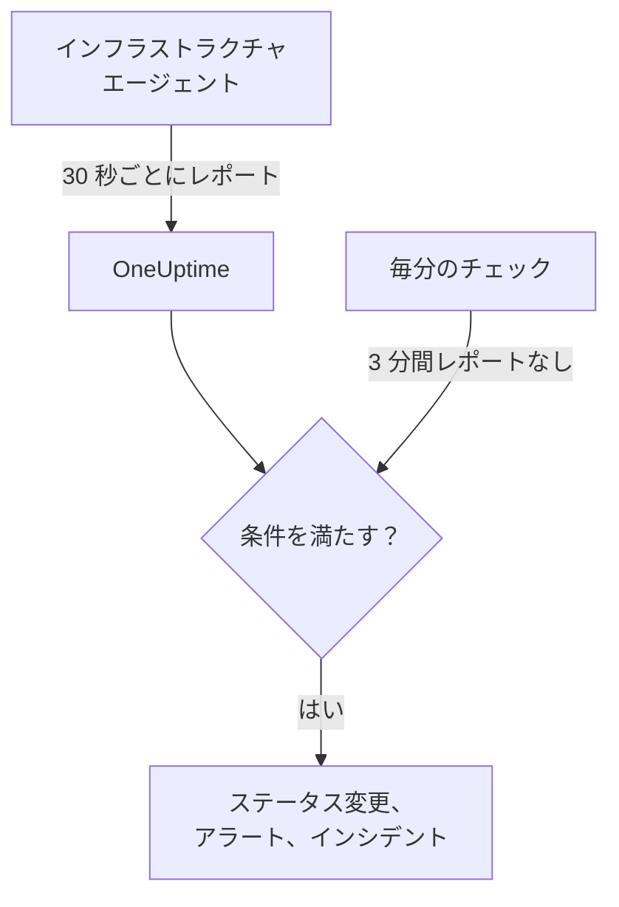

# サーバー / VM モニター

Server / VM モニターは、OneUptime のインフラストラクチャエージェント（`oneuptime-infrastructure-agent`）を通じて 1 台のマシンを監視します。このエージェントは小さなサービスで、30 秒ごとに CPU、メモリ、ディスク、負荷、ネットワーク、実行中のプロセスを OneUptime に報告します。このページでは、エージェントを Server / VM モニターに接続する方法、エージェントが報告する内容、そしてサーバーをオンラインまたはオフラインと判定する条件の書き方を説明します。

> [!IMPORTANT]
> **モニターを作成** では **Server / VM** を選べなくなりました。既存の Server / VM モニターは引き続き動作し、このページの内容はすべてそれらに当てはまります。新しいサーバーを監視するには、代わりに [ホストモニター](/docs/monitor/host-monitor) を作成してください。[ホスト OpenTelemetry Collector](/docs/telemetry/host-otel-collector) が送信するホストのメトリクスでアラートを出します。

:::cards
- [エージェントを接続する](#エージェントを接続する): インストールし、モニターのシークレットキーを渡して起動します。
- [エージェントが報告する内容](#エージェントが報告する内容): CPU、メモリ、ディスク、負荷、ネットワーク、プロセス。
- [監視条件](#監視条件): サーバーをオンラインまたはオフラインと見なすタイミングを決めます。
- [トラブルシューティング](#トラブルシューティング): エージェントが報告しない、またはモニターがオフラインにならない場合。
:::

## 仕組み

エージェントはシステムサービスとして動作します。30 秒ごとにレポートを収集し、モニターのシークレットキーで署名して OneUptime の URL に送信します。OneUptime は数値をモニターのメトリクスとして保存し、レポートをモニターの条件と照合します。

無応答は別途チェックされます。OneUptime は毎分、3 分以上報告がないすべての Server / VM モニターの **Is Online** 条件を再評価し、条件が許容する時間（既定では 3 分）より長く無応答のサーバーをオフラインと見なします。**Is Online** 条件のないモニターは、エージェントが無応答になっただけではオフラインになりません。この無応答に数えられるのは OneUptime がデータを受信していた時間だけです。OneUptime 自身が再起動、アップグレード、遅延の解消をしていた時間は数えられません。詳しくは [OneUptime がデータを受信していないとき](/docs/monitor/when-oneuptime-is-not-receiving) を参照してください。



## 始める前に

- プロジェクト内の Server / VM モニター。
- モニターを編集する権限。シークレットキーと、それを含むセットアップコマンドは、モニターを編集できるユーザーにだけ表示されます。
- サーバー上の root 権限（Linux、macOS）または管理者権限（Windows）。エージェントは自身をシステムサービスとしてインストールします。
- サーバーから OneUptime の URL への送信方向の HTTPS（直接、または HTTP プロキシ経由）。

## エージェントを接続する

以下のコマンドでは `https://oneuptime.com` と `YOUR_SECRET_KEY` を使っています。モニター自身のセットアップコマンドには OneUptime の URL とモニターのシークレットキーがすでに入っているので、できるだけモニターからコピーしてください。

:::steps
### モニターのセットアップコマンドを開く

**モニター** に移動し、Server / VM モニターを開いて **ドキュメント** を選びます。**サーバーモニターをセットアップ（Linux/Mac）** と **サーバーモニターをセットアップ（Windows）** のカードに、このモニター用のコマンドがあります。エージェントが最初に報告するまでは、モニターの **概要** にも表示されます。

### エージェントをインストールする

:::tabs
@tab Linux
```bash
curl -sSL https://oneuptime.com/docs/static/scripts/infrastructure-agent/install.sh | sudo bash
```
@tab macOS
```bash
curl -sSL https://oneuptime.com/docs/static/scripts/infrastructure-agent/install.sh | sudo bash
```
@tab Windows
1. [GitHub の最新リリース](https://github.com/OneUptime/oneuptime/releases/latest) からエージェントをダウンロードします。x64 は `oneuptime-infrastructure-agent_windows_amd64.zip`、ARM64 は `oneuptime-infrastructure-agent_windows_arm64.zip` です。
2. zip を展開します。中に `oneuptime-infrastructure-agent.exe` があります。
3. 展開したフォルダーで **コマンド プロンプト** を管理者として開きます。
:::

インストールスクリプトは、お使いのオペレーティングシステムとプロセッサ（x86-64 または ARM64）向けの最新リリースをダウンロードし、`oneuptime-infrastructure-agent` バイナリを `$HOME/bin` に配置します。セルフホストの場合、スクリプトはお使いの OneUptime の URL から配信されます。

### モニターに接続する

:::tabs
@tab Linux
```bash
sudo oneuptime-infrastructure-agent configure --secret-key=YOUR_SECRET_KEY --oneuptime-url=https://oneuptime.com
```
@tab macOS
```bash
sudo oneuptime-infrastructure-agent configure --secret-key=YOUR_SECRET_KEY --oneuptime-url=https://oneuptime.com
```
@tab Windows
```shell
oneuptime-infrastructure-agent configure --secret-key=YOUR_SECRET_KEY --oneuptime-url=https://oneuptime.com
```
:::

`configure` はシークレットキーと URL をエージェントの設定ファイルに保存し、エージェントをシステムサービスとしてインストールします。両方のフラグが必須です。セルフホストの場合は `https://oneuptime.com` をご自身の URL に置き換えてください。

サーバーがプロキシ経由でインターネットに接続する場合は、`--proxy-url` を追加します。

```bash
sudo oneuptime-infrastructure-agent configure --proxy-url=http://proxy.example.com:8080 --secret-key=YOUR_SECRET_KEY --oneuptime-url=https://oneuptime.com
```

### エージェントを起動する

:::tabs
@tab Linux
```bash
sudo oneuptime-infrastructure-agent start
```
@tab macOS
```bash
sudo oneuptime-infrastructure-agent start
```
@tab Windows
```shell
oneuptime-infrastructure-agent start
```
:::

起動するとエージェントは OneUptime でシークレットキーを確認し、すぐに最初のレポートを送信します。

### 報告されていることを確認する

`sudo oneuptime-infrastructure-agent status` を実行します（Windows では `sudo` は不要）。`Service is running` と表示されます。OneUptime では、最初のレポートが届くとモニターの **概要** にセットアップコマンドが表示されなくなり、**メトリクス** タブでサーバーのグラフが表示され始めます。
:::

## エージェントリファレンス

### コマンド

| コマンド | 動作 |
| --- | --- |
| `configure --secret-key=<key> --oneuptime-url=<url>` | 設定を保存し、エージェントをシステムサービスとしてインストールします。プロキシ経由でレポートを送るには `--proxy-url=<url>` を追加します。 |
| `start` | サービスを起動します。`configure` を実行するまでは起動しません。 |
| `stop` | サービスを停止します。 |
| `restart` | サービスを再起動します。 |
| `status` | サービスが実行中か停止中かを表示します。 |
| `logs` | エージェントのログの最後の 100 行を表示します。`-n <lines>` で表示する行数を変え、`-f` で新しい行を追い続けます。 |
| `uninstall` | サービスを削除し、エージェントの設定ファイルを削除します。 |
| `help` | コマンドの一覧を表示します。 |

Linux と macOS では `sudo` を付けて、Windows では管理者の **コマンド プロンプト** から実行します。設定済みのエージェントのシークレットキー、URL、プロキシを変更するには、`stop` と `uninstall` を実行してから、もう一度 `configure` と `start` を実行します。

### ファイル

| ファイル | Linux と macOS | Windows |
| --- | --- | --- |
| 設定 | `/etc/oneuptime-infrastructure-agent/config.json` | `%PROGRAMDATA%\oneuptime-infrastructure-agent\config.json` |
| ログ | `/var/log/oneuptime-infrastructure-agent/oneuptime-infrastructure-agent.log` | `%PROGRAMDATA%\oneuptime-infrastructure-agent\oneuptime-infrastructure-agent.log` |

エージェントがこれらのディレクトリに書き込めない場合は、代わりに `~/.oneuptime-infrastructure-agent/` を使います。環境変数 `ONEUPTIME_AGENT_CONFIG_PATH` と `ONEUPTIME_AGENT_LOG_PATH` で、それぞれのパスを明示的に指定できます。

## エージェントが報告する内容

各レポートには、サーバーのホスト名と次の情報が含まれます。

| 分類 | 報告される内容 |
| --- | --- |
| CPU | 使用率（%）、コア数、コアごとの使用率、user、system、idle、I/O 待ち、steal、nice、IRQ、ソフト IRQ に費やした時間 |
| メモリ | 合計、使用中、空き、利用可能なメモリ、バッファーとキャッシュ、使用率（%）、スワップの合計、使用中、空き、使用率（%） |
| ディスク | マウントされた各ディスクについて、マウントパス、デバイス、ファイルシステム、合計・使用中・空き容量、使用率（%）、読み書きしたバイト数と操作数、I/O 時間 |
| 負荷 | 1 分、5 分、15 分のロードアベレージ |
| ネットワーク | 各インターフェースについて、送受信したバイト数とパケット数、送受信のエラーとドロップ、加えて確立済みと待ち受け中の接続 |
| ホスト | オペレーティングシステム、プラットフォームとバージョン、カーネルのバージョンとアーキテクチャ、稼働時間、起動時刻、仮想化、プロセス数 |
| プロセス | 実行中の各プロセスの名前、PID、コマンド、CPU（%）、メモリ、状態、スレッド、ユーザー、開始時刻 |

オペレーティングシステムが提供しない値は省略されます。モニターの **メトリクス** タブでは、可用性、CPU、メモリ、ディスク使用量とディスク I/O、ロードアベレージ、スワップ、ネットワークトラフィックとエラー、接続、稼働時間、プロセス数がグラフ表示されます。

## 監視条件

条件は、モニターがオンライン、機能低下、オフラインのいずれになるか、またいつアラートやインシデントを作成するかを決めます。条件内の各フィルターには **フィルタータイプ**、**フィルター条件**、そしてほとんどのタイプでは値があります。

| フィルタータイプ | チェック内容 | フィルター条件 |
| --- | --- | --- |
| Is Online | エージェントが最近報告したかどうか（既定では直近 3 分以内） | 真, 偽 |
| CPU Usage (in %) | CPU 全体の使用率 | Greater Than, Less Than, Greater Than Or Equal To, Less Than Or Equal To |
| Memory Usage (in %) | 使用中のメモリ | CPU と同じ |
| Disk Usage (in %) | **ディスクパス** で指定したディスクの使用率 | CPU と同じ |
| Swap Usage (in %) | 使用中のスワップ | CPU と同じ |
| CPU IO Wait (in %) | CPU 時間のうち I/O 待ちの割合 | CPU と同じ |
| Load Average (1 minute) | 直近 1 分のロードアベレージ | CPU と同じ |
| Load Average (5 minute) | 直近 5 分のロードアベレージ | CPU と同じ |
| Load Average (15 minute) | 直近 15 分のロードアベレージ | CPU と同じ |
| Server Process Name | この名前のプロセスが実行中かどうか（大文字と小文字を区別しない） | Is Executing, Is Not Executing |
| Server Process Command | このコマンドラインと完全に一致するプロセスが実行中かどうか（大文字と小文字を区別しない） | Is Executing, Is Not Executing |
| Server Process PID | この PID のプロセスが実行中かどうか | Is Executing, Is Not Executing |

**ディスクパス** には、`/`、`/mnt/data`、`C:\`、`/dev/sda1` のようなマウントポイントまたはデバイスを指定します。空のままにすると `/` になります。`*` を入力すると、エージェントが報告するすべてのディスクをチェックします。しきい値を超えたディスクごとに個別のアラートが作成されるため、2 台目のディスクがいっぱいになっても 1 台目の未解決アラートに隠れません。

### 一定期間にわたって評価する

**この条件を一定期間にわたって評価する** は条件フォームにある独立したチェックボックスで、フィルター条件ではありません。**Is Online** とすべての数値フィルタータイプで使えます。オンにすると、最新のチェックの値ではなく、**過去（分単位）** で設定した期間にわたる集計値（**評価** で選択：平均、合計、Maximum Value、Minimum Value、All Values、Any Value）を比較します。**Is Online** フィルターでは、この期間が、サーバーがオフラインと見なされるまでにエージェントが無応答でいられる時間になります。

**All Values** は、期間が実際にデータで満たされて初めて一致します。作成したばかりのモニターや、チェックが記録されなくなったモニターには、直近 N 分について判断できるだけの履歴がないため、条件は手元にある 1 つの値で一致させず、待機します。**Any Value** は「1 回のチェックでも超えたらすぐに知らせる」ための設定で、これまでどおりすぐに発火します。

**データがない場合** は、期間が条件を裏付けられない間に何が起こるかを制御します。

| データがない場合 | 動作 | 用途 |
| --- | --- | --- |
| **Ignore**（既定） | 条件は一致しません。 | 通常のしきい値アラート。 |
| **トリガー** | データがないこと自体を問題として扱います。 | 無応答そのものが障害となるハートビート型のチェック。 |
| **Treat As Zero** | 期間を 1 つのゼロとして比較します。 | 「イベントなし」が本当にゼロを意味するカウンター。 |

> [!TIP]
> CPU と負荷は常に短いスパイクを起こします。1 回のレポートでアラートを出すのではなく、**平均** や **All Values** を使って数分間で評価してください。

### 条件の例

| 目的 | フィルタータイプ | フィルター条件 | 値 |
| --- | --- | --- | --- |
| エージェントの報告が止まったらサーバーをオフラインにする | Is Online | 偽 | — |
| CPU 使用率が 90% を超えたらアラート | CPU Usage (in %) | Greater Than | `90` |
| ルートディスクの使用率が 85% を超えたらアラート | Disk Usage (in %)、**ディスクパス** `/` | Greater Than | `85` |
| 使用率が 85% を超えたディスクごとに 1 件ずつアラート | Disk Usage (in %)、**ディスクパス** `*` | Greater Than | `85` |
| メモリ使用率が 80% を超えたらアラート | Memory Usage (in %) | Greater Than | `80` |
| nginx が停止したらアラート | Server Process Name | Is Not Executing | `nginx` |

## トラブルシューティング

:::details エージェントが報告しない
- サービスが実行中か確認します：`sudo oneuptime-infrastructure-agent status`。
- ログを読みます：`sudo oneuptime-infrastructure-agent logs -n 50`。`Metrics successfully pushed to OneUptime server` という行があれば、レポートは届いています。
- エージェントは起動時にシークレットキーを確認し、OneUptime に拒否されると `Secret key is invalid` をログに記録して終了します。キーを、モニターの **設定** ページの **サーバーモニターのシークレットキーをリセット** にあるものと比べてください。
- サーバーが HTTPS で OneUptime の URL に到達でき、ファイアウォールが送信方向の接続をブロックしていないことを確認します。
:::

:::details `sudo` でコマンドが見つからないと表示される
インストールスクリプトは、実行したユーザーの `$HOME/bin` にバイナリを配置し、使用したディレクトリを表示します。`sudo /root/bin/oneuptime-infrastructure-agent configure ...` のようにフルパスでエージェントを実行してください。代わりにシステムのパス上のディレクトリにインストールするには、スクリプトに `-b` を渡します。

```bash
curl -sSL https://oneuptime.com/docs/static/scripts/infrastructure-agent/install.sh | sudo bash -s -- -b /usr/local/bin
```
:::

:::details `start` でサービス設定が見つからないと表示される
`configure` が実行されていないか、`uninstall` で設定が削除されています。シークレットキーと URL を指定して `configure` を実行し、その後 `start` を実行してください。
:::

:::details サーバーが停止してもモニターがオフラインにならない
無応答のサーバーをオフラインにできるのは **Is Online** 条件だけです。**フィルター条件** を **偽** にした条件を追加し、変更先のモニターステータスを設定してください。
:::

:::details レポートがプロキシを通過しない
- `--proxy-url` に渡したプロキシの URL とポートを確認します。
- プロキシが OneUptime の URL への接続を許可していることを確認します。
- プロキシを変更するには、`stop` と `uninstall` を実行し、新しい `--proxy-url` を指定して `configure` を実行してから、`start` を実行します。
:::

## 次のステップ

:::cards
- [ホスト モニター](/docs/monitor/host-monitor): 新しいサーバーに使うモニター。OpenTelemetry のホストメトリクスに基づきます。
- [ホスト OpenTelemetry Collector](/docs/telemetry/host-otel-collector): Linux、macOS、Windows からホストのメトリクスとログを送信します。
- [インシデント & アラート テンプレート](/docs/monitor/incident-alert-templating): CPU、メモリ、ディスク、プロセスの詳細をインシデントのタイトルに入れます。
:::
