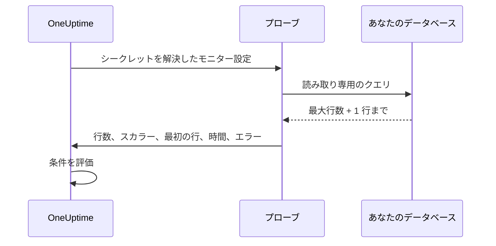

# SQL クエリ モニター

SQL クエリ モニターは、読み取り専用の SQL クエリをプローブからスケジュールに従って実行し、その結果に基づいてアラートを出します。対象は、返された行数、スカラー値、クエリにかかった時間、クエリのエラーです。「クエリを実行してインシデントを開く」という用途のために作られており、たとえば直近 5 分間にキャンセルされた注文の数が急増したとき、キューのテーブルが大きくなりすぎたとき、重要な行が消えたときにアラートを出せます。

:::cards
- [読み取り専用ユーザーを作成する](#読み取り専用ユーザーを作成する): モニターが使うデータベースのログインです。
- [モニターを作成する](#sql-クエリ-モニターを作成する): プローブを接続し、クエリを入力します。
- [クエリを書く](#クエリを書く): アラートの対象にする値を最初の列に置きます。
- [条件を設定する](#条件を設定する): 件数、値、遅いクエリ、エラーでアラートを出します。
:::

## 仕組み

チェックのたびに、プローブはデータベースに接続し、読み取り専用のコンテキストでクエリを実行し、上限付きの行数だけを読み戻して、コンパクトな要約を OneUptime に報告します。モニターの条件は、その要約に対して評価されます。

クエリはネットワーク内のプローブから実行されるので、OneUptime がデータベースに直接接続する必要はなく、結果セット全体がプローブの外に出ることもありません。報告されるのは、結果の小さな、上限付きの要約だけです。



プローブが報告するのは次のものだけです。

| 値 | 内容 |
|---|---|
| **行数** | クエリが返した行の数 (最大行数の上限で制限されます)。 |
| **スカラー値** | 最初の行の最初の列。`SELECT COUNT(*)` のようなクエリでは自然にこの値を使います。 |
| **最初の行** | 列と値のペアとしての最初の行。参考としてチェックの概要に表示されます。 |
| **実行時間** | チェックにかかった時間 (ミリ秒)。クエリだけでなく接続も含みます。 |
| **クエリエラー** | クエリが失敗した場合の、無害化されたエラーメッセージ。 |

結果セット全体が OneUptime に送られることはないので、顧客データが OneUptime のストレージに複製されることはありません。

## サポートされているデータベース

| データベース | デフォルトのポート |
|---|---|
| **PostgreSQL** | `5432` |
| **MySQL** | `3306` |
| **Microsoft SQL Server** | `1433` |

同じワイヤプロトコルと SQL 方言を使う MySQL 互換や PostgreSQL 互換のエンジンも通常は動作しますが、公式にテストしているのは上の 3 つのエンジンだけです。

モニターが接続するホストとポートが、[データベース](/docs/telemetry/databases) ページにあるデータベースのエンドポイントの 1 つである場合、そのアラートとインシデントはそのデータベースのページにも表示されます ([データベースのアラート](/docs/telemetry/databases#alerts-on-a-database) を参照)。モニター シークレットの参照として指定されたホストは照合されません。

## セキュリティモデル

顧客が用意したクエリを本番データベースで実行するのは繊細な作業です。そのため SQL クエリ モニターは設計上読み取り専用で、複数の制御を重ねています。

| 制御 | 内容 |
|---|---|
| **最小権限のデータベースユーザー** (主要な制御) | クエリに必要なテーブルにだけアクセスできる、専用の読み取り専用データベースユーザーで常に接続してください。これが最も重要な制御です。[読み取り専用ユーザーを作成する](#読み取り専用ユーザーを作成する) を参照してください。 |
| **読み取り専用での実行** | PostgreSQL と MySQL では、プローブは `READ ONLY` のトランザクションを開き、クエリの内容にかかわらずあらゆる書き込み (書き込みを行う CTE を含む) を拒否します。読み取り専用のトランザクションがない Microsoft SQL Server では、プローブは常にロールバックされるトランザクション内で実行します。 |
| **単一ステートメントと許可リストのクエリ** | クエリは `SELECT`、`WITH`、`VALUES`、`TABLE` のいずれかで始まる単一のステートメントでなければなりません。複数のステートメント (`SELECT 1; DROP TABLE …`) や、`INSERT`、`UPDATE`、`DELETE`、`DROP`、`EXEC`、`INTO` などの書き込みや DDL のキーワードは、プローブが接続する前に拒否します。このチェックは安全網であり境界ではありません。境界は読み取り専用ユーザーです。 |
| **ステートメントのタイムアウト** | すべてのクエリに厳格な制限時間があります。長く実行されすぎたクエリはキャンセルされます。 |
| **行数の上限** | 読み戻すのは最大行数まで (切り詰めを検出するために 1 行追加) なので、プローブのメモリとデータ量が抑えられます。 |
| **認証情報の秘匿** | データベースのエラーは保存前に無害化され、パスワード、ホスト、ユーザー名、データベース名、接続文字列はすべて伏せられます。そのため、認証情報がエラーメッセージに漏れることはありません。 |

## 始める前に

- データベースのホストとポートにネットワークで到達できる **プローブ**。データベースがインターネットから到達できるなら OneUptime がホストするプローブを、そうでなければネットワーク内で動く [カスタムプローブ](/docs/probe/custom-probe) を使います。
- **読み取り専用のデータベースユーザー** と接続情報 (ホスト、ポート、データベース名、ユーザー名、パスワード)。SQL Server の統合認証を使う場合は、読み取り専用の Windows またはドメインの ID。

## 読み取り専用ユーザーを作成する

常に専用の読み取り専用ユーザーで接続してください。管理者として、使っているエンジン用のステートメントを実行します。`orders` は自分のデータベースに置き換えてください。

:::tabs
@tab PostgreSQL
```sql
-- PostgreSQL
CREATE USER oneuptime_ro WITH PASSWORD 'a-strong-password';
GRANT CONNECT ON DATABASE orders TO oneuptime_ro;
GRANT USAGE ON SCHEMA public TO oneuptime_ro;
GRANT SELECT ON ALL TABLES IN SCHEMA public TO oneuptime_ro;
-- Include tables created in the future:
ALTER DEFAULT PRIVILEGES IN SCHEMA public GRANT SELECT ON TABLES TO oneuptime_ro;
```
@tab MySQL
```sql
-- MySQL
CREATE USER 'oneuptime_ro'@'%' IDENTIFIED BY 'a-strong-password';
GRANT SELECT ON orders.* TO 'oneuptime_ro'@'%';
FLUSH PRIVILEGES;
```
@tab Microsoft SQL Server
```sql
-- Microsoft SQL Server
CREATE LOGIN oneuptime_ro WITH PASSWORD = 'a-strong-password';
USE orders;
CREATE USER oneuptime_ro FOR LOGIN oneuptime_ro;
ALTER ROLE db_datareader ADD MEMBER oneuptime_ro;
```
:::

権限をさらに絞るには、クエリが読むテーブルに対してだけ `SELECT` を付与します。

## SQL クエリ モニターを作成する

:::steps
### 新しいモニターを始める

**モニター** に移動し、**モニターを作成** をクリックします。**モニターの種類** で **その他のモニターの種類** をクリックし、**Database Monitoring** の下の **SQL クエリ** を選ぶか、検索ボックスに `query` と入力します。**名前** を入力し、**次へ** をクリックします。

### 接続情報を入力する

**データベースの種類** を選び (ポートがそのエンジンのデフォルトに変わります)、ホスト、データベース名、読み取り専用ユーザーの認証情報を入力します。パスワードは直接入力せず、[モニター シークレット](#パスワードにモニター-シークレットを使う) として参照してください。各フィールドの説明は [構成](#構成) にあります。

### クエリを入力する

**SQL クエリ** に読み取り専用のステートメントを 1 つ入力します ([クエリを書く](#クエリを書く) を参照)。

### テストする

**モニターをテスト** をクリックし、保存する前にプローブからクエリを 1 回実行します。

### 条件を設定する

モニターに最初からある条件を確認し、独自の条件を追加します ([条件を設定する](#条件を設定する) を参照)。その後 **次へ** をクリックします。

### プローブを選んで作成する

データベースに到達できる **プローブ** と **監視間隔** を選び、**モニターを作成** をクリックします。
:::

## 構成

| フィールド | 入力する内容 |
|---|---|
| **データベースの種類** | PostgreSQL、MySQL、Microsoft SQL Server のいずれか。種類を選ぶとデフォルトのポートが設定されます。 |
| **ホスト** | プローブから到達できるデータベースのホスト (例: `db.internal`)。 |
| **ポート** | データベースのポート。 |
| **データベース名** | クエリを実行するデータベース。 |
| **Windows 統合認証を使用** | Microsoft SQL Server のみ。SQL のユーザー名とパスワードではなく、プローブを実行しているアカウントで認証します。[Windows 統合認証](#windows-統合認証) を参照してください。 |
| **ユーザー名** | 最小権限の読み取り専用データベースユーザー。 |
| **パスワード** | データベースのパスワード。パスワードをプレーンテキストで入力するのではなく、`{{monitorSecrets.name}}` で [モニター シークレット](/docs/monitor/monitor-secrets) を参照することを強くお勧めします ([パスワードにモニター シークレットを使う](#パスワードにモニター-シークレットを使う) を参照)。 |
| **SQL クエリ** | 実行する読み取り専用のクエリ ([クエリを書く](#クエリを書く) を参照)。 |
| **SSL/TLS を使用** | TLS で接続するときに有効にします。有効にした場合、データベースが自己署名証明書を使っているなら **サーバー証明書を検証** をオフにできます。 |

### その他の項目

| フィールド | デフォルト | 最大 | 制限するもの |
|---|---|---|---|
| **接続タイムアウト（ms）** | `10000` | `30000` | 接続の確立を待つ時間。 |
| **ステートメントのタイムアウト（ms）** | `15000` | `60000` | クエリを実行できる時間の厳格な上限。 |
| **最大行数** | `100` | `1000` | データベースから読み戻す行数の上限。 |

最大を超える値は最大に引き下げられます。

### Windows 統合認証

Microsoft SQL Server では、**Windows 統合認証を使用** を有効にすると、プローブのプロセスの ID で信頼された接続を開きます。このモードではユーザー名とパスワードのフィールドは無視され、ドライバーには渡されません。プローブにはドメインが信頼する ID が必要なので、この認証モードではセルフホストのプローブを使ってください。

| プローブの実行環境 | 設定する内容 |
|---|---|
| **Windows** | 読み取り専用の SQL Server ログインを持つドメインアカウントで、プローブのサービスを実行します。 |
| **Linux または macOS** | SQL Server のドメイン用に Kerberos を構成し、プローブのプロセスに有効なチケットを与えます (たとえば keytab を使います)。公式の Linux 版プローブイメージには、Microsoft ODBC Driver 18、unixODBC、Kerberos クライアントが含まれています。Kerberos の構成とチケットキャッシュをコンテナーにマウントし、プローブのプロセスから読めるようにして、場所がデフォルトでない場合は `KRB5_CONFIG` または `KRB5CCNAME` を設定してください。 |

プローブには、それを実行するホストにインストールされた Microsoft ODBC Driver for SQL Server が必要です。公式のプローブイメージには **ODBC Driver 18** が含まれています。セルフホストのプローブやカスタムプローブを実行する場合、プローブはホストに登録されている最新の `ODBC Driver N for SQL Server` を自動的に検出して使います (たとえば、インストールされているのが Driver 17 ならそれを使います)。Driver 18 でなければならないわけではありません。特定のドライバーに固定するには、プローブの環境変数 `SQL_SERVER_ODBC_DRIVER` にドライバーの正確な名前 (例: `ODBC Driver 17 for SQL Server`) を設定します。

SQL Server には適切な `MSSQLSvc` のサービスプリンシパル名が必要で、プローブとドメインコントローラーの時計は同期している必要があります。また、プローブはそのサービスプリンシパル名がカバーするホスト名で SQL Server を名前解決し、到達できなければなりません。信頼された ID には、監視クエリに必要なデータベース権限だけを付与してください。

## クエリを書く

クエリは **読み取り専用の単一ステートメント** でなければなりません。`SELECT`、`WITH`、`VALUES`、`TABLE` のいずれかで始める必要があります。末尾のセミコロンは使えますが、複数のステートメントは使えません。書き込みや DDL のキーワードはクエリのどこにあっても拒否されます。`INTO` も対象なので、`SELECT … INTO` も拒否されます。

プローブは保存時ではなく、チェックのたびにクエリを検査します。これらのルールに反するクエリも保存はでき、その後のチェックがすべて "Only read-only queries are allowed (must start with SELECT, WITH, VALUES, or TABLE)." で失敗し、デフォルトの条件によってモニターはオフラインになります。

クエリは軽く、範囲を絞ったものにしてください。チェックのたびに実行されるので、インデックスのある列と狭い時間の範囲を優先します。次のクエリは、直近 5 分間にキャンセルされた注文を数えます。

:::tabs
@tab PostgreSQL
```sql
-- Count recent cancellations (PostgreSQL)
SELECT COUNT(*) AS cancelled
FROM orders
WHERE status = 'CANCELLED'
  AND created_at > NOW() - INTERVAL '5 minutes';
```
@tab MySQL
```sql
-- The same idea on MySQL
SELECT COUNT(*) AS cancelled
FROM orders
WHERE status = 'CANCELLED'
  AND created_at > NOW() - INTERVAL 5 MINUTE;
```
@tab Microsoft SQL Server
```sql
-- The same idea on Microsoft SQL Server
SELECT COUNT(*) AS cancelled
FROM orders
WHERE status = 'CANCELLED'
  AND created_at > DATEADD(minute, -5, GETDATE());
```
:::

> [!TIP]
> `COUNT(*)` のようなクエリでは、件数は **行数** (1 行が返るので `1`) と **スカラー値** (最初の列にある件数そのもの) の両方で得られます。「いくつあるか」でアラートを出すには **スカラー値** と比較してください。

## パスワードにモニター シークレットを使う

データベースのパスワードがモニターにプレーンテキストで保存されないように、[モニター シークレット](/docs/monitor/monitor-secrets) を作成し、パスワードのフィールドから参照します。

:::steps
1. **モニター → 設定 → シークレット** に移動し、モニター シークレットを作成します。
2. 名前を付け (例: `dbPassword`)、このモニターにアクセスを許可します。
3. モニターの **パスワード** フィールドに `{{monitorSecrets.dbPassword}}` と入力します。
:::

OneUptime は、構成をプローブに渡す前にサーバー側でシークレットを解決します。OneUptime がこれらのシークレットを自動で作成することはありません。参照するかどうかはあなたが決めます。**ユーザー名**、**ホスト**、**データベース名**、**SQL クエリ** のフィールドもシークレットの参照を受け付けますが、**ポート** は受け付けません。

## 条件を設定する

モニターをオンライン、機能低下、オフラインのどれと見なすかを決める条件を追加します。SQL クエリ モニターでは次のチェックを使えます。

| フィルタータイプ | チェック内容 |
|---|---|
| **SQL Is Online** | データベースに到達でき、クエリが成功したかどうか。 |
| **SQL Query Row Count** | 返された行数。より大きい、より小さい、等しいなどの演算子で比較します。 |
| **SQL Query Scalar Value** | 最初の行の最初の列。入力した値が数値なら数値として、そうでなければ文字列として比較されます。`COUNT(*)` のようなクエリにはこのチェックを使います。 |
| **SQL Query Execution Time (in ms)** | クエリにかかった時間。遅いデータベースの検出に役立ちます。 |
| **SQL Query Error** | クエリのエラーメッセージ。空のとき (または空でないとき)、あるいは特定の文字列に一致したときにアラートを出します。 |
| **JavaScript Expression** | `rowCount`、`scalarValue`、`firstRow`、`executionTimeInMs`、`queryError`、`isOnline` を使った独自の JavaScript 式を評価します。[JavaScript 式](/docs/monitor/javascript-expression#sql-クエリのモニター) を参照してください。 |

数値のしきい値は整数です。`10.5` ではなく `10` のように書きます。SQL Query のフィルターは期間にわたって評価できず、各チェックは単独で評価されます。

新しい SQL クエリ モニターには最初から 2 つの条件があります。**SQL Is Online** が false の条件 (モニターがオフラインになり、自動的に解決するインシデントを宣言します) と、**SQL Is Online** が true の条件 (モニターをオンラインにします) です。**条件を追加** は条件を末尾に追加します。条件は上から順にチェックされ、最初に一致したものが結果を決めるので、追加した条件はオンラインの条件より上にドラッグしてください。

### 例: キャンセルが急増したらアラートを出す

上のクエリを使う場合:

| 条件 | フィルター |
|---|---|
| **機能低下** | `SQL Query Scalar Value` が `10` より大きい。 |
| **オフライン** | `SQL Query Scalar Value` が `50` より大きい、または `SQL Is Online` が `false`。 |

適切な人が呼び出されるように、条件にオンコールポリシーを関連付けます。SQL クエリ モニターには独自のテンプレート変数がありません。インシデントのタイトルでは `{{monitorName}}` でモニター名を示せますが、クエリの結果を引用することはできません。

## 考慮事項

- クエリはチェックのたびに実行されるので、軽くしてください。インデックスと狭い時間の範囲を使い、安全網としてステートメントのタイムアウトに頼ります。
- 報告されるのは行数、最初のセル (スカラー)、最初の行だけです。アラートの対象にしたい値が最初の列になるようにクエリを設計してください。
- 結果が最大行数を超えて切り詰められた場合、チェックの概要に **行が切り詰められました**: "Yes (result capped)" と表示されます。最大行数は必要なときだけ増やしてください。結果セットが大きいほどプローブのメモリを多く使います。
- 書き込みと DDL は常に拒否されます。書き込みの経路をテストしたいなら、このモニターはその用途向けではありません。
- 認証情報が保存時に暗号化されるよう、プレーンテキストのパスワードよりモニター シークレットを優先してください。
- クエリが失敗したチェックは、エラーを報告する前に 1 秒後に最大 3 回まで再試行されるので、短時間の接続断でモニターがオフラインになることはありません。セルフホストのプローブでは、`PROBE_MONITOR_RETRY_LIMIT` で回数を設定できます。

## トラブルシューティング

:::details すべてのチェックが "Only read-only queries are allowed" で失敗する
クエリが `SELECT`、`WITH`、`VALUES`、`TABLE` のいずれでも始まっていません。前にコメントがあるのは問題ありませんが、`SET` や `DECLARE` は使えません。読み取り専用の単一ステートメントに書き直してください。
:::

:::details チェックが "Disallowed SQL keyword" で失敗する
`SELECT` の中であっても、クエリのどこかに `INTO` や `EXEC` のような書き込み、DDL、実行のキーワードがあります。引用符で囲んだ文字列やコメントの中の単語は対象外です。キーワードを取り除くか、ロジックを読み取り専用ユーザーが読めるビューに移してください。
:::

:::details チェックがタイムアウトする
プローブが **接続タイムアウト（ms）** 以内に接続できなかったか、クエリが **ステートメントのタイムアウト（ms）** より長く実行されました。プローブがホストとポートに到達できることを確認し、クエリを軽くしてください。インデックスのある列で、短い時間の範囲に絞って絞り込みます。
:::

:::details 接続が証明書のエラーで失敗する
データベースの証明書が自己署名であるか、プローブに信頼されていません。**SSL/TLS を使用** をオンにすると表示される **サーバー証明書を検証** をオフにするか、プローブが信頼する証明書をデータベースに設定してください。
:::

:::details Windows 統合認証が失敗する
プローブには Microsoft ODBC Driver for SQL Server と、ドメインが信頼する ID が必要です。公式のプローブイメージを使うかドライバーをインストールしてから、[Windows 統合認証](#windows-統合認証) の設定を確認してください。
:::

## 次のステップ

:::cards
- [データベースヘルス モニター](/docs/monitor/database-health-monitor): SQL を書かずに接続、ロック、レプリケーションを監視します。
- [モニター シークレット](/docs/monitor/monitor-secrets): データベースのパスワードを暗号化して保管します。
- [JavaScript 式](/docs/monitor/javascript-expression): 複数の値を組み合わせた条件を書きます。
- [カスタム プローブ](/docs/probe/custom-probe): ネットワークの内側からチェックを実行します。
:::
