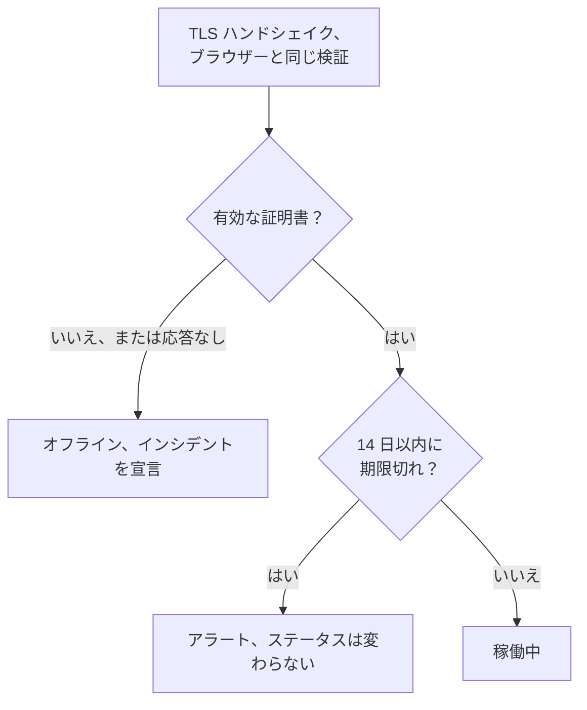

# SSL 証明書モニター

SSL 証明書モニターは、サイトやサービスが提示する TLS 証明書をブラウザーと同じようにチェックし、期限が切れる前に警告します。また、証明書が有効でなくなったとき、つまり期限切れ、自己署名、別のホスト名向けに発行された、またはブラウザーが信頼しない認証局のものである場合は、モニターをオフラインにします。

:::cards
- [モニターを作成する](#ssl-証明書モニターを作成する): ダッシュボードで 6 ステップ。
- [デフォルト条件](#デフォルト条件): 設定なしで、14 日前に期限切れを警告。
- [監視条件](#監視条件): 有効性、期限、自己署名証明書。
- [トラブルシューティング](#トラブルシューティング): 自己署名証明書と社内の証明書。
:::

## しくみ

チェックのたびに、プローブは URL のホストとポート（URL で別のポートを指定しない限り `443`）に TLS 接続を開き、ブラウザーと同じように証明書を検証します。信頼された認証局、一致するホスト名、今日を含む有効期間です。証明書が検証に通らなくてもプローブはそれを読むので、有効期限、発行者、フィンガープリントはどちらの場合も記録されます。失敗した、タイムアウトした、または無効な証明書を提示した接続は、許可した再試行回数まで再試行されます。その後、OneUptime が結果をモニターの条件に通します。

自身のネットワーク接続を失ったプローブは結果を報告しないため、証明書を無効とすることはありません。

## 始める前に

- **モニターを作成できるロール**: Project Owner、Project Admin、Project Member、Monitor Admin、Monitor Member のいずれか、または Create Monitor 権限を持つカスタムロール。
- **ホストとポートに到達できるプローブ。** 新しいモニターには、プロジェクトのデフォルトのプローブが選ばれます。プライベートネットワーク上のサービスには、そのネットワーク内の [カスタムプローブ](/docs/probe/custom-probe) が必要です。

## SSL 証明書モニターを作成する

:::steps
### 新しいモニターを始める

**モニター** に移動し、**モニターを作成** をクリックします。**モニターの種類** で **SSL 証明書** を選びます。

### 名前を付ける

`example.com certificate` のような **名前** を入力し、**次へ** をクリックします。

### URL を入力する

**ウェブサイト URL** に、証明書をチェックするサイト（たとえば `https://example.com`）を入力します。別のポートのサービスの場合は、ポートも含めます: `https://example.com:8443`。

### テストする

**モニターをテスト** をクリックし、**プローブを選択** でプローブを選んで **テストを実行** をクリックします。**モニターテスト結果** に、プローブが受け取った証明書が発行者と有効期限とともに表示されます。

### 条件を確認する

**モニター条件** は [デフォルト条件](#デフォルト条件) から始まります。証明書が有効でなければオフライン、14 日以内に期限が切れるならアラートです。必要なら変更して、**次へ** をクリックします。

### プローブを選んで作成する

**プローブ** と **監視間隔**（**5 分ごと** から始まります。SSL 証明書モニターには 5 分以上の間隔が用意されています）をそのまま使うか変更し、**モニターを作成** をクリックします。モニターのページが開きます。
:::

## 設定オプション

| 項目 | デフォルト | 入力する内容 |
| --- | --- | --- |
| **ウェブサイト URL** | なし | 証明書をチェックするサイト。`https://example.com` や `https://example.com:8443` など。使われるのはホストとポートだけで、パスは無視されます。 |
| **リクエストタイムアウト（秒）**（**その他の項目** の下） | `60` | 各試行で TLS ハンドシェイクを待つ時間。最大 60 秒です。 |
| **失敗時の再試行**（**その他の項目** の下） | プローブのデフォルト、通常 `3` | 失敗した試行を再試行する回数。最大 3 回です。 |

**失敗時の再試行** は最初の試行の _後_ の再試行を数えるので、`0` ならチェックは 1 回、`2` なら最大 3 回実行されます。空のままにすると、プローブのデフォルトを使います。プローブの `PROBE_MONITOR_RETRY_LIMIT` が別の値を指定しない限り 3 回です。接続エラー、証明書の検証失敗、タイムアウトはすべて、試行の間に 1 秒の間隔を置いて再試行されます。

## 監視条件

条件は、証明書を正常、機能低下、異常のどれとみなすか、そしてそれによってインシデントを宣言するかアラートを作成するかを決めます。各条件は 1 つ以上のフィルターをチェックします。

| フィルター | 条件 | チェック内容 |
| --- | --- | --- |
| **Is Valid Certificate** | **真**、**偽** | 証明書がブラウザーのチェックに通ること。信頼された認証局、一致するホスト名、今日を含む有効期間です。エンドポイントが応答しなかったときは **偽**。 |
| **Is Not A Valid Certificate** | **真**、**偽** | **Is Valid Certificate** の逆。証明書がそれらのチェックに通らないか、チェックできなかったときに **真**。 |
| **Is Expired Certificate** | **真**、**偽** | 証明書の有効期限が過ぎていること。 |
| **Is Self Signed Certificate** | **真**、**偽** | 証明書、またはそのチェーン内の証明書が自己署名であること。 |
| **Expires In Days** | **Greater Than**、**Less Than**、**Greater Than Or Equal To**、**Less Than Or Equal To** | 証明書の期限が切れるまでの日数。 |
| **Expires In Hours** | **Greater Than**、**Less Than**、**Greater Than Or Equal To**、**Less Than Or Equal To** | 証明書の期限が切れるまでの時間数。 |

**Expires In Days** は丸 1 日単位で数えます。14 日と 20 時間後に期限が切れる証明書の残りは 14 日です。**Expires In Hours** も同じように丸 1 時間単位で数えます。

フィルターが 2 つ以上ある場合、**一致条件** で **すべて** が一致する必要があるか、**いずれか** 1 つでよいかを決めます。条件の **アクション** は、その条件が何をするかを決めます。モニターのステータスを変える、アラートを作成する、インシデントを宣言する、またはそのいくつかです。

### デフォルト条件

新しい SSL 証明書モニターは 3 つの条件から始まるので、何も設定しなくても証明書の期限が切れる前に警告します。

1. **証明書が有効でない** — 証明書が期限切れ、自己署名、別のホスト名向けまたは信頼されていない認証局による発行であるか、エンドポイントが応答しなかったためにチェックできなかった場合。モニターは **オフライン** になり、「_monitor name_ certificate is not valid」というインシデントが作成されます。その根本原因に、これらのどれだったかが示されます。インシデントは証明書が再び有効になると自動で解決します。
2. **証明書の期限が近い** — 証明書は有効だが、14 日以内に期限が切れる場合。「_monitor name_ certificate expires soon」という **アラート** が作成されます。
3. **証明書が有効** — モニターは **稼働中** になります。

「期限が近い」の警告はインシデントではなくアラートです。ステータスページには表示されず、オンコールポリシーを追加しない限り誰も呼び出さず、モニターのステータスも変えません。プロジェクトの 2 番目のアラート重大度を使い、新しいプロジェクトでは **低** です。更新された証明書が取り込まれると、モニターは「証明書が有効」に戻り、アラートは自動で解決します。

条件は上から順にチェックされ、最初に一致したものが何が起きるかを決めます。そのため「期限が近い」は「有効」より上にあります。期限が近い証明書もまだ有効なので、両方に一致してしまうからです。

もっと早く警告を受けるには、「期限が近い」の条件にある **Expires In Days** フィルターの値を、たとえば `30` に変更します。代わりに誰かを呼び出すには、その条件の **アクション** を開き、**フィルターが一致したとき、インシデントを宣言します。** をオンにするか、アラートのまま **オンコールポリシー** でオンコールポリシーを追加します。

:::details 警告ができる前に作成されたモニターに警告を追加する
OneUptime がこの警告を追加する前に作成されたモニターには、「期限が近い」の条件がありません。追加するには:

1. モニターで **構成 → 条件** を開き、**監視条件を編集** をクリックします。
2. **条件を追加** をクリックします。フィルターを **Is Valid Certificate** / **真** に設定し、**フィルターを追加** をクリックして、2 つ目を **Expires In Days** / **Less Than Or Equal To** / `14` に設定します。**一致条件** は **すべて** のままにします（フィルターが 2 つになるとフィルターの下に表示されます）。
3. **アクション** で **フィルターが一致したとき、アラートを作成します。** をオンにし、**フィルターが一致したとき、モニターのステータスを変更します。** はオフのままにして、アラートを作成してもモニターのステータスは変えないようにします。
4. 新しい条件を、モニターをオンラインとする条件より上にドラッグして、保存します。
:::

### 条件の例

| 目的 | フィルター | 条件 | 値 |
| --- | --- | --- | --- |
| 1 か月前に警告する | **Expires In Days** | **Less Than Or Equal To** | `30` |
| 最終日に誰かを呼び出す | **Expires In Hours** | **Less Than** | `24` |
| 証明書の期限が切れてから初めてオフラインにする | **Is Expired Certificate** | **真** | — |
| 自己署名証明書に印を付ける | **Is Self Signed Certificate** | **真** | — |

期限に関する条件は、証明書を有効とする条件より上に置く必要があります。期限が近い証明書もまだ有効であり、最初に一致した条件が優先されるからです。

## ベストプラクティス

1. **更新のための時間を確保する** — デフォルトの警告は期限の 14 日前に届き、自動で更新される証明書に合っています。更新にもっと時間がかかる場合（購入する証明書や変更手続きなど）は、30 日に延ばします。
2. **すべてのエンドポイントを監視する** — 複数のドメインやサブドメインがある場合は、それぞれにモニターを作成します。それぞれが独自の証明書を持つことがあります。
3. **他のポートも含める** — `8443` など、`443` 以外のポートで TLS を提供するサービスにも証明書があります。URL にポートを入れます。
4. **更新後に確認する** — 証明書を更新したら、モニターの次の結果を確認します。表示される有効期限は新しいものになっているはずです。

## トラブルシューティング

:::details ブラウザーでは証明書に問題がないのに、モニターは有効でないと言う
インシデントの根本原因に理由が示されます。よくあるのは、中間証明書なしで証明書を送るサーバーです。ブラウザーはその欠けた部分を自分で補うことが多いですが、プローブは補いません。完全なチェーンを送るようにサーバーを設定します。もう 1 つは、URL のホスト名が証明書に含まれていない場合です。
:::

:::details 自己署名証明書を使う社内サービスを監視している
自己署名証明書は決して有効にならないため、デフォルト条件ではモニターはオフラインのままです。**Is Self Signed Certificate**、**Is Expired Certificate**、**Expires In Days** はそれでも機能するので、これらで条件を組み立てます。**構成 → 条件** で次のようにします。

1. 「有効でない」の条件で **フィルターを追加** をクリックし、新しいフィルターを **Is Self Signed Certificate** / **偽** に設定して、**一致条件** を **すべて** に設定します。エンドポイントが応答しないときや、証明書が別の点で誤っているときは、この条件が引き続きモニターをオフラインにします。
2. **Is Expired Certificate** / **真** で、モニターを **オフライン** にしてインシデントを宣言する条件を追加し、一番上にドラッグします。
3. 「期限が近い」の条件で、**Is Valid Certificate** / **真** を **Is Expired Certificate** / **偽** に置き換え、警告が自己署名証明書にも適用されるようにします。

証明書が有効期間内の間はどの条件にも一致せず、モニターはデフォルトのステータスである **稼働中** を表示します。
:::

:::details モニターが「could not be checked because the endpoint is not reachable」でオフラインになる
プローブがホストとポートへの TLS 接続を開けませんでした。URL のポートと、ファイアウォールがプローブを通していることを確認します。プライベートネットワーク上のホストには [カスタムプローブ](/docs/probe/custom-probe) が必要です。
:::

## 次のステップ

:::cards
- [Web サイト モニター](/docs/monitor/website-monitor): サイト自体が応答することをチェックします。
- [ドメイン モニター](/docs/monitor/domain-monitor): ドメインの登録の期限が切れる前に警告を受けます。
- [エスカレーションルール](/docs/on-call/escalation-rules): アラートとインシデントで誰を呼び出すかを決めます。
- [インシデント 概要](/docs/incidents/index): モニターがインシデントを宣言した後に起きること。
:::
