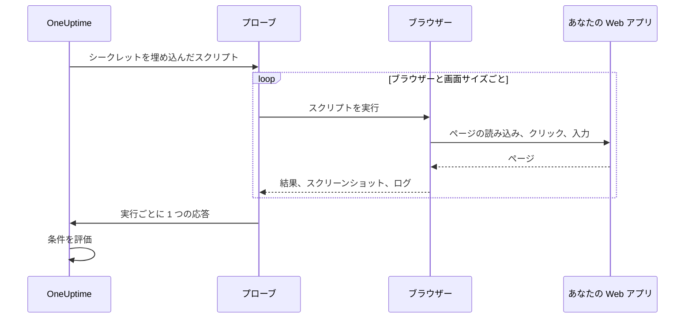

# 合成モニター

合成モニターは、あなたが書いた Playwright のスクリプトで、本物のブラウザーを使って Web アプリをスケジュールに従って操作します。ページを開き、フォームに入力し、ユーザーの操作の流れをクリックでたどり、その流れが失敗するとチェックも失敗します。稼働時間のチェックでは見えない不具合、たとえば動かなくなったログイン、押しても何も起きない購入ボタン、いつまでも読み込みが終わらないダッシュボードを捕まえるのに使います。

:::cards
- [モニターを作成する](#合成モニターを作成する): スクリプトを書き、ブラウザーと画面サイズを選びます。
- [スクリプトを書く](#スクリプトを書く): そのまま動くサインインの流れから始められます。
- [スクリーンショット](#スクリーンショット): 実行が失敗したときのページの様子を確認できます。
- [スクリプトで使えるもの](#スクリプトで使えるモジュール): Playwright、HTTP、暗号、メトリクス。
:::

## 仕組み

チェックのたびに、プローブは選んだブラウザーと画面サイズの組み合わせごとに 1 回ずつ、順番にスクリプトを実行します。各実行は、以前の実行の Cookie やストレージを持たない新しいブラウザーで始まります。スクリプトはページを操作し、スクリーンショットを撮り、結果を返すか例外を投げます。プローブはすべての実行を報告し、OneUptime はそれらに対して条件を評価します。



| 画面の種類 | ビューポート |
| --- | --- |
| Mobile | 360 × 640 |
| Tablet | 1024 × 768 |
| Desktop | 1920 × 1080 |

ブラウザーは Chromium と Firefox です。

## 始める前に

- Web アプリに到達できる **プローブ**。ネットワーク内のアプリには [カスタムプローブ](/docs/probe/custom-probe) を使います。プローブの Docker イメージには Chromium と Firefox が含まれています。Docker の外で動かすプローブには、それらをインストールしておく必要があります。
- 操作の流れに必要なパスワードやトークンを、[モニター シークレット](/docs/monitor/monitor-secrets) として保存しておきます。

## 合成モニターを作成する

:::steps
### 新しいモニターを始める

**モニター** に移動し、**モニターを作成** をクリックします。**モニターの種類** で **その他のモニターの種類** をクリックし、**Synthetic Monitoring** の下の **シンセティックモニター** を選ぶか、検索ボックスに `playwright` と入力します。**名前** を入力し、**次へ** をクリックします。

### スクリプトを追加する

**Playwright のコード** エディターにスクリプトを書きます。[下の例](#スクリプトを書く) から始めましょう。

### ブラウザーと画面サイズを選ぶ

**ブラウザーの種類** でブラウザーを、**画面の種類** でサイズを選びます。スクリプトは組み合わせごとに 1 回実行されるので、ブラウザー 2 つとサイズ 3 つなら、チェック 1 回あたり 6 回の実行になります。**その他の項目** の **エラー時の再試行回数** で、失敗した実行を最大 5 回まで再試行できます。

### テストする

**モニターをテスト** をクリックしてプローブからスクリプトを 1 回実行し、各実行の結果、ログ、スクリーンショットを確認します。

### 条件を確認する

モニターには最初から 2 つの条件があります。いずれかの実行が失敗するとオフラインになってインシデントを宣言し、どれも失敗しなければオンラインになります。必要に応じて変更するか独自の条件を追加し ([条件](#条件) を参照)、**次へ** をクリックします。

### プローブを選んで作成する

**プローブ** と **監視間隔** を選び (合成モニターでは 5 分以上の間隔を選べます)、**モニターを作成** をクリックします。
:::

## スクリプトを書く

スクリプトは `async` 関数の本体です。`page` はすでに開いている Playwright 互換のページです。これを操作し、`return` で結果を返し、`throw` (または Playwright の呼び出しのタイムアウト) で実行を失敗させます。次の例はサインインし、ダッシュボードが読み込まれることを確認します。

```javascript title="Synthetic monitor script"
await page.goto("https://app.example.com/login");
screenshots["login-page"] = await page.screenshot();

await page.fill("#email", "monitoring@example.com");
await page.fill("#password", "{{monitorSecrets.AppPassword}}");
await page.click("button[type=submit]");

// Fails the run if the dashboard does not appear within 10 seconds.
await page.waitForSelector(".dashboard", { timeout: 10000 });
screenshots["dashboard"] = await page.screenshot();

console.log(`Signed in on ${browserType}, ${screenSizeType}`);

return {
  data: { title: await page.title() },
};
```

| 目的 | 方法 | OneUptime が記録するもの |
| --- | --- | --- |
| 結果を報告する | `return { data: ... }` | 実行の **結果**。保持されるのは `data` だけです。 |
| 実行を失敗させる | `throw new Error("...")`、または待機をタイムアウトさせる | 実行の **スクリプトエラー**。 |
| 証拠を残す | `screenshots["name"] = await page.screenshot()` | 実行が失敗しても保持されるスクリーンショット。 |
| 痕跡を残す | `console.log(...)` | 実行のログメッセージ。 |

実行を確認するには、モニターの **概要** を開きます。**モニターの概要** カードにはブラウザーと画面サイズごとに 1 つのブロックがあり、**詳細をさらに表示** で各実行のスクリーンショットを見られます。

### Playwright の使用

ユーザーの操作の再現には Playwright を使います。`page` の値は、この実行のために作られたページに対する、安全な Playwright 互換のファサードです。`Page`、`Locator`、`Frame`、`ElementHandle`、`JSHandle`、`Request`、`Response`、キーボード、マウス、ブラウザーコンテキストのよく使うメソッドが使えます。ナビゲーション、ロケーター、クリック、フォーム入力、ページ上での評価、ポップアップ、追加のページ、レスポンスの確認、スクリーンショットが含まれます。この実行のブラウザーコンテキストには `page.context()` でアクセスでき、たとえば新しいページを開いたりポップアップを扱ったりできます。

合成モニターのスクリプトは、プローブの Node.js プロセスでは実行されません。値はコピーされたデータか、実行に紐づく不透明な機能として実行環境の境界を越えるので、一部の Playwright API は動作が異なるか、まったく動作しません。

| 使えないもの | 代わりに使うもの |
| --- | --- |
| ブラウザーの起動や接続のメソッド、CDP セッション、リクエストのルーティング、公開バインディング、Playwright のプライベートフィールド、ホストのファイルシステムのパスを読み書きするオプション。そのため `page.context().browser()` は使えません。 | 与えられたページとブラウザーコンテキスト。 |
| イベントリスナー (`page.on(...)`、`page.once(...)`)。呼び出すとわかりやすいエラーで失敗します。 | ダイアログやポップアップには `page.waitForEvent(...)`、または文字列や正規表現で照合するレスポンスやリクエストの待機。 |
| イベント、リクエスト、レスポンス、URL の待機メソッドに渡す関数の述語。 | 文字列や正規表現による照合、ロケーター、明示的なポーリング。 |
| 同期的なフレームのアクセサー (`page.frames()`、`page.mainFrame()`、`page.frame(...)`)。 | iframe には `page.frameLocator(...)`。 |
| `page.request.*` | HTTP リクエストにはグローバルの `axios`。 |
| ページ全体のスクリーンショットと PDF 出力。 | ビューポートのスクリーンショット。下で説明する、失敗時の証拠を残す動作はそのまま使えます。 |

`page.waitForNavigation(...)`、`page.setDefaultTimeout(...)`、`page.setDefaultNavigationTimeout(...)` はサポートされています。`page.waitForEvent(...)` が待機できるのは `dialog`、`domcontentloaded`、`load`、`popup`、`request`、`requestfailed`、`requestfinished`、`response` です。`page.evaluate()` などのメソッドに渡した評価関数は、監視対象のブラウザーのページで実行され、プローブのプロセスでは実行されません。1 回の実行で使えるページは最大 8 つです。

ブラウザーの権限は位置情報と通知に限られます。クリップボード、カメラ、マイク、MIDI、ローカルフォントなど、ホストのデバイスに関わる権限はモニターのスクリプトでは使えません。

### スクリプトが返すもの

スクリプトが返したデータは、保存前に JSON にシリアライズされます。プレーンなオブジェクトと配列の中では、`NaN` と `Infinity` は `null` になり、`undefined` のプロパティと関数は取り除かれ、`Date` オブジェクトは ISO 文字列になります。これは `JSON.stringify` の扱いと同じです。クラスのインスタンスなど、プレーンでないオブジェクトは丸ごと取り除かれます。`BigInt` は文字列になります。循環参照がある結果、30 階層を超えて入れ子になった結果、5 MB を超える結果は、代わりに実行を失敗させます。

### 返されたデータでアラートを出す

スクリプトが `data` として返したものがモニターの **Result Value** で、条件でこれを比較できます。`data` がオブジェクトや配列の場合は、Result Value フィルターの **フィールドパス（任意）** を入力して 1 つのフィールドを比較します。たとえば `status`、`timings.loadTime`、`errors[0].message` です。フィルターは、モニターが実行されるすべてのブラウザーと画面サイズのデータに対してチェックされ、そのどれかが一致すれば一致します。パスと条件のしくみは [返されたデータでアラートを出す](/docs/monitor/custom-code-monitor#返されたデータでアラートを出す) を参照してください。

## スクリーンショット

スクリプトのコンテキストには、あらかじめ宣言された `screenshots` オブジェクトがあります。スクリプトのどこでもこれにスクリーンショットを代入できます。これらのスクリーンショットは **スクリプトが例外を投げても** (アサーションの失敗、タイムアウト、予期しないエラーを含む) 保存されるので、実行が失敗したときのページの様子を正確に確認できます。保存したスクリーンショットは、OneUptime のダッシュボードでそのモニターの実行ごとに表示されます。

```javascript
// Capture screenshots via the `screenshots` side-channel — they are preserved on both success and failure.

await page.goto("https://app.example.com/login");
screenshots["login-page"] = await page.screenshot();

await page.fill("#email", "user@example.com");
await page.fill("#password", "wrong");
await page.click("button[type=submit]");

// If the next assertion throws, the `login-page` screenshot above is still captured.
await page.waitForSelector(".dashboard", { timeout: 5000 });

screenshots["dashboard"] = await page.screenshot();

return {
  data: "Login succeeded",
};
```

1 回の実行で保存できるスクリーンショットは最大 20 枚、1 枚あたり最大 10 MB、合計 50 MB までです。モニターのインシデントやアラートの説明にスクリーンショットを入れておけば、失敗した実行が開くインシデントやアラートのページと、それに関するメールにもスクリーンショットを表示できます。[スクリーンショットを表示する](/docs/monitor/incident-alert-templating#合成モニター) を参照してください。

:::details スクリーンショットを返す (従来の方法)
後方互換性のため、スクリーンショットを戻り値の一部としてスクリプトから返すこともできます。この方法で返したスクリーンショットは、スクリプトが正常に終了したときに **だけ** 保存され、スクリプトが例外を投げると失われます。失敗の証拠を残したいときは、上のサイドチャネルの方法を使ってください。

```javascript
// Legacy pattern — screenshots only captured on successful return.
const screenshots = {};
screenshots["screenshot-name"] = await page.screenshot();

return {
  data: "Hello World",
  screenshots: screenshots,
};
```
:::

## モニター シークレットを使う

スクリプトのどこでも、シークレットを `{{monitorSecrets.NAME}}` として参照できます。OneUptime は、スクリプトがプローブに届く前に、参照をシークレットの値にプレーンテキストとして置き換えます。そのため、文字列として使うときはシークレットを引用符で囲み、数値やブール値として使うときは何も付けずに書きます。

```javascript
// Used as a string: wrap it in quotes.
const password = "{{monitorSecrets.AppPassword}}";

// Used as a number or a boolean: leave it bare.
const retryLimit = {{monitorSecrets.RetryLimit}};
const verbose = {{monitorSecrets.Verbose}};
```

シークレットを作成し、使えるモニターを選ぶ方法は [モニター シークレット](/docs/monitor/monitor-secrets) を参照してください。

## カスタムメトリクス

`oneuptime.captureMetric()` 関数を使うと、スクリプトからカスタムメトリクスを記録できます。これらのメトリクスは OneUptime に保存され、Metric Explorer でダッシュボードのグラフにできます。

```javascript
oneuptime.captureMetric(name, value, attributes);
```

| パラメーター | 型 | 説明 |
| --- | --- | --- |
| `name` | string、必須 | メトリクス名 (例: `"dashboard.load.time"`)。自動的に `custom.monitor.` という接頭辞付きで保存されます。 |
| `value` | number、必須 | メトリクスの数値。 |
| `attributes` | object、任意 | 追加のコンテキストを表すキーと値のペア。 |

### 例

```javascript
await page.goto("https://app.example.com");

const startTime = Date.now();
await page.waitForSelector("#dashboard-loaded");
const loadTime = Date.now() - startTime;

// Capture page load time, tagged with this run's browser and screen size
oneuptime.captureMetric("dashboard.load.time", loadTime, {
  page: "dashboard",
  browser: browserType,
  screen: screenSizeType,
});

screenshots["dashboard"] = await page.screenshot();

return {
  data: { loadTime },
};
```

記録したメトリクスは、Metric Explorer に `custom.monitor.dashboard.load.time` のような名前で表示され、モニターの **メトリクス** ページの **カスタムメトリクス** にも表示されます。OneUptime はすべてのデータポイントにモニターとプローブを付けます。ブラウザーや画面サイズで絞り込みたいときは、例のように属性として渡してください。

1 回の実行で記録できるメトリクスは最大 100 件で、値は数値だけです。また OneUptime が保持するのは、1 回のチェックのすべての実行を合わせて最大 100 件です。カスタム コード モニターと同様に、一部の属性名は [予約済み](/docs/monitor/custom-code-monitor#予約済みの属性キー) で、スクリプトが設定すると取り除かれます。

## 条件

| フィルタータイプ | チェック内容 |
| --- | --- |
| **エラー** | 実行が投げたエラー (ある場合)。 |
| **Result Value** | 実行が返した `data`。 |
| **実行時間（ms）** | 実行にかかった時間。 |
| **ブラウザーの種類** | 実行で使ったブラウザー。**Equal To** または **Not Equal To**。 |
| **Screen Size** | 実行で使った画面サイズ。**Equal To** または **Not Equal To**。 |

各フィルターはすべての実行に対してチェックされ、どれか 1 つの実行が一致すれば一致します。フィルターは実行ごとではなく個別にチェックされます。**エラー** Is Not Empty と **ブラウザーの種類** Equal To `Firefox` を組み合わせると、Firefox の実行が失敗したときだけでなく、いずれかの実行が失敗し、かついずれかの実行が Firefox を使っていたときに一致します。1 つのブラウザーだけを監視したいときは、そのブラウザー専用のモニターを用意してください。

インシデントとアラートのテンプレートでは、すべての実行が `{{syntheticResponses}}` に入っています。[インシデント & アラート テンプレート](/docs/monitor/incident-alert-templating#合成モニター) を参照してください。

## スクリプトで使えるモジュール

| 名前 | 内容 |
| --- | --- |
| `page` | ブラウザーを操作するための、安全な Playwright 互換のファサードです。`page.context()` でこの実行のブラウザーコンテキストにアクセスし、ページを作成したりポップアップを扱ったりできますが、ブラウザーの起動や接続、CDP、ルーティング、バインディング、プライベートフィールド、ホストのパスを使うオプションは使えません。 |
| `screenshots` | スクリーンショットを代入する、あらかじめ宣言されたオブジェクトです (例: `screenshots['login-page'] = await page.screenshot()`)。ここに代入したスクリーンショットは、後でスクリプトが例外を投げても保存されます。 |
| `browserType` | この実行で使うブラウザー: `Chromium` または `Firefox`。 |
| `screenSizeType` | この実行で使う画面サイズ: `Mobile`、`Tablet`、`Desktop` のいずれか。 |
| `axios` | Promise ベースの HTTP クライアントで、関数としての Axios の呼び出しに加え、`request`、`get`、`head`、`options`、`post`、`put`、`patch`、`delete`、`create` をサポートします。リクエストの本文は最大 1 MB、レスポンスは最大 5 MB で、リダイレクトは 5 回までたどり、最長 30 秒でタイムアウトします。独自のトランスポート、アダプター、ソケット、エージェント、プロキシの上書きは使えません。 |
| `crypto` | ブラウザーのワーカー上で実装された SHA-256 ハッシュ、HMAC-SHA-256、`randomBytes`、`randomInt`、`randomUUID`。 |
| `console` | `console.log`、`info`、`warn`、`error`。メッセージは各実行と一緒に保持されます。 |
| `oneuptime.captureMetric` | カスタムメトリクスを記録します。[カスタムメトリクス](#カスタムメトリクス) を参照してください。 |
| `http` | `request`、`get`、`Agent` をサポートする、バッファリング方式でクライアント専用の互換ファサードです。 |
| `https` | クライアント専用の `http` ファサードの HTTPS 版です。 |
| `Buffer`、`setTimeout`、`setInterval` | およびそれぞれの `clear` 関数。 |

スクリプトは Node.js ではなくブラウザーのワーカーで実行され、独自のネットワーク接続は開けません。`fetch`、`XMLHttpRequest`、`WebSocket` はブロックされています。HTTP リクエストには `axios` を使ってください。

## 上限

| 上限 | デフォルト | プローブの設定 |
| --- | --- | --- |
| スクリプトのタイムアウト | 60 秒。タイムアウトしたワーカーとブラウザーのすべての子プロセスは終了されます。 | `PROBE_SYNTHETIC_MONITOR_SCRIPT_TIMEOUT_IN_MS` |
| 1 回の実行のプロセスツリー全体のメモリ | 1.5 GiB | `PROBE_SYNTHETIC_MONITOR_MAX_PROCESS_TREE_RSS_BYTES` |
| 書き込み可能なブラウザーのストレージ | 256 MiB | `PROBE_SYNTHETIC_MONITOR_MAX_DISK_BYTES` |
| 1 つのプローブで同時に行う実行 | 4 | `PROBE_SYNTHETIC_MONITOR_MAX_CONCURRENCY` |
| 1 回の実行あたりのページ | 8 | — |

メモリやストレージの上限を超えると、その実行は終了され、一時的なプロファイルは削除されます。プローブの設定はセルフホストのプローブに適用されます。Helm チャートでは、同じ値をプローブごとに設定します (例: `syntheticMonitorScriptTimeoutInMs`)。

ブラウザーはプローブの Docker イメージに含まれているので、セルフホストのプローブはイメージを更新すると新しいブラウザーになります。

## トラブルシューティング

:::details 実行が失敗するが、理由がわからない
危険な手順の前に、そのつど `screenshots` オブジェクトへスクリーンショットを代入してください。実行が失敗しても保存され、その時点のページの様子がわかります。
:::

:::details `page.on(...)` がエラーを投げる
イベントリスナーは隔離の境界を越えられません。ダイアログやポップアップには `page.waitForEvent(...)` を、または文字列や正規表現で照合するレスポンスやリクエストの待機を使ってください。
:::

:::details 実行がタイムアウトする
`page.waitForSelector(...)` と、スクリプト自体の上限より短い `timeout` を使って特定の要素を待機してください。そうすれば、遅い手順でわかりやすいエラーとともに実行が失敗します。
:::

:::details セルフホストのプローブで、ブラウザーの実行ファイルが見つからないと表示される
プローブが Docker イメージの外で動いていて、Chromium も Firefox もインストールされていません。プローブのイメージを使うか、そのマシンにブラウザーをインストールしてください。
:::

## 次のステップ

:::cards
- [カスタム コード モニター](/docs/monitor/custom-code-monitor): ブラウザーを使わずに、スクリプトで API をチェックします。
- [スクリーンショットを表示する](/docs/monitor/incident-alert-templating#合成モニター): 失敗した実行のスクリーンショットをインシデントに入れます。
- [モニター シークレット](/docs/monitor/monitor-secrets): 認証情報をスクリプトに書かずに済ませます。
:::
