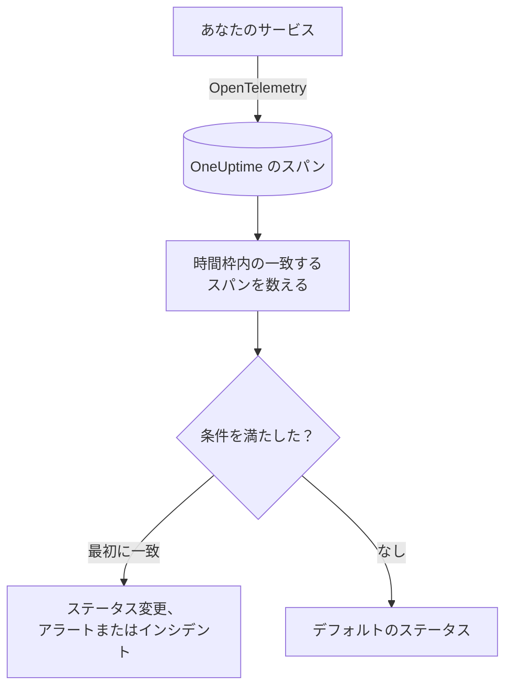

# トレース モニター

トレースモニターは、サービスが OneUptime に送るスパンのうち、フィルター（スパン名、ステータス、サービス、属性）に一致するものを時間枠の中で数えます。その数が条件を満たすと、モニターのステータスを変えたり、アラートを作成したり、インシデントを宣言したりします。エンドポイントへのリクエストの失敗、エラースパンの急増、トレースを送らなくなったサービスでアラートを出すために使います。

:::cards
- [モニターを作成する](#トレースモニターを作成する): 数えるスパンと、アラートを出すタイミングを選びます。
- [スパンステータスコード](#スパンステータスコード): OK、ERROR、UNSET の意味と、どれでフィルターするか。
- [評価のしくみ](#評価のしくみ): 時間枠、カウント、1 分ごとのサイクル。
- [条件](#条件): しきい値、異常検知、デフォルト。
:::

## しくみ

OneUptime は毎分、モニターのフィルターに一致し、時間枠内に開始したスパンを数えます。その数をモニターの条件と上から順に比べ、最初に一致した条件で何が起こるかが決まります。どれにも一致しなければ、モニターはデフォルトのステータスに戻ります。

## 始める前に

- サービスが OpenTelemetry でトレースを OneUptime に送っていること。[OpenTelemetry](/docs/telemetry/open-telemetry) を参照してください。
- 監視したいスパンの正確な名前をトレースエクスプローラーで調べておきます。スパン名は計装によって決まり、たとえば `POST /api/checkout` や `GET` です。

## トレースモニターを作成する

:::steps
### 新しいモニターを始める

**モニター** に移動し、**モニターを作成** をクリックします。

### Traces を選ぶ

**モニターの種類** で **その他のモニターの種類** をクリックし、**テレメトリ** の下の **トレース** を選ぶか、検索ボックスに `traces` と入力します。**名前** を入力し、**次へ** をクリックします。

### 数えるスパンを選ぶ

**トレースモニターの設定** で、**スパン名**、**トレースの監視期間（時間）**、**スパンステータスでフィルター** を設定します。空のままのフィルターはすべてのスパンに一致します。フィルターの下の **スパンのプレビュー** に、現在一致するスパンが表示されます。

### 絞り込む（任意）

**その他の項目** を開くと、テレメトリサービス、インフラエンティティ、属性でフィルターできます。

### 条件を設定する

**モニター条件** カードは 2 つの条件から始まります。一致するスパンがないときはインシデント付きでオフライン、1 件以上一致するときはオンラインです。アラートを受け取りたい内容に合わせて変更します（[条件](#条件) を参照）。

### モニターを作成する

**モニターを作成** をクリックします。モニターは **概要** ページで開き、1 分以内に最初の評価が行われます。
:::

> [!TIP]
> AI 機能の応答が悪いとき（失敗、拒否、途中で切れた、空、フラグ付き、遅い応答）に知らせを受けるには、代わりに **テレメトリ** の下の **AI / LLM** を選びます。このモニターはトレース内の AI 呼び出しを自動で読み取るため、スパンのフィルターを書く必要はありません。[AI / LLM オブザーバビリティ](/docs/telemetry/ai-llm-observability#ai-の回答がまずいときに知らせを受ける) を参照してください。

## 何を照会するか

| 項目 | 一致するもの | デフォルト |
| --- | --- | --- |
| **スパン名** | 名前にこのテキストを含むスパン。大文字と小文字は区別しません。 | 空: すべてのスパン |
| **トレースの監視期間（時間）** | 直近 5 秒から直近 24 時間までに開始したスパン。 | **過去 1 分** |
| **スパンステータスでフィルター** | 選んだステータスのいずれかを持つスパン: **未設定**、**OK**、**エラー**。 | 空: すべてのステータス |
| **テレメトリサービスでフィルター**（**その他の項目** 内） | 選んだサービスのいずれかからのスパン。 | 空: すべてのサービス |
| **インフラエンティティで絞り込み**（**その他の項目** 内） | 選んだホスト、Pod、コンテナー、その他のエンティティのいずれかからのスパン。 | 空: すべてのエンティティ |
| **属性でフィルター**（**その他の項目** 内） | 属性がすべての条件を満たすスパン。条件ごとに「等しい」「含む」などの演算子があります。 | 空: 条件なし |

スパンが数えられるには、設定したすべてのフィルターに一致する必要があります。

### スパンステータスコード

- **OK** — アプリケーションコードまたはトレースパイプラインによって、操作が明示的に成功とマークされた
- **ERROR** — 操作でエラーが発生した
- **UNSET** — エラーステータスが設定されていない。これはOpenTelemetryのデフォルトのステータスである

UNSETはデータが欠落していることを意味しません。OpenTelemetryの計装は、操作が失敗するとERRORを設定し、成功したスパンはUNSETのままにします。そのため、正常なサービスではほとんどのスパンがUNSETになります。OneUptimeはこれらのスパンを「Unset (no error)」として緑色で表示します。例外を記録してもスパンのステータスは変わらないため、UNSETのスパンにも例外が含まれることがあります。これらの例外はスパンと一緒に一覧表示されます。失敗時にアラートを発するには、ERRORでフィルタリングします。失敗しなかったすべてのスパンをカウントするには、OKとUNSETの両方を選択します。

成功したリクエストをOKとして表示したい場合は、**トレース > 設定 > パイプライン** で、フィルター条件を **ステータス = 未設定** とし、`http.response.status_code` の値（`200` など）をOkにマッピングする **ステータスリマッパー** を含むトレースパイプラインを追加します。

## 評価のしくみ

- **毎分。** トレースモニターはプローブでチェックされないため、設定する間隔も **プローブと間隔** ページもありません。
- **1 回の評価で 1 つの数値。** モニターは、すべてのフィルターに一致し、評価前の **トレースの監視期間（時間）** 内に開始したスパンを数えます。**過去 5 分** なら各評価は 5 分さかのぼるため、連続する評価の時間枠は重なります。
- **スパンがなければカウントは 0。** トレースを送らなくなったサービスは 0 になり、デフォルトのオフライン条件はまさにこれを探します。
- **OneUptime 自身の停止は沈黙ではありません。** OneUptime 自身がデータを受信していなかった時間（再起動中、アップグレード中、遅れの取り戻し中）が時間枠に含まれている間、チェックは待ちます。ステータスは変わらず、インシデントやアラートが開かれたり解決されたりすることもありません。[OneUptime がデータを受信していないとき](/docs/monitor/when-oneuptime-is-not-receiving) を参照してください。
- **条件は上から順に。** 最初に一致した条件で決まるため、最も重大なものを先頭に置きます。

ステータスの変化はすべて、その理由とともにモニターの **ステータスタイムライン** に記録されます。

## 条件

トレースモニターの条件の **フィルタータイプ** は 1 つだけです。時間枠内で一致したスパンの数である **Span Count** です。**フィルター条件** を選び、しきい値の条件なら **値** も選びます。

| フィルター条件 | スパンの数が次のとき一致 |
| --- | --- |
| **Greater Than** | 値より大きい |
| **Greater Than Or Equal To** | 値以上 |
| **Less Than** | 値より小さい |
| **Less Than Or Equal To** | 値以下 |
| **Equal To** | 値とちょうど等しい |
| **Anomalously High** | この曜日・時間帯の想定範囲を上回る |
| **Anomalously Low** | その範囲を下回る |
| **Anomalous** | その範囲をどちらかの方向に外れる |

異常の条件には **値** がありません。**感度**（Low、デフォルトの Medium、High）と、14 日（デフォルト）、28 日、60 日、90 日の **ベースラインウィンドウ** を選びます。OneUptime はカウントを 1 分あたりの割合に変え、そのウィンドウ内の同じ曜日・時間帯と比べます。ベースラインの対象はモニターのサービスとスパンステータスだけで、スパン名と属性のフィルターは含まれません。その曜日・時間帯の履歴が十分にたまるまで、条件は学習中で発火しません。

新しいトレースモニターは次の条件から始まります。

| 条件 | フィルター | 効果 |
| --- | --- | --- |
| Check if … is offline | **Span Count** **Equal To** `0` | モニターをオフラインにし、インシデントを宣言します（自動で解決） |
| Check if … is online | **Span Count** **Greater Than** `0` | モニターをオンラインにします |

## 実例: checkout リクエストの失敗

5 分間に、checkout サービスは `POST /api/checkout` という名前のスパンを 1,200 件記録します。内訳は UNSET が 1,150、OK が 20、ERROR が 30 です。同じモニターでも、**スパンステータスでフィルター** によって数える数はまったく違います。

| スパンステータスでフィルター | Span Count | 測るもの |
| --- | --- | --- |
| **エラー** | 30 | 失敗したリクエスト |
| **OK** | 20 | コードが成功とマークしたリクエストだけ |
| **未設定** と **OK** | 1,170 | 失敗しなかったすべてのリクエスト |
| 空 | 1,200 | すべてのリクエスト |

checkout リクエストが 5 分間に 10 件を超えて失敗したら呼び出されるようにするには:

- **スパン名**: `POST /api/checkout`
- **トレースの監視期間（時間）**: **過去 5 分**
- **スパンステータスでフィルター**: **エラー**
- 条件 1: **Span Count** **Greater Than** `10`: モニターをオフラインにし、インシデントを宣言する
- 条件 2: **Span Count** **Less Than Or Equal To** `10`: モニターをオンラインにする

失敗したリクエストが 30 件なら条件 1 が一致し、インシデントが宣言されます。失敗が 10 件以下の 5 分間が過ぎると条件 2 が一致し、モニターはオンラインに戻り、インシデントは自動で解決します。

## トラブルシューティング

:::details エンドポイントのスパンがまったく数えられない
**スパン名** はスパンの名前と比較されます。計装はサーバースパンにルート（`POST /api/checkout`）やメソッドだけ（`GET`）の名前を付けることがよくあります。トレースエクスプローラーで正確な名前を探してください。次に、モニターの **条件** ページ（**構成** の下）を開き、**監視条件を編集** をクリックします。**スパンのプレビュー** に、フィルターが今一致しているものが表示されます。
:::

:::details OK でフィルターすると成功したリクエストが数えられない
ほとんどの計装は成功したスパンを OK ではなく UNSET のままにします（[スパンステータスコード](#スパンステータスコード) を参照）。**未設定** と **OK** の両方を選ぶか、そこで説明しているトレースパイプラインを追加してください。
:::

:::details スパンに例外があるのに、エラーとして数えられない
例外を記録しても、スパンのステータスは変わりません。**エラー** でフィルターするか、例外そのものでアラートを出すには [例外モニター](/docs/monitor/exceptions-monitor) を使います。
:::

:::details 異常の条件がまったく発火しない
まだ学習中です。比較対象の曜日・時間帯に、**ベースラインウィンドウ** 内の十分な履歴がまだありません。
:::

## 次のステップ

:::cards
- [例外モニター](/docs/monitor/exceptions-monitor): サービスが記録する例外でアラートを出します。
- [ログ モニター](/docs/monitor/logs-monitor): ログの量と内容でアラートを出します。
- [検索構文](/docs/telemetry/search-syntax): トレースエクスプローラーでスパン名とステータスを探します。
- [インシデント & アラート テンプレート](/docs/monitor/incident-alert-templating): 役に立つアラートのタイトルと説明を書きます。
:::
