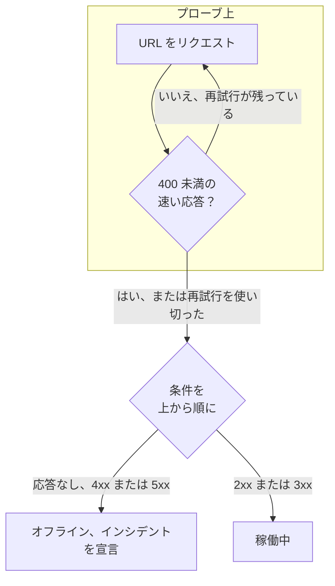

# Web サイト モニター

ウェブサイトモニターは、ウェブページが応答することをチェックします。チェックのたびにプローブがページの URL をリクエストし、ページが応答しないかエラーで応答すると、モニターはオフラインになってインシデントを宣言します。メソッド、ヘッダー、ボディを指定してエンドポイントを呼び出すには、代わりに [API モニター](/docs/monitor/api-monitor) を使います。

:::cards
- [モニターを作成する](#ウェブサイトモニターを作成する): ダッシュボードで 6 ステップ。
- [設定オプション](#設定オプション): URL プレースホルダー、リダイレクト、証明書、タイムアウト、再試行。
- [監視条件](#監視条件): 最初から何を稼働中または停止とみなすか。
- [トラブルシューティング](#トラブルシューティング): モニターとブラウザーの結果が食い違うとき。
:::

## しくみ

チェックのたびに、プローブは URL をリクエストし、リダイレクトをたどって、返ってきたものを記録します。ステータスコード、レスポンスタイム、ヘッダー、そして条件が必要とする場合はボディです。失敗した、タイムアウトした、`4xx` または `5xx` のステータスで応答した、あるいは 10 秒より長くかかったリクエストは、許可した再試行回数まで再試行されます。その後、OneUptime が結果をモニターの条件に通します。



モニターのどの条件もレスポンスボディを読まない場合（**レスポンスボディ** または **JavaScript Expression** フィルター）、プローブは `GET` の代わりに `HEAD` リクエストを送り、サーバーが `HEAD` を拒否すると `GET` で繰り返します。サーバーのアクセスログにはどちらも記録されることがあります。

自身のネットワーク接続を失ったプローブは結果を報告しないため、サイトをオフラインにすることはありません。

## 始める前に

- **モニターを作成できるロール**: Project Owner、Project Admin、Project Member、Monitor Admin、Monitor Member のいずれか、または Create Monitor 権限を持つカスタムロール。
- **サイトに到達できるプローブ。** 新しいモニターには、プロジェクトのデフォルトのプローブが選ばれます。サイトの前にファイアウォールがある場合は、[OneUptime Cloud のプローブの IP アドレス](/docs/configuration/ip-addresses) を許可します。プライベートネットワーク上のサイトには、そのネットワーク内で動く、プライベートアドレスへの到達を許可された [カスタムプローブ](/docs/probe/custom-probe) が必要です。[プライベートネットワークへのアクセス](/docs/self-hosted/private-network-access) を参照してください。

## ウェブサイトモニターを作成する

:::steps
### 新しいモニターを始める

**モニター** に移動し、**モニターを作成** をクリックします。**モニターの種類** で **ウェブサイト** を選びます。

### 名前を付ける

`Marketing site` のような **名前** を入力し、**次へ** をクリックします。

### URL を入力する

**ウェブサイト URL** に、`https://` を含むページの完全なアドレスを入力します。たとえば `https://example.com` です。リダイレクト、証明書、タイムアウト、再試行を変えるには、その下の **その他の項目** を開きます（[設定オプション](#設定オプション) を参照）。

### テストする

**モニターをテスト** をクリックし、**プローブを選択** でプローブを選んで **テストを実行** をクリックします。**モニターテスト結果** に、プローブが受け取った内容が表示されます。

### 条件を確認する

**モニター条件** は [デフォルト条件](#デフォルト条件) から始まります。サイトが応答しないかエラーで応答するとオフライン、`2xx` または `3xx` のステータスならオンラインです。必要なら変更して、**次へ** をクリックします。

### プローブを選んで作成する

**プローブ** と **監視間隔**（**5 分ごと** から始まります）をそのまま使うか変更し、**モニターを作成** をクリックします。モニターのページが開きます。
:::

## 設定オプション

### ウェブサイト URL

チェックするページを、スキームを含む完全な URL で指定します。`https://example.com`、`https://example.com/pricing`、`http://example.com:8080/health` などです。URL には `{{monitorSecrets.NAME}}` として [モニターシークレット](/docs/monitor/monitor-secrets) を入れられます。たとえばクエリ文字列のトークンです。

### 動的な URL プレースホルダー

サイトの前に CDN やキャッシュプロキシがあると、プローブがサーバーではなくキャッシュから応答を受け取ることがあります。キャッシュを回避するには URL にプレースホルダーを追加します。プローブはチェックのたびにそれを新しい値に置き換えます。

| プレースホルダー | 置き換えられる値 | 値の例 |
| --- | --- | --- |
| `{{timestamp}}` | 現在の Unix 時刻（秒） | `1719500000` |
| `{{random}}` | 32 文字の 16 進数からなるランダムで一意な文字列 | `3f2b8c1d9e7a4b6c8d0e1f2a3b4c5d6e` |

プレースホルダーを含む URL:

```text
https://example.com/health?cb={{timestamp}}
```

5 分間隔の 2 回のチェックでプローブがリクエストする URL:

```text
https://example.com/health?cb=1719500000
https://example.com/health?cb=1719500300
```

`{{random}}` も同じように使います: `https://example.com/health?nocache={{random}}`。

### その他の項目

これらの設定は、URL の下の **その他の項目** に折りたたまれています。折りたたまれた見出しには項目名が並び、変更したものが示されます。

| 項目 | デフォルト | 内容 |
| --- | --- | --- |
| **リダイレクトに従わない** | オフ | リダイレクトをたどらずに最初の応答を評価します。[下記](#リダイレクトに従わない) を参照してください。 |
| **自己署名証明書を許可する** | オフ | モニター自身のホスト名について、TLS 証明書の検証を省略します。 |
| **クライアント証明書を使用（mTLS）** | オフ | クライアント証明書と秘密鍵を提示します。[クライアント証明書（mTLS）](#クライアント証明書mtls) を参照してください。 |
| **リクエストタイムアウト（秒）** | `60` | 各試行を待つ時間。最大は 60 秒です。 |
| **失敗時の再試行** | プローブのデフォルト、通常は `3` | 失敗した試行を何回再試行するか。最大は 3 回です。[再試行とタイムアウト](#再試行とタイムアウト) を参照してください。 |

#### リダイレクトに従わない

デフォルトでは、プローブはリダイレクト（`301`、`302`、`303`、`307`、`308`）を最大 10 回までたどり、最後にたどり着いたページを評価します。代わりにリダイレクトの応答そのものを評価するには、**リダイレクトに従わない** をオンにします。たとえば `http://` が `https://` にリダイレクトされることを確認する場合です。[デフォルト条件](#デフォルト条件) では、リダイレクトの応答はオンラインとみなされます。

**自己署名証明書を許可する** は、モニター自身のホスト名にとどまるリダイレクトをたどります。別のホスト名へのリダイレクトは通常どおり検証されます。

#### クライアント証明書（mTLS）

サイトが相互 TLS を必要とする場合は、**クライアント証明書を使用（mTLS）** をオンにして、次を入力します。

| 項目 | 入力する内容 |
| --- | --- |
| **クライアント証明書 (PEM)** | 提示する PEM 形式のクライアント証明書。 |
| **クライアント秘密鍵 (PEM)** | 対応する PEM 形式の秘密鍵。 |
| **クライアント秘密鍵のパスフレーズ** | 任意。秘密鍵が暗号化されている場合のみのパスフレーズ。 |

これは curl の `--cert` と `--key` フラグに相当します。

```bash
curl --cert client.crt --key client.key https://example.com/health
```

鍵をモニターの設定に含めないようにするには、証明書と鍵を [モニターシークレット](/docs/monitor/monitor-secrets) として保存し、これらの項目に `{{monitorSecrets.NAME}}` を入力します。シークレットはサーバー上で埋め込まれ、その値がダッシュボードに表示されることはありません。

クライアント証明書は、リクエストがモニター URL のオリジン（同じスキーム、ホスト、ポート）にとどまっている間だけ提示されます。別のオリジンへリダイレクトされたあとは、証明書なしで続行します。

#### 再試行とタイムアウト

**失敗時の再試行** は最初の試行の _あと_ の再試行を数えるので、`0` ならチェックは 1 回、`2` なら最大 3 回実行されます。空欄の場合はプローブのデフォルトが使われます。プローブの `PROBE_MONITOR_RETRY_LIMIT` で別の値が指定されていない限り 3 です。プローブは試行の間に 1 秒待ち、各試行には **リクエストタイムアウト（秒）** の全時間が与えられます。

再試行される失敗は、接続エラー、タイムアウト、`4xx` と `5xx` の応答、10 秒より遅い応答です。再試行しても変わらないため再試行されないのは、無効またはブロックされた URL、10 回を超えるリダイレクト、512 KiB を超える応答です。

## 監視条件

条件は、ウェブサイトをオンライン、機能低下、オフラインのどれとみなすか、そしてそれによってインシデントを宣言するかアラートを作成するかを決めます。各条件は 1 つ以上のフィルターをチェックします。

| フィルター | 条件 | チェック内容 |
| --- | --- | --- |
| **Is Online** | **真**、**偽** | ステータスコードにかかわらず、サイトが応答したかどうか。 |
| **レスポンスステータスコード** | **Equal To**、**Not Equal To**、**Greater Than**、**Less Than**、**Greater Than Or Equal To**、**Less Than Or Equal To** | HTTP ステータスコード。 |
| **レスポンスタイム（ms）** | **Greater Than**、**Less Than**、**Greater Than Or Equal To**、**Less Than Or Equal To** | リダイレクトを含め、リクエストにかかった時間。 |
| **レスポンスボディ** | **含む**、**Not Contains** | レスポンスボディ内のテキスト。大文字と小文字を区別します。 |
| **Response Header** | **含む**、**Not Contains** | 応答にこの名前のヘッダーがあるかどうか。`x-cache` のように小文字で名前を入力します。 |
| **Response Header Value** | **含む**、**Not Contains** | ヘッダーがちょうどこの値を持つかどうか。`no-store` のように小文字で比較します。 |
| **JavaScript Expression** | **Evaluates To True** | 応答に対する式。[JavaScript 式](/docs/monitor/javascript-expression) を参照してください。 |
| **Is Request Timeout** | **真**、**偽** | すべての試行でリクエストがタイムアウトしたかどうか。 |

**条件を追加** は、すでにフィルターにちなんだ名前の付いた条件を追加します。たとえば _Response Time (in ms) is above 3000_ です。名前は、自分で名前を入力するまでフィルターに合わせて変わります。説明は任意で、追加するには条件の **設定** を開きます。

フィルターが 2 つ以上ある場合、**一致条件** で **すべて** が一致する必要があるか、**いずれか** 1 つでよいかを決めます。条件の **アクション** は、その条件が何をするかを決めます。モニターのステータスを変える、アラートを作成する、インシデントを宣言する、またはそのいくつかです。

### デフォルト条件

新しいウェブサイトモニターは 2 つの条件から始まるので、何も変えずに動きます。

- **オフライン** — ウェブサイトが応答しないか、`400` 以上（または `200` 未満）のステータスコードで応答した場合。モニターは **オフライン** になり、インシデントが作成されます。インシデントはウェブサイトが戻ると自動で解決します。
- **オンライン** — ウェブサイトが `200`、`204`、`301` など、任意の `2xx` または `3xx` のステータスコードで応答した場合。モニターは **稼働中** になります。

条件の一覧では、これらはモニターにちなんで _Check if (name) is offline_ と _Check if (name) is online_ という名前になっています。

そのため、`204 No Content` を返すページや、**リダイレクトに従わない** をオンにして監視しているリダイレクトは、稼働中とみなされます。正常を意味するステータスコードが 1 つだけの場合は、モニターの **構成 → 条件** ページで両方の条件を変更します。たとえばオンラインの条件では **レスポンスステータスコード** / **Equal To** / `200`、オフラインの条件では **Not Equal To** / `200` とし、それぞれにある 2 つのステータスコードフィルターを置き換えます。

条件は上から順にチェックされ、最初に一致したものが何が起きるかを決めます。

どれにも一致しない場合、モニターはデフォルトのステータスに戻ります。条件の下にある **その他の項目** で別のものを選ばない限り **稼働中** です。折りたたまれた **その他の項目** の見出しに、それがどのステータスかが表示されます。

OneUptime がこれらのデフォルトを変更する前に作成されたモニターは、作成時の条件を保ち、`200` だけをオンラインとみなします。API や Terraform で作成したモニターは、送信した条件を使います。

### 一定期間にわたる評価

**この条件を一定期間にわたって評価する** はフィルターの下にあるチェックボックスで、**Is Online**、**レスポンスステータスコード**、**レスポンスタイム（ms）** で使えます。オンにすると、最新のチェックだけでなく、過去のチェックの期間を評価します。**評価** で集計方法を選び、**過去（分単位）** で 2 分から 60 分までの期間を選びます。

| 集計 | 一致するとき |
| --- | --- |
| **平均**、**合計**、**Maximum Value**、**Minimum Value** | 期間全体でのその値が条件を満たすとき。数値のフィルターのみ。 |
| **All Values** | 期間内のすべてのチェックが条件を満たすとき。 |
| **Any Value** | 期間内の少なくとも 1 つのチェックが条件を満たすとき。 |

**All Values** は、期間が本当にデータで埋まってから一致します。作成されたばかりのモニターや、チェックが記録されなくなったモニターには、直近 N 分について何かを言えるだけの履歴がないため、条件は手元の 1 つの値で一致せずに待ちます。**Any Value** は「1 回でもしきい値を超えたらすぐに知らせる」ための設定で、引き続きすぐに発火します。

**データがない場合** は、期間が条件を裏付けられない間に何が起きるかを決めます。

| オプション | 何が起きるか | 用途 |
| --- | --- | --- |
| **Ignore**（デフォルト） | 条件は一致しません。 | 通常のしきい値アラート。 |
| **トリガー** | データがないこと自体を問題とみなします。 | 沈黙そのものが障害となるチェック。 |
| **Treat As Zero** | 期間を 1 つのゼロとして比較します。 | イベントがないことが本当にゼロを意味するカウンター。 |

### 条件の例

| 目的 | フィルター | 条件 | 値 |
| --- | --- | --- | --- |
| 遅いときにサイトを機能低下にする | **レスポンスタイム（ms）** | **Greater Than** | `3000` |
| `200` で返されたエラーページを検出する | **レスポンスボディ** | **Not Contains** | `Welcome` |
| CDN のヘッダーがあることを確認する | **Response Header** | **含む** | `x-cache` |
| 正常として `200` だけを受け入れる | **レスポンスステータスコード** | **Equal To** | `200` |

## トラブルシューティング

:::details モニターはオフラインなのに、ブラウザーではサイトが表示される
プローブがブラウザーとは異なる応答を受け取りました。インシデントの根本原因と、モニターの **モニタリングログ** に、プローブが見た内容が表示されます。よくある原因:

- ファイアウォールやボットフィルターがプローブをブロックしている。[OneUptime Cloud のプローブの IP アドレス](/docs/configuration/ip-addresses) を許可します。
- サイトが社内ネットワークからしか到達できない。そのネットワーク内で [カスタムプローブ](/docs/probe/custom-probe) を使います。
- 証明書が自己署名、またはプライベート認証局のもの。**自己署名証明書を許可する** をオンにするか、[SSL 証明書モニター](/docs/monitor/ssl-certificate-monitor) で証明書を別に監視します。
:::

:::details チェックが「Remote response exceeded the allowed size.」で失敗する
プローブが読み取る応答は最大 512 KiB で、このページはそれより大きいです。ヘルスエンドポイントなど小さいページをモニターの対象にするか、**レスポンスボディ** と **JavaScript Expression** のフィルターを外して、プローブがヘッダーだけで済むようにします。
:::

:::details チェックが「Monitor target exceeded 10 redirects.」で失敗する
URL のリダイレクトが 10 回を超えています。通常はループです。`curl -IL` で URL を開いてリダイレクトの連鎖を確認し、連鎖の終点となるべきページをモニターの対象にします。
:::

:::details プライベートネットワークのアドレスに関するメッセージでチェックが失敗する
URL がプライベートアドレスに解決され、チェックを実行したプローブにはプライベートアドレスへの到達が許可されていません。セルフホストのプローブでは、`PROBE_ALLOW_PRIVATE_NETWORK_MONITORS` で許可します。[プライベートネットワークへのアクセス](/docs/self-hosted/private-network-access) を参照してください。
:::

## 次のステップ

:::cards
- [API モニター](/docs/monitor/api-monitor): メソッド、ヘッダー、ボディを指定してエンドポイントを呼び出します。
- [SSL 証明書モニター](/docs/monitor/ssl-certificate-monitor): サイトの証明書の期限が切れる前に警告を受け取ります。
- [モニター シークレット](/docs/monitor/monitor-secrets): トークンや鍵をモニターの設定に含めないようにします。
- [インシデント](/docs/incidents/index): モニターがインシデントを宣言したあとに起きること。
:::
