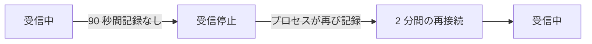

# OneUptime がデータを受信していないとき

OneUptime の再起動中、アップグレード中、または滞留したデータの処理中は、エージェント、コレクター、プローブ、ハートビート送信元が送るものはモニターに届きません。OneUptime はそれがいつ起きたかを記録し、その時間をサーバー、ホスト、その他どのリソースのせいにもしません。その時間は監視されていなかったのであり、ダウンタイムではありません。

## 仕組み

データを受け取る OneUptime の各プロセスは、データを保存するデータベースに到達できる限り、30 秒ごとに受信中であることを記録します。OneUptime は次の三種類の時間を除外します。

- 受信停止: どのプロセスも 90 秒を超えて何も記録していない時間。OneUptime が停止、再起動、アップグレード中だったか、データベースのいずれかに到達できなかった時間です。
- 再接続: OneUptime が受信を再開してから最初の 2 分間。エージェントが再接続し、保持していたデータを送る時間です。
- 追い付き: 処理待ちのデータのキューが一分を超えて遅れている間、キューにまだ残っている最も古いデータ以降の時間。



90 秒未満で終わる再起動は途切れではありません。コレクターは届けられなかったデータを再送します。

## その間に変わること

| 対象 | OneUptime の動作 |
| --- | --- |
| サーバー / VM モニター | **Is Online** は OneUptime が受信していた分だけを数えます。デフォルトでは、OneUptime が聞き取れたはずの沈黙が 3 分続くとサーバーはオフラインになります。 |
| 受信リクエストと受信メールのモニター | **Recieved In Minutes** と **Not Recieved In Minutes** は OneUptime が受信していた分だけを数えます。この条件が満たされると、その理由に何分が除外されたかが示されます。 |
| ホスト、Kubernetes、Docker、メトリクス、ログ、トレースなど、テレメトリーを読むモニター | ウィンドウに受信していない時間を含むチェックは、その時間がウィンドウから外れるまで待ちます。ただし、その時間が終わってから 15 分を超えて待つことはありません。それまでは何も変わりません。ステータスは変わらず、インシデントやアラートが開かれたり解決されたりすることもありません。キューが遅れている間、チェックは現在までではなくキューの位置までを読みます。 |
| ホスト、クラスター、その他のインベントリ | リソースが **切断済み** になるのは、OneUptime が受信している間に沈黙のしきい値(ほとんどは 15 分)を過ぎた後だけです。 |
| プローブと AI エージェント | OneUptime が受信している間に 3 分沈黙すると **切断済み** になります。 |
| ホスト、Docker ホストと Podman ホスト、Kubernetes クラスターの **可用性** チャート | その時間は **未監視** として網掛けされ、線はダウンに落ちる代わりにそこで途切れます。稼働率のバッジはその時間を除外します。データのある区間は引き続きアップとして数えられます。 |
| ステータスページの稼働率と SLO | どちらもモニターのステータスから算出されるため、誤ったステータス変更がなければ誤ったダウンタイムもありません。 |

> [!NOTE]
> 時間を除外することは、その時間を埋めることではありません。OneUptime が聞き取れなかった時間について、リソースがアップと表示されることはありません。その時間は単に判定されないだけです。OneUptime が受信を再開すると、本当にダウンしているリソースは、その時点から送るもの、または送らないものによって判定されます。

## セルフホストのインストール

### 起動中

OneUptime のプロセスは起動中、ステータスチェックを除くすべてのリクエストに `503 Service Unavailable` と `Retry-After: 5` で応答し、ブラウザーには自動で再読み込みするページが返ります。OpenTelemetry のコレクターや SDK は、このような応答を受けるとデータを破棄せずにリクエストを再送します。`/status/ready` はプロセスの準備ができるまで失敗するため、Kubernetes はそれまでトラフィックを送りません。

### ワーカーレプリカ

プロセスが OneUptime の受信中を記録するのは、受信トラフィックがそのプロセスに届く場合だけです。前段に ingress がなく、キューの処理だけを行うレプリカを実行している場合は、そのレプリカで `RECEIVES_INGRESS_TRAFFIC` を `false` に設定してください。そうしないと、トラフィックを受けるレプリカがすべて停止している間もそれらが記録を続け、その障害が再びリソースのダウンとして数えられます。Helm チャートはワーカー Pod にすでにこれを設定しており、単一の OneUptime コンテナーでは何も必要ありません。

```yaml title="ワーカーコンテナー"
env:
  - name: RECEIVES_INGRESS_TRAFFIC
    value: "false"
```

### 記録される内容

OneUptime はこの記録を含むバージョンにアップグレードした時点から記録を始めます。それ以前の時間は従来どおりに判定されます。受信中を記録するプロセスがない間、最後の記録以降の時間は最長一時間まで途切れとして扱われます。その後は沈黙が再び数えられるため、書き込まれなくなった記録がリソースの障害を長く隠すことはありません。記録は 400 日間保持され、OneUptime が記録を読めないときは、ずっと受信していたものとして沈黙を判定します。

## 次のステップ

:::cards
- [ホスト モニター](/docs/monitor/host-monitor): ホストのメトリクスでアラートを出します。
- [サーバー / VM モニター](/docs/monitor/server-monitor): サーバーのエージェントが報告を止めたことを知ります。
- [受信リクエスト モニター](/docs/monitor/incoming-request-monitor): ハートビートをデッドマンスイッチにします。
- [アップグレード](/docs/installation/upgrading): セルフホストのインストールをアップグレードします。
:::
