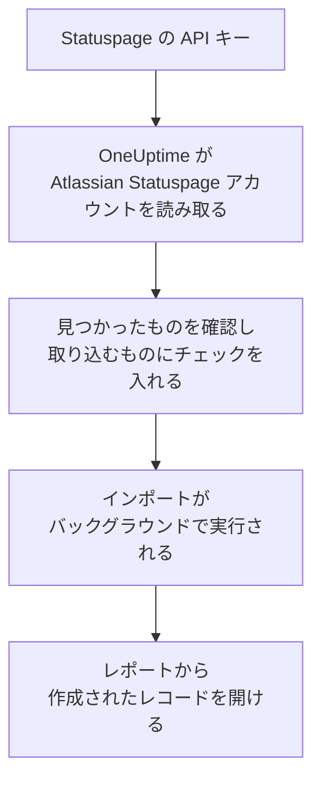

# Atlassian Statuspage からの移行

**別のツールからインポート** を使えば、Atlassian Statuspage のページを数分で OneUptime に移行できます。Statuspage の API キーがあれば、OneUptime がページ、そのコンポーネントとグループ、メール購読者を読み取り、見つけたものを表示し、チェックを入れたものを作成します。Statuspage では何も変更されません。

:::cards
- [アカウントをインポートする](#atlassian-statuspage-アカウントをインポートする): キーを作成し、アカウントを読み取って、取り込むものにチェックを入れます。
- [取り込まれるもの](#取り込まれるもの): Statuspage の各ページ、コンポーネント、購読者が OneUptime で何になるか。
- [移行を完了する](#移行を完了する): インポートが終わったらすること。
:::

## 仕組み

- **キーは 1 回だけ使われます。** OneUptime がアカウントを読み取っている間は暗号化して保持され、読み取りが終わるとすぐに削除されます。成功したかどうかは関係ありません。再び表示されることも、ログに書き込まれることもありません。
- **OneUptime は読み取るだけです。** 呼び出すのは Atlassian Statuspage 自身の API だけです: `api.statuspage.io`。リクエストは 1 秒に 1 回で、これは Statuspage が 1 つのキーに許可する上限です。Atlassian Statuspage から速度を落とすよう求められると、待ってから再試行します。
- **インポートを開始するまで何も作成されません。** プレビューには、項目ごとに、新規か、OneUptime に既存か (そのまま使われます)、以前のインポートで取り込まれたか、取り込めない理由は何かが表示されます。
- **もう一度実行しても二重に作成されることはありません。** OneUptime は、各インポートが取り込んだものを Atlassian Statuspage の ID で記憶しています。Atlassian Statuspage でページやコンポーネントを追加した後にもう一度実行すると、新しいものだけが作成されます。

## 始める前に

- **OneUptime のプロジェクトと、取り込むものを作成する権限。** プロジェクトのオーナーと管理者はすべてを取り込めます。その他のロールもインポートを実行でき、作成を許可されている種類のレコードを取り込めます。それ以外は、理由とともに取り込みなしとして表示されます。
- **Statuspage の API キー。** 作成できるのはアカウントオーナーだけです。インポートが Statuspage に書き込むことはなく、キーで見えるすべてのページを読み取ります。
- **ページのための空き (OneUptime Cloud の場合)。** プランには、ステータスページと購読者の数に上限があります。入りきらないものは取り込みなしとして表示されます。コンポーネントは無料の手動モニターになります。

## Atlassian Statuspage アカウントをインポートする

:::steps
### Statuspage で API キーを作成する
Statuspage で左下のアバターを選択し、**API info** を開きます。**Create key** を選択し、名前を `OneUptime import` としてキーをコピーします。

### インポートページを開く
OneUptime で **プロジェクト設定** > **別のツールからインポート** を開き、**Atlassian Statuspage** を選択します。

### Atlassian Statuspage を接続する
キーを **Atlassian Statuspage の API キー** に貼り付け、**Atlassian Statuspage アカウントを読み取る** を選択します。大きなアカウントでは数分かかります。読み取りの間はページを離れてもかまいません。

### 取り込むものにチェックを入れる
プレビューには、見つかったものが種類ごとのセクションに分かれて表示されます。作成されるものには最初からチェックが入っています。ただし、購読者は除きます。各項目の下には、元のとおりには取り込まれない点が表示されます。チェックしたステータスページが、チェックしていないモニターを表示している場合はそのことが表示され、**これらも選択** でチェックを入れられます。購読者を取り込むには、チェックを入れたうえで、その下で、購読者が更新の受け取りに同意しており、移行してよいことを確認します。メールは誰にも送信されません。

### インポートを開始する
**インポートを開始** を選択します。インポートはバックグラウンドで実行されます。ページを離れてもかまわず、レポートはそのページで待っています。
:::

レポートには、作成と取り込みなしの件数が表示され、各項目が、作成されたレコードへのリンクとともに一覧されます (失敗したものが先頭)。以前のインポートは、同じページの **以前のインポート** に一覧されます。

## 取り込まれるもの

| Atlassian Statuspage では | OneUptime では | 方法 |
| --- | --- | --- |
| Components | 手動モニター | 各コンポーネントは、ステータスページに表示される手動モニターになります。何もチェックしないため、Statuspage と同じく OneUptime でステータスを設定します。コンポーネントグループはページのグループになります。 |
| Pages | ステータスページ | 各ページは、名前と説明、グループに分かれたコンポーネント、強調表示しているコンポーネントの稼働率と履歴とともに取り込まれます。一部の人だけが見られるページは非公開として取り込まれます。 |
| Email subscribers | ステータスページの購読者 | 確認済みのメール購読者は、移行してよいことを確認すると取り込まれ、同じコンポーネントを購読します。メールは誰にも送信されず、OneUptime から届く更新には毎回購読解除のリンクが含まれます。 |

コンポーネントは稼働中として取り込まれます。現在 Statuspage で稼働中でないものはプレビューに表示されるので、インポート後にステータスを設定できます。

## 取り込まれないもの

- **インシデント、定期メンテナンスとその履歴。** OneUptime のインシデントは人を呼び出す現在進行中のレコードなので、過去のものは Statuspage に残ります。
- **SMS、Webhook、Slack、Microsoft Teams の購読者。** プレビューに件数が表示されます。取り込まれるのはメール購読者だけです。
- **インシデントテンプレートとシステムメトリクス。** 必要なものは OneUptime で追加してください。
- **ステータスページ独自のドメインとブランディング。** OneUptime で、ドメインは **カスタムドメイン** に、ロゴは **ブランディング** に追加してください。

## 上限

1 回のインポートで作成されるのは最大 2,000 件です。モニターは最大 1,000 件、ステータスページは 50 件までです。購読者はこの件数に含まれず、1 回のインポートで最大 5,000 人まで取り込めます。上限を超えた分は取り込みなしとして表示されます。残りを取り込むには、もう一度インポートを実行してください。

OneUptime Cloud では、プランに空きがないステータスページと購読者は、必要なものとともに取り込みなしとして表示されます。

プレビューは 1 日保持されます。チェックを入れてインポートを開始できるのは、アカウントを読み取った本人だけです。プロジェクトのオーナーと管理者は、すべてのインポートの進行状況とレポートを確認できます。

## 移行を完了する

:::steps
### ステータスページを確認する
**ステータスページ** で各ページを開き、Statuspage のページと比べます。各コンポーネントは手動モニターです。状況が変わったら OneUptime でステータスを変更してください。

### ステータスページのアドレスを OneUptime に向ける
**ステータスページ** でページを開き、**カスタムドメイン** にドメインを追加してから、DNS レコードを変更します。これで訪問者と購読者が新しいページにアクセスできるようになります。

### Atlassian Statuspage のページをオフにする
ドメインが OneUptime を向いたら、購読者に二重に通知されないように Statuspage のページを閉じます。
:::

## トラブルシューティング

:::details Atlassian Statuspage が API キーを受け付けなかった
キー全体をコピーしたこと、そしてアカウントオーナーが **API info** で作成したキーであることを確認してください。キーは 1 つの Statuspage 組織に属し、その組織のページだけを読み取ります。その後、**再試行** を選択します。
:::

:::details 購読者を取り込めない
購読者の下にある、更新の受け取りに同意しており移行してよいことを確認するボックスにチェックを入れてください。**インポートを開始** はそれを待っています。Statuspage で購読を確認しなかった購読者は Statuspage に残ります。
:::

:::details チェックを入れられない項目がある
それぞれに理由が表示されます: プロジェクトに既にある名前、以前のインポートで取り込まれたもの、または作成する権限がないかプランに含まれないレコードです。
:::

## 次のステップ

:::cards
- [ステータス ページ 概要](/docs/status-pages/index): ステータスページに何が表示され、誰が見られるか。
- [購読者とお知らせ](/docs/status-pages/subscribers): 購読者がインシデントを知る方法。
- [手動モニター](/docs/monitor/manual-monitor): ステータスを自分で設定するモニター。
:::
