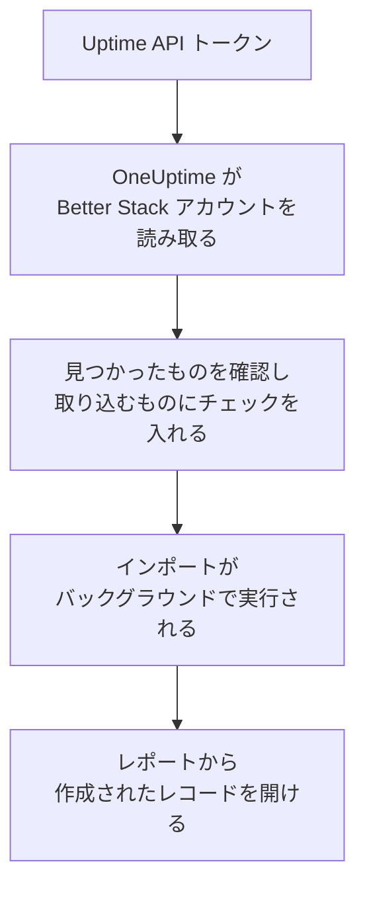

# Better Stack からの移行

**別のツールからインポート** を使えば、Better Stack の Uptime モニター、ハートビート、ステータスページを数分で OneUptime に移行できます。Better Stack の Uptime API トークンがあれば、OneUptime がモニター、ハートビート、ステータスページとそのメール購読者を読み取り、見つけたものを表示し、チェックを入れたものを作成します。Better Stack では何も変更されません。

:::cards
- [アカウントをインポートする](#better-stack-アカウントをインポートする): トークンを作成し、アカウントを読み取って、取り込むものにチェックを入れます。
- [取り込まれるもの](#取り込まれるもの): Better Stack の各モニター、ハートビート、ステータスページが OneUptime で何になるか。
- [移行を完了する](#移行を完了する): インポートが終わったらすること。
:::

## 仕組み

- **キーは 1 回だけ使われます。** OneUptime がアカウントを読み取っている間は暗号化して保持され、読み取りが終わるとすぐに削除されます。成功したかどうかは関係ありません。再び表示されることも、ログに書き込まれることもありません。
- **OneUptime は読み取るだけです。** 呼び出すのは Better Stack 自身の API だけです: `incidents.betterstack.com`。Better Stack から速度を落とすよう求められると、待ってから再試行します。
- **インポートを開始するまで何も作成されません。** プレビューには、項目ごとに、新規か、OneUptime に既存か (そのまま使われます)、以前のインポートで取り込まれたか、取り込めない理由は何かが表示されます。
- **もう一度実行しても二重に作成されることはありません。** OneUptime は、各インポートが取り込んだものを Better Stack の ID で記憶しています。Better Stack でモニターやハートビートを追加した後にもう一度実行すると、新しいものだけが作成されます。

## 始める前に

- **OneUptime のプロジェクトと、取り込むものを作成する権限。** プロジェクトのオーナーと管理者はすべてを取り込めます。その他のロールもインポートを実行でき、作成を許可されている種類のレコードを取り込めます。それ以外は、理由とともに取り込みなしとして表示されます。
- **Better Stack の Uptime API トークン。** チーム単位の Uptime トークンを使います。そのチームのモニター、ハートビート、ステータスページを読み取ります。インポートが Better Stack に書き込むことはありません。
- **支払い方法 (OneUptime Cloud の場合)。** チェックを実行するモニターは Free プランでも利用量に応じて課金されるため、インポートの前に **プロジェクト設定** > **請求** で支払い方法を追加してください。支払い方法がないと、それらのモニターは取り込みなしとして表示されます。

## Better Stack アカウントをインポートする

:::steps
### Better Stack で API トークンを作成する
Better Stack で **API tokens** > **Team-based tokens** を開き、チームを選択します。**Uptime API tokens** で `OneUptime import` という名前のトークンを作成してコピーします。

### インポートページを開く
OneUptime で **プロジェクト設定** > **別のツールからインポート** を開き、**Better Stack** を選択します。

### Better Stack を接続する
トークンを **Better Stack の API キー** に貼り付け、**Better Stack アカウントを読み取る** を選択します。大きなアカウントでは数分かかります。読み取りの間はページを離れてもかまいません。

### 取り込むものにチェックを入れる
プレビューには、見つかったものが種類ごとのセクションに分かれて表示されます。作成されるものには最初からチェックが入っています。ただし、一時停止中のモニター (チェックを入れると一時停止の状態で取り込まれます) と購読者は除きます。各項目の下には、元のとおりには取り込まれない点が表示されます。チェックしたステータスページが、チェックしていないモニターを表示している場合はそのことが表示され、**これらも選択** でチェックを入れられます。購読者を取り込むには、チェックを入れたうえで、その下で、購読者が更新の受け取りに同意しており、移行してよいことを確認します。メールは誰にも送信されません。

### インポートを開始する
**インポートを開始** を選択します。インポートはバックグラウンドで実行されます。ページを離れてもかまわず、レポートはそのページで待っています。
:::

レポートには、作成と取り込みなしの件数が表示され、各項目が、作成されたレコードへのリンクとともに一覧されます (失敗したものが先頭)。以前のインポートは、同じページの **以前のインポート** に一覧されます。

## 取り込まれるもの

| Better Stack では | OneUptime では | 方法 |
| --- | --- | --- |
| Monitors and heartbeats | モニター | 各モニターは、同じアドレス、間隔、タイムアウトを持つ同じ種類のモニターになります。各ハートビートは受信リクエストモニターになります。 |
| Status pages | ステータスページ | 各ページは、セクションをグループとし、表示しているモニターとハートビートとともに取り込まれます。手動で管理している項目は手動モニターになります。パスワードや IP 許可リストのあるページは非公開として取り込まれます。 |
| Email subscribers | ステータスページの購読者 | 確認済みのメール購読者は、移行してよいことを確認すると取り込まれ、同じリソースを購読します。メールは誰にも送信されず、OneUptime から届く更新には毎回購読解除のリンクが含まれます。 |

- **status、expected status code、keyword、keyword absence のモニター** は Web サイトモニターになります。別のメソッド、ヘッダー、JSON の本文を送る場合は API モニターになります。status モニターはどの 2xx 応答でも稼働とみなし、expected status code モニターは指定したコードで稼働とみなします。
- **ping と TCP のモニター** は ping とポートのモニターになります。**SMTP、POP、IMAP のモニター** はそのポートのポートモニターになります。OneUptime はポートの応答を確認し、メールのやり取りは確認しません。
- **DNS モニター** は、問い合わせる名前の DNS モニターになり、同じサーバーに問い合わせます。
- **ハートビート** は受信リクエストモニターになり、期間と猶予のあいだリクエストが届かないとダウンになります。OneUptime ではそれぞれ新しいアドレスになります。
- **SSL 期限の警告。** 証明書の期限切れ前に警告するモニターには、同じ日数前に警告する SSL 証明書モニターも、そのモニターの名前で作成されます。

各モニターは、自分で作成したモニターと同じく、プロジェクトのプローブからチェックされます。OneUptime にない間隔は最も近い間隔に、1 分を超えるタイムアウトは 1 分になります。どちらかが変わる場合はプレビューに表示されます。

## 取り込まれないもの

- **稼働履歴、応答時間、インシデント。** OneUptime はインポートが終わった時点からチェックを始めます。
- **アラートの連絡先と連携。** [移行を完了する](#移行を完了する) のとおり、OneUptime で通知先を決めてください。
- **パスワードと、シークレットを含む可能性のあるヘッダー。** サインインするモニターや、`Authorization`、Cookie、トークンのヘッダーを送るモニターは、それを除いて取り込まれます。[モニターシークレット](/docs/monitor/monitor-secrets) で追加してください。
- **UDP と Playwright のモニター。** 同じことをする OneUptime のモニターはなく、プレビューにそれぞれ表示されます。
- **購読を確認しなかった購読者。** Better Stack に残ります。
- **モニター、ハートビート、手動で管理する項目以外にステータスページが表示しているもの。** プレビューにそれぞれ表示されます。
- **ステータスページ独自のドメインとブランディング。** OneUptime で、ドメインは **カスタムドメイン** に、ロゴは **ブランディング** に追加してください。

## 上限

1 回のインポートで作成されるのは最大 2,000 件です。モニターは最大 1,000 件、ステータスページは 50 件までです。購読者はこの件数に含まれず、1 回のインポートで最大 5,000 人まで取り込めます。上限を超えた分は取り込みなしとして表示されます。残りを取り込むには、もう一度インポートを実行してください。

OneUptime Cloud では、チェックを実行するモニターには支払い方法が必要です。プランに空きがないものは、必要なものとともに取り込みなしとして表示されます。

プレビューは 1 日保持されます。チェックを入れてインポートを開始できるのは、アカウントを読み取った本人だけです。プロジェクトのオーナーと管理者は、すべてのインポートの進行状況とレポートを確認できます。

## 移行を完了する

:::steps
### モニターを確認する
**モニター** で各モニターを開き、最初の結果を確認します。ハートビートモニターは新しいアドレスになるため、ping を送るジョブの送信先を変更してください。

### 通知先を決める
モニターに所有者を追加するか、モニターが作成するインシデントに **オンコール** > **オンコールポリシー** のオンコールポリシーを設定して、障害が起きたときに適切な人に伝わるようにします。

### ステータスページのアドレスを OneUptime に向ける
**ステータスページ** でページを開き、**カスタムドメイン** にドメインを追加してから、DNS レコードを変更します。これで訪問者と購読者が新しいページにアクセスできるようになります。

### Better Stack のチェックをオフにする
OneUptime が同じ対象をチェックするようになったら、二重に通知されないように Better Stack のチェックを一時停止します。
:::

## トラブルシューティング

:::details Better Stack が API キーを受け付けなかった
トークン全体をコピーしたこと、そして **Uptime API tokens** にあるチームのトークンで、Telemetry のトークンではないことを確認してください。その後、**再試行** を選択します。
:::

:::details モニターが取り込みなしとして表示される
理由が表示されます: OneUptime にない種類のモニター、OneUptime が読み取れないアドレス、またはそのモニターのための空きや支払い方法がないプロジェクトです。名前、種類、アドレスが同じモニターを OneUptime が既に実行している場合は、そのモニターがそのまま使われます。
:::

:::details チェックを入れられない項目がある
それぞれに理由が表示されます: プロジェクトに既にある名前、以前のインポートで取り込まれたもの、または作成する権限がないかプランに含まれないレコードです。
:::

## 次のステップ

:::cards
- [受信リクエスト モニター](/docs/monitor/incoming-request-monitor): OneUptime でのハートビートの仕組み。
- [ステータス ページ 概要](/docs/status-pages/index): ステータスページに何が表示され、誰が見られるか。
- [UptimeRobot からの移行](/docs/moving-to-oneuptime/uptimerobot): UptimeRobot からチェックを移行します。
:::
