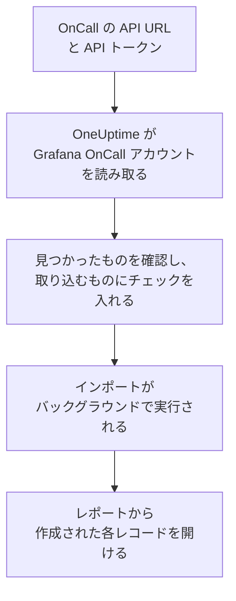

# Grafana OnCall からの移行

Grafana Labs は 2026 年 3 月にオープンソース版の Grafana OnCall をアーカイブしました。Grafana Cloud では Grafana Cloud IRM の一部として引き続き提供されています。どこで動かしている場合でも、**別のツールからインポート** を使えばオンコールの設定を数分で OneUptime に移行できます。OnCall の API URL と API トークンがあれば、OneUptime がユーザー、チーム、スケジュール、エスカレーションチェーンを読み取り、見つけたものを表示し、チェックを入れたものを作成します。Grafana OnCall では何も変更されません。

:::cards
- [アカウントをインポートする](#grafana-oncall-アカウントをインポートする): トークンを作成し、アカウントを読み取って、取り込むものにチェックを入れます。
- [取り込まれるもの](#取り込まれるもの): Grafana OnCall の各レコードが OneUptime で何になるか。
- [移行を完了する](#移行を完了する): インポートが終わったらすること。
:::

## 仕組み

- **トークンは 1 回だけ使われます。** OneUptime がアカウントを読み取っている間は API URL と一緒に暗号化して保持され、読み取りが終わるとすぐに削除されます。成功したかどうかは関係ありません。再び表示されることも、ログに書き込まれることもありません。
- **OneUptime は、指定されたアドレスから読み取るだけです。** 呼び出すのは貼り付けた OnCall の API URL だけで、頻度は最大で 1 秒に 1 回です。これはトークンあたり 5 分間に 300 リクエストという Grafana OnCall の制限内に収まります。Grafana OnCall から速度を落とすよう求められると、待ってから再試行します。
- **アドレスはリクエストのたびに確認されます。** OneUptime は、自身が動いているマシンやクラウドのメタデータサービスを呼び出すことはなく、リダイレクトにも従いません。OneUptime Cloud では、アドレスが公開されたもので、`https://` で始まっている必要もあります。セルフホストの OneUptime は、管理者がオフにしていない限り、自社ネットワーク内の Grafana OnCall も読み取れます。[Private Network Access](/docs/self-hosted/private-network-access) を参照してください。
- **インポートを開始するまで何も作成されません。** プレビューには、項目ごとに、新規か、OneUptime に既存か (そのまま使われます)、以前のインポートで取り込まれたか、取り込めない理由は何かが表示されます。
- **もう一度実行しても二重に作成されることはありません。** OneUptime は、各インポートが取り込んだものを Grafana OnCall の ID で記憶しています。Grafana OnCall でユーザーやスケジュールを追加した後にもう一度実行すると、新しいものだけが作成されます。

## 始める前に

- **OneUptime のプロジェクトと、取り込むものを作成する権限。** プロジェクトのオーナーと管理者はすべてを取り込めます。その他のロールもインポートを実行でき、作成を許可されている種類のレコードを取り込めます。それ以外は、理由とともに取り込みなしとして表示されます。
- **Grafana OnCall の API トークン。** Grafana のサービスアカウントのトークンではなく、OnCall の API トークンを使ってください。インポートが Grafana OnCall に書き込むことはありません。インポートが終わったらトークンを削除してください。
- **OnCall の API URL。** OnCall の設定で、API トークンの横に表示されています。Grafana Cloud では `https://oncall-prod-us-central-0.grafana.net/oncall` のような形式です。自社でインストールしている場合は、OnCall エンジンのアドレスです。

## Grafana OnCall アカウントをインポートする

:::steps
### Grafana OnCall で API トークンを作成する
Grafana で **OnCall** > **Settings** を開きます。Grafana Cloud では **IRM** > **Settings** > **Admin & API** を開きます。そこに表示されている OnCall の API URL をコピーします。**API tokens** で `OneUptime import` という名前のトークンを作成し、コピーします。

### インポートページを開く
OneUptime で **プロジェクト設定** > **別のツールからインポート** を開き、**Grafana OnCall** を選択します。

### Grafana OnCall を接続する
アドレスを **Grafana OnCall の API URL** に、トークンを **Grafana OnCall の API キー** に貼り付け、**Grafana OnCall アカウントを読み取る** を選択します。大きなアカウントでは数分かかり、読み取り中はページを離れてもかまいません。

### 取り込むものにチェックを入れる
プレビューには、見つかったものが種類ごとのセクションに分かれて表示されます。作成されるものには最初からチェックが入っています。ただし、どのチーム、スケジュール、エスカレーションチェーンにも含まれていない人は除きます。各項目の下には、元のとおりには取り込まれない点が表示されます。チェックした項目が、チェックしていないものを使っている場合はそのことが表示され、**これらも選択** でチェックを入れられます。

### インポートを開始する
招待される人がいる場合は、**新しいユーザーの招待先** で参加先のチームを選びます。次に **インポートを開始** を選択します。インポートはバックグラウンドで実行されます。ページを離れてもかまわず、レポートはそのページで待っています。
:::

レポートには、作成、招待、取り込みなしの件数が表示され、各項目が、作成されたレコードへのリンクとともに一覧されます (失敗したものが先頭)。以前のインポートは、同じページの **以前のインポート** に一覧されます。

## 取り込まれるもの

| Grafana OnCall | OneUptime | 方法 |
| --- | --- | --- |
| ユーザー | プロジェクトのメンバー | メールアドレスで照合します。まだプロジェクトにいない人は、選んだチームに招待されます。 |
| チーム | チーム | メンバーと一緒に作成されます。プロジェクトに同じ名前のチームがある場合はそのまま使われ、メンバーも変更されません。 |
| スケジュール | オンコールスケジュール | 各ローテーションは、同じメンバー、開始日時、交代、オンコールの時間を持つレイヤーになります。スケジュールのタイムゾーンで、スケジュールのチームが所有します。上位のレイヤーにあるローテーションは、引き続き下位のレイヤーより優先されます。 |
| エスカレーションチェーン | オンコールポリシー | 人、チーム、スケジュールのオンコール担当者に通知するステップはエスカレーションルールになり、待機ステップは次のルールまでの待機時間になります。チェーンを繰り返すステップは、ポリシーの繰り返しになります。 |

同じレイヤーで同時にオンコールになるローテーションと、複数の人を同時にオンコールにするローテーションは、それぞれ別の OneUptime スケジュールになります。OneUptime のスケジュールでは同時にオンコールになるのは 1 人だからです。そのスケジュールを呼び出していたオンコールポリシーは、そのすべてを呼び出します。

## 取り込まれないもの

- **アラートグループとその履歴。** OneUptime は過去のアラートではなく、設定から始まります。
- **インテグレーション、ルート、送信 Webhook。** 代わりに、モニターとアラートの送信元を OneUptime に向けてください。[移行を完了する](#移行を完了する) を参照してください。
- **オーバーライド、1 回限りのシフト、すでに終了したローテーション。** まだ必要なオーバーライドは、インポート後に OneUptime で追加してください。
- **カレンダーリンクのシフト。** シフトが iCal リンクから来るスケジュールは、レイヤーなしで取り込まれます。OneUptime でレイヤーを追加してください。
- **各ユーザーの通知ルール。** 招待を承諾した後、各自の **ユーザー設定** で呼び出し方法を選びます。
- **OneUptime に完全に対応するものがないステップ。** Slack のユーザーグループやチャンネルに通知する、Webhook を呼び出す、インシデントを宣言する、アラートを解決するステップは取り込まれません。人に 1 人ずつ通知するステップは全員を同時に呼び出し、特定の時間帯やアラート数のときだけ進むステップは常に進みます。プレビューに何が変わるかが表示されます。

## 上限

1 回のインポートで作成されるのは最大 2,000 件です。ユーザーは最大 500 人、チームは 200 件、オンコールスケジュールは 200 件、オンコールポリシーは 200 件までです。上限を超えた分は取り込みなしとして表示されます。残りを取り込むには、もう一度インポートを実行してください。

OneUptime Cloud では、プランに含まれないレコードは、必要なプランとともに取り込みなしとして表示されます。

プレビューは 1 日保持されます。チェックを入れてインポートを開始できるのは、アカウントを読み取った本人だけです。プロジェクトのオーナーと管理者は、すべてのインポートの進行状況とレポートを確認できます。

## 移行を完了する

:::steps
### オンコールスケジュールを確認する
**オンコール** > **オンコールスケジュール** で各スケジュールを開き、現在のオンコール担当者と次の担当者を確認します。

### 全員が呼び出しを受けられるようにする
招待された人は招待を承諾し、呼び出しを受ける電話番号、メールアドレス、またはモバイルアプリを追加します。**オンコール** > **準備状況** で、まだ連絡がつかない人を確認できます。

### アラートを OneUptime に送る
モニターとアラートを出すツールの送信先を OneUptime にし、一度自分を呼び出してテストします。

### Grafana OnCall の呼び出しをオフにする
OneUptime が正しい人を呼び出すようになったら、二重に呼び出されないように Grafana OnCall の通知をオフにします。
:::

## トラブルシューティング

:::details Grafana OnCall が API キーを受け付けなかった
トークン全体をコピーしたか、Grafana のサービスアカウントのトークンではなく OnCall の API トークンか、API URL がその横に表示されているものかを確認してください。その後 **再試行** を選択します。
:::

:::details OneUptime が API URL を呼び出さなかった
OnCall の API URL を、OnCall の設定に表示されているとおりに貼り付けてください。OneUptime Cloud では `https://` で始まり、インターネットから到達できる必要があります。セルフホストの OneUptime は、管理者がオフにしていない限り自社ネットワーク内のアドレスにも到達できますが、OneUptime が動いているマシン上のアドレスには決して到達しません。
:::

:::details プレビューに表示されない種類のレコードがある
トークンで読み取れなかったため、プレビューの上部にその旨が表示されています。トークンは作成した人が見られるものを読み取るので、Grafana OnCall の管理者としてトークンを作成し、アカウントをもう一度読み取ってください。
:::

:::details チェックを入れられない項目がある
それぞれに理由が表示されます: プロジェクトに既にある名前、以前のインポートで取り込まれたもの、または作成する権限がないかプランに含まれないレコードです。
:::

## 次のステップ

:::cards
- [オンコールスケジュール](/docs/on-call/schedules): レイヤー、制限、引き継ぎ。
- [エスカレーションルール](/docs/on-call/escalation-rules): オンコールポリシーがどのように人を呼び出すか。
- [PagerDuty からの移行](/docs/moving-to-oneuptime/pagerduty): PagerDuty からチームを移行します。
:::
