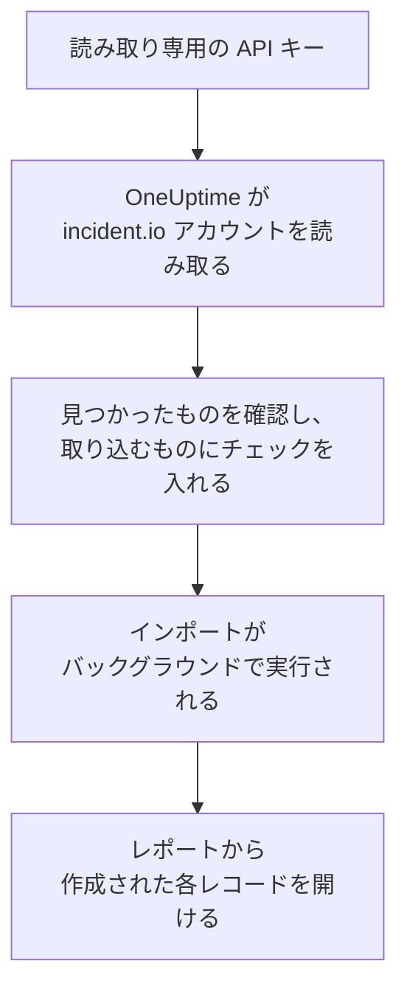

# incident.io からの移行

**別のツールからインポート** を使えば、incident.io の設定を数分で OneUptime に移行できます。読み取り専用の incident.io API キーがあれば、OneUptime がユーザー、チーム、スケジュール、エスカレーションパス、サービス、インシデント設定を読み取り、見つけたものを表示し、チェックを入れたものを作成します。incident.io では何も変更されません。

:::cards
- [アカウントをインポートする](#incidentio-アカウントをインポートする): キーを作成し、アカウントを読み取って、取り込むものにチェックを入れます。
- [取り込まれるもの](#取り込まれるもの): incident.io の各レコードが OneUptime で何になるか。
- [移行を完了する](#移行を完了する): インポートが終わったらすること。
:::

## 仕組み

- **キーは 1 回だけ使われます。** OneUptime がアカウントを読み取っている間は暗号化して保持され、読み取りが終わるとすぐに削除されます。成功したかどうかは関係ありません。再び表示されることも、ログに書き込まれることもありません。
- **OneUptime は読み取るだけです。** 呼び出すのは incident.io 自身の API、`api.incident.io` だけです。incident.io から速度を落とすよう求められると、待ってから再試行します。
- **インポートを開始するまで何も作成されません。** プレビューには、項目ごとに、新規か、OneUptime に既存か (そのまま使われます)、以前のインポートで取り込まれたか、取り込めない理由は何かが表示されます。
- **もう一度実行しても二重に作成されることはありません。** OneUptime は、各インポートが取り込んだものを incident.io の ID で記憶しています。incident.io でユーザーやスケジュールを追加した後にもう一度実行すると、新しいものだけが作成されます。

## 始める前に

- **OneUptime のプロジェクトと、取り込むものを作成する権限。** プロジェクトのオーナーと管理者はすべてを取り込めます。その他のロールもインポートを実行でき、作成を許可されている種類のレコードを取り込めます。それ以外は、理由とともに取り込みなしとして表示されます。
- **データの閲覧だけができる incident.io の API キー。** インポートが incident.io に書き込むことはないため、キーに作成、編集、管理の権限は必要ありません。

## incident.io アカウントをインポートする

:::steps
### incident.io で API キーを作成する
incident.io で **Settings** > **API keys** を開き、**Add new** を選択します。名前を `OneUptime import` とし、データを閲覧する権限だけを付与して (作成、編集、管理の権限は付与しません)、キーをコピーします。

### インポートページを開く
OneUptime で **プロジェクト設定** > **別のツールからインポート** を開き、**incident.io** を選択します。

### incident.io を接続する
キーを **incident.io の API キー** に貼り付け、**incident.io アカウントを読み取る** を選択します。大きなアカウントでは数分かかり、読み取り中はページを離れてもかまいません。

### 取り込むものにチェックを入れる
プレビューには、見つかったものが種類ごとのセクションに分かれて表示されます。作成されるものには最初からチェックが入っています。ただし、どのチーム、スケジュール、エスカレーションパスにも含まれていない人は除きます。各項目の下には、元のとおりには取り込まれない点が表示されます。チェックした項目が、チェックしていないものを使っている場合はそのことが表示され、**これらも選択** でチェックを入れられます。

### インポートを開始する
招待される人がいる場合は、**新しいユーザーの招待先** で参加先のチームを選びます。次に **インポートを開始** を選択します。インポートはバックグラウンドで実行されます。ページを離れてもかまわず、レポートはそのページで待っています。
:::

レポートには、作成、招待、取り込みなしの件数が表示され、各項目が、作成されたレコードへのリンクとともに一覧されます (失敗したものが先頭)。以前のインポートは、同じページの **以前のインポート** に一覧されます。

## 取り込まれるもの

| incident.io | OneUptime | 方法 |
| --- | --- | --- |
| ユーザー | プロジェクトのメンバー | メールアドレスで照合します。まだプロジェクトにいない人は、選んだチームに招待されます。無効化されているユーザーは取り込まれません。 |
| チーム | チーム | メンバーと一緒に作成されます。プロジェクトに同じ名前のチームがある場合はそのまま使われ、メンバーも変更されません。 |
| スケジュール | オンコールスケジュール | 各ローテーションは、同じメンバー、開始日時、交代の長さ、勤務時間を持つレイヤーになります (スケジュールのタイムゾーン)。現在有効なバージョンのローテーションが取り込まれます。 |
| エスカレーションパス | オンコールポリシー | 各レベルは、同じスケジュール、ユーザー、チームを同じ待機時間の後に呼び出すエスカレーションルールになります。繰り返しはポリシーの繰り返しになり、分岐からは最初のパスが取り込まれます。 |
| カタログのサービス | サービス | サービスカテゴリーに属するカタログタイプのエントリーで、サービスカタログに作成されます。アーカイブされたエントリーは除外されます。 |
| 重大度 | インシデントの重大度 | incident.io の順序で、最も重大なものから作成されます。プロジェクトに同じ名前の重大度がある場合はそのまま使われます。 |
| ステータス | インシデントの状態 | トリアージのステータスは OneUptime がインシデントを開始する状態に、クローズのステータスはインシデントが解決される状態に対応します。対応中と一時停止のステータスは、確認済みと解決済みの間に作成されます。 |
| インシデントロール | インシデントロール | リーダーのロールは OneUptime のインシデントコマンダーに対応し、その他のロールは作成されます。OneUptime は各インシデントを宣言した人を記録するため、報告者のロールは不要です。 |
| カスタムフィールド | インシデントのカスタムフィールド | 単一選択フィールドはドロップダウンに、複数選択フィールドは複数選択のドロップダウンに、テキストとリンクのフィールドはテキストに、数値フィールドは数値になり、選択肢も取り込まれます。 |

複数の人が同時にオンコールになるローテーションは、オンコールの人ごとに 1 つの OneUptime スケジュールになります。OneUptime のスケジュールでは同時にオンコールになるのは 1 人だからです。そのスケジュールを呼び出していたオンコールポリシーは、そのすべてを呼び出します。

## 取り込まれないもの

- **インシデント、アラート、その履歴。** OneUptime は過去のインシデントではなく、設定から始まります。
- **ワークフロー、ステータスページ、アラートルート、インテグレーション。** 代わりに、モニターとアラートの送信元を OneUptime に向けてください。[移行を完了する](#移行を完了する) を参照してください。
- **選択肢がカタログから来るカスタムフィールド、** および OneUptime に対応する状態がないステータス: declined、merged、canceled、learning。
- **スケジュールのオーバーライドと、後日に予定されたローテーションの変更。** 予定された変更はプレビューにそれぞれ表示されるので、その時期が来たら OneUptime で変更してください。
- **OneUptime に完全に対応するものがないエスカレーションのステップ。** Slack や Microsoft Teams のチャンネルに投稿するステップは、OneUptime ではワークスペースの通知ルールがその役割を担うため除外されます。別のエスカレーションパスに引き継ぐステップも同様です。次のオンコール担当者を呼び出すステップは、OneUptime で最も近いものとして取り込まれ、プレビューに何が変わるかが表示されます。

## 上限

1 回のインポートで作成されるのは最大 2,000 件です。ユーザーは最大 500 人、チームは 200 件、オンコールスケジュールは 200 件、オンコールポリシーは 200 件、サービスは 500 件、インシデントのカスタムフィールドは 100 件、インシデントの重大度、状態、ロールはそれぞれ 25 件までです。上限を超えた分は取り込みなしとして表示されます。残りを取り込むには、もう一度インポートを実行してください。

OneUptime Cloud では、プランに含まれないレコードは、必要なプランとともに取り込みなしとして表示されます。

プレビューは 1 日保持されます。チェックを入れてインポートを開始できるのは、アカウントを読み取った本人だけです。プロジェクトのオーナーと管理者は、すべてのインポートの進行状況とレポートを確認できます。

## 移行を完了する

:::steps
### オンコールスケジュールを確認する
**オンコール** > **オンコールスケジュール** で各スケジュールを開き、現在のオンコール担当者と次の担当者を確認します。

### 全員が呼び出しを受けられるようにする
招待された人は招待を承諾し、呼び出しを受ける電話番号、メールアドレス、またはモバイルアプリを追加します。**オンコール** > **準備状況** で、まだ連絡がつかない人を確認できます。

### アラートを OneUptime に送る
モニターとアラートを出すツールの送信先を OneUptime にし、一度自分を呼び出してテストします。

### incident.io の呼び出しをオフにする
OneUptime が正しい人を呼び出すようになったら、二重に呼び出されないように incident.io の通知をオフにします。
:::

## トラブルシューティング

:::details incident.io が API キーを受け付けなかった
キー全体をコピーしたか、**Settings** > **API keys** でキーが削除されていないかを確認してください。その後 **再試行** を選択します。
:::

:::details プレビューに表示されない種類のレコードがある
キーで読み取れなかったため、プレビューの上部にその旨が表示されています。その種類のデータを閲覧する権限をキーに付与して、アカウントをもう一度読み取ってください。
:::

:::details チェックを入れられない項目がある
それぞれに理由が表示されます: 無効化されているユーザー、プロジェクトに既にある名前、以前のインポートで取り込まれたもの、または作成する権限がないかプランに含まれないレコードです。
:::

## 次のステップ

:::cards
- [オンコールスケジュール](/docs/on-call/schedules): レイヤー、制限、引き継ぎ。
- [インシデントの状態と重大度](/docs/incidents/states-and-severities): インシデントがたどる状態と重大度。
- [Opsgenie からの移行](/docs/moving-to-oneuptime/opsgenie): Opsgenie からチームを移行します。
:::
