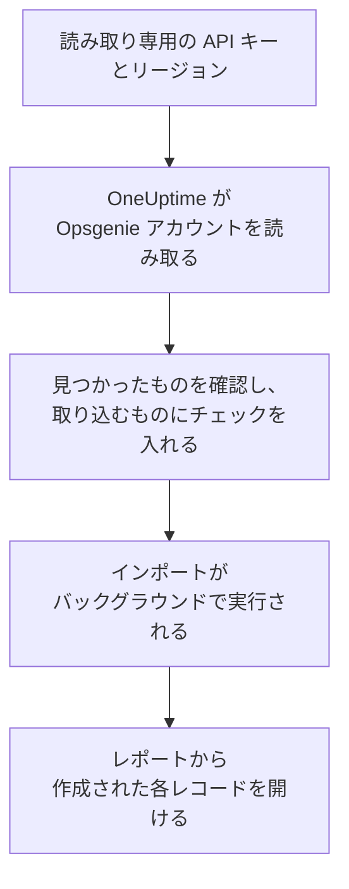

# Opsgenie からの移行

Atlassian は Opsgenie を終了します。Opsgenie は 2025 年 6 月に販売を終了し、2027 年 4 月にサポートが終了します。OneUptime はオンコールチームの新しい居場所になり、**別のツールからインポート** を使えば数分で移行できます。読み取り専用の Opsgenie API キーがあれば、OneUptime がユーザー、チーム、スケジュール、エスカレーション、サービスを読み取り、見つけたものを表示し、チェックを入れたものを作成します。Opsgenie では何も変更されません。

:::cards
- [アカウントをインポートする](#opsgenie-アカウントをインポートする): キーを作成し、アカウントを読み取って、取り込むものにチェックを入れます。
- [取り込まれるもの](#取り込まれるもの): Opsgenie の各レコードが OneUptime で何になるか。
- [移行を完了する](#移行を完了する): インポートが終わったらすること。
:::

## 仕組み

- **キーは 1 回だけ使われます。** OneUptime がアカウントを読み取っている間は暗号化して保持され、読み取りが終わるとすぐに削除されます。成功したかどうかは関係ありません。再び表示されることも、ログに書き込まれることもありません。
- **OneUptime は読み取るだけです。** 呼び出すのは Opsgenie 自身の API だけです: `api.opsgenie.com`、またはヨーロッパのアカウントでは `api.eu.opsgenie.com`。Opsgenie から速度を落とすよう求められると、待ってから再試行します。
- **インポートを開始するまで何も作成されません。** プレビューには、項目ごとに、新規か、OneUptime に既存か (そのまま使われます)、以前のインポートで取り込まれたか、取り込めない理由は何かが表示されます。
- **もう一度実行しても二重に作成されることはありません。** OneUptime は、各インポートが取り込んだものを Opsgenie の ID で記憶しています。Opsgenie でユーザーやスケジュールを追加した後にもう一度実行すると、新しいものだけが作成されます。

## 始める前に

- **OneUptime のプロジェクトと、取り込むものを作成する権限。** プロジェクトのオーナーと管理者はすべてを取り込めます。その他のロールもインポートを実行でき、作成を許可されている種類のレコードを取り込めます。それ以外は、理由とともに取り込みなしとして表示されます。
- **Read と Configuration access の権限を持つ Opsgenie の API キー。** Configuration access があると、キーでユーザー、チーム、スケジュール、エスカレーションを読み取れます。インポートが Opsgenie に書き込むことはありません。
- **Opsgenie のリージョン。** `app.eu.opsgenie.com` でサインインしている場合、アカウントはヨーロッパにあります。それ以外の場合はアメリカ合衆国にあります。

## Opsgenie アカウントをインポートする

:::steps
### Opsgenie で API キーを作成する
Opsgenie で **Settings** > **API key management** を開き、**Add new API key** を選択します。名前を `OneUptime import` とし、**Read** と **Configuration access** だけを付与して、キーをコピーします。

### インポートページを開く
OneUptime で **プロジェクト設定** > **別のツールからインポート** を開き、**Opsgenie** を選択します。

### Opsgenie を接続する
**Opsgenie アカウントはどこにありますか？** で **アメリカ合衆国** または **ヨーロッパ** を選びます。キーを **Opsgenie の API キー** に貼り付け、**Opsgenie アカウントを読み取る** を選択します。大きなアカウントでは数分かかり、読み取り中はページを離れてもかまいません。

### 取り込むものにチェックを入れる
プレビューには、見つかったものが種類ごとのセクションに分かれて表示されます。作成されるものには最初からチェックが入っています。ただし、Opsgenie でオフになっているスケジュールと、どのチーム、スケジュール、エスカレーションにも含まれていない人は除きます。各項目の下には、元のとおりには取り込まれない点が表示されます。チェックした項目が、チェックしていないものを使っている場合はそのことが表示され、**これらも選択** でチェックを入れられます。

### インポートを開始する
招待される人がいる場合は、**新しいユーザーの招待先** で参加先のチームを選びます。次に **インポートを開始** を選択します。インポートはバックグラウンドで実行されます。ページを離れてもかまわず、レポートはそのページで待っています。
:::

レポートには、作成、招待、取り込みなしの件数が表示され、各項目が、作成されたレコードへのリンクとともに一覧されます (失敗したものが先頭)。以前のインポートは、同じページの **以前のインポート** に一覧されます。

## 取り込まれるもの

| Opsgenie | OneUptime | 方法 |
| --- | --- | --- |
| ユーザー | プロジェクトのメンバー | メールアドレスで照合します。まだプロジェクトにいない人は、選んだチームに招待されます。ブロックされているユーザーは取り込まれません。 |
| チーム | チーム | メンバーと一緒に作成されます。プロジェクトに同じ名前のチームがある場合はそのまま使われ、メンバーも変更されません。 |
| スケジュール | オンコールスケジュール | 各ローテーションは、同じメンバー、開始日時、交代の長さ、時間の制限を持つレイヤーになります。スケジュールのタイムゾーンで、スケジュールのチームが所有します。 |
| エスカレーション | オンコールポリシー | 各ルールは、同じスケジュール、ユーザー、チームを呼び出すエスカレーションルールになります。遅延が同じルールはまとめて呼び出し、次のエスカレーションルールまでの待機時間は遅延の差になります。エスカレーションの繰り返しは、ポリシーの繰り返しになります。 |
| サービス | サービス | サービスカタログに作成され、そのチームが所有します。 |

ローテーションによって 2 人が同時にオンコールになるスケジュールは、ローテーションごとに 1 つの OneUptime スケジュールになります。OneUptime のスケジュールでは同時にオンコールになるのは 1 人だからです。そのスケジュールを呼び出していたオンコールポリシーは、そのすべてを呼び出します。

## 取り込まれないもの

- **アラート、インシデント、その履歴。** OneUptime は過去のアラートではなく、設定から始まります。
- **インテグレーション、ハートビート、アラートポリシー、ルーティングルール。** 代わりに、モニターとアラートの送信元を OneUptime に向けてください。[移行を完了する](#移行を完了する) を参照してください。
- **スケジュールのオーバーライドと、すでに終了したローテーション。** まだ必要なオーバーライドは、インポート後に OneUptime で追加してください。
- **各ユーザーの通知ルール。** 招待を承諾した後、各自の **ユーザー設定** で呼び出し方法を選びます。
- **OneUptime に完全に対応するものがないステップ。** 次のオンコール担当者やチームの管理者を呼び出すルールは、OneUptime で最も近いものとして取り込まれ、プレビューに何が変わるかが表示されます。

## 上限

1 回のインポートで作成されるのは最大 2,000 件です。ユーザーは最大 500 人、チームは 200 件、オンコールスケジュールは 200 件、オンコールポリシーは 200 件、サービスは 500 件までです。上限を超えた分は取り込みなしとして表示されます。残りを取り込むには、もう一度インポートを実行してください。

OneUptime Cloud では、プランに含まれないレコードは、必要なプランとともに取り込みなしとして表示されます。

プレビューは 1 日保持されます。チェックを入れてインポートを開始できるのは、アカウントを読み取った本人だけです。プロジェクトのオーナーと管理者は、すべてのインポートの進行状況とレポートを確認できます。

## 移行を完了する

:::steps
### オンコールスケジュールを確認する
**オンコール** > **オンコールスケジュール** で各スケジュールを開き、現在のオンコール担当者と次の担当者を確認します。

### 全員が呼び出しを受けられるようにする
招待された人は招待を承諾し、呼び出しを受ける電話番号、メールアドレス、またはモバイルアプリを追加します。**オンコール** > **準備状況** で、まだ連絡がつかない人を確認できます。

### アラートを OneUptime に送る
モニターとアラートを出すツールの送信先を OneUptime にし、一度自分を呼び出してテストします。

### Opsgenie の呼び出しをオフにする
OneUptime が正しい人を呼び出すようになったら、二重に呼び出されないように Opsgenie の通知をオフにします。
:::

## トラブルシューティング

:::details Opsgenie が API キーを受け付けなかった
キー全体をコピーしたか、インテグレーションのキーではなく **API key management** のキーか、**Read** と **Configuration access** があるか、アカウントのあるリージョンを選んだかを確認してください。その後 **再試行** を選択します。
:::

:::details プレビューに表示されない種類のレコードがある
キーで読み取れなかったため、プレビューの上部にその旨が表示されています。キーに **Configuration access** を付与して、アカウントをもう一度読み取ってください。
:::

:::details チェックを入れられない項目がある
それぞれに理由が表示されます: ブロックされているユーザー、プロジェクトに既にある名前、以前のインポートで取り込まれたもの、または作成する権限がないかプランに含まれないレコードです。
:::

## 次のステップ

:::cards
- [オンコールスケジュール](/docs/on-call/schedules): レイヤー、制限、引き継ぎ。
- [エスカレーションルール](/docs/on-call/escalation-rules): オンコールポリシーがどのように人を呼び出すか。
- [incident.io からの移行](/docs/moving-to-oneuptime/incident-io): incident.io からチームを移行します。
:::
