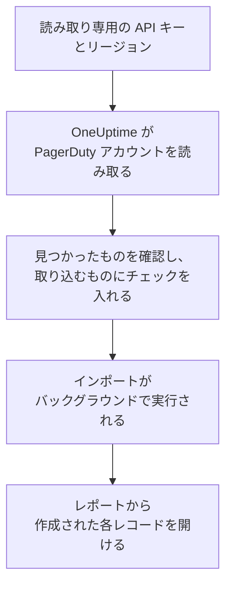

# PagerDuty からの移行

**別のツールからインポート** を使えば、PagerDuty の設定を数分で OneUptime に移行できます。読み取り専用の PagerDuty API キーがあれば、OneUptime がユーザー、チーム、スケジュール、エスカレーションポリシー、サービスを読み取り、見つけたものを表示し、チェックを入れたものを作成します。PagerDuty では何も変更されません。

:::cards
- [アカウントをインポートする](#pagerduty-アカウントをインポートする): キーを作成し、アカウントを読み取って、取り込むものにチェックを入れます。
- [取り込まれるもの](#取り込まれるもの): PagerDuty の各レコードが OneUptime で何になるか。
- [移行を完了する](#移行を完了する): インポートが終わったらすること。
:::

## 仕組み

- **キーは 1 回だけ使われます。** OneUptime がアカウントを読み取っている間は暗号化して保持され、読み取りが終わるとすぐに削除されます。成功したかどうかは関係ありません。再び表示されることも、ログに書き込まれることもありません。
- **OneUptime は読み取るだけです。** 呼び出すのは PagerDuty 自身の REST API だけです: `api.pagerduty.com`、またはヨーロッパのアカウントでは `api.eu.pagerduty.com`。PagerDuty から速度を落とすよう求められると、待ってから再試行します。
- **インポートを開始するまで何も作成されません。** プレビューには、項目ごとに、新規か、OneUptime に既存か (そのまま使われます)、以前のインポートで取り込まれたか、取り込めない理由は何かが表示されます。
- **もう一度実行しても二重に作成されることはありません。** OneUptime は、各インポートが取り込んだものを PagerDuty の ID で記憶しています。PagerDuty でユーザーやスケジュールを追加した後にもう一度実行すると、新しいものだけが作成されます。

## 始める前に

- **OneUptime のプロジェクトと、取り込むものを作成する権限。** プロジェクトのオーナーと管理者はすべてを取り込めます。その他のロールもインポートを実行でき、作成を許可されている種類のレコードを取り込めます。それ以外は、理由とともに取り込みなしとして表示されます。
- **読み取り専用の PagerDuty REST API キー。** PagerDuty の管理者とアカウントオーナーが作成できます。インポートが PagerDuty に書き込むことはないため、キーには読み取りアクセスだけで十分です。
- **PagerDuty のリージョン。** サインインするアドレスが `eu.pagerduty.com` で終わる場合、アカウントはヨーロッパにあります。それ以外の場合はアメリカ合衆国にあります。

## PagerDuty アカウントをインポートする

:::steps
### PagerDuty で API キーを作成する
PagerDuty で **Integrations** > **Developer Tools** > **API Access Keys** を開き、**Create New API Key** を選択します。説明を `OneUptime import` とし、**Read-only API Key** にチェックを入れて **Create Key** を選択し、キーをコピーします。

### インポートページを開く
OneUptime で **プロジェクト設定** > **別のツールからインポート** を開き、**PagerDuty** を選択します。

### PagerDuty を接続する
**PagerDuty アカウントはどこにありますか？** で **アメリカ合衆国** または **ヨーロッパ** を選びます。キーを **PagerDuty の API キー** に貼り付け、**PagerDuty アカウントを読み取る** を選択します。大きなアカウントでは数分かかり、読み取り中はページを離れてもかまいません。

### 取り込むものにチェックを入れる
プレビューには、見つかったものが種類ごとのセクションに分かれて表示されます。作成されるものには最初からチェックが入っています。ただし、PagerDuty でオフになっているサービスと、どのチーム、スケジュール、エスカレーションポリシーにも含まれていない人は除きます。各項目の下には、元のとおりには取り込まれない点が表示されます。チェックした項目が、チェックしていないものを使っている場合はそのことが表示され、**これらも選択** でチェックを入れられます。

### インポートを開始する
招待される人がいる場合は、**新しいユーザーの招待先** で参加先のチームを選びます。次に **インポートを開始** を選択します。インポートはバックグラウンドで実行されます。ページを離れてもかまわず、レポートはそのページで待っています。
:::

レポートには、作成、招待、取り込みなしの件数が表示され、各項目が、作成されたレコードへのリンクとともに一覧されます (失敗したものが先頭)。以前のインポートは、同じページの **以前のインポート** に一覧されます。

## 取り込まれるもの

| PagerDuty | OneUptime | 方法 |
| --- | --- | --- |
| ユーザー | プロジェクトのメンバー | メールアドレスで照合します。まだプロジェクトにいない人は、選んだチームに招待されます。 |
| チーム | チーム | メンバーと一緒に作成されます。プロジェクトに同じ名前のチームがある場合はそのまま使われ、メンバーも変更されません。 |
| スケジュール | オンコールスケジュール | 各レイヤーは、同じメンバー、開始日時、交代の長さ、制限を持つレイヤーになります。スケジュールのタイムゾーンで、スケジュールのチームが所有します。レイヤーの順序はそのまま保たれるため、上位のレイヤーは引き続き下位のレイヤーより優先されます。 |
| エスカレーションポリシー | オンコールポリシー | 各エスカレーションルールは、同じスケジュールとユーザーを呼び出し、同じ遅延の後にエスカレーションするエスカレーションルールになります。ポリシーの繰り返しは、オンコールポリシーの繰り返しになります。 |
| サービス | サービス | サービスカタログに作成され、そのチームが所有します。PagerDuty でオフになっているサービスには、最初はチェックが入っていません。 |

PagerDuty のスケジュールは 1 つの OneUptime スケジュールのままです。レイヤー同士の優先順位は PagerDuty と同じです。交代の長さが時間単位で割り切れないレイヤーは、交代を 1 時間単位に丸めて取り込まれ、プレビューにその旨が表示されます。

## 取り込まれないもの

- **インシデント、アラート、その履歴。** OneUptime は過去のインシデントではなく、設定から始まります。
- **インテグレーション、Event Orchestrations、Incident Workflows、ステータスページ。** 代わりに、モニターとアラートの送信元を OneUptime に向けてください。[移行を完了する](#移行を完了する) を参照してください。
- **スケジュールのオーバーライドと、すでに終了したレイヤー。** まだ必要なオーバーライドは、インポート後に OneUptime で追加してください。
- **シフトベースのスケジュール。** インポートが読み取るのは PagerDuty のレイヤー式のスケジュールで、新しいシフトベースのスケジュール (shift-based schedules) は読み取りません。アカウントにシフトベースのスケジュールがある場合はプレビューの上部にその旨が表示され、それを呼び出すエスカレーションルールはそのスケジュールなしで取り込まれます。OneUptime で作成してください。
- **各ユーザーの通知ルール。** 招待を承諾した後、各自の **ユーザー設定** で呼び出し方法を選びます。
- **OneUptime に完全に対応するものがないルール。** メンバーを順番に (ラウンドロビンで) 割り当てるエスカレーションルールは、OneUptime では全員を同時に呼び出します。プレビューに何が変わるかが表示されます。

## 上限

1 回のインポートで作成されるのは最大 2,000 件です。ユーザーは最大 500 人、チームは 200 件、オンコールスケジュールは 200 件、オンコールポリシーは 200 件、サービスは 500 件までです。上限を超えた分は取り込みなしとして表示されます。残りを取り込むには、もう一度インポートを実行してください。

OneUptime Cloud では、プランに含まれないレコードは、必要なプランとともに取り込みなしとして表示されます。

プレビューは 1 日保持されます。チェックを入れてインポートを開始できるのは、アカウントを読み取った本人だけです。プロジェクトのオーナーと管理者は、すべてのインポートの進行状況とレポートを確認できます。

## 移行を完了する

:::steps
### オンコールスケジュールを確認する
**オンコール** > **オンコールスケジュール** で各スケジュールを開き、現在のオンコール担当者と次の担当者を確認します。

### 全員が呼び出しを受けられるようにする
招待された人は招待を承諾し、呼び出しを受ける電話番号、メールアドレス、またはモバイルアプリを追加します。**オンコール** > **準備状況** で、まだ連絡がつかない人を確認できます。

### アラートを OneUptime に送る
モニターとアラートを出すツールの送信先を OneUptime にし、一度自分を呼び出してテストします。

### PagerDuty の呼び出しをオフにする
OneUptime が正しい人を呼び出すようになったら、二重に呼び出されないように PagerDuty の通知をオフにします。
:::

## トラブルシューティング

:::details PagerDuty が API キーを受け付けなかった
キー全体をコピーしたか、インテグレーションキーではなく **API Access Keys** の REST API キーか、アカウントのあるリージョンを選んだかを確認してください。その後 **再試行** を選択します。
:::

:::details プレビューに表示されない種類のレコードがある
キーで読み取れなかったため、プレビューの上部にその旨が表示されています。種類によっては、それを含む PagerDuty のプランでしか使えません (チームなど)。読み取れるキーで、アカウントをもう一度読み取ってください。
:::

:::details チェックを入れられない項目がある
それぞれに理由が表示されます: プロジェクトに既にある名前、以前のインポートで取り込まれたもの、または作成する権限がないかプランに含まれないレコードです。
:::

## 次のステップ

:::cards
- [オンコールスケジュール](/docs/on-call/schedules): レイヤー、制限、引き継ぎ。
- [エスカレーションルール](/docs/on-call/escalation-rules): オンコールポリシーがどのように人を呼び出すか。
- [Opsgenie からの移行](/docs/moving-to-oneuptime/opsgenie): Opsgenie からチームを移行します。
:::
