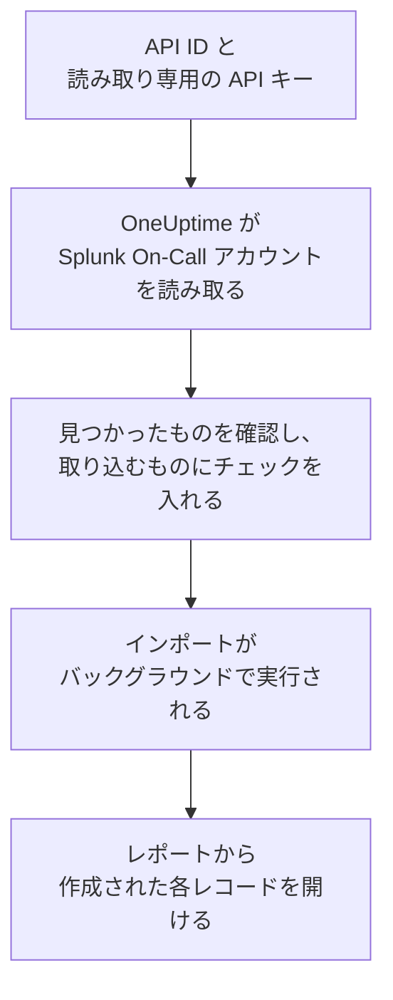

# Splunk On-Call からの移行

**別のツールからインポート** を使えば、Splunk On-Call (旧 VictorOps) の設定を数分で OneUptime に移行できます。API ID と読み取り専用の API キーがあれば、OneUptime がユーザー、チーム、ローテーション、エスカレーションポリシーを読み取り、見つけたものを表示し、チェックを入れたものを作成します。Splunk On-Call では何も変更されません。

:::cards
- [アカウントをインポートする](#splunk-on-call-アカウントをインポートする): キーを作成し、アカウントを読み取って、取り込むものにチェックを入れます。
- [取り込まれるもの](#取り込まれるもの): Splunk On-Call の各レコードが OneUptime で何になるか。
- [移行を完了する](#移行を完了する): インポートが終わったらすること。
:::

## 仕組み

- **キーは 1 回だけ使われます。** OneUptime がアカウントを読み取っている間は API ID と一緒に暗号化して保持され、読み取りが終わるとすぐに削除されます。成功したかどうかは関係ありません。再び表示されることも、ログに書き込まれることもありません。
- **OneUptime は読み取るだけです。** 呼び出すのは Splunk On-Call 自身の API、`api.victorops.com` だけです。Splunk On-Call は各種類のリクエストに 1 秒あたり最大 2 回までしか応答しないため、OneUptime はそのペースを守り、速度を落とすよう求められると、待ってから再試行します。
- **インポートを開始するまで何も作成されません。** プレビューには、項目ごとに、新規か、OneUptime に既存か (そのまま使われます)、以前のインポートで取り込まれたか、取り込めない理由は何かが表示されます。
- **もう一度実行しても二重に作成されることはありません。** OneUptime は、各インポートが取り込んだものを Splunk On-Call の ID で記憶しています。Splunk On-Call でユーザーやローテーションを追加した後にもう一度実行すると、新しいものだけが作成されます。

## 始める前に

- **OneUptime のプロジェクトと、取り込むものを作成する権限。** プロジェクトのオーナーと管理者はすべてを取り込めます。その他のロールもインポートを実行でき、作成を許可されている種類のレコードを取り込めます。それ以外は、理由とともに取り込みなしとして表示されます。
- **Splunk On-Call の API ID と読み取り専用の API キー。** どちらも Splunk On-Call の **Integrations** > **API** にあります。インポートが Splunk On-Call に書き込むことはないため、読み取り専用のキーで十分です。

## Splunk On-Call アカウントをインポートする

:::steps
### Splunk On-Call で API キーを作成する
Splunk On-Call で **Integrations** > **API** を開きます。API ID は API キーの上に表示されています。`OneUptime import` という名前で新しい API キーを作成し、**Read-only** にチェックを入れて、API ID とキーをコピーします。

### インポートページを開く
OneUptime で **プロジェクト設定** > **別のツールからインポート** を開き、**Splunk On-Call** を選択します。

### Splunk On-Call を接続する
API ID を **Splunk On-Call の API ID** に、キーを **Splunk On-Call の API キー** に貼り付け、**Splunk On-Call アカウントを読み取る** を選択します。大きなアカウントでは数分かかり、読み取り中はページを離れてもかまいません。

### 取り込むものにチェックを入れる
プレビューには、見つかったものが種類ごとのセクションに分かれて表示されます。作成されるものには最初からチェックが入っています。ただし、どのチーム、ローテーション、エスカレーションポリシーにも含まれていない人は除きます。各項目の下には、元のとおりには取り込まれない点が表示されます。チェックした項目が、チェックしていないものを使っている場合はそのことが表示され、**これらも選択** でチェックを入れられます。

### インポートを開始する
招待される人がいる場合は、**新しいユーザーの招待先** で参加先のチームを選びます。次に **インポートを開始** を選択します。インポートはバックグラウンドで実行されます。ページを離れてもかまわず、レポートはそのページで待っています。
:::

レポートには、作成、招待、取り込みなしの件数が表示され、各項目が、作成されたレコードへのリンクとともに一覧されます (失敗したものが先頭)。以前のインポートは、同じページの **以前のインポート** に一覧されます。

## 取り込まれるもの

| Splunk On-Call | OneUptime | 方法 |
| --- | --- | --- |
| ユーザー | プロジェクトのメンバー | メールアドレスで照合します。まだプロジェクトにいない人は、選んだチームに招待されます。 |
| チーム | チーム | メンバーと一緒に作成されます。プロジェクトに同じ名前のチームがある場合はそのまま使われ、メンバーも変更されません。 |
| ローテーション | オンコールスケジュール | 各ローテーションはそのチームが所有するスケジュールになり、各シフトは、同じメンバー、開始日時、交代、オンコールの曜日と時間を持つレイヤーになります。Splunk On-Call で今オンコールの人は、OneUptime でもオンコールになります。 |
| エスカレーションポリシー | オンコールポリシー | ポリシーのチームが所有します。各ステップは、同じローテーションとユーザーを呼び出すエスカレーションルールになります。ステップのタイムアウトはその前の待機時間になり、間にタイムアウトのないステップはまとめて呼び出します。 |

同じローテーションで同時にオンコールになるシフトは、それぞれ別の OneUptime スケジュールになります。OneUptime のスケジュールでは同時にオンコールになるのは 1 人だからです。そのローテーションを呼び出していたオンコールポリシーは、そのすべてを呼び出します。スケジュールはローテーションの最初のシフトのタイムゾーンを使い、別のタイムゾーンのシフトは時間がそのタイムゾーンに換算されます。

## 取り込まれないもの

- **インシデント、アラート、その履歴。** OneUptime は過去のインシデントではなく、設定から始まります。
- **インテグレーション、routing keys、alert rules。** 代わりに、モニターとアラートの送信元を OneUptime に向けてください。[移行を完了する](#移行を完了する) を参照してください。
- **予定されたオーバーライド。** まだ必要なオーバーライドは、インポート後に OneUptime で追加してください。
- **各ユーザーの呼び出しポリシー。** 招待を承諾した後、各自の **ユーザー設定** で呼び出し方法を選びます。
- **OneUptime に完全に対応するものがないステップ。** Webhook を呼び出すステップや別のエスカレーションポリシーに回すステップは取り込まれません。取り込まれる人のどのアドレスでもないアドレスにメールを送るステップも同様です。次の、または前のオンコール担当者を呼び出すステップは、今のオンコール担当者を呼び出します。プレビューに何が変わるかが表示されます。

## 上限

1 回のインポートで作成されるのは最大 2,000 件です。ユーザーは最大 500 人、チームは 200 件、オンコールスケジュールは 200 件、オンコールポリシーは 200 件までです。上限を超えた分は取り込みなしとして表示されます。残りを取り込むには、もう一度インポートを実行してください。

OneUptime Cloud では、プランに含まれないレコードは、必要なプランとともに取り込みなしとして表示されます。

プレビューは 1 日保持されます。チェックを入れてインポートを開始できるのは、アカウントを読み取った本人だけです。プロジェクトのオーナーと管理者は、すべてのインポートの進行状況とレポートを確認できます。

## 移行を完了する

:::steps
### オンコールスケジュールを確認する
**オンコール** > **オンコールスケジュール** で各スケジュールを開き、現在のオンコール担当者と次の担当者を確認します。

### 全員が呼び出しを受けられるようにする
招待された人は招待を承諾し、呼び出しを受ける電話番号、メールアドレス、またはモバイルアプリを追加します。**オンコール** > **準備状況** で、まだ連絡がつかない人を確認できます。

### アラートを OneUptime に送る
モニターとアラートを出すツールの送信先を OneUptime にし、一度自分を呼び出してテストします。

### Splunk On-Call の呼び出しをオフにする
OneUptime が正しい人を呼び出すようになったら、二重に呼び出されないように Splunk On-Call の通知をオフにします。
:::

## トラブルシューティング

:::details Splunk On-Call が API ID と API キーを受け付けなかった
**Integrations** > **API** から API ID とキー全体をコピーしたか、そこでキーが削除されていないかを確認してください。その後 **再試行** を選択します。
:::

:::details プレビューに表示されない種類のレコードがある
キーで読み取れなかったため、プレビューの上部にその旨が表示されています。**Integrations** > **API** でキーを確認し、アカウントをもう一度読み取ってください。
:::

:::details チェックを入れられない項目がある
それぞれに理由が表示されます: プロジェクトに既にある名前、以前のインポートで取り込まれたもの、または作成する権限がないかプランに含まれないレコードです。
:::

## 次のステップ

:::cards
- [オンコールスケジュール](/docs/on-call/schedules): レイヤー、制限、引き継ぎ。
- [エスカレーションルール](/docs/on-call/escalation-rules): オンコールポリシーがどのように人を呼び出すか。
- [PagerDuty からの移行](/docs/moving-to-oneuptime/pagerduty): PagerDuty からチームを移行します。
:::
