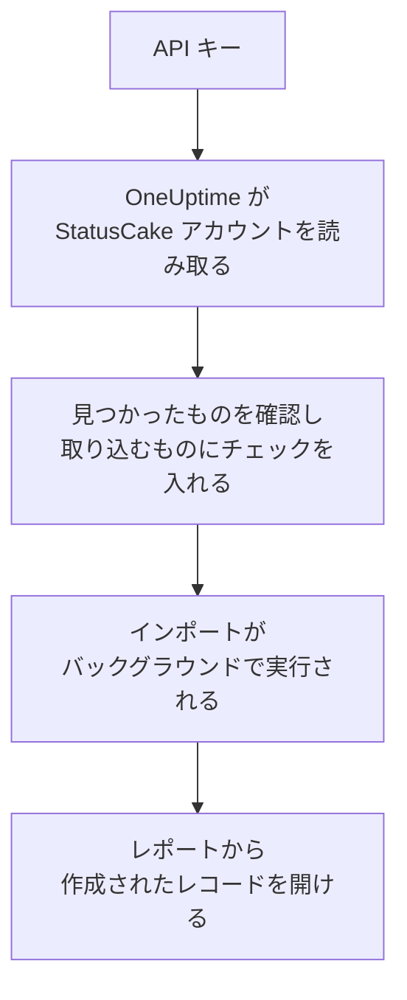

# StatusCake からの移行

**別のツールからインポート** を使えば、StatusCake のチェックを数分で OneUptime に移行できます。StatusCake の API キーがあれば、OneUptime が稼働、SSL、ハートビートのチェックを読み取り、見つけたものを表示し、チェックを入れたものを作成します。StatusCake では何も変更されません。

:::cards
- [アカウントをインポートする](#statuscake-アカウントをインポートする): キーを作成し、アカウントを読み取って、取り込むものにチェックを入れます。
- [取り込まれるもの](#取り込まれるもの): StatusCake の各チェックがどの OneUptime モニターになるか。
- [移行を完了する](#移行を完了する): インポートが終わったらすること。
:::

## 仕組み

- **キーは 1 回だけ使われます。** OneUptime がアカウントを読み取っている間は暗号化して保持され、読み取りが終わるとすぐに削除されます。成功したかどうかは関係ありません。再び表示されることも、ログに書き込まれることもありません。
- **OneUptime は読み取るだけです。** 呼び出すのは StatusCake 自身の API だけです: `api.statuscake.com`。リクエストは 1 秒に 1 回で、StatusCake が Free アカウントに許可する 1 分あたり 60 回の範囲に収まります。StatusCake から速度を落とすよう求められると、待ってから再試行します。
- **インポートを開始するまで何も作成されません。** プレビューには、項目ごとに、新規か、OneUptime に既存か (そのまま使われます)、以前のインポートで取り込まれたか、取り込めない理由は何かが表示されます。
- **もう一度実行しても二重に作成されることはありません。** OneUptime は、各インポートが取り込んだものを StatusCake の ID で記憶しています。StatusCake でチェックを追加した後にもう一度実行すると、新しいものだけが作成されます。

## 始める前に

- **OneUptime のプロジェクトと、取り込むものを作成する権限。** プロジェクトのオーナーと管理者はすべてを取り込めます。その他のロールもインポートを実行でき、作成を許可されている種類のレコードを取り込めます。それ以外は、理由とともに取り込みなしとして表示されます。
- **StatusCake の API キー。** インポートが StatusCake に書き込むことはありません。
- **支払い方法 (OneUptime Cloud の場合)。** チェックを実行するモニターは Free プランでも利用量に応じて課金されるため、インポートの前に **プロジェクト設定** > **請求** で支払い方法を追加してください。支払い方法がないと、それらのモニターは取り込みなしとして表示されます。

## StatusCake アカウントをインポートする

:::steps
### StatusCake で API キーを作成する
StatusCake でアカウントパネルを開き、**API Keys** に移動します。`OneUptime import` という名前でキーを作成してコピーします。

### インポートページを開く
OneUptime で **プロジェクト設定** > **別のツールからインポート** を開き、**StatusCake** を選択します。

### StatusCake を接続する
キーを **StatusCake の API キー** に貼り付け、**StatusCake アカウントを読み取る** を選択します。大きなアカウントでは数分かかります。読み取りの間はページを離れてもかまいません。

### 取り込むものにチェックを入れる
プレビューには、見つかったものが種類ごとのセクションに分かれて表示されます。作成されるものには最初からチェックが入っています。ただし、StatusCake で一時停止中のチェックは除きます。それらにチェックを入れると、一時停止の状態で取り込まれます。各項目の下には、元のとおりには取り込まれない点が表示されます。

### インポートを開始する
**インポートを開始** を選択します。インポートはバックグラウンドで実行されます。ページを離れてもかまわず、レポートはそのページで待っています。
:::

レポートには、作成と取り込みなしの件数が表示され、各項目が、作成されたレコードへのリンクとともに一覧されます (失敗したものが先頭)。以前のインポートは、同じページの **以前のインポート** に一覧されます。

## 取り込まれるもの

| StatusCake では | OneUptime では | 方法 |
| --- | --- | --- |
| Uptime, SSL and heartbeat checks | モニター | 各チェックは、同じアドレス、間隔、タイムアウト、ページに含まれるべき (または含まれてはいけない) テキストを持つ同じ種類のモニターになります。 |

- **HTTP と HEAD のチェック** は Web サイトモニターになります。データやヘッダーを送る場合は API モニターになります。StatusCake はアラートを出すステータスコードを指定します。それ以外のコードは OneUptime でも稼働とみなされます。
- **ping と TCP のチェック** は ping とポートのモニターになります。**SMTP と SSH のチェック** はそのポートのポートモニターになります。OneUptime はポートの応答を確認し、その上のやり取りは確認しません。
- **DNS チェック** は、同じサーバーに問い合わせる DNS モニターになります。
- **SSL チェック** は、最初のアラートと同じだけ前に警告する SSL 証明書モニターになります。SSL アラートのある稼働チェックにも 1 つ作成されます。
- **ハートビートチェック** は受信リクエストモニターになり、期間のあいだリクエストが届かないとダウンになります。OneUptime ではそれぞれ新しいアドレスになります。

各モニターは、自分で作成したモニターと同じく、プロジェクトのプローブからチェックされます。OneUptime にない間隔は最も近い間隔に、1 分を超えるタイムアウトは 1 分になります。どちらかが変わる場合はプレビューに表示されます。

## 取り込まれないもの

- **稼働履歴、応答時間、インシデント。** OneUptime はインポートが終わった時点からチェックを始めます。
- **アラートの連絡先と連携。** [移行を完了する](#移行を完了する) のとおり、OneUptime で通知先を決めてください。
- **パスワードと、シークレットを含む可能性のあるヘッダー。** サインインするモニターや、`Authorization`、Cookie、トークンのヘッダーを送るモニターは、それを除いて取り込まれます。[モニターシークレット](/docs/monitor/monitor-secrets) で追加してください。
- **DNS チェックが想定するアドレス。** OneUptime で条件として追加してください。
- **ページ速度、ドメイン、サーバーのチェック。** OneUptime には独自の [ドメインモニター](/docs/monitor/domain-monitor) とサーバー監視があるので、代わりにそれらを設定してください。
- **メンテナンスウィンドウ。** プレビューに件数が表示されます。OneUptime で定期メンテナンスとして計画してください。

## 上限

1 回のインポートで作成されるのは最大 2,000 件です。モニターは最大 1,000 件までです。上限を超えた分は取り込みなしとして表示されます。残りを取り込むには、もう一度インポートを実行してください。

OneUptime Cloud では、チェックを実行するモニターには支払い方法が必要です。プランに空きがないものは、必要なものとともに取り込みなしとして表示されます。

プレビューは 1 日保持されます。チェックを入れてインポートを開始できるのは、アカウントを読み取った本人だけです。プロジェクトのオーナーと管理者は、すべてのインポートの進行状況とレポートを確認できます。

## 移行を完了する

:::steps
### モニターを確認する
**モニター** で各モニターを開き、最初の結果を確認します。ハートビートモニターは新しいアドレスになるため、ping を送るジョブの送信先を変更してください。

### 通知先を決める
モニターに所有者を追加するか、モニターが作成するインシデントに **オンコール** > **オンコールポリシー** のオンコールポリシーを設定して、障害が起きたときに適切な人に伝わるようにします。

### StatusCake のチェックをオフにする
OneUptime が同じ対象をチェックするようになったら、二重に通知されないように StatusCake のチェックを一時停止します。
:::

## トラブルシューティング

:::details StatusCake が API キーを受け付けなかった
**API Keys** からキー全体をコピーしたこと、そしてキーが削除されていないことを確認してください。その後、**再試行** を選択します。
:::

:::details モニターが取り込みなしとして表示される
理由が表示されます: OneUptime にない種類のモニター、OneUptime が読み取れないアドレス、またはそのモニターのための空きや支払い方法がないプロジェクトです。名前、種類、アドレスが同じモニターを OneUptime が既に実行している場合は、そのモニターがそのまま使われます。
:::

:::details チェックを入れられない項目がある
それぞれに理由が表示されます: プロジェクトに既にある名前、以前のインポートで取り込まれたもの、または作成する権限がないかプランに含まれないレコードです。
:::

## 次のステップ

:::cards
- [Web サイト モニター](/docs/monitor/website-monitor): Web サイトモニターが何をどのようにチェックするか。
- [SSL 証明書モニター](/docs/monitor/ssl-certificate-monitor): OneUptime が証明書の期限切れ前に警告する仕組み。
- [Uptime Kuma からの移行](/docs/moving-to-oneuptime/uptime-kuma): Uptime Kuma からチェックを移行します。
:::
