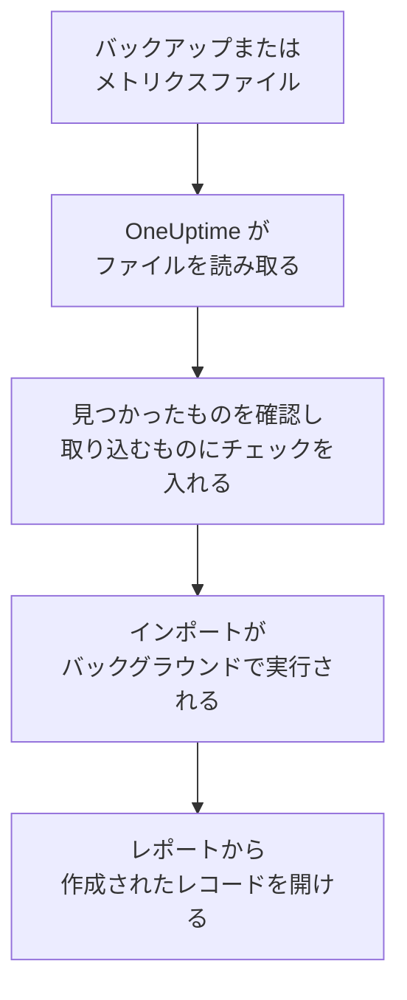

# Uptime Kuma からの移行

Uptime Kuma は自分のマシンで動いているため、**別のツールからインポート** はキーではなくファイルから読み取ります。Uptime Kuma 1 がエクスポートするバックアップか、どのバージョンでも提供されるメトリクスページです。OneUptime はそこからモニターを読み取り、見つけたものを表示し、チェックを入れたものを作成します。Uptime Kuma では何も変更されません。

:::cards
- [モニターをインポートする](#uptime-kuma-のモニターをインポートする): ファイルを保存して読み取り、取り込むものにチェックを入れます。
- [取り込まれるもの](#取り込まれるもの): Uptime Kuma の各モニターが OneUptime で何になるか。
- [移行を完了する](#移行を完了する): インポートが終わったらすること。
:::

## 仕組み

- **ファイルは 1 回だけ読み取られます。** OneUptime はアップロード中にファイルを読み取ってモニターを見つけ、ファイルを保存することはありません。ファイル内のパスワード、トークン、プッシュキーがコピーされることもありません。
- **OneUptime が Uptime Kuma に接続することはありません。** すべてファイルから取り込みます。Uptime Kuma のバックアップでもメトリクスページでもないファイルは、理由とともに拒否されます。
- **インポートを開始するまで何も作成されません。** プレビューには、項目ごとに、新規か、OneUptime に既存か (そのまま使われます)、以前のインポートで取り込まれたか、取り込めない理由は何かが表示されます。
- **もう一度実行しても二重に作成されることはありません。** OneUptime は、各インポートが取り込んだものを Uptime Kuma の ID で記憶しています。モニターを追加した後に新しいファイルを読み取ると、新しいものだけが作成されます。

## 始める前に

- **OneUptime のプロジェクトと、取り込むものを作成する権限。** プロジェクトのオーナーと管理者はすべてを取り込めます。その他のロールもインポートを実行でき、作成を許可されている種類のレコードを取り込めます。それ以外は、理由とともに取り込みなしとして表示されます。
- **Uptime Kuma のファイル。** Uptime Kuma 1 の JSON バックアップには、各モニターとその設定が含まれます。Uptime Kuma 2 にはバックアップがないため、代わりにメトリクスページを保存します。各モニターの名前、種類、アドレスは含まれますが、チェック間隔やチェック内容は含まれません。
- **支払い方法 (OneUptime Cloud の場合)。** チェックを実行するモニターは Free プランでも利用量に応じて課金されるため、インポートの前に **プロジェクト設定** > **請求** で支払い方法を追加してください。支払い方法がないと、それらのモニターは取り込みなしとして表示されます。

## Uptime Kuma のモニターをインポートする

:::steps
### Uptime Kuma でファイルを保存する
Uptime Kuma 1 では **Settings** > **Backup** を開き、**Export** を選択します。Uptime Kuma 2 では **Settings** > **API Keys** でキーを追加し、Uptime Kuma の `/metrics` を開いて、ユーザー名を空にしてキーをパスワードとしてサインインし、ページをテキストファイルとして保存します。

### インポートページを開く
OneUptime で **プロジェクト設定** > **別のツールからインポート** を開き、**Uptime Kuma** を選択します。

### ファイルを読み取る
**Uptime Kuma のバックアップまたはメトリクスファイル** で **ファイルを選択** を選択し、保存したファイルを選んでから **ファイルを読み取る** を選択します。OneUptime がすぐに読み取り、見つけたものを表示します。

### 取り込むものにチェックを入れる
プレビューには、見つかったものが種類ごとのセクションに分かれて表示されます。作成されるものには最初からチェックが入っています。ただし、Uptime Kuma で一時停止中のモニターは除きます。それらにチェックを入れると、一時停止の状態で取り込まれます。各項目の下には、元のとおりには取り込まれない点が表示されます。

### インポートを開始する
**インポートを開始** を選択します。インポートはバックグラウンドで実行されます。ページを離れてもかまわず、レポートはそのページで待っています。
:::

レポートには、作成と取り込みなしの件数が表示され、各項目が、作成されたレコードへのリンクとともに一覧されます (失敗したものが先頭)。以前のインポートは、同じページの **以前のインポート** に一覧されます。

## 取り込まれるもの

| Uptime Kuma では | OneUptime では | 方法 |
| --- | --- | --- |
| Monitors | モニター | バックアップからは、各モニターが、同じアドレス、間隔、タイムアウト、稼働とみなすステータスコードを持つ同じ種類のモニターになります。メトリクスページからは、各モニターが 5 分ごとにチェックする設定で取り込まれるため、インポート後にそれぞれ確認してください。 |

- **HTTP(S) とキーワードのモニター** は Web サイトモニターになります。別のメソッド、ヘッダー、JSON の本文を送る場合は API モニターになり、キーワードも正しく設定されます。
- **JSON クエリのモニター** は、クエリを除いた API モニターになります。OneUptime で条件として追加してください。
- **ping、ポート、DNS のモニター** は ping、ポート、DNS のモニターになります。
- **プッシュモニター** は受信リクエストモニターになり、間隔とその再試行のあいだリクエストが届かないとダウンになります。OneUptime ではそれぞれ新しいアドレスになります。
- **手動モニター** は手動モニターのままです。**グループ** はフォルダーなので、その中のモニターが個別に取り込まれます。
- **証明書の期限切れ。** 証明書の期限切れ前に警告するモニターには、SSL 証明書モニターも、そのモニターの名前で作成されます。

各モニターは、自分で作成したモニターと同じく、プロジェクトのプローブからチェックされます。OneUptime にない間隔は最も近い間隔に、1 分を超えるタイムアウトは 1 分になります。どちらかが変わる場合はプレビューに表示されます。

## 取り込まれないもの

- **稼働履歴、応答時間、インシデント。** OneUptime はインポートが終わった時点からチェックを始めます。
- **通知。** [移行を完了する](#移行を完了する) のとおり、OneUptime で通知先を決めてください。
- **パスワードと、シークレットを含む可能性のあるヘッダー。** サインインするモニターや、`Authorization`、Cookie、トークンのヘッダーを送るモニターは、それを除いて取り込まれます。[モニターシークレット](/docs/monitor/monitor-secrets) で追加してください。
- **反転 (upside down) モニター。** チェックが失敗したときに稼働とみなすモニターで、このように動作する OneUptime のモニターはありません。
- **Docker、データベース、ゲームサーバー、MQTT など、OneUptime に対応するものがないモニター。** プレビューにそれぞれ表示されます。
- **ステータスページとメンテナンス。** 必要なステータスページを OneUptime で作成し、インポートしたモニターを表示してください。

## 上限

1 回のインポートで作成されるのは最大 2,000 件です。モニターは最大 1,000 件までです。ファイルは最大 10 MB までです。上限を超えた分は取り込みなしとして表示されます。残りを取り込むには、もう一度インポートを実行してください。

OneUptime Cloud では、チェックを実行するモニターには支払い方法が必要です。プランに空きがないものは、必要なものとともに取り込みなしとして表示されます。

プレビューは 1 日保持されます。チェックを入れてインポートを開始できるのは、ファイルを読み取った本人だけです。プロジェクトのオーナーと管理者は、すべてのインポートの進行状況とレポートを確認できます。

## 移行を完了する

:::steps
### モニターを確認する
**モニター** で各モニターを開き、最初の結果を確認します。ハートビートモニターは新しいアドレスになるため、ping を送るジョブの送信先を変更してください。

### 通知先を決める
モニターに所有者を追加するか、モニターが作成するインシデントに **オンコール** > **オンコールポリシー** のオンコールポリシーを設定して、障害が起きたときに適切な人に伝わるようにします。

### Uptime Kuma のチェックをオフにする
OneUptime が同じ対象をチェックするようになったら、二重に通知されないように Uptime Kuma のチェックを一時停止します。
:::

## トラブルシューティング

:::details ファイルが拒否された
OneUptime が理由を表示します: 10 MB を超えるファイル、有効な JSON ではないファイル、または Uptime Kuma のバックアップでもメトリクスページでもないファイルです。バックアップをもう一度エクスポートするか、`/metrics` をプレーンテキストとして保存し直して、もう一度選択してください。
:::

:::details モニターが取り込みなしとして表示される
理由が表示されます: OneUptime にない種類のモニター、OneUptime が読み取れないアドレス、またはそのモニターのための空きや支払い方法がないプロジェクトです。名前、種類、アドレスが同じモニターを OneUptime が既に実行している場合は、そのモニターがそのまま使われます。
:::

:::details チェックを入れられない項目がある
それぞれに理由が表示されます: プロジェクトに既にある名前、以前のインポートで取り込まれたもの、または作成する権限がないかプランに含まれないレコードです。
:::

## 次のステップ

:::cards
- [Web サイト モニター](/docs/monitor/website-monitor): Web サイトモニターが何をどのようにチェックするか。
- [受信リクエスト モニター](/docs/monitor/incoming-request-monitor): OneUptime でのハートビートの仕組み。
- [UptimeRobot からの移行](/docs/moving-to-oneuptime/uptimerobot): UptimeRobot からチェックを移行します。
:::
