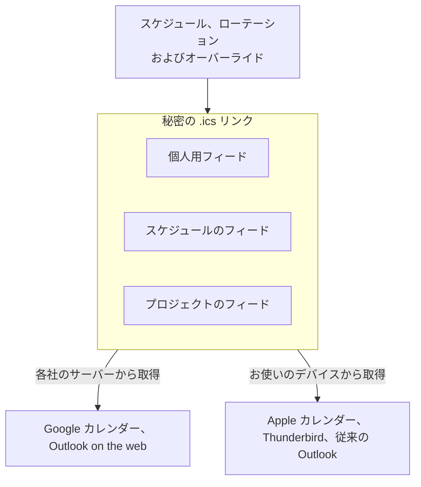

# カレンダーフィード

カレンダーフィードは、オンコールのシフトを普段見ているカレンダーに表示します。OneUptime は、各ユーザー、各スケジュール、各プロジェクトに秘密の iCalendar（`.ics`）リンクを発行します。Google カレンダー、Outlook、Apple カレンダー、Thunderbird など、URL でカレンダーを購読できるアプリならどれでも、このリンクを定期的に取得し、シフトごとに 1 件の予定を表示します。インストールするものも、接続するアカウントもありません。リンクがそのまま連携のすべてです。



> [!NOTE]
> 購読したカレンダーは **計画** のためのものです。カレンダーアプリはそれぞれのスケジュールでフィードを取得し直します。Google カレンダーは 8〜24 時間に 1 回しか取得しません。そのため、シフトの 1 時間前に行われた交代は、カレンダーではなく、OneUptime 自身のリマインダー、再割り当ての通知、呼び出しによって届きます。

## 得られるもの

- シフトごとに 1 件の予定。個人用フィードではタイトルが `On-call · <Schedule>` （スケジュールがちょうど 1 つのエスカレーションポリシーに紐づいている場合は ` · <Policy>` が付きます）、共有フィードでは `<Name> · On-call · <Schedule>` です。説明には、オンコール担当者、スケジュールとそのタイムゾーン、レイヤー、スケジュールのタイムゾーン・UTC・自分のタイムゾーンでのシフト時間、このスケジュールを通じて自分を呼び出すエスカレーションポリシー、ダッシュボードのスケジュールへのリンクが含まれます。
- オーバーライドが反映されます。誰かが代わりを務めると、予定はその人に移り（ `(covering for <Name>)` が付きます）、カレンダーアプリでは同じ予定のままなので、重複せずにその場で更新されます。一部だけのオーバーライドでは、シフトが隣り合う複数の予定に分かれます。
- 既定では過去 2 日分と今後 90 日分です。過去 60 日、今後 180 日まで広げられます。予定が 5,000 件を超えるフィードは短縮され、カレンダーの説明にその旨が表示されます。
- 予定は空き時間（ `TRANSP:TRANSPARENT` ）として示されるため、購読したフィードで予定が埋まることはありません。また非公開にはならないため、共有のチームカレンダーでは閲覧できる全員にタイトルが表示されます。
- 時刻は UTC で送られ、カレンダーアプリが変換します。説明には、スケジュールのタイムゾーンと自分のタイムゾーンでの時刻が書かれます。自分のタイムゾーンは **プロフィール** （ダッシュボード右上の自分の写真）の **タイムゾーン** で、スケジュールのタイムゾーンはその **レイヤー** ページの **スケジュールのタイムゾーン** カードで設定します。タイムゾーンのないスケジュールは、呼び出しと同じくサーバーのタイムゾーンで展開され、予定にその旨が表示されます。

固定の割り当て（エスカレーションポリシーのルールで直接指定されたユーザーやチーム）には開始も終了もないため、どのフィードにも表示されません。OneUptime Cloud では、フィードはオンコールスケジュールと同じプラン（Growth）に従います。そのプランに満たないプロジェクトでは、エラーではなく空のカレンダーが返されます。

## 3 種類のリンク

| リンク | 作成できる人 | 内容 | 場所 |
| --- | --- | --- | --- |
| **個人用フィード** | 各ユーザー、プロジェクトごとに 1 つ | そのプロジェクトのすべてのスケジュールでの自分のシフトと、誰かの代わりに担当するシフト（任意） | **ユーザー設定** > **カレンダー** > **カレンダーフィード** |
| **スケジュールのフィード** | スケジュールを編集できる人。読み取れる人はリンクをコピー可能 | 1 つのスケジュールの全員のシフトと、任意でカバレッジの空白の予定 | スケジュールのページの **このスケジュールを購読** カード |
| **プロジェクトのフィード** | オンコールスケジュールを編集できる人。読み取れる人はリンクをコピー可能 | プロジェクトのすべてのスケジュールの全員のシフトと、任意でカバレッジの空白の予定 | **オンコール** > **カレンダーフィード** |

リンクは次のような形です。

```text
https://<your host>/api/on-call-calendar/user/<token>/shifts.ics
https://<your host>/api/on-call-calendar/schedule/<token>/schedule.ics
https://<your host>/api/on-call-calendar/project/<token>/project.ics
```

> [!WARNING]
> パスに含まれる 43 文字のトークンが唯一の資格情報です。ログインも Cookie も API キーも使いません。これらのリンクはすべてパスワードと同じように扱ってください。

## 個人用フィード

個人用フィードはプロジェクトごとです。2 つ目のプロジェクトには、2 つ目のリンクと 2 つ目のカレンダーができます。

:::steps
### カレンダーフィードを開く

シフトを表示したいプロジェクトで **ユーザー設定** > **カレンダー** > **カレンダーフィード** を開きます。 **カレンダー** はサイドメニューのセクションで、最初は折りたたまれています。

### リンクを生成する

**カレンダーリンクを生成** をクリックします。 **オンコールシフトを購読** カードに、購読の手順が 1 つにまとめて表示されます。

- **カレンダーに追加**: **Google カレンダー** は Google カレンダーを開き、カレンダーを追加するかどうかを尋ねます。 **Apple カレンダー / Outlook** は、リンクの `webcal://` 形式を、コンピューターや電話が購読に使うアプリで開きます。Mac、iPhone、iPad では Apple カレンダー、Windows では Outlook です。
- **またはリンクをコピー**: **リンクをコピー** は、URL でカレンダーを購読できるその他のアプリ用に `https://` リンクをコピーします。リンクは、クリックして表示するまでページ上では隠されています。

### リンクを購読する

下の「カレンダーアプリで購読する」にある、お使いのアプリの手順に従ってください。アプリが次にリンクを取得したときに、シフトが予定として表示されます。「カレンダーの更新頻度」を参照してください。
:::

### フィードの設定

**カレンダーフィードの設定** カードの **設定を編集** をクリックすると、リンクに含める内容を変更できます。

| 設定 | 内容 |
| --- | --- |
| **他の人の代わりに担当するシフトを含める** | 既定でオン。普段はメンバーではないスケジュールで、オーバーライドによって担当することになったシフトを追加します。 |
| **過去のシフトを含める日数** | カレンダーに含める過去の範囲（既定は 2、最大 60）。 |
| **今後のシフトを含める日数** | カレンダーに含める今後の範囲（既定は 90、7〜180）。 |

ステータス行には、リンクが最後に取得された日時、取得したカレンダーアプリ、取得回数、リンクを区別できるようトークンの末尾 4 文字が表示されます。2 日たってもリンクが一度も取得されていない場合、ページはサーバーにインターネットから到達できるかを尋ねます（「トラブルシューティング」を参照）。

### リンクを管理する

| 操作 | 結果 |
| --- | --- |
| **リンクを再生成** | 新しいトークンを発行します。古いリンクを購読しているアプリはすべて更新されなくなります。30 日間は古いリンクが空のカレンダーを返してそれらのアプリにコピーを消去させ、その後は 404 を返します。新しいリンクで購読し直してください。 |
| **無効にする** | リンクは残しますが、再び有効にするまで空のカレンダーを返します。 |
| **削除** | リンクを削除します。まだ取得し続けているアプリは 404 を受け取り、最後に取得した内容を表示し続けます。空にしたい場合は、先に無効にしてください。 |

### 今後のシフトと代理

このページには、 **今後のシフト** （今後 30 日間）と、後述する **シフト前にリマインド** カードも表示されます。自分の各シフトには **代理を依頼** リンクがあります。シフトのプロジェクトでユーザーオーバーライドを開き、そのシフト用の新しいオーバーライドを入力済みの状態で表示します。自分が **誰が不在ですか？** に、シフトの時間が **開始** と **終了** に入るため（シフトがすでに始まっている場合は現在から）、残りは **誰が代理しますか？** だけです。オーバーライドは、その時間帯の自分への呼び出しを、すべてのオンコールポリシーから代理の人に送ります。1 つのポリシーの中にしかないシフトは、代わりにそのポリシーのユーザーオーバーライドのページで代理を設定します。自分が他の人の代わりに担当しているシフトには **代理を依頼** はありません。オーバーライドは連鎖しないため、代理の代理を立てても何も変わらないからです。

同じ個人用リンクを `?schedule=<id>` で 1 つのスケジュールに絞り込んだものが、各スケジュールのページに **このスケジュールの自分のシフトのみ** として表示されます。また、オンコールのバナーと **マイオンコールポリシー** ページには、上記のページへの **シフトをカレンダーに追加** リンクがあります。

### モバイルアプリ

モバイルアプリでは、 **On-Call** > **Add shifts to my calendar** （ **Settings** > **Calendar feed** にもあります）で、プロジェクトごとに 1 つのリンクがあります。iPhone では、 **Open in Calendar** で標準の購読シートが開きます。Android では電話上で URL を購読する方法がないため、画面には **Share link** と **Copy https link** が表示され、コンピューターでリンクを追加するよう案内されます。追加後、電話に同期されます。アプリの **Your shifts** 一覧は同じデータから作られ、同じ **Get cover** 操作があります。

## カレンダーアプリで購読する

アプリにボタンがある場合は、OneUptime の **Google カレンダー** または **Apple カレンダー / Outlook** を使います。その他のアプリには、 **リンクをコピー** で得られる `https://` リンクを使います。2 つの形式については、下の「https リンクと webcal リンク」で説明します。

:::tabs
@tab Google カレンダー
1. OneUptime で **Google カレンダー** をクリックします。Google カレンダーが開き、カレンダーを追加するかどうかを尋ねるので、 **追加** をクリックします。
2. または、ウェブ版 Google カレンダーで **他のカレンダー** の横の **+** > **URL で追加** をクリックし、リンク（OneUptime の **リンクをコピー** ）を貼り付けて **カレンダーを追加** をクリックします。

**Google カレンダー** ボタンは、Google の URL による追加ページ `https://calendar.google.com/calendar/r?cid=` の後に、リンクの `webcal://` 形式をパーセントエンコードしたものを続けて開きます。このページは `webcal://` 形式しか受け付けません。 `https://` 形式を渡すと、Google は "Unable to add calendar. Check the URL." と応答します。 **URL で追加** はどちらの形式も受け付けます。

Google はフィードを **Google のサーバーから** 取得するため、OneUptime のサーバーにはインターネットから到達できる必要があります。OneUptime Cloud は常に到達できます。セルフホストの場合は「トラブルシューティング」を参照してください。最初の取得は通常、購読から数分以内に行われます。その後 Google はおよそ 8〜24 時間ごとに更新し、それ以上かかることもあります。購読したカレンダーには更新ボタンがなく、Google はフィード内の更新のヒントを無視します。Google がリンクを読み取ると、フィードのページのステータス行に **最終取得 …（取得元: Google Calendar）** と表示されます。

カレンダーの名前とタイムゾーンが読み取られるのは **最初に購読したときだけ** です。後でスケジュールの名前を変えても、Google のカレンダー名は変わりません。名前が重要なら、削除して追加し直してください。Google はカレンダーファイルに含まれるリマインダーを破棄するため、Google の設定でそのカレンダーの既定の通知を設定するか、より良い方法として OneUptime 自身のリマインダーを使ってください。Google は読み取れなかったアドレスを記憶します。原因を解消したら、 `?nocache=1` を末尾に付けてリンクを追加し直すか（OneUptime は不明なクエリパラメーターを無視するため、フィード自体は変わりません）、リンクを再生成してください。Android と iOS の Google カレンダーアプリは URL で購読できません。コンピューターでリンクを追加すると、電話にも表示されます。
@tab Outlook on the web
1. **カレンダー** > **カレンダーを追加** > **Web から定期受信** を開きます。
2. `https://` リンク（OneUptime の **リンクをコピー** ）を貼り付け、カレンダーに名前を付けて **インポート** をクリックします。

Outlook.com、職場または学校アカウントの Outlook on the web、新しい Outlook for Windows、Outlook for Mac でも同じように動作します。Outlook は **Microsoft のサーバーから** 取得します。Outlook.com ではおよそ 3 時間ごと、職場または学校アカウントでは 4〜6 時間ごとで、1 日以上かかることもあります。間隔は固定で、手動での更新はできません。

カレンダーを電話や Outlook on the web にも表示したい場合は、デスクトップアプリではなくここで購読してください。従来の Outlook for Windows で作成した購読は、その PC にとどまります。
@tab 従来の Outlook for Windows
1. Outlook がインストールされている PC で、OneUptime の **Apple カレンダー / Outlook** をクリックします。Windows が `webcal://` リンクを Outlook に渡し、Outlook がインターネット予定表を追加するかどうかを尋ねます。Outlook がなければ、Windows には `webcal` のハンドラーがありません。
2. または Outlook で **ファイル** > **アカウント設定** > **アカウント設定** > **インターネット予定表** > **新規** を開き、リンク（OneUptime の **リンクをコピー** ）を貼り付けて **追加** をクリックします。

従来の Outlook では `https://…/shifts.ics` リンク自体を **開かないでください** 。一度きりのスナップショットがインポートされ、更新されません。 `webcal://` リンクを開くか、 **インターネット予定表** にアドレスを追加すると、購読が作成されます。

フィードは **送受信** で更新されます（F9、または送受信グループの間隔）。購読の設定には **更新の制限** チェックボックスがあり、オンにすると Outlook は発行者が提案する間隔より頻繁には更新しません。OneUptime は 1 時間（ `X-PUBLISHED-TTL:PT1H` ）を提案するため、フィードはおよそ 1 時間ごとに更新されます。このヒントがないフィードは、チェックボックスがオンの間は一切更新されません。OneUptime のフィードにはヒントがあるので、オンのままで構いません。従来の Outlook はフィードを **お使いの PC から** 取得し、サーバーの証明書を検証します。
@tab Apple カレンダー（macOS）
1. OneUptime で **Apple カレンダー / Outlook** をクリックするか、カレンダーで **ファイル** > **新規カレンダー照会** を選んでリンクを貼り付けます。
2. 購読シートで **自動更新** を設定し（5 分、15 分、1 時間、1 日、1 週間ごと。既定は 1 時間ごと）、 **場所** で **iCloud** を選びます。こうするとカレンダーが iPhone と iPad にも表示され、そのスケジュールで更新され続けます。

macOS はフィードを **お使いの Mac から** 取得するため、Mac から到達できる限り、プライベートネットワーク上のインストールでも動作します。自己署名証明書や社内 CA の証明書は、先に macOS のキーチェーンで信頼しておく必要があります。このシートでは **通知を削除** が既定でオンになっていますが、フィードにアラームは含まれないため、ここでは影響しません。
@tab iPhone と iPad
デバイス上で購読するには、OneUptime モバイルアプリで **Open in Calendar** をタップするか、 **設定** > **カレンダー** > **アカウント** > **アカウントを追加** > **その他** > **照会するカレンダーを追加** に進んでリンクを貼り付けます。

デバイス自体で作成した購読は、 **設定** > **カレンダー** > **アカウント** > **データの取得方法** に従って更新されます。既定は **自動** で、主に Wi-Fi に接続して充電している間に取得します。確実に更新したい場合は、場所を **iCloud** にして Mac で購読するか、 **データの取得方法** を固定の間隔に設定してください。
@tab Thunderbird
**ファイル** > **新規作成** > **カレンダー** > **ネットワーク上** > **iCalendar (ICS)** を選び、 `https://` リンクを貼り付けて、カレンダーのプロパティで更新間隔を選びます（1、5、15、30、60 分）。Thunderbird は **お使いのコンピューターから** 取得するため、サーバーの証明書を信頼している必要があります。
@tab Android
Google カレンダーアプリも Samsung カレンダーも URL を購読できません。コンピューターで Google カレンダーに `https://` リンクを追加すると（ **他のカレンダー** > **+** > **URL で追加** ）、カレンダーはその Google アカウントの他のデータとともに電話に同期されます。Android の OneUptime モバイルアプリには、まさにこのための **Share link** と **Copy https link** があります。
@tab その他のサービス
Fastmail はおよそ 1 時間ごとに更新し、 **取得に 5 回続けて失敗すると購読を無効にします** 。そうなった場合は、サーバーが正常に戻ってから追加し直してください。Proton Calendar は 4〜16 時間ごとに更新し、非常に大きなフィードは拒否します。拒否された場合は **今後のシフトを含める日数** を減らしてください。Confluence Team Calendars はスケジュールのフィードを受け付けます。カレンダー名の 28 文字の上限は守られます。
:::

## カレンダーの更新頻度

| カレンダーアプリ | 一般的な更新間隔 | 取得元 | 備考 |
| --- | --- | --- | --- |
| Google カレンダー（URL で追加） | 8〜24 時間、それ以上のことも | Google のサーバー | 手動更新なし。更新のヒントを無視。名前とタイムゾーンは最初の購読時にのみ読み取り |
| Outlook.com | 約 3 時間 | Microsoft のサーバー | 固定。24 時間を超えることも |
| Outlook on the web（職場、学校） | 約 4〜6 時間 | Microsoft のサーバー | 固定。ユーザーは変更不可 |
| 従来の Outlook for Windows | 送受信時。 **更新の制限** ありで約 1 時間ごと | お使いの PC | `webcal` リンクで購読。電話やウェブには同期されない |
| Apple カレンダー（macOS） | 5 分〜1 週間、既定は 1 時間ごと | お使いの Mac | iCloud に保存すると iPhone と iPad にも反映 |
| Apple カレンダー（iOS のみ） | **データの取得方法** による。バッテリーに左右される | お使いの電話 | 確実にするには Mac で購読 |
| Thunderbird | 1〜60 分 | お使いのコンピューター | |
| Fastmail | 約 1 時間ごと | Fastmail のサーバー | 取得に 5 回失敗すると無効化 |
| Proton Calendar | 4〜16 時間 | Proton のサーバー | 大きなフィードは拒否 |

OneUptime 自体は常に最新のデータを返します。レイヤー、ローテーション、オーバーライド、ポリシーへの紐づけを変更するとフィードはすぐに無効化され、応答のキャッシュは最大 5 分です。待たされるのはカレンダーアプリの都合で、サーバーの都合ではありません。OneUptime は `REFRESH-INTERVAL` と `X-PUBLISHED-TTL` で 1 時間ごとの更新を提案しますが、このヒントに従うのは従来の Outlook だけで、それも **更新の制限** がオンのときだけです。Apple カレンダー、Thunderbird などは、カレンダーごとに設定した間隔で更新します。

## https リンクと webcal リンク

どちらも同じフィードを指します。 `webcal://` はスキームの名前だけを変えたリンクで、オペレーティングシステムがブラウザーではなくカレンダーアプリを開くようにするためのものです。アプリはその後、サーバーが https で提供していれば `https://` でフィードを取得します。Apple カレンダーと Google カレンダーはそうします。

- **リンクをコピー** は `https://` 形式を返します。Google カレンダーの **URL で追加** 、Outlook on the web、Thunderbird、Fastmail はこの形式を受け付けます。
- **Apple カレンダー / Outlook** は `webcal://` 形式を開きます。Apple カレンダーと従来の Outlook for Windows はこの形式から購読します。従来の Outlook で代わりに `https://` 形式を開くと、一度きりのインポートになります。
- **Google カレンダー** は、Google の URL による追加リンクに `webcal://` 形式を含めます。そのページが受け付ける唯一の形式です。
- OneUptime は `webcals://` を発行しなくなりました。iOS では開けず（「アドレスが無効です」）、Google も受け付けません。すでに `webcals://` リンクで購読しているカレンダーは引き続き動作します。
- インストールがまだプレーンな `http` で動いている場合、フィードはトークンも含めて平文で取得され、ダッシュボードのリンクの横に警告が表示されます。リンクを広く共有する前に `https` に切り替えてください。

フィードの URL はリダイレクトしません。OneUptime に届いたスキームが何であっても `200` を返します。TLS が手前で終端される場合（OneUptime Cloud や、独自のロードバランサーまたは CDN の背後）、アプリはカレンダーアプリがどのスキームを使ったかを判別できず、そこでリダイレクトすると同じ URL に戻ってしまうからです。プレーンな `http` から `https` への転送は、TLS を終端するプロキシ（それを知っている唯一のホップ）で行ってください。

## リマインダーと再割り当ての通知

カレンダーアプリは購読したフィードのアラームを届けません。Google は破棄し、Apple は既定で取り除き、Outlook は平坦化します。そのため OneUptime は独自にリマインダーを送ります。

:::steps
1. **ユーザー設定** > **カレンダー** > **カレンダーフィード** を開きます。
2. **シフト前にリマインド** カードで、事前に通知するタイミングを選びます: **1 週間** 、 **1 日** 、 **1 時間** 、 **15 分** 、または **カスタム** で 15 分から 14 日までの任意の値。複数同時に選べます。
3. リマインダーの受け取り方は、 **ユーザー設定** > **通知設定** （オンコールタブ）の **オンコールシフト開始前** で選びます。メールとプッシュが既定でオンです。
:::

各リマインダーはシフトごとに 1 回送られます。メッセージには、スケジュール、それを通じて呼び出すポリシー、自分のタイムゾーンでの開始時刻が含まれます。

- 遅れて設定されたオーバーライドによって、シフトがリマインドのタイミングの内側に入った場合（誰かが開始 20 分前にシフトを渡してきた場合など）は、すぐに 1 回だけ遅れてリマインダーが送られます。
- リマインドを受けたシフトが他の人に渡ると、 **今後のオンコールシフトが再割り当てされた** が届きます。別のイベントの種類なので、これだけを消音できます。
- シフトが始まった後にリマインダーが送られることはなく、どのエスカレーションポリシーにも紐づいていないスケジュールについても送られません。そうしたスケジュールは誰も呼び出せないからです。
- WhatsApp では、リマインダーは Meta が事前承認したオンコールのテンプレートで届きます。このテンプレートはスケジュールとエスカレーションポリシーを示してスケジュールにリンクしますが、開始時刻は含まず、WhatsApp は英語でしか配信しません。再割り当ての通知には承認済みの WhatsApp テンプレートがないため、代わりに他のチャネルで届きます。

## スケジュールまたはプロジェクトの共有リンク

共有リンクはコピーした人ではなく **プロジェクト** に属し、人の名前は表示しますが、メールアドレスは決して表示しません。スケジュールのリンクを共有のチームカレンダー（Google、Outlook、Confluence）に追加すれば、1 つの購読でチーム全体をカバーできます。

### スケジュールのフィード

スケジュールのページの **このスケジュールを購読** カードは 2 つに分かれています。 **このスケジュールの自分のシフトのみ** （スケジュールで絞り込んだ個人用リンク）と **このスケジュールの全員のシフト（チーム共有リンク）** です。スケジュールに **編集** 権限を持つ人は **共有リンクを公開** を使えるほか、 **リンクを再生成** でリンクを更新したり、 **無効にする** で無効にしたりできます。スケジュールを読み取れる人はリンクをコピーできます。カードには、リンクが最後に更新された日時が表示されます。

### プロジェクトのフィード

**オンコール** > **カレンダーフィード** には **このプロジェクトの全員のシフト（共有リンク）** カードがあります。プロジェクトのすべてのスケジュールをカバーする 1 つの共有リンクで、公開、再生成、無効化の同じ操作と、個人用フィードのページへのリンクがあります。

### 共有リンクの設定

**共有リンクの設定** カードの **設定を編集** をクリックします。

| 設定 | 内容 |
| --- | --- |
| **カバレッジの空白を表示** | 既定でオフ。レイヤーが担当する _はず_ なのに誰もオンコールでない時間に、 `No coverage · <Schedule>` という予定を追加します。空のレイヤー、開始日が未来のレイヤー、かみ合わないレイヤー、24 時間 365 日（24×7）のスケジュールのあらゆる空白が対象です。業務時間のスケジュールの業務時間外は報告されず、空白の予定は古い順に最大 100 件までです。 |
| **表示する最小の空白（分）** | 既定は 60。これより短い空白は表示しません。 |
| **誰かがプロジェクトを離れたら再生成** | 既定でオフ。誰かがプロジェクトの最後のチームを離れたときにリンクを自動的に再生成し、元同僚のカレンダーが更新されないようにします。その後は他の全員が購読し直す必要があるため、オプトインになっています。 |
| **過去のシフトを含める日数** 、 **今後のシフトを含める日数** | 個人用フィードと同じです。 |

リンクを持っていた人が離れたときは共有リンクを更新するか、上の自動更新をオンにしてください。

誰かがプロジェクトの最後のチームを離れると、OneUptime はその人をそのプロジェクトのスケジュールレイヤーとエスカレーションルールから削除し、その人を指定しているプロジェクトの有効なオーバーライドと今後のオーバーライド（代わってもらう側としても代わりを務める側としても）を削除し、そのプロジェクトの個人用フィードを無効にし、そこでのリマインダーを削除します。個人用リンクは、所有者がプロジェクトのメンバーである間だけシフトを表示します。これはリンクが取得されるたびに確認されるため、離れた人には空のカレンダーが返され、モバイルアプリの今後のシフト一覧には、その人がまだメンバーであるプロジェクトだけが含まれます。

## 予定の詳細

- 各シフトには、スケジュールとシフトの開始時刻から作られる固定の ID があります。そのため同じシフトは、個人用フィードでもスケジュールのフィードでも、リンクを再生成した後でも同じ予定です。カレンダーアプリはその場で更新し、変更があると予定のシーケンス番号が上がります。
- シフト全体を入れ替えるオーバーライドは予定を保ったまま担当者を変えます。シフトの一部を代わるオーバーライドは、隣り合う 3 件の予定を作ります。たとえば A 09:00–12:00、B 12:00–13:00、A 13:00–17:00 です。
- スケジュールが 2 つ以上のエスカレーションポリシーに紐づいていて、オーバーライドがそのうち 1 つにだけ適用される場合、呼び出される人はポリシーごとに異なります。フィードはこれを隠さずに示します。シフトは他のポリシーが呼び出す人の予定として残り、別の人を呼び出すポリシー名を記した注記が付きます。代理の人には `On-call · <Schedule> · <Policy> (covering for <Name>)` というタイトルの予定が追加されます。
- 過去のシフトの説明には "Past shifts reflect the current rotation, not who was actually paged" という一文が入ります。
- どのエスカレーションポリシーにも紐づいていないスケジュールも表示され、誰も呼び出さないという注記が付きます。

## 監査ではなく計画のために

フィードは過去の日も含め、ローテーションを **現在の設定のとおりに** 表示します。後から入力したオーバーライドは、カレンダーの履歴を書き換えます。実際にオンコールで過ごした時間、公平性の確認、手当の計算には、ページャーが実際に行ったことに基づく **オンコール** > **レポート** > **ユーザーのオンコール時間** を使ってください。

## セキュリティ

- リンク内のトークンが唯一の資格情報です。リンクを持っている人は誰でも、再生成されるまでシフト（名前、スケジュール、ポリシー）を見られます。チャットルームやチケットにリンクを貼らないでください。チームにカレンダーが必要な場合は、個人用ではなくスケジュールまたはプロジェクトのリンクを共有してください。
- リンクはプロジェクトごとです。個人用リンクが漏れても、公開されるのは 1 つのプロジェクトのシフトだけで、所属するすべてのプロジェクトではありません。
- リンクを再生成すると、古いトークンは 30 日間の猶予期間に入ります（空のカレンダー、その後 404）。 **無効にする** は空のカレンダーを返します。不明なリンクや期限切れのリンクは、手がかりのない 404 を返します。空のカレンダーを受け取った購読アプリはコピーを消去し、404 を受け取ったアプリはコピーを残します。無効化と再生成が空のカレンダーを返すのはこのためです。
- トークンはハッシュ化して保存され、設定ページに表示されるコピーは `ENCRYPTION_SECRET` で暗号化されます。セルフホストのインストールでは、この変数に本物のシークレットを設定してください。未設定の場合や、このリポジトリに含まれるプレースホルダー（ `secret` 、または `config.example.env` が設定する `please-change-this-to-random-value` ）のままの場合、サーバーは起動時に警告します。後で変更すると、保存されたコピーを読めなくなるため、ページに **リンクを再生成** が表示されます。再生成するまでフィードは動作し続けます。
- フィードの応答には `Cache-Control: private` が付き、検索エンジンからは除外され（ `X-Robots-Tag: noindex` ）、リンクごと、クライアントのアドレスごとにレート制限されます。

OneUptime 自身の Nginx は、フィードへのリクエストをログに残しません。

```nginx title="default.conf.template"
location ~ ^/api/on-call-calendar/(user|schedule|project)/ {
    access_log off;
    error_log /dev/null crit;
    proxy_max_temp_file_size 0;
    ...
}
```

そのため、トークンがクライアントのアドレスと並んでログファイルに記録されることはありません。アプリケーションもトークンを記録しません。 `access_log off` はリクエストごとの行を除き、 `error_log` はアップストリームからの取得に失敗したときに Nginx が書く行を除きます（これがないと、再起動中に取得したすべてのクライアントのトークンが記録されます）。 `proxy_max_temp_file_size 0` は、大きなフィードが一時ファイルに書き出されないようにします。

> [!WARNING]
> **OneUptime の手前で動かしているプロキシ、WAF、CDN は、ログを残さないよう設定しない限り、アクセスログとエラーログに完全な URI を記録します。** フィードを展開する前に確認してください。

## セルフホストの設定

有効にする必要があるものはありません。フィードはどのインストールでも動作します。4 つの環境変数で制御でき、Docker Compose では `config.env` に、Helm では values の `onCallCalendarFeed` の下に設定します（チャートの [設定リファレンス](https://github.com/OneUptime/oneuptime/blob/master/HelmChart/Public/oneuptime/docs/configuration.md#on-call-calendar-feeds) を参照）。

| 変数 | Helm の値 | 既定値 | 効果 |
| --- | --- | --- | --- |
| `DISABLE_ON_CALL_CALENDAR_FEED` | `onCallCalendarFeed.disabled` | `false` | 緊急停止スイッチ。すべてのフィード URL が `Retry-After: 3600` 付きの `503` を返します。購読アプリは手元のコピーを保ち、後で再試行します。何も削除されません。 |
| `ON_CALL_CALENDAR_FEED_RATE_LIMIT_WINDOW_SECONDS` | `onCallCalendarFeed.rateLimit.windowSeconds` | `60` | レート制限のウィンドウの長さ。 |
| `ON_CALL_CALENDAR_FEED_RATE_LIMIT_PER_TOKEN_PER_WINDOW` | `onCallCalendarFeed.rateLimit.perTokenPerWindow` | `60` | 1 つのリンクを 1 つのクライアントアドレスから取得できる、ウィンドウあたりの回数。 |
| `ON_CALL_CALENDAR_FEED_RATE_LIMIT_PER_IP_PER_WINDOW` | `onCallCalendarFeed.rateLimit.perIpPerWindow` | `3000` | 1 つのクライアントアドレスがすべてのリンクにわたって取得できる、ウィンドウあたりの回数。1 つのアドレスの背後にいるオフィス全体の上限です。 |

その他の関連事項:

- **`HOST` と `HTTP_PROTOCOL`** からリンクが作られます。 `HOST` が空か `localhost` の場合、または `HTTP_PROTOCOL` が `http` の場合、フィードのページに警告が表示され、リンクは外部から機能しません。 `HOST` がプライベートアドレス（ `10.x` 、 `172.16–31.x` 、 `192.168.x` 、コンテナー名のようなドットのない名前、または `.internal` 、 `.local` 、 `.lan` などの下の名前）の場合、ページには Google カレンダーと Outlook on the web がリンクに到達できないと表示されます。同じネットワーク内のコンピューター上のアプリからは引き続き到達できます。
- **`TRUSTED_PROXY_HOPS`** は、アドレスごとの制限でどのアドレスを数えるかを決めます。既定値の `1` は、標準の Docker Compose と Helm の構成に適しています。 `X-Forwarded-For` に追記する独自のプロキシ（CDN、WAF、ロードバランサー）ごとに 1 を加えてください。そうしないと、すべてのカレンダークライアントが同じアドレスに見え、1 つの枠を共有してしまいます。チャートのドキュメントの [Trusted proxies](https://github.com/OneUptime/oneuptime/blob/master/HelmChart/Public/oneuptime/docs/configuration.md#trusted-proxies) を参照してください。
- **Redis** はキャッシュとレート制限を支えます。どちらも穏やかに縮退します。Redis がなくてもフィードは遅くなるだけで生成され、レート制限はリクエストを通します。
- Helm チャートの分割モード（ `worker.enabled: true` ）では、フィードは API 層で生成されます。毎正時に集中するカレンダークライアントに合わせて、その層の規模を決めてください。
- 上記の Nginx アクセスログの除外は、同梱の `packages/Nginx/default.conf.template` に含まれています。テンプレートをカスタマイズする場合も残してください。

## トラブルシューティング

:::details Google カレンダーに "Unable to add calendar. Check the URL." と表示される
古いバージョンの OneUptime は、 **Google カレンダー** ボタンにリンクの `https://` 形式を入れていましたが、Google の URL による追加ページは `webcal://` 形式しか受け付けません。フィードのページを再読み込みして、もう一度 **Google カレンダー** をクリックするか、 **他のカレンダー** > **+** > **URL で追加** でリンクを追加してください。
:::

:::details Google カレンダーにカレンダーは表示されるがシフトがない
まずフィードのページのステータス行を確認してください。 **最終取得 …（取得元: Google Calendar）** と表示されていれば、Google はリンクを読み取っています。ブラウザーでリンクを開き、何が返されるかを確認してください。空のカレンダーなら、 `X-WR-CALDESC` に理由が記載されています（下の「カレンダーが空」を参照）。

**まだ取得されていません** は、Google がリンクを読み取れなかったことを意味します。ネットワーク外のマシンから `curl -sI <link>` を実行したとき、すぐに `Content-Type: text/calendar` 付きの `200` が返る必要があります。OneUptime の手前にあるリダイレクト、ログインページ、ファイアウォール、ボットチェックは、Google の取得を妨げます。古いバージョンの OneUptime では、 `PROVISION_SSL=true` で TLS が Nginx の手前で終端されるインストールで、リダイレクトのループも同じ問題を起こしていました。 `200` が返るようになったら、 `?nocache=1` を末尾に付けてリンクを追加し直し、Google に新しく読み取らせてください。
:::

:::details リンクが一度も取得されない、または「URL を取得できませんでした」と表示される
Google カレンダー、Outlook on the web、Fastmail、Proton は **自社のサーバーから** 取得するため、OneUptime のホストには、それらが信頼する証明書で、公開インターネットから到達できる必要があります。プライベートネットワーク上、VPN の背後、または社内の認証局を使うインストールには、何を貼り付けても到達できません。

Apple カレンダー、Thunderbird、従来の Outlook はデバイスから取得するため、デバイスがダッシュボードを開ける場所ならどこでも動作します（自己署名の場合は、そのデバイスで証明書を信頼した後）。フィードのページのステータス行で、リンクがすでに取得されたかどうかがわかります。ネットワーク外からリンクに対して `curl -I` を実行するのが、最も手早い確認方法です。

```bash
curl -I "https://<your host>/api/on-call-calendar/user/<token>/shifts.ics"
```

OneUptime からプライベートネットワークに _到達_ できるようにすること（ [プライベートネットワークアクセス](/docs/self-hosted/private-network-access) ）は別の話で、ここでは役に立ちません。
:::

:::details カレンダーが古い
まず更新頻度の表を確認してください。Google の遅れは正常です。Google にもう一度読み取らせるには、カレンダーを削除して追加し直すか、リンクに `?nocache=1` を付けます（不明なパラメーターは無視されるためフィードは変わりませんが、Google は新しいものとして扱います）。従来の Outlook では F9 を押し、 **更新の制限** の設定を確認してください。Apple カレンダーでは **表示** > **カレンダーを更新** を使います。当日の変更が重要なら、カレンダーではなく OneUptime のリマインダーと再割り当ての通知に頼ってください。
:::

:::details カレンダーが空
空のカレンダーは意図的なものです。リンクが無効になっている、再生成後 30 日間の猶予期間内にある古いリンクである、プロジェクトがオンコールスケジュールを含むプランに満たない、またはそのプロジェクトのどのスケジュールにも含まれなくなった、のいずれかです。ブラウザーでリンクを開くと、カレンダーの説明（ `X-WR-CALDESC` ）に理由が記載されています。プロジェクトを離れた場合、リンクは空のままです。リンクは、あなたがメンバーである間だけシフトを表示します。
:::

:::details リンクが 404 を返す
リンクが不明、削除済み、または猶予期間が終了しています。新しいリンクを生成して購読し直してください。
:::

:::details リンクが 503 を返す
`DISABLE_ON_CALL_CALENDAR_FEED` が設定されているか、サーバーが混み合っています。同時に生成されるフィードは数件までで、展開に非常に時間がかかるスケジュールは途中で打ち切られます。以前のフィードのコピーがあれば、サーバーは代わりにそれを `Warning: 110` ヘッダー付きで返します。そのため 503 は、代わりに返せるものがなかったことを意味します。クライアントは最後のコピーを保ち、 `Retry-After` の間隔の後に再試行します。Fastmail は 5 回続けて失敗すると購読を無効にするため、サーバーが正常に戻ったら追加し直してください。 `oncall_calendar_render_duration_ms` メトリクスで、運用担当者はどのフィードが遅いかを確認できます。
:::

:::details 429 または "too many requests"
1 つのアドレスの背後にある多数のクライアント（オフィスの NAT、VPN ゲートウェイ）は、アドレスごとの枠を共有します。 `ON_CALL_CALENDAR_FEED_RATE_LIMIT_PER_IP_PER_WINDOW` を引き上げ、 `TRUSTED_PROXY_HOPS` を確認してください。値が小さすぎると、すべてのクライアントが自分のプロキシのものとみなされ、1 つの枠を共有することになります。
:::

:::details Apple カレンダー、Thunderbird、Outlook で証明書エラーが出る
これらのアプリはデバイス上で TLS を検証します。社内 CA をデバイスの信頼ストア（macOS のキーチェーン、Windows の証明書ストア、Thunderbird の証明書マネージャー）にインポートするか、公的に信頼された証明書を使ってください。Google や Microsoft のようなサーバー側の取得元に、プライベート CA を信頼させることはできません。
:::

:::details 時刻が正しくない
ファイル内の時刻はすべて UTC で、カレンダーアプリが自分のタイムゾーンに変換します。シフトが一定の時間だけずれて見える場合は、スケジュールのタイムゾーン（その **レイヤー** ページの **スケジュールのタイムゾーン** ）と自分のタイムゾーン（ **プロフィール** の **タイムゾーン** ）を確認してください。タイムゾーンのないスケジュールはサーバーのタイムゾーンで展開され、予定にその旨が表示されます。
:::

:::details フィードが短縮されたと表示される
期間内に 5,000 件を超える予定がありました。 **今後のシフトを含める日数** を減らすか、プロジェクト全体ではなく **このスケジュールの自分のシフトのみ** を購読してください。
:::

:::details Google に古いカレンダー名が表示される
Google は最初の購読時にしか名前を読み取りません。カレンダーを削除して追加し直してください。
:::

:::details 設定ページにリンクの再生成が必要と表示される
リンクの作成後に `ENCRYPTION_SECRET` が変更されたため、サーバーがリンクを表示できなくなっています。既存の購読は動作し続けます。再生成すると、もう一度コピーできるリンクが得られ、古いリンクは 30 日後に廃止されます。
:::

:::details フィードにシフトがない
表示されるのはスケジュールのシフトだけです。ポリシーのルールでユーザーやチームを直接割り当てた場合は固定の割り当てで、予定はありません。オーバーライドで他の人が引き受けたシフトは、その人のフィードに移るため、自分のフィードからは消えます。メンバーではないスケジュールでオーバーライドによって担当することになったシフトを表示するには、 **他の人の代わりに担当するシフトを含める** をオンにしてください。
:::

## 次のステップ

:::cards
- [オンコールスケジュール](/docs/on-call/schedules): フィードに表示されるローテーションを設定します。
- [スケジュールタイムライン](/docs/on-call/schedule-timeline): ダッシュボードですべてのスケジュールを並べて確認します。
- [エスカレーションルール](/docs/on-call/escalation-rules): スケジュールをポリシーに紐づけて、シフトの担当者を呼び出せるようにします。
:::
