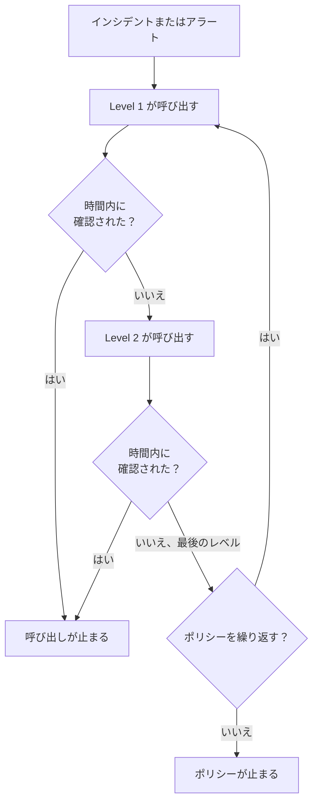
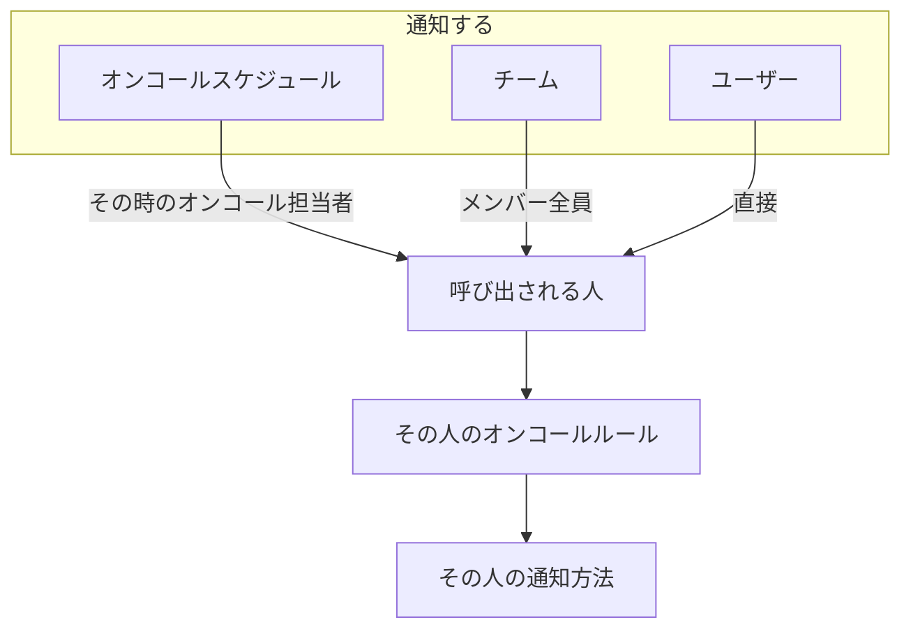

# エスカレーションルール

オンコールポリシーは、レベルごとに人を呼び出します。各エスカレーションルールが 1 つのレベルで、誰を呼び出すか、そして次のレベルを呼び出す前に誰かが確認するのをどれだけ待つかを決めます。ポリシーのルールは、その **エスカレーションルール** ページに順番に表示されます。



:::cards
- [最初に呼び出す相手](#最初に呼び出す相手): 最初のレベルを持つポリシーを作成します。
- [エスカレーションルールを追加する](#エスカレーションルールを追加する): 次のレベルを順を追って追加します。
- [レベルが人を呼び出す仕組み](#レベルが人を呼び出す仕組み): タイミング、繰り返し、各人への連絡方法。
- [API と Terraform](#api-または-terraform-でルールを作成する): ポリシーとルールをコードとして作成します。
:::

## 最初に呼び出す相手

**オンコールポリシー** ページでオンコールポリシーを作成すると、フォームは **名前** と **最初に誰に通知しますか？** を尋ねます。この質問は **通知する** と同じピッカーを使い、オンコールスケジュール、チーム、ユーザーを必要なだけ選べます。選んだ相手はポリシーの最初のエスカレーションルール **Level 1** になり、次のレベルを呼び出す前に確認を **30 分** 待ちます。

:::steps
1. **オンコール** > **オンコールポリシー** に移動し、 **オンコールポリシーを作成** をクリックします。
2. **名前** を入力します。
3. **最初に誰に通知しますか？** で **対応者を追加** をクリックし、最初に呼び出すオンコールスケジュール、チーム、ユーザーを選びます。
4. **オンコールポリシーを作成** をクリックします。作成したポリシーはその **エスカレーションルール** ページで開き、そこでレベルを追加できます。
:::

**最初に誰に通知しますか？** は省略できます。空のままにすると、ポリシーはエスカレーションルールなしで作成されます。ルールを追加するまで誰も呼び出さず、概要にもそう表示されます。説明とラベルは **その他の項目** の下にあります。この質問は、エスカレーションルールを追加できる人にだけ表示されます。

## エスカレーションルールを追加する

:::steps
### ポリシーのエスカレーションルールを開く

オンコールポリシーを開き、サイドメニューで **エスカレーションルール** を選んで **エスカレーションルールを追加** をクリックします。ダイアログは短い 1 ページです。

### 通知する相手を選ぶ

**通知する** で **対応者を追加** をクリックし、検索して、このレベルで呼び出すオンコールスケジュール、チーム、ユーザーを必要なだけ選びます。少なくとも 1 つ追加してください。

| 対応者 | レベルが実行されたときに呼び出される人 |
| --- | --- |
| **オンコールスケジュール** | レベルが実行された時点でそのスケジュールのオンコール担当者。固定の人ではありません。 |
| **チーム** | チームのメンバー全員。 |
| **ユーザー** | その人に直接。 |

### 待ち時間を設定する

**エスカレーションまでの時間（分）** は、次のレベルを呼び出す前に確認をどれだけ待つかです。初期値は **30 分** です。レベルに合わせて変更してください。

### 必要ならルールに名前を付ける

それ以外の項目はすべて **その他の項目** の下にあり、開くまでは折りたたまれています。

- **名前**: 省略可能です。名前を付けないルールはレベルにちなんだ名前になります。ポリシーの最初のルールは **Level 1**、2 番目は **Level 2** というようになります。名前の欄には、ルールに付く名前が表示されます。
- **説明**: 省略可能なメモです。たとえば、このレベルが誰をなぜ呼び出すのかを書きます。

折りたたまれている間、 **その他の項目** の見出しには 2 つの項目名と、ルールに設定済みのもの（説明や独自の名前）が表示されます。

### ルールを作成する

**ルールを作成** をクリックします。ルールは他のルールの下に、ポリシーの次のレベルとして追加されます。
:::

## レベルが人を呼び出す仕組み

インシデントやアラートがポリシーに届くと、 **Level 1** がすぐに対応者を呼び出します。待ち時間内に誰も確認しなければ **Level 2** が呼び出され、以降も一覧の下へと続きます。最後のレベルの待ち時間が確認なしで過ぎると、ポリシーの **繰り返しポリシー** （ルールの下にあります）が繰り返すよう指定していれば、許可された回数だけ **Level 1** からやり直し、そうでなければ止まります。インシデントやアラートを確認または解決すると、どのレベルでも呼び出しは止まります。

すでに確認済みまたは解決済みの状態で作成されたインシデント、アラート、エピソード（後から記録したもの）は、どのポリシーも実行しません。誰も呼び出されず、そのフィードにポリシー名とともにその旨が記録されます。 [確認済みまたは解決済みの状態で宣言されたインシデント](/docs/incidents/declaring-incidents#確認済みまたは解決済みの状態で宣言されたインシデント) を参照してください。

ポリシーを繰り返すには、 **繰り返しポリシー** カードの **編集** をクリックし、 **誰も確認しない場合に繰り返す** をオンにして **繰り返し回数** を設定します。

### エスカレーションの概要

**エスカレーションルール** ページの上部にある概要には、はしご全体が表示されます。各レベルがいつ呼び出されるか、誰を呼び出すか、最後のレベルの後に何が起きるかです。対応者の全員を呼び出せないレベルは、カードにその旨が表示されます。ラベルをクリックすると、誰がなぜ呼び出せないのかがわかります。

### 各人への連絡方法

レベルが呼び出す各人には、その人自身のオンコールルールに従って連絡します。 **ユーザー設定** > **オンコールルール** には、インシデント、インシデントエピソード、アラート、アラートエピソードごとのタブがあり、重大度ごとのカードに、どの通知方法をどれだけ経過後に試すかが表示されます。プロジェクト管理者は、 **ユーザー** > メンバー > **オンコールルール** でメンバーのルールを確認、変更できます。



ある人に有効なユーザーオーバーライドがあると、その人への呼び出しは代わりを務める人に送られます。

どのメッセージもプロバイダーが受け付ける形で送られるため、呼び出しは必ず送信されます。各チャネルで送れる量は次のとおりです。

| チャネル | 送れる最長のメッセージ |
| --- | --- |
| SMS | 1,600 文字 |
| 電話 | Twilio の 4,000 文字の通話スクリプトに収まる分 |
| プッシュ通知 | 4 KB（そのうちタイトル、本文、データで最大 3 KB） |
| WhatsApp | 1,024 文字 |
| Telegram | 4,096 文字 |

それより長いメッセージ（長いタイトルや、テンプレートが差し込んだ長い説明を含むもの）は切り詰められ、全文は OneUptime にあるという注記で終わります: "… (truncated — see OneUptime for the full text)"。WhatsApp メッセージの文面は固定のテンプレートなので、代わりに最も長い値が切り詰められ、それぞれ "…" で終わります。メッセージ内のリンクが切り詰められることはありません。

### 呼び出しが送信されない場合

送信されなかった呼び出しは、その人の **オンコールログ** （ユーザー設定）に理由が表示されます。行には **エラー** と表示され、ステータスメッセージに理由が示されます。 **Sending** のまま残ることはありません。メッセージは次のいずれかを伝えます。

- プロジェクトの残高で支払えなかったこと、そして残高を追加できる人;
- プロジェクトでチャネルがオフになっていること、そしてオンにできる人。

プロジェクトのオーナーには、残高が補充されるかチャネルが再びオンになるまでの間に、この件のメールが 1 回送られます。

OneUptime Cloud では、SMS、通話、WhatsApp、Telegram のメッセージはそれぞれ **プロジェクト設定 > 通知 > 通知設定** にあるプロジェクトの残高から支払われます。プロバイダーがメッセージを受け付けた時点で、正確な費用が残高から差し引かれます。同時に送られるメッセージの数は関係ありません。

- そこで **自動チャージ** がオンになっていると、残高がしきい値を下回っているのを見つけたメッセージが、まず自動チャージに設定された金額を追加し、プロジェクトのカードに請求します。同じ瞬間に残高不足を見つけたメッセージは、カードに 1 回だけ請求します。
- その請求が失敗した場合（支払い方法がない、またはカードが拒否された場合）、自動チャージは 1 時間後にもう一度カードを試し、それまで **通知設定** の上部にその旨が表示されます。手動で残高を追加するか、自動チャージを保存し直すと、すぐに再試行されます。
- 自動チャージがカードに請求できない間も、呼び出しは残りの残高で送られ続けます。

> [!IMPORTANT]
> 新しいプロジェクトでは、SMS、電話、WhatsApp、Telegram はオフになっています。OneUptime Cloud ではすべてのメッセージがプロジェクトの残高から支払われ、セルフホストのインストールでは先に Twilio アカウントか Telegram ボットの設定が必要だからです。チャネルがオフの間は、プロジェクトの誰もそのチャネルの通知方法を追加できません。チャネルをオンにできるのは、プロジェクトのオーナー、 **Billing Admin** 、または **Manage Billing** 権限を持つ人だけで、 **プロジェクト設定 > 通知 > 通知設定** の **通知チャネル** カードで行います。プロジェクト管理者にはできません。それ以外の人には、チャネルがオフになっているあらゆる場所で、誰がオンにできるのかが正確に伝えられます。そのチャネルの自分の通知方法一覧の上、セットアップチェックリスト、そしてそのチャネルが必要になったときに届くメッセージです。

## ルールの編集、並べ替え、削除

各ルールのカードには **ルールを編集** と、その他の操作がある **⋯** メニューがあります。

- **ルールを編集** は同じ 1 ページのダイアログを、ルールの現在の内容（対応者、待ち時間、 **その他の項目** の下の名前と説明）を入力した状態で開きます。対応者を追加または削除して **変更を保存** をクリックします。名前を消すと、ルールには再びレベルの名前が付きます。
- ルールの **⋯** メニューにある **上へ移動** と **下へ移動** は、ルールのレベルを変えます。レベルにちなんで名付けられたルールは、位置に合った名前を保ちます。 **Level 3** が **Level 2** より上へ移動すると、2 つの名前が入れ替わります。 **マネージャー** のように自分で選んだ名前は、ルールがどこへ移動しても変わりません。
- **ルールを削除** は、先に確認を求め、そのレベルが誰を呼び出すかを表示します。レベルを削除すると、その下のレベルが繰り上がり、レベルにちなんで名付けられたルールは合わせて名前が変わります。

## API または Terraform でルールを作成する

エスカレーションルールは `/api/on-call-duty-policy-escalation-rule` リソースです。ルールが呼び出すユーザー、チーム、スケジュールは `/api/on-call-duty-policy-escalation-rule-user` 、 `-team` 、 `-schedule` リソースです。

- `name` なしで作成したルールは、ダッシュボードと同じくレベルにちなんだ名前になります。ポリシーの 3 番目のレベルになるルールなら **Level 3** です。Terraform のエスカレーションルールリソースでは、引き続き名前が必要です。
- `escalateAfterInMinutes` には、ダッシュボード以外では既定値がありません。これなしで作成したルールは待ちません。このレベルが実行されるとすぐに次のレベルが呼び出されます。明示的に設定してください。ダッシュボードが提案する値は 30 です。
- `miscDataProps` に `onCallSchedules` 、 `teams` 、 `users` （ID のリスト）を含めて作成したルールには、それらの対応者が設定されます。ダッシュボードの **通知する** ピッカーはこの方法で対応者を送ります。これらなしで作成したルールは、上記のリソースで対応者を追加するまで誰も呼び出しません。
- レベルにちなんで名付けられたルールの名前が変わるのは、ダッシュボードでルールを移動または削除したときです。API や Terraform で `order` を変更しても、変わるのは順序だけです。
- `/api/on-call-duty-policy` で、 `miscDataProps` に `onCallSchedules` 、 `teams` 、 `users` （ID のリスト）を含めてオンコールポリシーを作成すると、ダッシュボードと同じく最初のエスカレーションルールが作成されます。それらを呼び出す **Level 1** で、 `escalateAfterInMinutes` は 30 です。すべての ID がプロジェクトに属し、呼び出し元にエスカレーションルールを作成する権限が必要です。そうでなければポリシーは作成されません。これらなしで作成したポリシーには、従来どおりルールがありません。Terraform のポリシーリソースはこれらを送りません。

```bash
curl -X POST https://oneuptime.com/api/on-call-duty-policy \
  -H "apikey: $ONEUPTIME_API_KEY" \
  -H "Content-Type: application/json" \
  -d '{
    "data": {
      "projectId": "<project-id>",
      "name": "Production on-call"
    },
    "miscDataProps": {
      "onCallSchedules": ["<schedule-id>"],
      "users": ["<user-id>"]
    }
  }'
```

## 次のステップ

:::cards
- [オンコールスケジュール](/docs/on-call/schedules): レベルが呼び出すローテーションを作成します。
- [スケジュールタイムライン](/docs/on-call/schedule-timeline): すべてのスケジュールで誰がオンコールかを確認し、カバレッジの空白を見つけます。
- [着信ポリシー](/docs/on-call/incoming-call-policy): 電話をかけてきた人がオンコールのエンジニアにつながるようにします。
:::
